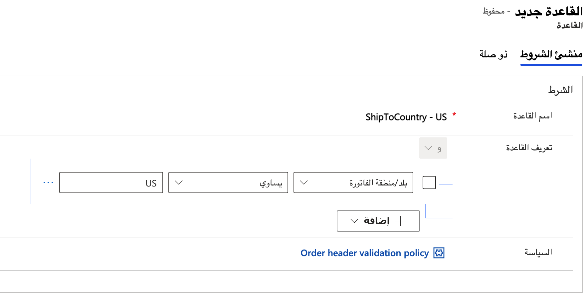
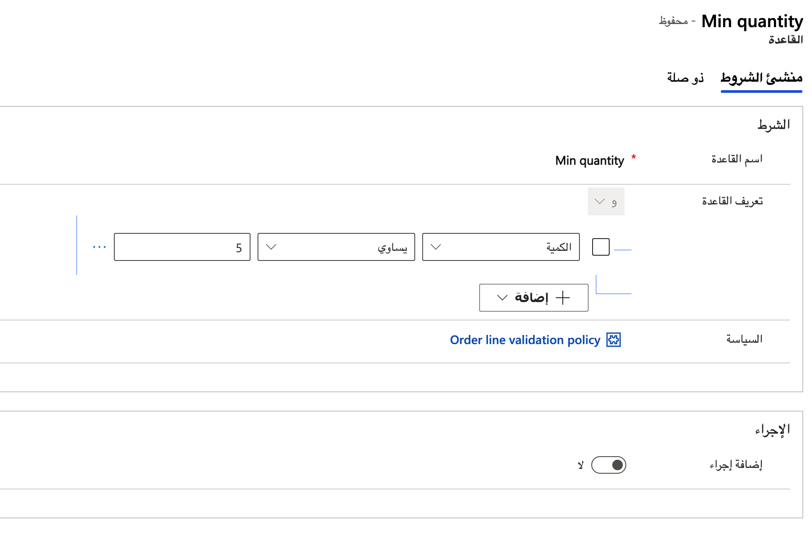
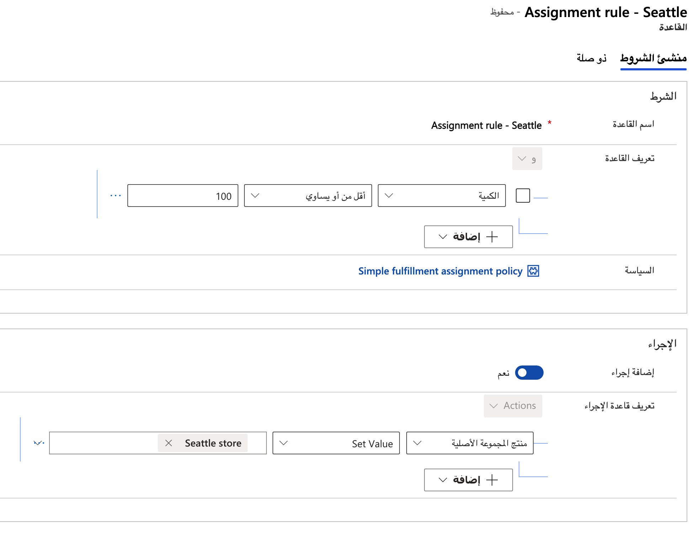
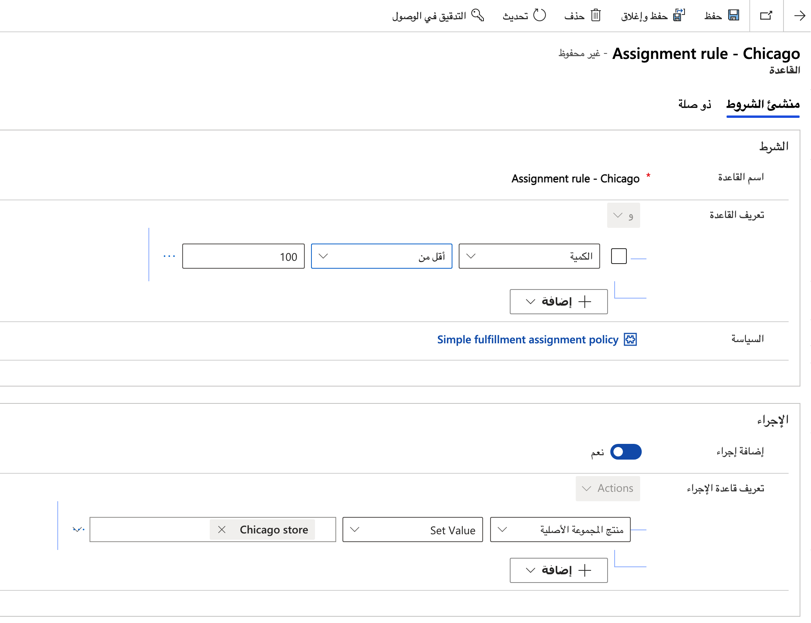
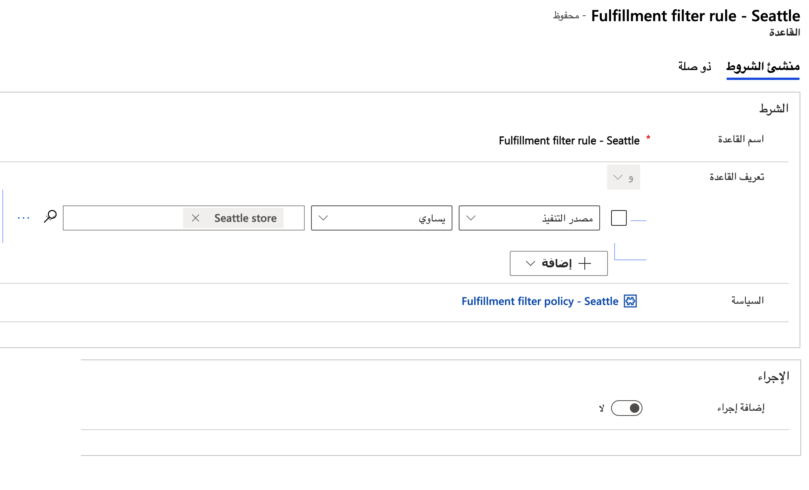
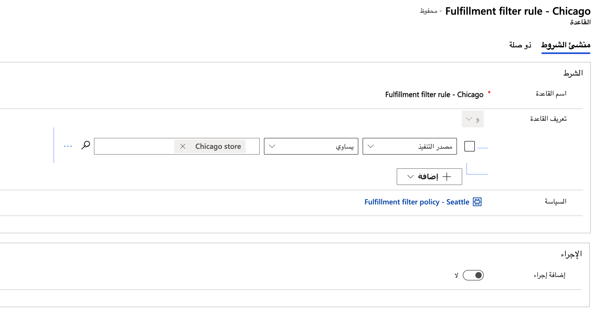
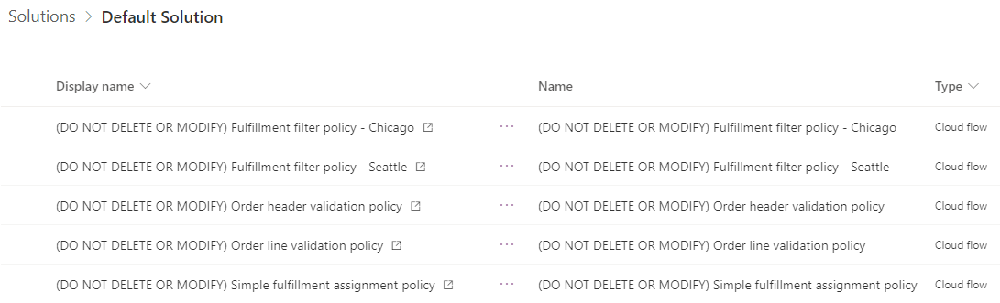

تصف هذه الوحدة الخطوات المطلوبة لإنشاء نهج في Intelligent Order Management.

## إنشاء نهج جديد للتحقق من صحة العنوان

لإنشاء نهج جديد للتحقق من صحة العنوان، اتبع هذه الخطوات.

1. انتقل إلى **التزامن‬ \> سياسات** وحدد **جديد**.
1. بالنسبة إلى **اسم النهج**، أدخل **نهج التحقق من صحة عنوان الأمر**.
1. بالنسبة إلى **نوع النهج**، أدخل **نهج التنفيذ**.
1. بالنسبة إلى **أهمية النهج**، أدخل **مهم**.
1. بالنسبة إلى **الحالة**، أدخل **غير منشور**.
1. بالنسبة إلى **الكيان المقترن**، أدخل **الأمر‏‎**.
1. حدد **حفظ**.

## إنشاء قاعدة جديدة لنهج التحقق من صحة عنوان الأمر

لإنشاء قاعدة جديدة لنهج التحقق من صحة عنوان الأمر، اتبع هذه الخطوات.

1. في صفحة نهج التحقق من صحة عنوان الأمر، حدد **قاعدة جديدة**.
1. بالنسبة إلى **قاعدة الاسم**، أدخل **ShipToCountry - الولايات المتحدة**.
1. بالنسبة إلى **تعريف القاعدة**:
    1. في الحقل الأول، حدد **الشحن إلى البلد/المنطقة**.
    1. في الحقل الثاني، حدد **يساوي**.
    1. في الحقل الثالث، حدد **الولايات المتحدة**.
1. بالنسبة إلى **النهج**، أدخل أو حدد **نهج التحقق من صحة عنوان الأمر**.

    > [!div class="mx-imgBorder"]
    > 
1. حدد **حفظ وإغلاق**. 

## نشر نهج التحقق من صحة العنوان

لنشر نهج التحقق من صحة العنوان، اتبع هذه الخطوات.

1. انتقل إلى نهج التحقق من عنوان الأمر الذي أنشأته. يجب أن تكون في هذه الصفحة بالفعل إذا اتبعت الخطوات المذكورة أعلاه.
1. حدد **نشر**.

## إنشاء نهج جديد للتحقق من صحة السطر

لإنشاء نهج جديد للتحقق من صحة السطر، اتبع هذه الخطوات.

1. انتقل إلى **التزامن‬ \> سياسات** وحدد **جديد**.
1. بالنسبة إلى **اسم النهج**، أدخل **نهج التحقق من صحة سطر الأمر**.
1. بالنسبة إلى **نوع النهج**، أدخل **نهج التنفيذ**.
1. بالنسبة إلى **أهمية النهج**، أدخل **مهم**.
1. بالنسبة إلى **الحالة**، أدخل **غير منشور**.
1. بالنسبة إلى **الكيان المقترن**، أدخل **منتج الأمر‏‎**.
1. حدد **حفظ**.

## إنشاء قاعدة جديدة لنهج التحقق من صحة سطر الأمر

لإنشاء قاعدة جديدة لنهج التحقق من صحة سطر الأمر، اتبع هذه الخطوات.

1. في صفحة نهج التحقق من صحة سطر الأمر، حدد **قاعدة جديدة**.
1. ضمن **الشرط**، **لاسم القاعدة**، أدخل **الحد الأدنى للكمية**.
1. بالنسبة إلى **تعريف القاعدة**:
    1. في الحقل الأول، حدد **الكمية**.
    1. في الحقل الثاني، حدد **أكبر من أو يساوي**.
    1. في الحقل الثالث، أدخل أو حدد **5**.
1. ضمن **الإجراء**، قم بتعيين قيمة **إضافة إجراء** على **لا**.

    > [!div class="mx-imgBorder"]
    > 
1. حدد **حفظ وإغلاق**.

## نشر نهج التحقق من صحة السطر

لنشر نهج التحقق من صحة السطر، اتبع هذه الخطوات.

1. انتقل إلى نهج التحقق من سطر الأمر الذي أنشأته. يجب أن تكون على هذه الشاشة بالفعل إذا اتبعت الخطوات المذكورة أعلاه.
1. حدد **نشر**.

## إنشاء نهج تعيين عمليات التنفيذ البسيطة

لإنشاء نهج تعيين عمليات التنفيذ البسيطة، اتبع الخطوات التالية.

1. انتقل إلى **التزامن‬ \> سياسات** وحدد **جديد**.
1. بالنسبة إلى **اسم النهج**، أدخل **نهج تعيين عمليات التنفيذ البسيطة**.
1. بالنسبة إلى **نوع النهج**، أدخل **نهج التنفيذ**.
1. بالنسبة إلى **أهمية النهج**، أدخل **المعلومات**.
1. بالنسبة إلى **الحالة**، أدخل **غير منشور**.
1. بالنسبة إلى **الكيان المقترن**، أدخل **منتج الأمر‏‎**.
1. حدد **حفظ**.

## إنشاء قاعدة نهج تعيين لعملية تنفيذ بسيطة جديدة لمتجر سياتل

لإنشاء قاعدة نهج تعيين لعملية تنفيذ بسيطة جديدة لمتجر **سياتل**، اتبع هذه الخطوات.

1. في الصفحة **نهج تعيين عمليات التنفيذ البسيطة** ، حدد **قاعدة جديدة**.
1. ضمن **الشرط** الخاص **باسم القاعدة**، أدخل **قاعده التعيين- سياتل**.
1. بالنسبة إلى **تعريف القاعدة**:
    1. في الحقل الأول، حدد **الكمية**.
    1. في الحقل الثاني، حدد **أكبر من أو يساوي**.
    1. في الحقل الثالث، أدخل أو حدد **100**.
1. ضمن **الإجراء**، قم بتعيين قيمة **إضافة إجراء** على **نعم**.
    1. في الحقل الأول، حدد **مصدر التنفيذ**.
    1. في الحقل الثاني، حدد **تعيين القيمة**.
    1. في الحقل الثالث، أدخل أو حدد **متجر سياتل**.

    > [!div class="mx-imgBorder"]
    > 
1. حدد **حفظ وإغلاق**.

## إنشاء قاعدة نهج تعيين لعملية تنفيذ بسيطة جديدة لمتجر شيكاغو

لإنشاء قاعدة نهج تعيين لعملية تنفيذ بسيطة جديدة لمتجر **شيكاغو**، اتبع هذه الخطوات.

1. في الصفحة **نهج تعيين عمليات التنفيذ البسيطة** ، حدد **قاعدة جديدة**.
1. ضمن **الشرط** الخاص **باسم القاعدة**، أدخل **قاعده التعيين- شيكاغو**.
1. بالنسبة إلى **تعريف القاعدة**:
    1. في الحقل الأول، حدد **الكمية**.
    1. في الحقل الثاني، حدد **أقل من**.
    1. في الحقل الثالث، أدخل أو حدد **100**.
1. ضمن **الإجراء**، قم بتعيين قيمة **إضافة إجراء** على **نعم**.
    1. في الحقل الأول، حدد **مصدر التنفيذ**.
    1. في الحقل الثاني، حدد **تعيين القيمة**.
    1. في الحقل الثالث، أدخل أو حدد **متجر شيكاغو**.
    > [!div class="mx-imgBorder"]
    > 

1. حدد **حفظ وإغلاق**.

## نشر نهج تعيين عمليات التنفيذ البسيطة

لنشر نهج تعيين عمليات التنفيذ البسيطة، اتبع الخطوات التالية.

1. انتقل إلى نهج تعيين عمليات التنفيذ البسيطة التي أنشأتها. يجب أن تكون في هذه الصفحة بالفعل إذا اتبعت الخطوات المذكورة أعلاه.
1. حدد **نشر**.

## إنشاء نهج تصفية لمتجر سياتل

لإنشاء نهج تصفية لمتجر **سياتل**، اتبع الخطوات التالية.

1. انتقل إلى **التزامن‬ \> سياسات** وحدد **جديد**.
1. بالنسبة إلى **اسم النهج**، أدخل **نهج تصفية التنفيذ - سياتل**.
1. بالنسبة إلى **نوع النهج**، أدخل **نهج التصفية**.
1. بالنسبة إلى **أهمية النهج**، أدخل **المعلومات**.
1. بالنسبة إلى **الحالة**، أدخل **غير منشور**.
1. بالنسبة إلى **الكيان المقترن**، أدخل **أمر‏ التنفيذ‎**.
1. حدد **حفظ**.

## إنشاء قاعدة تصفية جديدة لمتجر سياتل

لإنشاء قاعدة تصفية جديدة لمتجر **سياتل**، اتبع الخطوات التالية.

1. في الصفحة **نهج تصفية التنفيذ - سياتل** ، حدد **قاعدة جديدة**.
1. ضمن **الشرط**، **لاسم القاعدة**، أدخل **الحد الأدنى للكمية**.
1. بالنسبة إلى **تعريف القاعدة**:
    1. في الحقل الأول، حدد **مصدر التنفيذ**.
    1. في الحقل الثاني، حدد **يساوي**.
    1. في الحقل الثالث، أدخل أو حدد **متجر سياتل**.
1. ضمن **الإجراء**، قم بتعيين قيمة **إضافة إجراء** على **لا**.

    > [!div class="mx-imgBorder"]
    > 
1. حدد **حفظ وإغلاق**.

## نشر نهج تصفية لمتجر سياتل

لنشر نهج تصفية لمتجر **سياتل**، اتبع الخطوات التالية.

1. انتقل إلى نهج تصفية "سياتل" الذي أنشأته. يجب أن تكون في هذه الصفحة بالفعل إذا اتبعت الخطوات المذكورة أعلاه.
1. حدد **نشر**.

## إنشاء نهج تصفية لمتجر شيكاغو

لإنشاء نهج تصفية لمتجر **شيكاغو**، اتبع الخطوات التالية.

1. انتقل إلى **التزامن‬ \> سياسات** وحدد **جديد**.
1. بالنسبة إلى **اسم النهج**، أدخل **نهج تصفية التنفيذ - شيكاغو**.
1. بالنسبة إلى **نوع النهج**، أدخل **نهج التصفية**.
1. بالنسبة إلى **أهمية النهج**، أدخل **المعلومات**.
1. بالنسبة إلى **الحالة**، أدخل **غير منشور**.
1. بالنسبة إلى **الكيان المقترن**، أدخل **أمر‏ التنفيذ‎**.
1. حدد **حفظ**.

## إنشاء قاعدة تصفية جديدة لمتجر شيكاغو

لإنشاء قاعدة تصفية جديدة لمتجر **شيكاغو**، اتبع الخطوات التالية.

1. في الصفحة **نهج تصفية التنفيذ - شيكاغو** ، حدد **قاعدة جديدة**.
1. ضمن **الشرط**، **لاسم القاعدة**، أدخل **الحد الأدنى للكمية**.
1. بالنسبة إلى **تعريف القاعدة**:
    1. في الحقل الأول، حدد **مصدر التنفيذ**.
    1. في الحقل الثاني، حدد **يساوي**.
    1. في الحقل الثالث، أدخل أو حدد **متجر شيكاغو**.
1. ضمن **الإجراء**، قم بتعيين قيمة **إضافة إجراء** على **لا**.

    > [!div class="mx-imgBorder"]
    > 
1. حدد **حفظ وإغلاق**.

## نشر نهج تصفية لمتجر شيكاغو

لنشر نهج تصفية لمتجر **شيكاغو**، اتبع الخطوات التالية.

1. انتقل إلى نهج تصفية شيكاغو الذي أنشأته. يجب أن تكون في هذه الصفحة بالفعل إذا اتبعت الخطوات المذكورة أعلاه.
1. حدد **نشر**.

إذا كنت قد قمت بالمتابعة، ستشاهد الآن تدفقات سحابة Power Automate المنقولة كما هو موضح في الصورة التالية.

> [!div class="mx-imgBorder"]
> 

## إضافة حدث الإدخال إلى نوع الإجراء

لإضافة حدث إدخال إلى نوع إجراء، اتبع هذه الخطوات.

1. انتقل إلى **الموفرون \> أنواع الإجراءات**.
1. حدد **تحديد التنفيذ المستند إلى النهج**.
1. حدد **+ حدث عمل إدخال نوع إجراء IOM جديد**.
1. بالنسبة إلى **الاسم**، أدخل **تم التحقق من صحة سطور الأمر بنجاح**.
1. بالنسبة إلى **نوع الإجراء**، أدخل **تحديد التنفيذ المستند إلى النهج**. 
1. بالنسبة إلى **تعريف حدث العمل**، أدخل **تم التحقق من صحة سطور الأمر بنجاح**.
1. حدد **حفظ**.

