تصف هذه الوحدة الخطوات المطلوبة لإنشاء تنسيق معالجة الأوامر في Intelligent Order Management.

## إضافة الإطار المتجانب "التحقق من صحة البيانات الرئيسية للأمر"

لإضافة الإطار المتجانب **التحقق من صحة البيانات الرئيسية للأمر**، اتبع هذه الخطوات:

1. انتقل إلى **التنسيق‬‏‫ > مهام سير العمل** وحدد **جديد‏‎**.
1. أدخل اسماً لسير العمل الجديد، ثم حدد **حفظ**.
1. حدد رمز علامة الجمع (**+**)، ثم أضف الإطار المتجانب **التحقق من صحة البيانات الرئيسية للأمر**.

    > [!div class="mx-imgBorder"]
    > [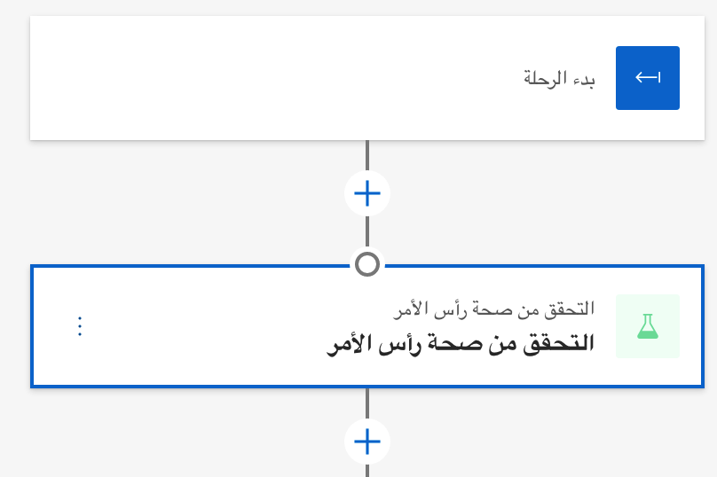](../media/validate-order-header-tile-ss.png#lightbox)

1. في مربع الحوار **التحقق من صحة البيانات الرئيسية للأمر**، أدخل المعلومات التالية:
    - بالنسبة إلى **الاسم**، أدخل **التحقق من صحة البيانات الرئيسية للأمر**.
    - بالنسبة إلى **نوع الإجراء**، أدخل **التحقق من صحة الأمر**.
    - بالنسبة إلى **أحداث الإدخال**، أدخل **أمر جديد**.
    - بالنسبة إلى **نهج التنفيذ**، أدخل **نهج التحقق من صحة البيانات الرئيسية للأمر**.

     > [!div class="mx-imgBorder"]
     > [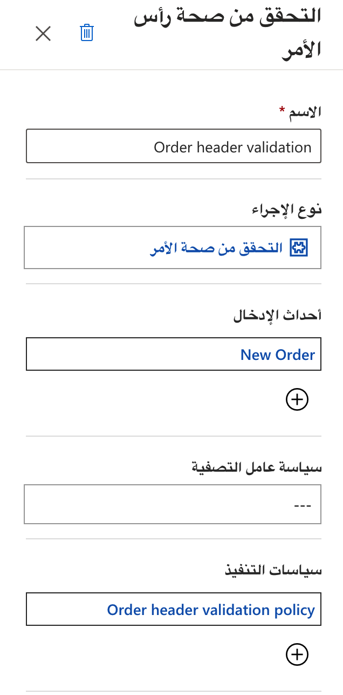](../media/validate-order-header-properties-ss.png#lightbox)

1. حدد **حفظ**.

## إضافة الإطار المتجانب "التحقق من صحة بند الأمر"

لإضافة الإطار المتجانب **التحقق من صحة بند الأمر**، اتبع هذه الخطوات:

1. انتقل إلى **التنسيق‬‏‫ > مهام سير العمل** وحدد **جديد‏‎**.
1. حدد رمز علامة الجمع (**+**)، ثم أضف الإطار المتجانب **التحقق من صحة بند الأمر**.

    > [!div class="mx-imgBorder"]
    > [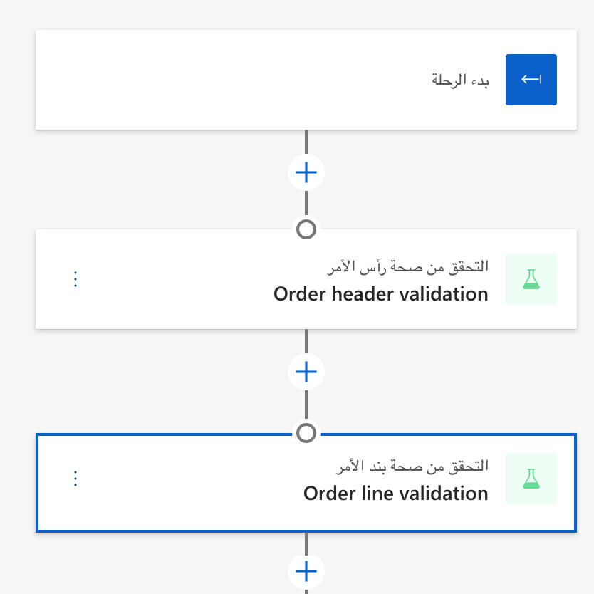](../media/validate-order-line-tile-ss.png#lightbox)

1. في مربع الحوار **التحقق من صحة بند الأمر**، أدخل المعلومات التالية:
    - في **الاسم**، أدخل **التحقق من صحة بند الأمر**.
    - بالنسبة إلى **نوع الإجراء**، أدخل **التحقق من صحة بند الأمر**.
    - بالنسبة إلى **أحداث الإدخال**، أدخل **تم التحقق من صحة البيانات الرئيسية للأمر بنجاح**.

    > [!div class="mx-imgBorder"]
    > [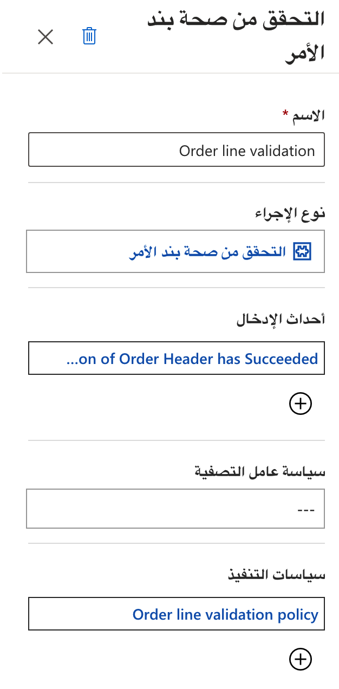](../media/validate-order-line-properties-ss.png#lightbox)

1. حدد **حفظ**.

## إضافة إطار متجانب مخصص

لإضافة إطار متجانب **مخصص**، اتبع هذه الخطوات:

1. انتقل إلى **التنسيق‬‏‫ > مهام سير العمل** وحدد **جديد‏‎**.
1. حدد رمز علامة الجمع (**+**)، ثم أضف إطاراً متجانباً **مخصصاً**.

    > [!div class="mx-imgBorder"]
    > [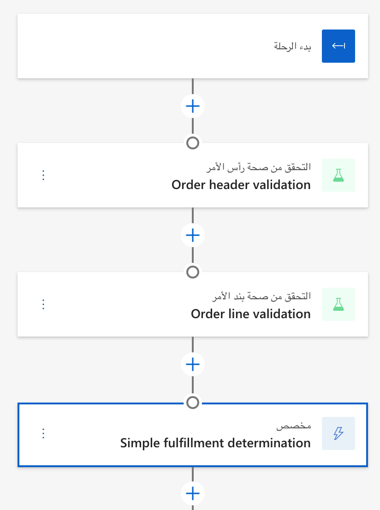](../media/custom-tile-ss.png#lightbox)

1. في مربع الحوار **مخصص**، أدخل المعلومات التالية:
    - في **الاسم**، أدخل **تحديد عمليات التنفيذ البسيطة**.
    - بالنسبة إلى **نوع الإجراء**، أدخل **تحديد التنفيذ المستند إلى النهج**.
    - بالنسبة إلى **أحداث الإدخال**، أدخل **تم التحقق من صحة سطور الأمر بنجاح**.
    - بالنسبة إلى **نهج التنفيذ**، أدخل **نهج تعيين عمليات التنفيذ البسيطة**.

    > [!div class="mx-imgBorder"]
    > [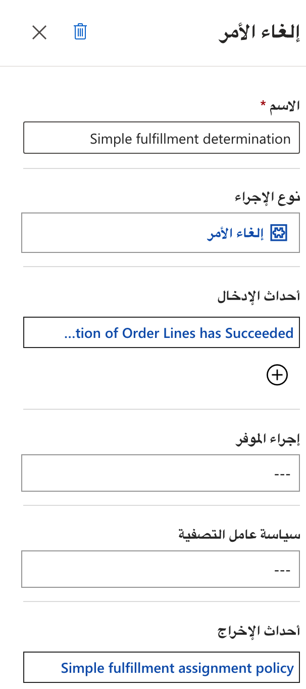](../media/custom-properties-ss.png#lightbox)

1. حدد **حفظ**.

## إضافة إطار متجانب مقسِّم

لإضافة إطار متجانب **مقسِّم**، اتبع هذه الخطوات:

1. انتقل إلى **التنسيق‬‏‫ > مهام سير العمل** وحدد **جديد‏‎**.
1. حدد رمز علامة الجمع (**+**)، ثم أضف إطاراً متجانباً **مقسِّمًا**.

    > [!div class="mx-imgBorder"]
    > [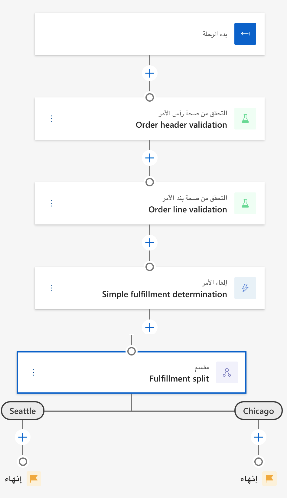](../media/splitter-tile-ss.png#lightbox)

1. في مربع الحوار **المقسِّم**، أدخل المعلومات التالية:
    - بالنسبة إلى **الاسم**، أدخل **تقسيم التنفيذ**.
    - بالنسبة إلى حقلي **إعدادات المقسِّم**، أدخل **سياتل** و **شيكاغو**.
    
    > [!div class="mx-imgBorder"]
    > [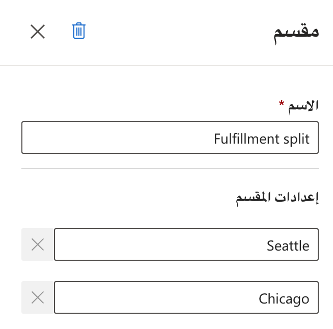](../media/splitter-properties-ss.png#lightbox)

1. حدد **حفظ**.

## إضافة الإطار المتجانب "الإرسال إلى التنفيذ" ضمن فرع سياتل

لإضافة الإطار المتجانب **الإرسال إلى التنفيذ** ضمن فرع **سياتل**، اتبع هذه الخطوات:

1. انتقل إلى **التنسيق‬‏‫ > مهام سير العمل** وحدد **جديد‏‎**.
1. ضمن فرع **سياتل**، حدد رمز علامة الجمع (**+**) ثم أضف الإطار المتجانب **الإرسال إلى التنفيذ**.

    > [!div class="mx-imgBorder"]
    > [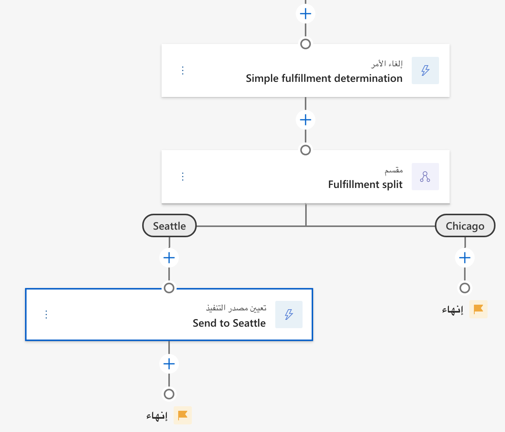](../media/send-fulfillment-tile-ss.png#lightbox)

1. في مربع الحوار **الإرسال إلى التنفيذ**، أدخل المعلومات التالية:
    - في **الاسم**، أدخل **إرسال إلى سياتل**.
    - بالنسبة إلى **نوع الإجراء**، أدخل **الإرسال إلى التنفيذ**.
    - بالنسبة إلى **أحداث الإدخال**، أدخل **تم إنشاء أمر التنفيذ بنجاح**.
    - بالنسبة إلى **إجراء الموفر‏‎‬**، أدخل **تمرين عملي - إرسال إلى التنفيذ (Outlook)**.
    - بالنسبة إلى **نهج التصفية**، أدخل **نهج تصفية التنفيذ سياتل**.
1. حدد **حفظ**.

## إضافة الإطار المتجانب "الإرسال إلى التنفيذ" ضمن فرع شيكاغو

لإضافة الإطار المتجانب **الإرسال إلى التنفيذ** ضمن فرع **شيكاغو**، اتبع هذه الخطوات:

1. انتقل إلى **التنسيق‬‏‫ > مهام سير العمل** وحدد **جديد‏‎**.
1. ضمن فرع **شيكاغو**، حدد رمز علامة الجمع (**+**) ثم أضف الإطار المتجانب **الإرسال إلى التنفيذ**.

    > [!div class="mx-imgBorder"]
    > [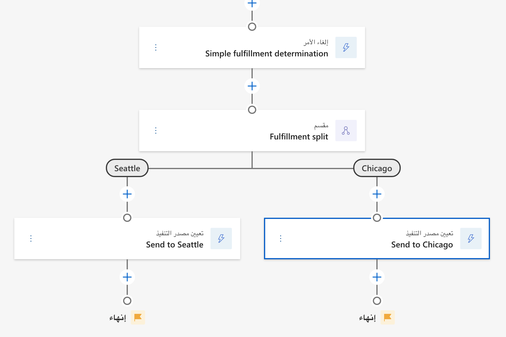](../media/send-fulfillment-tile-2-ss.png#lightbox)

1. في مربع الحوار **الإرسال إلى التنفيذ**، أدخل المعلومات التالية:
    - في **الاسم**، أدخل **إرسال إلى شيكاغو**.
    - بالنسبة إلى **نوع الإجراء**، أدخل **الإرسال إلى التنفيذ**.
    - بالنسبة إلى **أحداث الإدخال**، أدخل **تم إنشاء أمر التنفيذ بنجاح**.
    - بالنسبة إلى **إجراء الموفر‏‎‬**، أدخل **تمرين عملي - إرسال إلى التنفيذ (RequestBin)**.
    - بالنسبة إلى **نهج التصفية**، أدخل **نهج تصفية التنفيذ شيكاغو**.
1. حدد **حفظ**.

## نشر سير عمل تنسيق معالجة الأوامر

بعد الانتهاء من إنشاء سير عمل تنسيق معالجة الأوامر، حدد **نشر** لنشر سير العمل. 

إذا اتبعت الخطوات المطلوبة، فستظهر مهام سير العمل السحابية المجمعة في Power Automate، كما في الصورة التالية.

> [!div class="mx-imgBorder"]
> [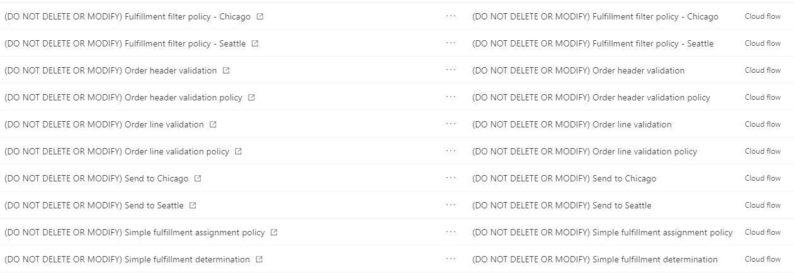](../media/order-orchestration-ss.png#lightbox)
