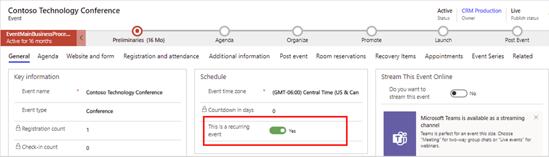
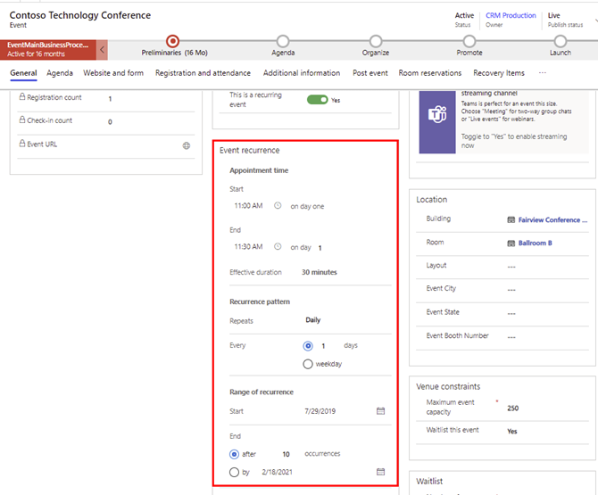
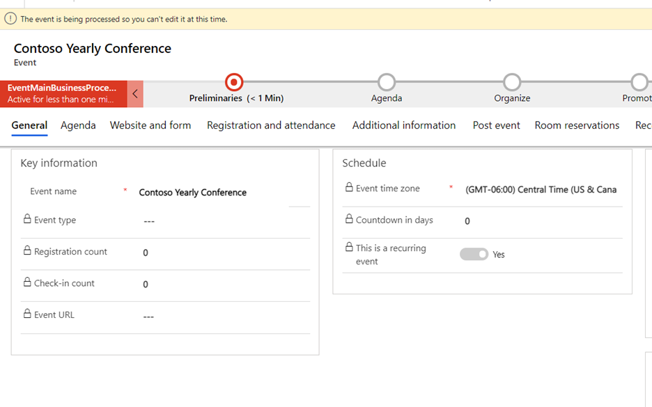
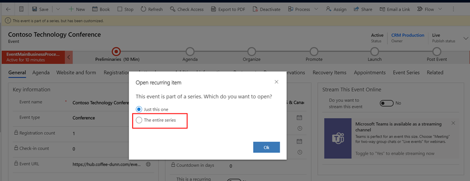
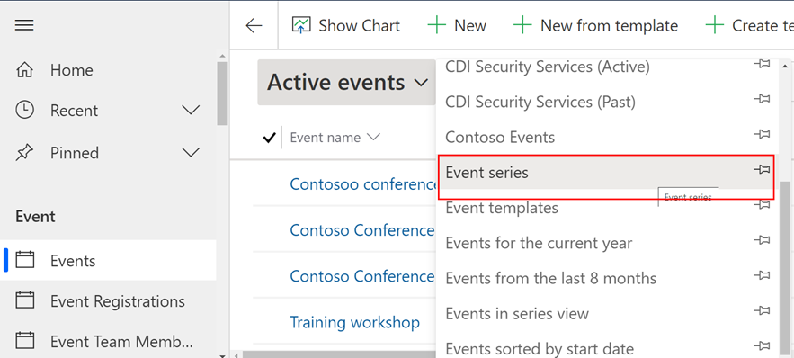
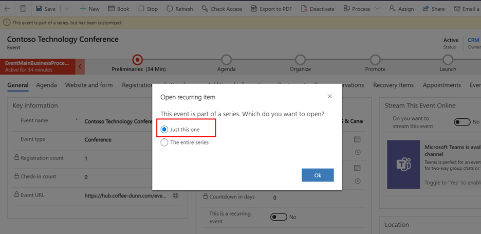

إذا كنت تستضيف حدثاً يحدث بشكل منتظم، مثل مكالمة شريك شهرية أو مؤتمر مطورين سنوي أو عرض تقديمي لأرباح ربع سنوية، فيمكنك تحقيق الاستفادة من ذلك عن طريق إعداد حدث متكرر. إن الفائدة الأساسية لميزة الحدث المتكرر أنه يُمكنك تحرير جميع الأحداث كاملة في الوقت ذاته، وليس حدثاً تلو الآخر. 

توفر الأحداث المتكررة العديد من المزايا في حالات مثل وبما في ذلك:

-   إمكانية إنشاء العديد من الأحداث المتطابقة في وقت واحد.

-   خيارات الجدولة المرنة التي تتيح لك إمكانية جدولة الأحداث التي تحدث سنوياً أو شهرياً أو يومياً أو كل نصف شهر أو كل نصف سنة أو غير ذلك.
    يمكنك أيضاً جدولة كل حدث ليحدث، على سبيل المثال، في الثلاثاء الثاني من كل شهر آخر.

-   إمكانية إدارة السلسلة بأكملها من مصدر واحد. على سبيل المثال، إذا قمت بتغيير اسم سلسلة الأحداث، فستحصل جميع الأحداث المخصصة التي تعد جزءاً من هذه السلسلة على اسم جديد أيضاً.

-   تخصيص تكرارات الأحداث الفردية. على سبيل المثال، يمكنك جدولة حدث أغسطس في السلسلة للبدء في الأسبوع الثالث من الشهر، مع ترك جميع التكرارات الشهرية الأخرى في الأسبوع الأول من الشهر.

-   الاحتفاظ بجدول مشترك لكل تكرار. تُجدول جلسات سلسله الأحداث حسب تاريخ البدء لكل تكرار حدث. مثال، خطاب ترحيب في 8:00 صباحا في اليوم الأول، وورشه في الساعة 1:00 م في اليوم الثاني وهكذا. وبهذه الطريقة، دائماً ما يتبع جدول أعمال كل تكرار حدث فردي تاريخ بدء التكرار.

> [!TIP]
> عادةً من الأفضل إنشاء حدث متكرر من البداية بدلاً من تحويل حدث واحد موجود في حدث متكرر.

لإعداد حدث متكرر، افتح منطقة عمل  **تخطيط الحدث**، وانتقل إلى  **حدث** > **أحداث**، ثم انقر فوق **جديد** على شريط الأوامر. يُمكنك إعداد الحدث بإعطائه اسماً وضبط الإعدادات الأساسية الأخرى في علامة التبويب  **عام** كما هو معتاد، ثم انتقل إلى القسم **الجدول** لملء معلومات الحدث المتكرر.

> [!IMPORTANT]
> عند إعداد حدث متكرر، عليك تعيين جدول متكرر قبل أن تضيف أي جلسات عمل إلى جدول الأعمال. يضمن هذا الإجراء إنشاء جلسات عملك على نحوٍ صحيح كجلسات عمل متكررة (مع تواريخ البدء ذات الصلة) بدلاً من جلسات العمل المطلقة (التي تشتمل على تاريخ تقويم ثابت، ولذا لن تتكرر).

عند تعيين حقل **حدث متكرر** إلى **نعم**، يظهر القسم **تكرار الحدث** .

> [!div class="mx-imgBorder"]
> 

> [!div class="mx-imgBorder"]
> 

استخدم الإعدادات الموجودة في قسم **تكرار الحدث** لإنشاء نمط جدول التكرارات. في المثال الموضح في لقطة الشاشة السابقة، يتم إنشاء سلسلة يجري فيها كل حدث من 9 ص إلى 5:00 م في أول يوم اثنين من كل شهر آخر وينتهي بعد 10 تكرارات.

> [!NOTE]
> بمجرد حفظ حدث متكرر، سوف يظهر شريط منبثق يوضح أنه "جارٍ معالجه الحدث ومن ثم لا تستطيع تحريره في هذا الوقت". إذا كنت بحاجة إلى إجراء تحديث بعد حفظ سجل الحدث، فقد يستغرق دقيقة قبل أن يسمح لك التطبيق بفعل ذلك، لأن التطبيق يُنشئ أحداثاً متكررة أخرى في الخلفية. 

> [!div class="mx-imgBorder"]
> 

> [!NOTE]
> أقصى حد للتكرارات هو 150. عند إدخال مجموعة من الإعدادات التي ستؤدي إلى حدوث أكثر من 150 تكرار، سوف تحصل على تحذير ولن تتمكن من حفظ الحدث حتى ضبط الإعدادات.

لمزيد من المعلومات، راجع [إعداد حدث متكرر](/dynamics365/marketing/event-recurring?azure-portal=true#set-up-a-recurring-event).

## تحرير جميع الأحداث في سلسلة متكررة

عند إعداد حدث متكرر، تحتفظ جميع الأحداث الموجودة في هذه السلسلة بارتباط إلى السلسلة نفسها. مما يعني أنه يُمكنك تحرير جميع التكرارات غير المخصصة في وقت واحد. مثال، يُمكنك تغيير مكان جميع التكرارات.

لتحرير كافة الأحداث غير المخصصة في سلسلة، افتح منطقة عمل **تخطيط الحدث** وانتقل إلى **أحداث > حدث**. افتح طريقة عرض قائمة الأحداث حيث يُمكنك عمل أحد الإجراءات التالية.

ابحث عن أي تكرار لسلسلة الأحداث الهدف في القائمة وحدد ذلك الحدث لفتحه. يفتح مربع حوار **فتح عنصر متكرر‬**؛ حدد **السلسلة بأكملها** لتحرير السلسلة بأكملها (بدلاً من مجرد تكرار الحدث الذي حددته). كما سترى شريطاً أعلى الحدث يشير إلى أن "هذا الحدث جزء من سلسله".

> [!div class="mx-imgBorder"]
> 

افتح مُحدِّد طريقة العرض (الموجود أعلى القائمة مباشرةً) وحدد **سلسلة الأحداث**. تعرض هذه القائمة الآن صفاً واحداً فقط لسلسلة الأحداث التي أعددتها. حدد سلسلة أحداث لفتحها.

> [!div class="mx-imgBorder"]
> 

للحصول على مزيد من المعلومات، راجع [تحرير جميع الأحداث في سلسلة](/dynamics365/marketing/event-recurring?azure-portal=true#edit-all-events-in-a-series).

## تخصيص التكرارات الفردية من سلسلة

إضافة إلى ذلك، يُمكنك تخصيص أي حدث فردي ينتمي إلى سلسلة الأحداث. يجب فعل ذلك إذا كنت ترغب في نقل حدث ربع سنوي إلى مكان آخر. تُوقف الأحداث المخصصة تعقب التحديثات التي تقوم بها في السلسلة نفسها.

لعرض حدث واحد يشكل جزءاً من سلسلة أو تحريره، افتح منطقة عمل **تخطيط الحدث** وانتقل إلى **أحداث > حدث** وقم بتعيين محدد العرض إلى **الأحداث النشطة**.

يجب أن تشاهد الآن قائمة بتكرارات الأحداث الفردية (والأحداث غير المتكررة). ابحث عن وحدد تكرار الحدث الذي تريد تخصيصه. يفتح مربع الحوار **فتح عنصر متكرر** . بمجرد أن يفتح‬، حدد **هذا فقط** لتحرير تكرار الحدث الذي حددته (بدلاً من السلسلة بأكملها). ثم حدد **موافق** لجعل التكرار الحالي تكراراً مخصصاً.

> [!div class="mx-imgBorder"]
> 

لمزيد من المعلومات، راجع [‏‫تخصيص التكرارات الفردية](/dynamics365/marketing/event-recurring?azure-portal=true#customize-individual-occurrences-from-a-series).

إذا غيرت رأيك لاحقاً، فيُمكنك إرجاع أي حدث مخصص لجعله يتعقب إعدادات السلسلة مرة أخرى، ولكن هذا سيُسقط جميع الإعدادات المخصصة لهذا التكرار. لمزيد من المعلومات عن كيفيه إرجاع تكرار مخصص، راجع [إرجاع تكرار مخصص إلى تكرار قياسي](/dynamics365/marketing/event-recurring?azure-portal=true#revert-a-custom-occurrence-to-a-standard-occurrence).
