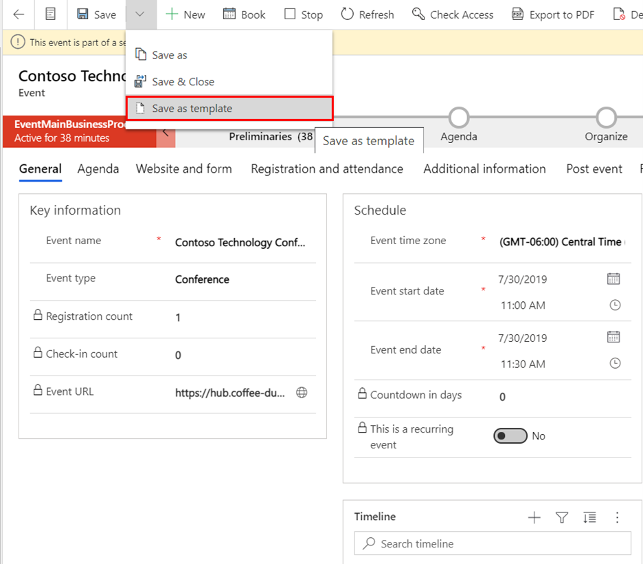

إذا كنت تُنشئ أحداثًا مشابهة عادةً، يُمكنك توفير الوقت عن طريق إعداد قالب حدث واحد أو أكثر. يمكن لكل قالب الاحتفاظ بنفس الإعدادات جميعها كحدث قياسي، بما في ذلك:

-   إعداد حدث أساسي (الاسم، والوصف، والنوع، وغير ذلك)

-   أماكن إقامة الأحداث

-   جلسات عمل الأحداث والمتحدثون

-   بطاقات الأحداث

لإنشاء قالب حدث جديد، افتح منطقه عمل **الأحداث** وانتقل إلى **الحدث > الحدث** وحدد **+ جديد** من شريط الأوامر.

سوف تفتح صفحة سجل حدث حدث جديد. يجب تعبئة جميع التفاصيل اللازمة وإضافة أي أماكن وجلسات ومتحدثين وبطاقات تريد تضمينها في النموذج. عندما تكون مستعدا، حدد **حفظ كقالب** من القائمة.
في مربع الحوار، حدد **موافق.**

> [!div class="mx-imgBorder"]
> 

لعرض قوالب الأحداث، افتح منطقه عمل **الأحداث** وانتقل إلى الأحداث > الحدث وقم بتعيين محدد العرض إلى **قوالب الأحداث**. تعرض لك القائمة جميع قوالب الأحداث المتاحة التي يمكنك عرضها وإدارتها. يُرجى ملاحظة أنه لترى خيار **حفظ كقالب**، قد تحتاج إلى تحديد السهم المنسدل بجانب زر **حفظ** في شريط الأوامر الرئيسي. في مربع الحوار، حدد **موافق**.

لمزيد من المعلومات، راجع [إنشاء قوالب الأحداث واستخدامها](/dynamics365/marketing/event-templates?azure-portal=true#create-an-event-from-a-template).

## إنشاء حدث من قالب

عندما تُنشئ حدثًا من قالب، فإنه يتم نسخ سجل القالب الرئيسي وجميع السجلات المرتبطة به لإنشاء سجل جديد. لا يوجد ارتباط إلى القالب في الوقت الحالي. ولذا يُمكنك الآن العمل مع الحدث الجديد كما لو كنت تعمل مع أي حدث أنشأته من البداية.

لإنشاء حدث جديد، افتح منطقه عمل **الأحداث** وانتقل إلى **الأحداث > الحدث**، ثم حدد **+ ‏‫جديد من القالب‬** من شريط الأوامر. يتم فتح مربع الحوار **إنشاء من قالب**. استخدم مربع الحوار للبحث عن القالب الذي تريده، ثم حدد **موافق**.

وبمجرد ظهور الحدث الجديد، اعطه اسمًا جديدًا، وقم بتعيين تاريخ البدء، ثم حدد **حفظ** في الركن الأيمن السفلي من النافذة.

عند إنشاء حدث بناءً على نموذج، سيعرض في البداية تاريخ البدء وتاريخ الانتهاء وجدول الجلسة الذي تم حفظه مع النموذج. يُمكنك تغيير تاريخ البدء والانتهاء للحدث وجميع جلساته مرة واحدة ببساطة عن طريق تغيير **تاريخ بدء** الحدث وسيتم تعديل جميع التواريخ والأوقات الأخرى وفقًا لذلك.

> [!NOTE]
> لا يُشكّل متحدثو جلسات العمل جزءًا من الحدث ولكن يتم الارتباط بهم من كل جلسة عمل. ويتم الاحتفاظ بهذه الارتباطات في القالب وتضمينها في الأحداث التي تم إنشاؤها بناءً على قالب. ولكن لا يتم نسخ سجلات المتحدث نفسها ولا تتأثر بطريقة أخرى.

لمزيد من المعلومات، راجع [إنشاء حدث من قالب](/dynamics365/marketing/event-templates?azure-portal=true#create-an-event-from-a-template)و [عرض قوالب الأحداث وتحريرها](/dynamics365/marketing/event-templates?azure-portal=true#view-and-edit-your-event-templates).
