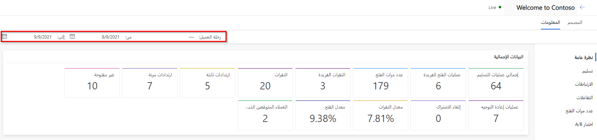

يساعدك Dynamics 365 Marketing على اتخاذ قرارات أكثر ذكاءً من خلال القدرة على متابعة التفاعلات في الوقت الفعلي من صفحات التسويق والنماذج ورسائل البريد الإلكتروني ومواقع الويب وغيره. ويُمكنك أيضًا تتبع تفاعلات جهات الاتصال وعرض التحليلات لفهم تأثيرك وتحسين المحتوى التسويقي.

ويُمكّنك Dynamics 365 من عرض المعلومات، مثل الإحصاءات والتحليلات ومؤشرات الأداء الأساسية استنادًا إلى نتائج التسويق من الكيانات التالية:

-   جهات الاتصال

-   العملاء المتوقعون

-   الشرائح

-   رحلات العميل

-   رسائل البريد الإلكتروني

-   نماذج نقاط العميل المتوقع

-   صفحات التسويق

-   نماذج التسويق

-   مواقع الويب

-   اجتماعي

-   عناوين URL لإعادة التوجيه

## فتح وتصفيه باستخدام المعلومات

مع جميع أنواع الكيانات تقريبًا، يُمكنك عرض النتائج والتحليلات ذات الصلة بفتح سجل ثم التبديل إلى علامة تبويب **المعلومات** .

> [!IMPORTANT] 
> تُعالج تحليلات التسويق في أقل من 10 دقائق لكل 100000 عنصر (رسائل البريد الإلكتروني المرسلة وجهات الاتصال وغير ذلك). ورُغم ذلك، قد تستغرق المعالجة ما يصل إلى ساعة، خاصة عند معالجة عدد كبير من العناصر. مثال، قد تحتاج 1000000 صنفًا ما يصل إلى 6 ساعات لمعالجتها. تنخفض سرعة المعالجة عند تجاوز عدد العناصر الحد الأقصى المذكور في سياسة الاستخدام العادل.

## التنقل بين فئات المعارف الدقيقة

تتضمن بعض علامات تبويب **المعلومات** فئتين أو أكثر من المعلومات. يُمكنك التنقل بين هذه الفئات باستخدام قائمة التنقل الرأسية الموجودة في جانب الصفحة.

> [!div class="mx-imgBorder"]
> 

## تصفية المعارف الدقيقة بنطاق التاريخ والاستخدام

في أعلى معظم المعلومات، ستجد إعدادات تتيح لك تصفية المعلومات المعروضة، مثل، حسب التاريخ (إعدادات **من** و **إلى** ) أو الاستخدام (مثل أي **رحلة عميل** تم فيها استخدام بريد إلكتروني).

وهذا يجعل من السهل رؤية التحليلات المتعلقة بحملة معينة أو فترة تاريخ عند مراجعة المبادرات التسويقية.

> [!div class="mx-imgBorder"]
> 

لمزيد من المعلومات، راجع [تحليل النتائج للحصول على المعلومات من الأنشطة التسويقية](/dynamics365/marketing/insights/?azure-portal=true).

## مسرد المعلومات ومؤشرات الأداء الأساسية

عند مراجعة المعلومات، سترى الرسوم البيانية والجداول الزمنية والقيم لمجموعة متنوعة من النتائج والتفاعلات ومؤشرات الأداء الأساسية (KPIs). لمعرفة المزيد عما تخبرك به كل شاشة، مرر مؤشر الماوس فوق القيمة التي تهتم بها حتى يظهر رمز المعلومات، ثم مرر الماوس فوق الرمز لعرض تلميح أداة مع وصف للقيمة.

> [!div class="mx-imgBorder"]
> 

تحتوي معلومات Dynamics 365 Marketing على العديد من مصطلحات التحليلات المشار إليها في جميع أنواع الكيانات تقريبًا. لمراجعة المصطلحات التحليلية الأكثر شيوعًا، تفضل بزيارة [مسرد المعلومات](/dynamics365/marketing/insights-glossary/?azure-portal=true).
