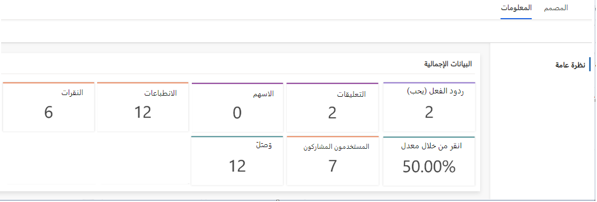

يستطيع Dynamics 365 أيضًا جمع معلومات عن منشورات مواقع التواصل الاجتماعي. يتم توفير رؤية الأداء لمنشورات مواقع التواصل الاجتماعي من خلال رؤى مباشرة من تطبيق التسويق. هنا يُمكنك رؤية مؤشرات الأداء الأساسية التفصيلية مثل ردود الفعل والتعليقات والانطباعات والوصول والتفاصيل الأخرى. لعرض المعلومات التي تخص منشورات مواقع التواصل، انتقل إلى **التسويق**> **‏‫تنفيذ التسويق‬** > **‏‫المنشورات الاجتماعية‬**. بعد ذلك، حدد المنشور المطلوب من التقويم، ثم افتح علامة تبويب **المعلومات**.

> [!div class="mx-imgBorder"]
> 
