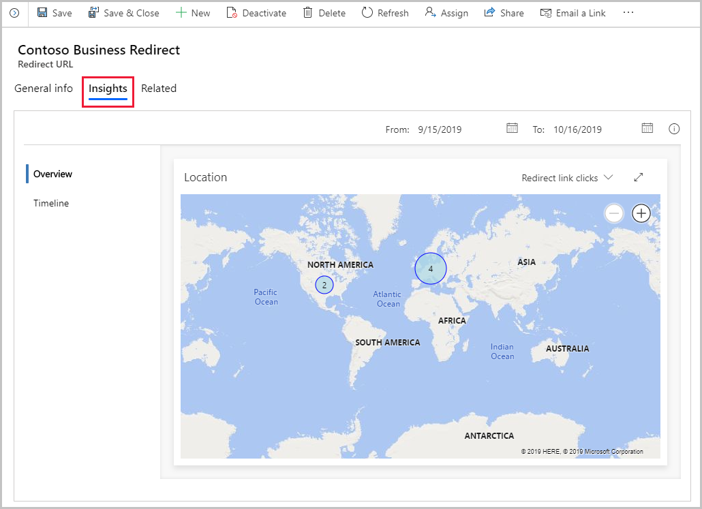

عناوين URL لإعادة التوجيه هي ارتباطات تقوم بإعادة التوجيه من خلال Dynamics 365 Server في طريقها إلى أجزاء المحتوى الأخرى التي يبحث هذا الشخص، الذي نقر على الارتباط، عنها. يستطيع Dynamics 365 Marketing إنشاء عناوين URL لإعادة التوجيه نيابة عنك. يستهدف كل عنوان URL لإعادة التوجيه خادم Dynamics 365 Marketing، ويُسجل النقرة، ثم يُعيد توجيه المستخدم فوراً إلى المحتوى المتوقع.

يسجل Dynamics 365 كل نقرة على عنوان URL لإعادة التوجيه التي توجه المستخدم إلى الهدف الفعلي. باستخدام عناوين URL مختلفة لإعادة التوجيه في لافتات الإعلانات والتغريدات ومنشورات Facebook وفي أي مكان آخر، ستتمكن من رؤية عدد الأشخاص الذين نقروا على كل واحد من هذه الارتباطات ومكانهم الفعلي عند النقر ووقت ذلك، إضافة إلى الحصول على معلومات أفضل عن العملاء.

لعرض معلومات عناوين URL لإعادة التوجيه، انتقل إلى **Marketing** > **التسويق عبر الإنترنت** > **‎‏‎عناوين URL لإعادة التوجيه‏**، وحدد سجل عناوين URL لإعادة التوجيه، ثم افتح علامة تبويب‏‎ **المعلومات** .

توفر عناوين URL لإعادة التوجيه فئات المعلومات مثل **نظرة عامة**، التي تعرض خريطة توضح أماكن الأشخاص عند تحديد الارتباط المُعاد توجيهه و **الجدول الزمني**. الجدول الزمني عبارة عن جدول يعرض تفاصيل كل مرة تم فيها تحديد عنوان URL لإعادة التوجيه.

لمزيد من المعلومات عن تحليلات عناوين URL لإعادة التوجيه، راجع [معلومات عناوين URL لإعادة التوجيه](/dynamics365/marketing/insights#redirect-url-insights).
