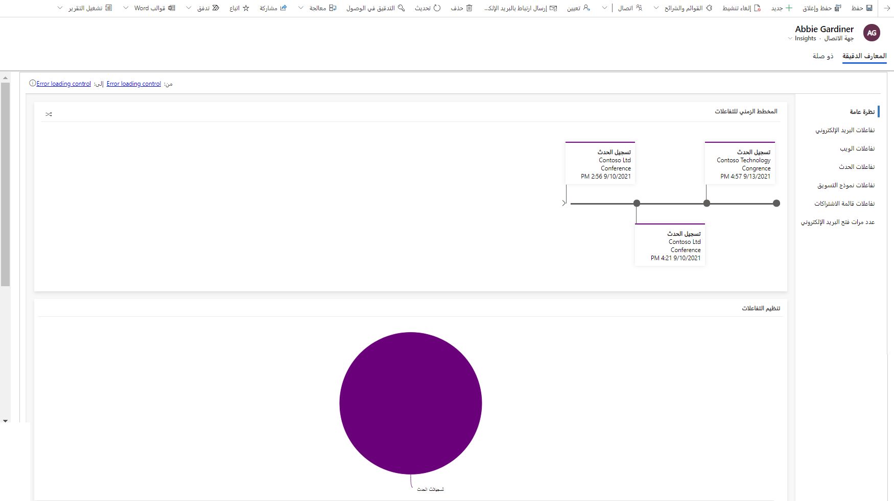
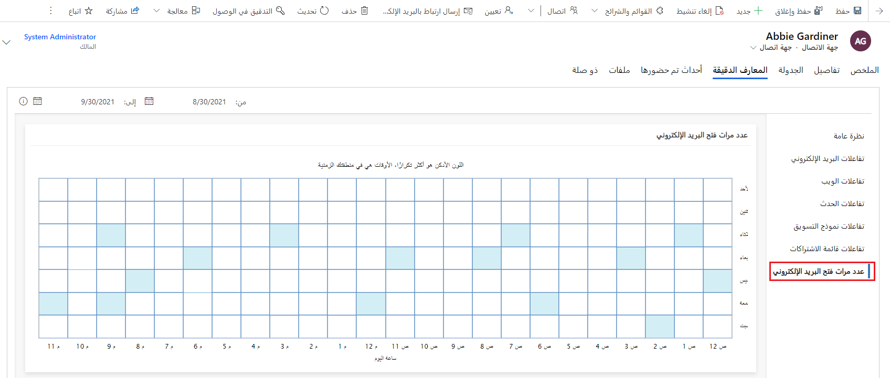

إن الحصول على بيانات عملاء جيدة يغذي المبادرات التسويقية. يوفر محرك رؤى Dynamics 365 Marketing تحليلات وأنماط تفصيلية لبياناتك، مما يتيح لك تحديد المحتوى الأكثر شيوعًا.
جهات الاتصال هي كيان العميل الأساسي في Dynamics 365 Marketing. تمثل معظم جهات الاتصال العملاء أو العملاء المحتملين. قد تقوم أيضًا بتضمين شركاء أو موردين بين جهات الاتصال، خاصةً بالنسبة للأحداث التي ستقوم فيها بتضمين المتحدثين والموردين والجهات الراعية في قاعدة بيانات جهات الاتصال.

بمجرد أن تبدأ جهات الاتصال في التفاعل مع الحملات التسويقية المختلفة، فإنها ستبدأ في إنشاء مؤشرات أداء أساسية وتحليلات تفصيلية. يُمكنك العثور على سجل كامل لكيفية تفاعل جهة الاتصال التي حددتها مع مبادرات التسويق. وقد يساعدك ذلك على فهم ما تهتم به جهة الاتصال المحددة هذه وأنواع الرسائل التي تستجيب لها. قد يستخدم المسوقون هذه المعلومات للحصول على معلومات أعمق عن صانعي قرار محددين حتى يتمكنوا من استهداف المبادرات المستقبلية بشكل أفضل، في حين قد يستخدم مندوبو المبيعات هذا لمعرفة أفضل طريقة للتحدث مع هذا الشخص إذا اختاروا الاتصال به مباشرةً.

‏‫لعرض معلومات جهات الاتصال، انتقل إلى **التسويق** > **العملاء** > **جهات الاتصال**، حدد سجل جهة اتصال ثم افتح علامة تبويب  **المعلومات** حيث تشاهد نظرة عامة على التفاعلات التسويقية لجهة الاتصال المحددة.

> [!div class="mx-imgBorder"]
> 

توفر جهات الاتصال فئات المعلومات الدقيقة التالية:

-   **نظرة عامة**: تعرض مخططًا زمنيًا لجميع التفاعلات التي أجرتها جهة الاتصال مع رسم مخطط للتفاعلات مقسم حسب النوع.

-   **‏‫تفاعلات البريد الإلكتروني**: عرض التفاصيل الكاملة لنتائج البريد الإلكتروني لجهة الاتصال المحددة في طريقة عرض الجدول الزمني، ومنها قائمة بجميع الرسائل المرسلة إليها، إضافة إلى قوائم الرسائل المفتوحة، والنقرات، والارتدادات وغيره.

-   **تفاعلات الويب**: اطلع على الصفحات والارتباطات من مواقع الويب وصفحات التسويق التي فتحتها جهة الاتصال، والارتباطات التي حددتها في طريقة عرض الجدول الزمني.

    > [!NOTE] 
    > Dynamics 365 for Marketing يستخدم ملفات تعريف الارتباط في صفحات التسويق بحيث يمكن لصفحات الويب أن تتضمن معلومات اتصال مملوءة مسبقًا وللتسجيل عند فتح جهة اتصال صفحة تسويقية. كما تستخدم ميزة مواقع الويب ملفات تعريف الارتباط لتسجيل الزيارات إلى أي صفحة ويب حيث وضعت البرنامج النصي للتعقب. تعمل ملفات تعريف الارتباط مع ميزة صفحات التسويق لتحديد جهات الاتصال من خلال مطابقة معرفات الزائرين مع عمليات إرسال الصفحة المقصودة.

    > [!IMPORTANT] 
    > تتطلب العديد من البلدان/المناطق (ومنها الاتحاد الأوروبي) أن تحصل على الموافقة قبل إعداد ملف تعريف ارتباط على جهاز المستخدم. تتحمل مؤسستك مسؤولية إعلامك بجميع لوائح وقوانين الأسواق التي تعمل بها والتأكد من امتثالك لها، بما في ذلك الحصول على موافقة لتعيين ملفات تعريف الارتباط. يُمكنك قراءه المزيد عن لوائح الاتحاد الأوروبي في: [دليل الويب للاتحاد الأوروبي](http://ec.europa.eu/ipg/basics/legal/cookies//?azure-portal=true).

    > [!IMPORTANT] 
    > يُمكن عد الصفحات التي تحتوي على برنامج تعقب نصي فقط لـ Dynamics 365 for Marketing هنا.

    -   تعرض قائمة مواقع الويب التي تمت زيارتها كافة الصفحات المُتعقبة التي تمت زيارتها بواسطة جهة الاتصال المعروفة هذه.

    -   تعرض قائمة مواقع الويب التي تم النقر فوقها كافة الارتباطات التي قام هذا المستخدم بالنقر عليها عند عرض صفحة تم تعقبها. يعرض كل ارتباط تمت زيارته كعنوان URL كامل، وتُدرج الزيارات المتكررة مرة واحدة فقط، باستخدام العداد.

    -   إذا كنت تقوم بتضمين نموذج تسويق داخل صفحة ويب خارجية، فمن ثم يتم تضمين علامة تعقب وتظهر الزيارات إلى هذه الصفحة.

    -   لا تُعرض نتائج الزيارات المجهولة والنقر فوق URL المعاد توجيهه التي حدثت قبل أن تصبح جهة الاتصال معروفة هنا.

-   **تفاعلات الحدث:** شاهد الجدول الزمني لسجلات تفاعلات الحدث وتسجيل الأحداث وتسجيل الوصول والإلغاء لجهة الاتصال الحالية.

-   **تفاعلات نماذج التسويق:** شاهد نماذج التسويق التي أرسلتها جهة الاتصال ومحتوى كل عملية إرسال.

-   **تفاعلات قائمه الاشتراك:** شاهد أي قائمة اشتراك تسرد جهة الاتصال المرتبطة أو المتروكة، ومتى.

-   **أوقات فتح البريد الكتروني:** شاهد الأيام والأوقات التي عادةً ما تفتح فيها جهة الاتصال رسائل البريد الإلكترونية والمدة التي تنتظرها عادةً قبل فتحها. كما أن هذه المعلومات تُعلم ميزة الجدولة التلقائية، التي تضيف مخطط أفضل أوقات الإرسال المتوقعة هنا عند التمكين.

    > [!div class="mx-imgBorder"]
    > 

> [!IMPORTANT] 
> قبل استخدم الجدولة الذكية، على المسؤول تمكينها وتكوينها. إذا لم تشاهد الميزات الموضحة في هذا الموضوع، فيُرجى مطالبة المسؤول بتمكين [الجدولة الذكية](/business-applications-release-notes/april19/dynamics365-marketing/email-scheduling-recommendation/?azure-portal=true) لموقع الويب. راجع [تمكين ميزات الذكاء الصناعي وتكوينها](/dynamics365/marketing/admin-machine-learning/?azure-portal=true) و [معلومات جهة الاتصال](/dynamics365/marketing/insights#contact-insights) لمزيد من المعلومات.
