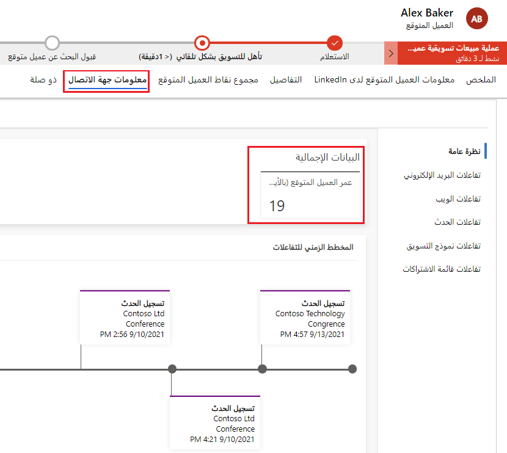

عادة ما يُنشئ تطبيق Marketing عميلًا متوقعًا لجهة اتصال ترسل صفحة منتقل إليها. تجمع المعلومات بين التفاعلات التي أجرتها جميع جهات الاتصال التي تنتمي إلى هذا الحساب.

معظم المعلومات المعروضة لأحد العملاء المتوقعين هي نفسها المعروضة لجهات الاتصال ومأخوذة من سجل جهة الاتصال المرتبط بالعميل المتوقع الحالي، كما هو موضح سابقًا في معلومات جهات الاتصال. والاستثناء الوحيد هو علامة تبويب **نظرة عامة** . تتعقب علامة التبويب المعلومات الخاصة بالعميل المتوقع مثل عمره (طول المدة التي كان السجل نشطًا فيها) وتقدمه بمرور الوقت.

> [!NOTE]
> ترتبط سجلات التفاعل بسجلات جهات الاتصال فقط ولا تؤدي إلى السجلات. تتوفر معظم المعلومات فقط للعملاء المتوقعين المرتبطين بجهة اتصال أو سجل حساب، ويرتبط بسجلات جهات الاتصال. لمزيد من المعلومات، راجع [‬‏‫استخدام العملاء المتوقعين لتسجيل التعبيرات التي تهمك وتعقبها‬‏‫](/dynamics365/marketing/manage-customer-information?azure-portal=true#use-leads-to-register-and-track-expressions-of-interest).

لعرض معلومات العملاء المتوقعين، انتقل إلى **التسويق** > **العملاء** > **العملاء المتوقعين**، وحدد سجل عميل متوقع، ثم افتح علامة تبويب **المعلومات** .

> [!div class="mx-imgBorder"]
> 

لمزيد من المعلومات، راجع [معلومات العميل المتوقع](/dynamics365/marketing/insights#lead-insights).
