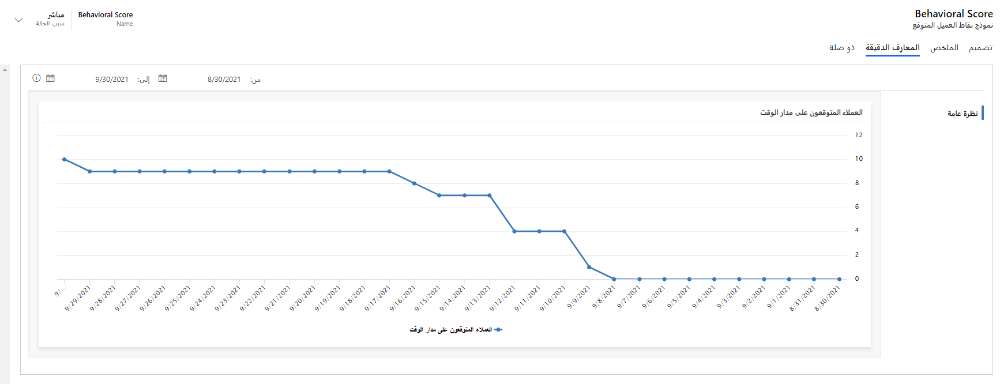

عند الانتقال إلى عرض معلومات نموذج نقاط العميل المتوقع، ستجد مخططًا زمنيًا يوضح عدد العملاء المتوقعين الذين عالجهم النموذج بمرور الوقت.
تتوفر المعلومات فقط للنماذج التي تكون (أو كانت) مباشرة.

لعرض **معلومات نموذج العميل المتوقع**، انتقل إلى **Marketing** > **إدارة العميل المتوقع** > **نماذج تسجيل النقاط**، وحدد سجل نموذج نقاط العميل المتوقع، ثم افتح علامة تبويب **المعلومات** .

> [!div class="mx-imgBorder"]
> 

> [!NOTE]
> لعرض معلومات تسجيل نقاط العميل المتوقع، يجب تعيين دور أمان **‏‫عارض نقاط العميل المتوقع‬** إلى المستخدمين لإضافة إلى أحد أدوار التسويق أو أمان المبيعات الأخرى.

لمزيد من المعلومات، راجع [‏‫معلومات نموذج نقاط العميل المتوقع.‬](/dynamics365/marketing/insights#lead-scoring-model-insights).
