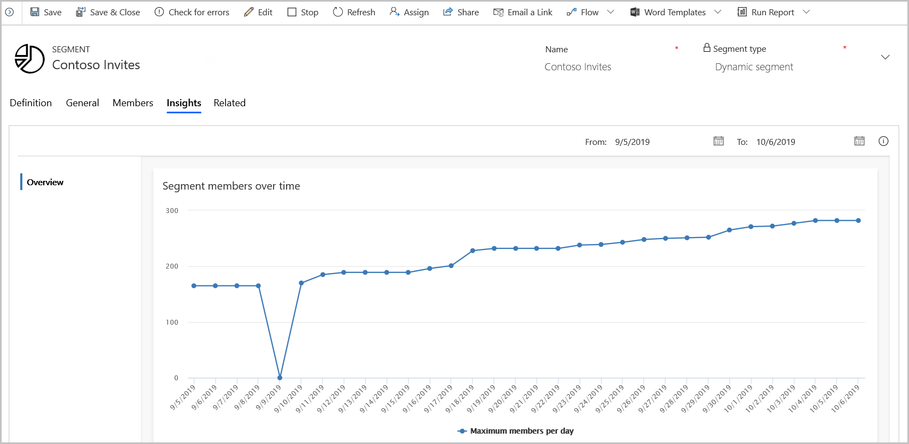

الشرائح السوقية هي مجموعة من جهات الاتصال التي تستهدفها في حملة تسويق. تعمل معلومات العملاء مع شرائح Dynamics 365 Marketing وتساعد في إنشاء تعريفات شرائح متقدمة وتحليلات العملاء.

لعرض معلومات الشريحة، انتقل إلى **التسويق** > **العملاء** > **الشرائح**، وحدد سجل شريحة، ثم افتح علامة تبويب **المعلومات** . تستطيع رؤية طريقة تغيير عضوية الشريحة التي حددتها بمرور الوقت.

لمزيد من المعلومات، راجع [معلومات الشرائح](/dynamics365/marketing/insights#segment-insights).

