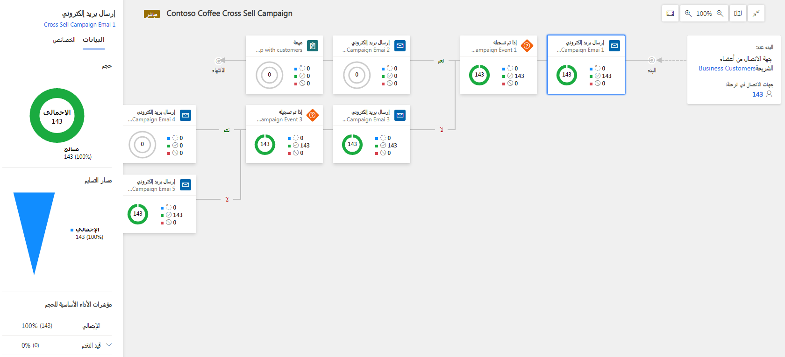

بمجرد بدء تشغيل رحلة العميل، تبدأ في إنشاء وجمع المعلومات عن مكان جهات الاتصال في الرحلة. كما أنها تُظهر أنهم تفاعلوا مع عناصر مختلفة مثل رسائل البريد الإلكتروني والصفحات والأحداث. يوفر Dynamics 365 Marketing معلومات قيمة، مثل التحليلات ومؤشرات الأداء الأساسية والرسوم البيانية وغيره. كل شيء مُصمم لمساعدتك في الحصول على المعلومات من نتائج التسويق. معلومات رحلة العميل متوفرة فقط إذا كانت مباشرة.

لعرض معلومات رحلة العميل، انتقل إلى **التسويق** > **‏‫تنفيذ التسويق‬** > **رحلات العميل** وحدد رحلة. تعرض الرحلات بعض المعلومات في علامة تبويب **المصمم** والمعلومات الأخرى في علامة تبويب **المعلومات**.

> [!Note] 
> قد يكون هناك بعض التأخير بمجرد تشغيل رحلة العميل قبل أن تصبح الرؤى متوفرة.

> [!IMPORTANT] 
> عندما تستهدف رحلة عميل قائمة اشتراك، سوف يتم إزالة أي جهة اتصال ألغت اشتراكها من هذه القائمة باستخدام مركز الاشتراك تلقائياً من هذه الرحلة في غضون 24 ساعة، حتى لو كانت مستبعدة مسبقاً خلال الرحلة. ولكن، إذا أزل مستخدم Dynamics 365 جهة اتصال من القائمة يدوياً باستخدام واجهة Dynamics 365، فسوف تستمر معالجة جهة الاتصال بواسطة أي رحلات مُعدة مسبقاً، ويمكن لجهة الاتصال الاستمرار في تلقي الرسائل حتى انتهاء جميع الرحلات النشطة. ولهذا السبب، يُفضل عادةً أن تطلب من جميع جهات الاتصال إدارة الاشتراكات باستخدام مركز الاشتراك.

## معلومات علامة تبويب "المصمم"

علامة تبويب "المصمم" هي إصدار للقراءة فقط من البنية الأساسية لبرنامج ربط العمليات التجارية لرحلتك. ويبدو كما حدث عندما كنت تصمم الرحلة، ولكن الآن يعرض النتائج ولا يتضمن مربع أدوات أو عناصر تحكم في التحرير.
في كل إطار متجانب في الزاوية اليمنى، يمكنك رؤية نظرة عامة على كيفية تدفق جهات الاتصال خلال هذا الإطار المتجانب، كما هو موضح في الرسم التوضيحي التالي. ومن خلال فحص هذه القيم، يمكنك الحصول على نظرة عامة سريعة حول كيفية تدفق مختلف جهات الاتصال خلال البنية، والمسار الذي تختاره، والمشكلات التي قد تواجهها. (كما يُعرض كل مؤشر أداء أساسي في لوحة 
**البيانات** عند تحديد تجانب.) لمزيد من المعلومات عن المعلومات والتحليلات الموضحة في علامة التبويب المصمم، راجع [معلومات المصمم](/dynamics365/marketing/insights?azure-portal=true#designer-insights) و[عرض المراحل الرئيسية في دورة حياة رحلة العميل](/dynamics365/marketing/customer-journeys-create-automated-campaigns#view-milestones-in-the-customer-journey-life-cycle).

> [!div class="mx-imgBorder"]
> 

## نظرة عامة على معلومات علامة تبويب المعلومات

توفر علامة تبويب معلومات رحلة العميل نظرة عامة أساسية على رحلة العميل المحددة في رسم بياني دائري لرسائل البريد الإلكتروني التي تم تسليمها والمحظورة. ثم تقسم المحتوى التسويقي لرحلة العميل إلى أقسام حيث يُمكنك عرض نتائج البريد الإلكتروني الأساسية وتقدير عدد جهات الاتصال التي تفاعلت مع رسائل البريد الإلكتروني وصفحات التسويق التي استخدمتها هذه الرحلة على مدار الوقت. لمزيد من المعلومات عن المعلومات المضمنة في علامة تبويب معلومات رحلة العميل، راجع [نظرة عامة على المعلومات](/dynamics365/marketing/insights#insights--overview)

## علامة تبويب معلومات الرحلات غير المكتملة

عند تحليل نتائج رحلة عميل، فإن أحد أهم الأشياء التي يجب اكتشافها هو ما إذا تم تسليم جميع الرسائل كما هو متوقع أم لا. تعرض لك علامة تبويب "الرحلات غير المكتملة" كل سبب قد يؤدي إلى فشل جهة اتصال في إكمال الرحلة وتذكر كل جهة اتصال تقع في كل فئة من هذه الفئات للرحلة الحالية. لمزيد من المعلومات عن تحليلات الرحلات غير المكتملة والأسباب المختلفة لتوقف الرحلة، راجع [الرحلات غير المكتملة.](/dynamics365/marketing/insights#insights--overview)

## إنشاء شرائح سلوكية ديناميكية من نتائج رحلة العميل

بعد بدء رحلة العميل مباشرة، سوف تتمكن من متابعة تقدم جهات الاتصال من خلال البنية الأساسية لبرنامج ربط العمليات التجارية لرحلتك. يُمكنك استخدام عدد كبير من هذه النتائج لكي يتم تلقائياً إنشاء شرائح سلوكية تعثر على جميع جهات الاتصال الجاري تعدادها حسب نتيجة معينة. ويوفر هذا الإجراء طريقة سهلة للعثور على جميع جهات الاتصال التي فعلت أشياء محددة في رحلة معينة وأيضاً إنشاء شريحة. مثال، قد تريد إنشاء شريحة من جهات الاتصال التي فتحت رسالة بريد إلكتروني محددة في رحلة العميل حتى تتمكن من استخدام هذه الشريحة في رحلة عميل أخرى. يستطيع Dynamics 365 Marketing فعل ذلك بكل سهولة. ويُمكن للتسويق أيضاً إنشاء شريحة متغيرة في تطبيق "التسويق" يُمكنك استخدامه. ونظراً لأن الشرائح السلوكية متغيرة، فإنها ستستمر في النمو حيث تعالج الرحلة المزيد من جهات الاتصال. لمزيد من المعلومات، راجع إنشاء شرائح سلوكية متغيرة من نتائج رحلة العميل.

لمزيد من المعلومات، راجع [معلومات رحلة العميل](/dynamics365/marketing/insights#customer-journey-insights).
