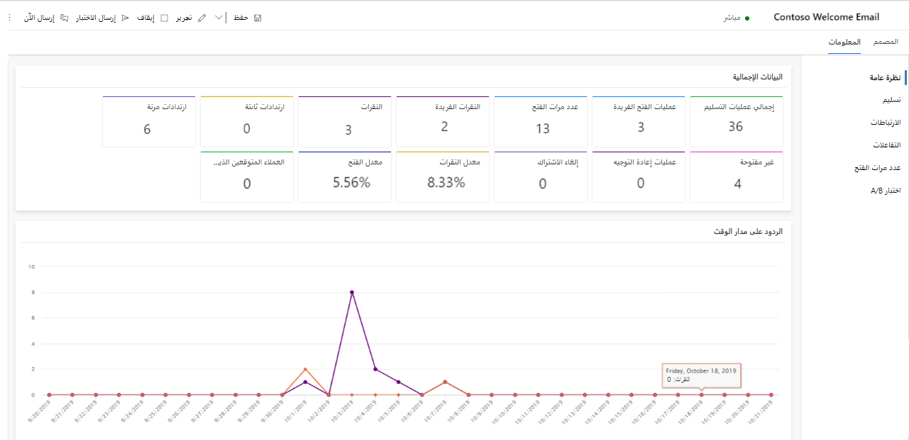

تُظهر معلومات التسويق عبر البريد الإلكتروني سجلًا كاملًا لكيفية تفاعل جهات الاتصال المختلفة مع رسالة محددة. كما تُظهر المعلومات الارتباطات التي تم تحديدها وأين كانت عند التفاعل مع الرسالة. ويُمكنك أيضًا الاطلاع على تفاصيل التسليم بشأن البريد الإلكتروني التسويقي أو جهة اتصال معينة. 

لعرض معلومات البريد الإلكتروني، انتقل إلى **التسويق** > **‎تنفيذ التسويق** > **لبريد الإلكتروني التسويقي**، وحدد رسالة بريد إلكتروني، ثم افتح علامة تبويب **المعلومات** . تتوفر المعارف الدقيقة فقط لرسائل البريد الإلكتروني التي تكون (أو كانت) مباشرة.

> [!div class="mx-imgBorder"]
> 

> [!IMPORTANT] 
> عندما تكون رسالة البريد الكتروني مباشرة، يقوم Dynamics 365 for Marketing بتحميل جميع الصور ذات الصلة المستخدمة في البريد الإلكتروني من المكتبة إلى شبكة تسليم المحتوي. لا يتم إرفاق الصور بكل رسالة، بل يتم تضمينها كارتباطات تتم إعادة توجيهها من خلال Dynamics 365 for Marketing لأغراض التعقب. ولن يقوم المستلمون بتنزيل أي صور حتى يفتحوا الرسالة، مما يحفظ النطاق الترددي لك ولهم. عندما يطلب عميل البريد الإلكتروني لمستلم الصور، يعرف Dynamics 365 for Marketing بفتح الرسالة وبواسطة من. في الغالب تُفتح الرسائل التي تأتي من مرسل مألوف وتحتوي على موضوع جذاب ونص معاينة ذي صلة أكثر من الرسائل التي تحتوي على بعض هذه الأشياء أو لا تحتوي على شيء منها.

ونظرًا لأنه يمكن لموظفي التسويق إعادة استخدام رسالة بريد إلكتروني في رحلات عميل مختلفة عديدة، فإن إعدادات التصفية للمعارف الدقيقة للبريد الإلكتروني تتضمن حقلًا لتحديد الرحلة التي ترغب في تحليلها. إذا لم تختر تحديد رحلة، فستنطبق المعلومات التي تشاهدها على جميع الرحلات التي تم فيها استخدام الرسالة. وفيما يتعلق بمعظم الكيانات الأخرى، يمكنك أيضًا تصفية المعارف الدقيقة للبريد الإلكتروني حسب نطاق التاريخ.

توفر رسائل البريد الإلكتروني التسويقية فئات المعلومات مثل **نظرة عامة**، و **نتائج التسليم**، و **الارتباطات**، و **التفاعلات**، و **أوقات الفتح** و **اختبار A/B** التي توفر تحليلًا لكل رابط مضمن في البريد الإلكتروني. للاطلاع على مزيد من المعلومات عن كل فئة معلومات والتحليلات ذات الصلة ومؤشرات الأداء الأساسية، راجع [معلومات البريد الإلكتروني](/dynamics365/marketing/insights?azure-portal=true#email-insights) و [مسرد المعلومات](/dynamics365/marketing/insights-glossary).
