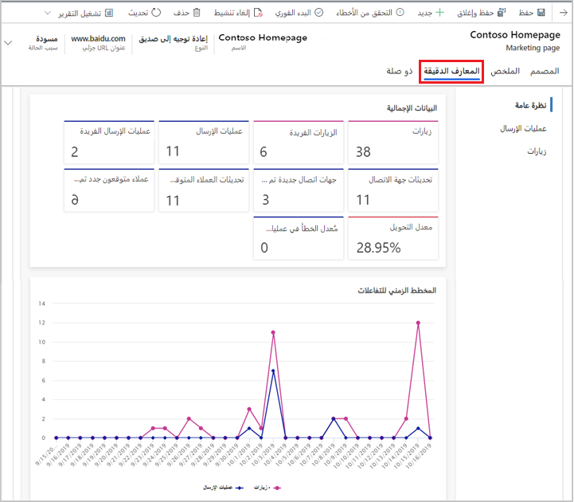

تساعدك معلومات صفحة Marketing في العثور على سجل كامل لكيفية تفاعل جهات الاتصال المختلفة مع الصفحة وعمليات الإرسال التي تم إجراؤها باستخدامها. يُمكنك إعادة استخدام صفحات التسويق في عدة رحلات مختلفة. استخدم عناصر تحكم التصفية في الصفحة لتحديد الرحلة التي ترغب في تحليلها. إذا لم تحدد رحلة، فسوف تنطبق المعلومات التي تشاهدها على جميع الرحلات التي تم فيها استخدام الصفحة. وفيما يتعلق بمعظم الكيانات الأخرى، يمكنك أيضًا تصفية المعارف الدقيقة لصفحات التسويق حسب نطاق التاريخ.

لعرض معلومات صفحه التسويق، انتقل إلى **التسويق** > **‏‫التسويق على الإنترنت‬** > **‏‫صفحات التسويق‬**، حدد صفحة تسويقية، ثم افتح علامة تبويب **المعلومات** . والمعلومات متوفرة فقط للصفحات التي تكون (أو كانت) مباشرة.

توفر صفحات Marketing [فئات المعلومات](/dynamics365/marketing/insights#categories) مثل **نظرة عامة**، التي توفر نظرة عامة على صفحة التسويق التي تتضمن مؤشرات الأداء الأساسية. **عمليات الإرسال** توفر جدولًا يسرد المحتوى الكامل لكل عمليه إرسال تم إجراؤها من خلال الصفحة وتسرد **الزيارات** معلومات عن كل مرة تُفتح فيها الصفحة.

لمزيد من المعلومات عن مؤشرات الأداء الأساسية المختلفة المذكورة في صفحات التسويق، راجع [معلومات صفحة Marketing](/dynamics365/marketing/insights?azure-portal=true#marketing-page-insights) و [‬‏‫مسرد المعلومات](/dynamics365/marketing/insights-glossary).

## معلومات نموذج التسويق

يتم عمل كل نموذج تسويق من مجموعة من حقول نماذج التسويق، وكذلك أزرار النماذج، والعناصر الرسومية، وعدد قليل من إعدادات التكوين. يمكنك العثور على سجل كامل لكيفية تفاعل جهات الاتصال المختلفة مع نموذج وعمليات الإرسال التي تم إجراؤها باستخدامه في علامة تبويب **المعلومات**. رُغم أنه يُمكنك استخدام كل نموذج في صفحات تسويق متعددة وفي رحلات متعددة، فإن جميع معلومات النموذج تجمع البيانات من جميع حات الاستخدام. لا يزال بإمكانك تصفية النتائج حسب نطاق التاريخ ويمكنك رؤية معلومات نموذج التسويق المتعلقة بجهة اتصال معينة.

لعرض معلومات نموذج تسويق، انتقل إلى **التسويق** > **‎التسويق على الإنترنت** > **نماذج التسويق**، وحدد نموذجًا، ثم افتح علامة تبويب  **المعلومات** . تتوفر المعلومات فقط للنماذج التي تكون (أو كانت) مباشرة.

توفر نماذج Marketing [فئات المعلومات](/dynamics365/marketing/insights#categories) مثل **نظرة عامة**، توفر نظرة عامة على صفحة التسويق التي تتضمن مؤشرات الأداء الأساسية؛ **عمليات الإرسال**، توفر جدولًا يسرد المحتوى الكامل لكل عمليه إرسال تم إجراؤها من خلال الصفحة؛ و **الزيارات**,، توفر معلومات عن كل مرة تمت فيها زيارة النموذج أو إرساله.

لمزيد من المعلومات عن مؤشرات الأداء الأساسية المختلفة المذكورة في نماذج التسويق، راجع [معلومات نموذج Marketing](/dynamics365/marketing/insights?azure-portal=true#marketing-form-insights) و [‬‏‫مسرد المعلومات](/dynamics365/marketing/insights-glossary).
