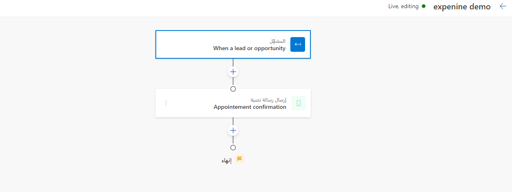
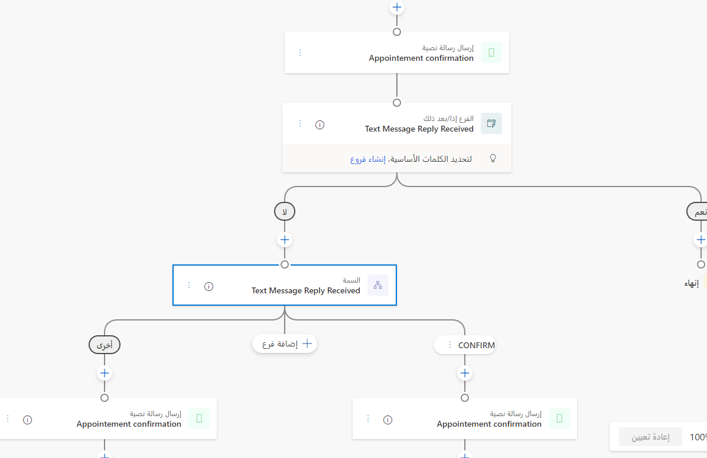
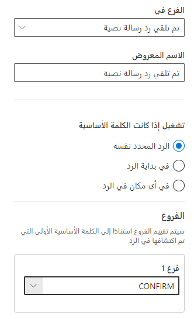

لإضافة  **الإجراءات** أو  **العناصر** في مصمم الرحلة، حدد علامة الجمع (**+**) على لوحة الرحلة. ستوفر لك نافذة منبثقة خيارات متنوعة لتخصيص رحلتك.

## إرسال الرسائل إلى العملاء

تتيح لك رحلات العملاء التسويقية في الوقت الفعلي الوصول إلى العملاء من خلال قنوات مختلفة، بما في ذلك:

-   [البريد الإلكتروني](/dynamics365/marketing/real-time-marketing-email/?azure-portal=true)

-   [الرسالة النصية](/dynamics365/marketing/real-time-marketing-outbound-text-messaging/?azure-portal=true)

-   [الإعلام المؤقت](/dynamics365/marketing/real-time-marketing-push-notifications/?azure-portal=true)

### الفرع إذا/ثم

يتيح لك الفرع إذا/ثم تفريع رحلة العميل استناداً إلى إجراءات العميل، مثل فتح بريد إلكتروني أو إكمال عملية شراء. سينتظر الفرع إذا/ثم حتى يقوم العميل بتنفيذ المشغل خلال المهلة الزمنية المحددة.
إذا قام العميل بتنفيذ المشغل، فسيقوم على الفور بالمضي قدماً إلى الفرع **نعم**. إذا لم يقم العميل بتنفيذ المشغل خلال المهلة المحددة، فسيقوم العميل بالمضي قدماً إلى الفرع **لا** بعد انقضاء المهلة.

على سبيل المثال، يمكنك إعداد الفرع إذا/ثم لانتظار حدث **تم فتح الرسالة الإلكترونية‬** على رسالة إلكترونية تم إرسالها مسبقاً. إذا تم تعيين المهلة الزمنية إلى **يوم واحد**، سينتظر الفرع إذا/ثم حتى يفتح العميل الرسالة الإلكترونية خلال ذلك اليوم. إذا فتح العميل الرسالة الإلكترونية خلال هذا اليوم، فسيقوم على الفور بالمضي قدماً إلى الفرع **نعم**.
إذا لم يفتح العميل الرسالة الإلكترونية خلال هذا اليوم، فسيقوم على الفور بالمضي قدماً إلى الفرع **نعم** بعد يوم واحد.

### فرع السمة

يتيح لك فرع السمة تفريع الرحلة بناءً على سمات مختلفة، بما في ذلك:

-   **سمات العميل** - يمكنك تفريع الرحلة بناءً على سمات العميل، مثل العنوان أو العمر. يحدد جمهور الرحلة السمات التي سيتم عرضها. على سبيل المثال، إذا كانت الرحلة خاصة بجهات الاتصال، فسيتم عرض سمات جهات الاتصال فقط.

-   **عضوية مقطع العميل** - يمكنك تفريع الرحلة بناءً على ما إذا كان العميل جزءاً من مقطع. يحدد جمهور الرحلة المقاطع التي سيتم عرضها. على سبيل المثال، سيتم عرض المقاطع المستندة إلى جهات الاتصال فقط للرحلات المخصصة لجهات الاتصال.

-   **السمات في المشغلات** - يمكنك تفريع الرحلة بناءً على قيم السمات في المشغلات. لعرض قيم السمات، يجب أن يكون المشغل قد حدث مسبقاً في الرحلة. وبالتالي، يمكنك فقط التحقق من قيم السمات للمشغل الذي يبدأ رحلة قائمة على المشغل أو المشغلات التي يتم استخدامها في الفرع إذا/ثم.

يتحقق فرع السمة من قيم السمات في اللحظة التي يدخل فيها العميل هذه الخطوة. على سبيل المثال، عندما يقوم أحد العملاء بإدخال خطوة فرع السمة، فإن شرط عضوية المقطع سيتحقق مما إذا كان العميل جزءاً من المقطع المحدد في تلك اللحظة.

### متى يتم استخدام السمة مقابل فرعي إذا/ثم

عند إنشاء رحلة تسويق في الوقت الحقيقي، ستحتاج إلى اتخاذ خيارات بشأن أنواع التفرع التي يجب استخدامها. بالإضافة إلى ذلك، ستحتاج إلى تحديد وقت استخدام فرع سمة مقابل الفرع إذا/ثم. يستخدم كلا الفرعين منطق نعم/لا بسيطاً ويقوم بتقييم المستخدمين لديك ثم توجيههم إلى خطوة أو أخرى بناءً على سلوك العملاء أو سمات ملفات التعريف.

الإرشاد العام هو أنه من الأفضل استخدام فروع السمات للأحداث التي حدثت بالفعل (السمات الموجودة في ملف تعريف العميل الخاص بك).
بدلاً من ذلك، سيتم تقييم فرعي إذا/ثم بناءً على ما إذا كان سلوك العميل المطلوب قد حدث أو لا.

لمزيد من المعلومات، راجع[وقت استخدام السمة مقابل فرعي إذا/ثم](/dynamics365/marketing/real-time-marketing-branches/?azure-portal=true).

## اختبار أ/ب

باستخدام اختبارات أ/ب، يمكنك قياس القناة أو استراتيجية إرسال المحتوى التي ستؤدي إلى نجاح أعلى. يقوم كل اختبار بإجراء مقارنة بين مجموعة عناصر تحكم مستخدمين (الإصدار أ) ومتغير (الإصدار ب). تحصل مجموعة عنصر المستخدم على تجربة افتراضية. تحصل مجموعة المتغير على تجربة أو رسالة مختلفة. ومن خلال مقارنة نتائج المجموعات، يمكنك تحديد المجموعة الأكثر فعاليةً. بعد إجراء التحديد، ستحدد تفاصيل الإصدار "أ" والإصدار "ب".

ستقوم الرحلة عادةً بتشغيل الاختبار بالكامل تلقائياً. يبدأ الاختبار بإرسال الإصدارين "أ" و"ب" إلى مجموعة صغيرة من جمهورك خلال تجاوزه لمراحل رحلته. بعد ذلك، ستحلل الرحلة نتائج التفاعل وستحدد فائزاً بناءً على المعايير التي اخترتها (نسبة النقر إلى الظهور، أو معدل الفتح، أو هدف الرحلة). بعد ذلك، سترسل الرحلة الإصدار الفائز إلى بقية جمهورك تلقائياً.

> [!NOTE]
> يمكنك إضافة ما يصل إلى خمسة اختبارات لكل رحلة. يمكنك اختبار قنوات مماثلة (البريد الإلكتروني "أ" مقابل البريد الإلكتروني "ب") أو اختبار قنوات مختلفة (البريد الإلكتروني مقابل الرسائل النصية).

لمزيد من المعلومات، راجع [اختبار رحلات التسويق في الوقت الحقيقي وتحسينها](/dynamics365/marketing/real-time-marketing-experimentation/?azure-portal=true).

### تحسين القناة

يعمل تحسين القناة على استبعاد فكرة التخمين من عملية تحديد القناة الصحيحة التي تمكنك من الوصول إلى كل عميل، وذلك من خلال انتقاء القناة المثلى استناداً إلى البيانات التاريخية للعميل. حدد قناتين على الأقل تريد تحسينهما. تأكد من وجود هدف رحلة محدد لمساعدة نموذج الذكاء الاصطناعي على معرفة ما تريد تحسينه. حدد القناة التي ستعمل كقناة افتراضية، وهو الخيار *الآمن* الذي يتم بموجبه تصفية 10 بالمائة تقريباً من جمهورك تلقائياً من خلاله. ستسمح لك القناة الافتراضية بإجراء مقارنة بين نتائج توصيات الذكاء الاصطناعي ومجموعة عناصر التحكم الخاصة بك.

لمزيد من المعلومات، راجع [استخدام تحسين قناة خلال وقت التشغيل المستند إلى الذكاء الاصطناعي](/dynamics365/marketing/real-time-marketing-channel-optimization/?azure-portal=true).

## خطوة الانتظار

يتيح لك خيار **خطوة الانتظار** إضافة خطوات انتظار في الرحلة. يمكنك تعيين هذا الخيار على مقدار معين من الوقت، أو حتى حلول تاريخ ووقت معين، أو حتى حلول وقت معين يحدده مشغل الحدث.

لمزيد من المعلومات، راجع [انتظار](/dynamics365/marketing/real-time-marketing-tile-reference?azure-portal=true?azure-portal=true#wait).

## الكلمات الأساسية النصية

عند تحديد رسالة نصية تتضمن كلمات أساسية، سيقوم النظام بتحديدها تلقائياً وسيقترح عليك تفريع الرحلة وفقاً لذلك.

> [!div class="mx-imgBorder"]
> 

بنقرة واحدة، سيتم إنشاء الفروع ذات الصلة، مما يتيح لك إعداد إجراءات المتابعة لكل فرع.

> [!div class="mx-imgBorder"]
> 

بالنسبة لكل فرع وكلمة أساسية، يمكنك تحديد مدى صرامة عملية تحديد الكلمات الأساسية:

- يجب أن تكون الكلمة الأساسية هي الرد الكامل

- يجب أن تكون الكلمة الأساسية في بداية الرد

-  يجب أن تكون الكلمة الأساسية في أي مكان في رسالة الرد

> [!div class="mx-imgBorder"]
> 

أخيراً، يمكنك إضافة المزيد من الفروع إلى رحلتك وتحديد الكلمات الأساسية التي لم تكن في الرسالة ولكنها مدرجة في صفحة الكلمات الأساسية النصية.
استخدم هذه الطريقة إذا كنت تريد تضمين تفريع للكلمات الأساسية التي ربما تم إبلاغ العميل بها في الماضي.

### الإصدار الأولي: تنشيط مشغل مخصص

> [!IMPORTANT]
> ميزة المعاينة هي ميزة غير كاملة، ولكن يتم توفيرها قبل الإصدار الرسمي حيث يتمكن العملاء من الوصول المبكر وتقديم تعليقات. الهدف من ميزات المعاينة ليس الاستخدام في الإنتاج وقد يكون لها وظائف محدودة أو مقيدة.

لا تقدم Microsoft دعماً لميزة المعاينة هذه. لن يتمكن فريق الدعم الفني لـ Microsoft Dynamics ‏365 من مساعدتك في هذه المشكلات أو الأسئلة.
ميزات الإصدار الأولي ليست مخصصة للاستخدام الإنتاجي، لاسيما لمعالجة البيانات الشخصية أو البيانات الأخرى التي تخضع لمتطلبات الامتثال القانونية أو التنظيمية.

استناداً إلى الاحتياجات الفريدة لأعمالك، قد ترغب في تشغيل عمليات مخصصة أو تدفقات Microsoft Power Automate في نقاط معينة في رحلة العميل.
بدلاً من ذلك، قد ترغب في إنشاء رحلات متعددة تعمل معاً بشكل منطقي.
من خلال تشغيل الإجراءات المخصصة، يمكنك إنجاز هذه المهام، والتي ستعمل كحلقة وصل بين الرحلات أو بين الرحلات والعمليات المخصصة.

عند استخدام مشغل مخصص، يمكنك اختيار البيانات المراد إرسالها كجزء من المشغل. يمكنك اختيار بيانات ملف تعريف العميل (على سبيل المثال، سمات الجمهور المستهدف، مثل جهات الاتصال، والعملاء المتوقعين، وما إلى ذلك) والبيانات من المشغلات الأخرى المستخدمة في الرحلة (على سبيل المثال، سمات المشغل الذي يبدأ الرحلة).

على سبيل المثال، يمكن أن تحتوي رحلة طلب القرض على خطوات مختلفة تتطلب موافقة المندوب البشري. من خلال إنشاء رحلة عميل منفصلة أو تدفق Power Automate للموافقة على استثناء القرض، يمكنك تشغيله من نقاط مختلفة في رحلات طلب القرض حيث يمكن أن تحدث استثناءات. يمكنك استخدام البيانات التي ترسلها مع المشغل لتعبئة المحتوى الديناميكي، أو يمكنك استخدام البيانات كمدخلات لإجراءات التدفق الأخرى.

لمزيد من المعلومات، راجع [الإصدار الأولي: تشغيل إجراء خارج رحلة](/dynamics365/marketing/real-time-marketing-custom-actions/?azure-portal=true).

## نشر الرحلة

بعد إضافة جميع الخطوات إلى رحلتك، ستكون جاهزاً العرض البث المباشر وإرسال الرسائل إلى العملاء. قبل نشر الرحلة، تأكد من أن جميع المحتويات ذات الصلة (رسائل البريد الإلكتروني، والرسائل النصية، والإعلامات المؤقتة) بالحالة **جاهز للإرسال.**  بالإضافة إلى ذلك، يجب أيضاً نشر مشغلات الأحداث والتعليمات البرمجية المدمجة بها.

للانتقال إلى الوضع المباشر، حدد الزر **نشر** في الرحلة.

بعد الانتهاء من العرض المباشر، يمكنك النظر إلى [صفحة تحليلات](/dynamics365/marketing/real-time-marketing-analytics/?azure-portal=true) الرحلة لمعرفة مدى أدائها.

> [!IMPORTANT]
> لا يمكنك تعديل الرحلة بعد نشرها، لذا تأكد من التحقق من أن جميع خطوات الرحلة هي بالضبط كيف تريدها أن تكون قبل النشر.

لمزيد من المعلومات، راجع [إنشاء رحلة مستندة إلى حدث](/dynamics365/marketing/real-time-marketing-event-based-journey/?azure-portal=true)  [وإنشاء رحلة مستندة إلى مقطع](/dynamics365/marketing/real-time-marketing-segment-based-journey/?azure-portal=true).
