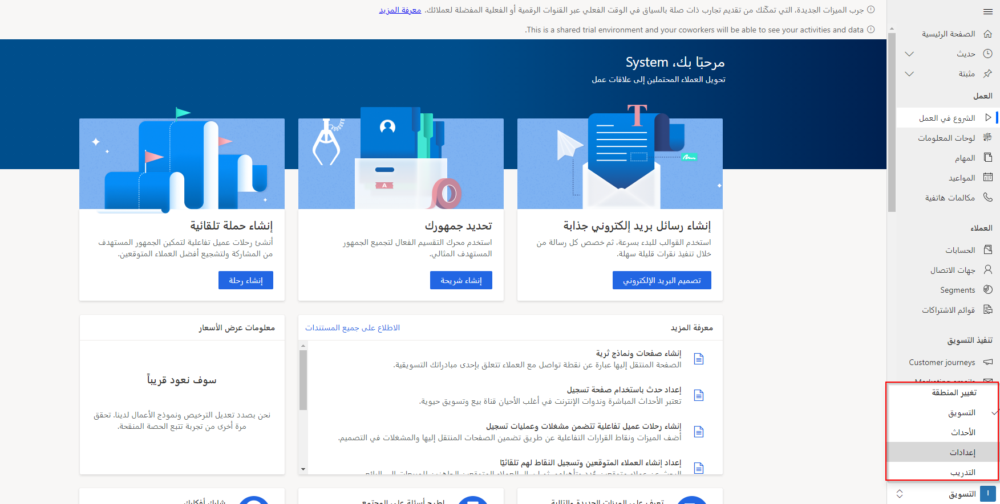

بفضل Microsoft Dynamics 365 Marketing، تحصل على إدارة شاملة للأحداث. مع التخطيط الأولي وإعداد الميزانية من خلال الترويج والنشر، ُيعد Dynamics 365 Marketing المصدر الشامل لتخطيط الأحداث وتنفيذها. ويشمل أيضًا تسجيل الحضور وبث الندوات عبر الإنترنت وإنشاء قوائم العملاء المتوقعين والتحليلات وغيره. 

يتم تجميع ميزات إدارة الأحداث لـ Dynamics 365 في منطقة العمل، مما يساعد على تسهيل العثور على الكيانات والإعدادات ذات الصلة في أثناء تركيزك على الأحداث. للوصول إلى هذه الميزات من Dynamics 365 Marketing، يجب توسيع قائمة منطقة العمل في الزاوية اليسرى السفلية من المتصفح الجانبي وحدد **الاحداث**. في منطقة عمل **الأحداث**، يُمكنك الانتقال بين الكيانات المتعلقة بالحدث باستخدام المتصفح الجانبي. 

على غرار الإجراءات التي اتخذتها في منطقة عمل تطبيق **التسويق** الأساسية، ستنشئ وتدير جميع التفاصيل اللازمة لتخطيط الأحداث ونشرها وترويجها وتحليلها. 

لعرض قائمة بجميع سجلات الأحداث، افتح منطقة عمل **الأحداث** وانتقل إلى **الحدث > الأحداث**، ومن هنا يمكنك استخدام عناصر تحكم عرض القائمة القياسية للبحث في القائمة وفرزها وتصفيتها للعثور على حدث موجود وفتحه، أو لإنشاء سجل حدث جديد.

سوف يتم تخزين كل إجراء متعلق بالحدث تتخذه مباشرةً في سجل الحدث. وسوف يتم تخزينه أيضًا في سجلات أخرى مرتبطة بهذا الحدث. ينقسم النص الأساسي لصفحة سجل الحدث إلى علامات تبويب، يُمكنك التنقل بينها باستخدام الارتباطات الموجودة أعلى نص الصفحة. 

تتضمن علامات التبويب الموجودة في صفحة سجل الحدث ما يلي:

-   **عام** - عرض معلومات الحدث الأساسية وتحريرها.

-   **جدول أعمال** - عرض تفاصيل جدول الحدث (الجلسات ومسارات الجلسة) وتحريرها، ومشاركات المتحدثين والجهات الراعية.

-   **موقع ويب ونموذج** - إنشاء موقع ويب مخصص للأحداث ودمج نماذج التسويق لتسجيل الحدث.

-   **التسجيل والحضور** - عرض من قام بالتسجيل للحدث، ومن حضر الحدث، ومن قام بالإلغاء. ويمكنك أيضًا إنشاء تسجيلات وتسجيلات وصول يدويًا.

-   **المعلومات الإضافية** - إعداد فريق الحدث وتسجيل المعلومات العامة والأهداف والتفاصيل المالية.

-   **بعد الحدث** - عرض وإنشاء استطلاعات عبر الإنترنت ذات صلة بالحدث عن طريق استخدام Microsoft Dynamics 365 Customer Voice. عادةً ما تستخدم هذه الميزة لتجميع آراء الحضور عن كيفية سير الحدث.

-   **حجوزات الغرف** - عرض تقويم يوضح الغرف المخصصة للحدث المعروض حاليًا وجلساته.
    لا تُعرض الغرف والأحداث غير المحجوزة أو الجلسات دون غرف مخصصة.

-   **عناصر الاسترداد** - عرض تعقب الأخطاء في مهام سير عمل الأحداث والتحقيق فيها.

-   **مرتبط** - يوفر ارتباطات لموضوعات ذات صلة بالحدث، تتراوح من الأنشطة إلى المتحدثين. إذا حددت موضوعًا في القائمة ذات الصلة، فستظهر علامة تبويب مؤقتة جديدة لهذا الموضوع على يسار القائمة ذات الصلة.

لمزيد من المعلومات، راجع [إعداد حدث](/dynamics365/marketing/set-up-event?azure-portal=true). 
