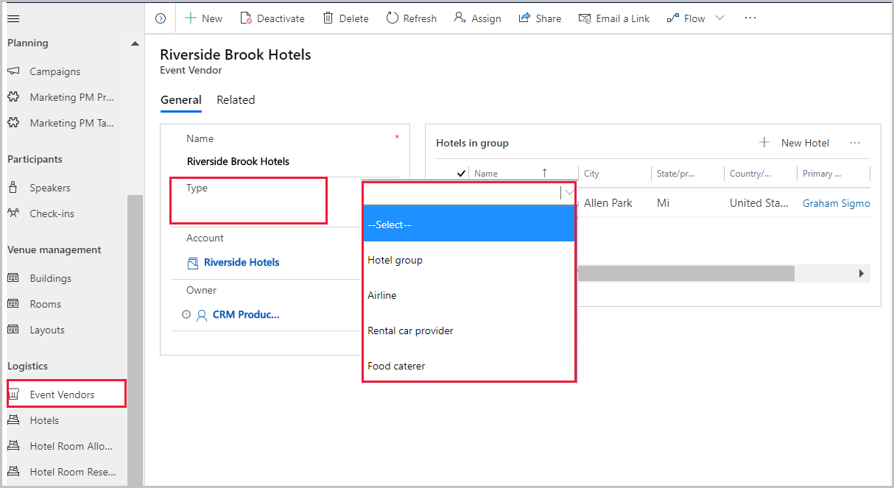
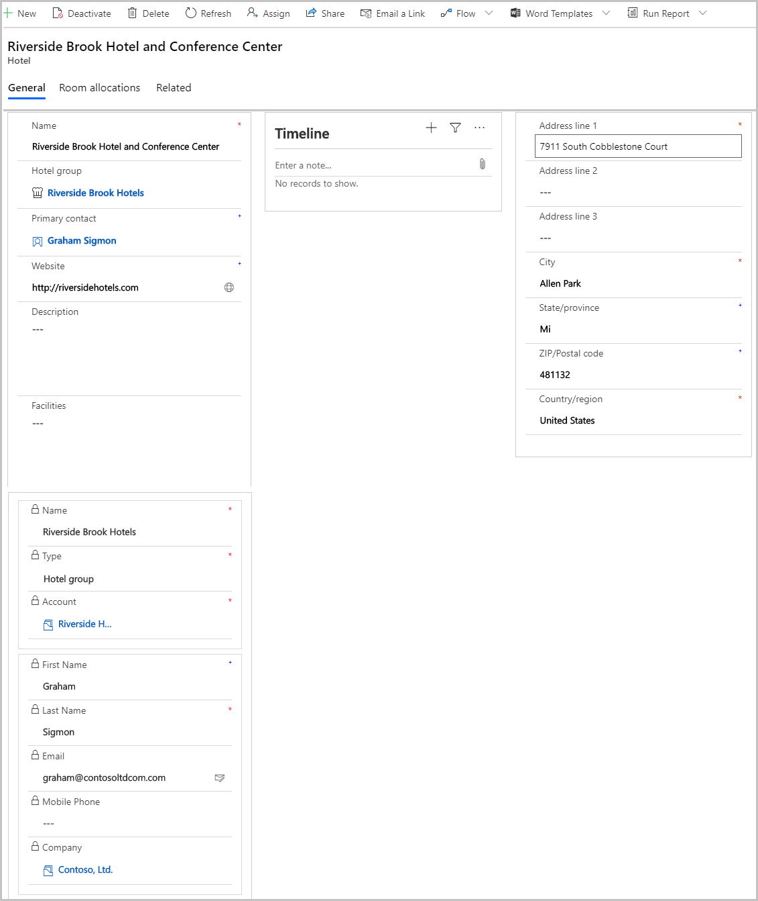
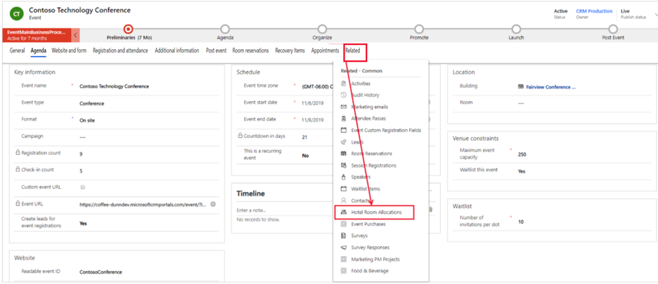
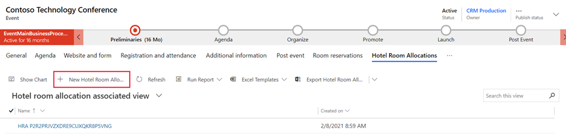
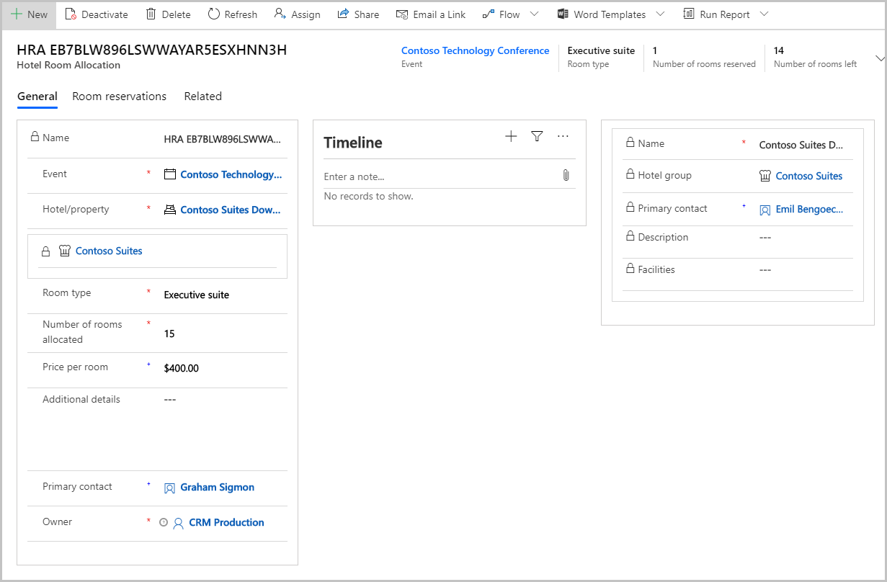
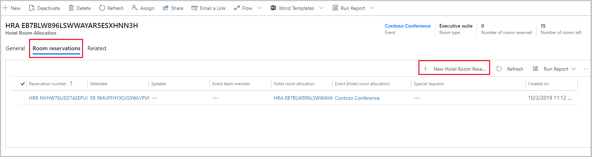
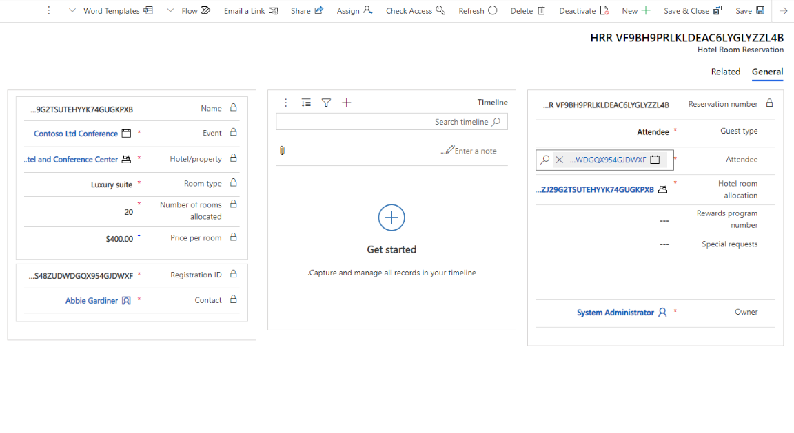

يُمكننا إعداد الموردين والخدمات اللوجستية وحجوزات الفنادق وإدارتها في Dynamics 365 Marketing. يُمكنك تسجيل الفنادق المحلية، ومعلومات الاتصال الخاصة بهم، وتخصيص مجموعات الغرف التي ستتوفر للحضور، وتنفيذ عمليات الحجز للغرف المخصصة. إضافة إلى ذلك، يُمكنك تسجيل خطوط الطيران وشركات تأجير السيارات ومموّن الأغذية وغيرهم.  

غالبًا ما تكون الميزات اللوجستية معلوماتية؛ لا يُكشف عنها مباشرة إلى الحضور من خلال موقع ويب الأحداث القياسي. مثال، يُمكنك إدخال حجوزات الفندق في Dynamics 365 Marketing حسب الاتصالات التي أجريتها مع الحضور. لا تزال بحاجه إلى الاتصال بالفندق من أجل إعلامهم بالحجوزات.

افتح منطقة عمل **الأحداث** وانتقل إلى **الخدمات اللوجستية**. الكيانات التالية متوفرة: **مورّدو الأحداث**، **والفنادق**، **‏‫وتخصيصات غرف الفنادق‬**، **‏‫وحجوزات غرف الفنادق‬**.

## مورّدو الأحداث 
عادة ما يُمثل مورّدو الأحداث الشركات أو المؤسسات التي شاركتها للمساعدة في تنفيذ الأحداث. ونظرًا لأن مورّدي الأحداث مستقلون عن أي حدث، يُمكنك الاستخدام من أجل أحداث متعددة.

عامة، قد تُنشئ مورّد حدث إذ يُمكنك إقرانه بخدمات لوجستية أخرى. مثال، هناك مجموعة فندق وعادةً ما يدير الفندق شركة بالاسم نفسه. في هذا المثيل، تُمثل سلسله الفندق مورّد الأحداث. لاحقًا، يُمكنك ربط الفنادق الفردية بمجموعه الفنادق عند إدارة الخدمات اللوجستية المخصصة للفندق من أجل الحدث.

لإنشاء مورّد حدث بغرض استخدامه مع أي حدث، اتبع الخطوات التالية:

1.  انتقل إلى منطقه عمل **الأحداث** ثم انتقل إلى **الخدمات اللوجستية > مورّدي الأحداث**.

1.  من شريط الأوامر، حدد **+ جديد**.

1.  أدخل تفاصيل المورد مثل اسم المورد ونوعه (مثل الخطوط الجوية وشركات تأجير السيارات ومموّن الأغذية وسلاسل الفنادق) وحساب المورد.

    > [!NOTE]
    > يجب ربط كل مورّد حدث بحساب موجود بالفعل في النظام، ولذا عليك إنشاء سجل حساب لمورّد الحدث قبل إنشاء سجل المورد.

1.  حدد **حفظ وإغلاق**.

    

## الفنادق 
يمكنك إقران سجل الفندق بمجموعة فندق (مورد الحدث) إذا كانت الخاصية جزء من مجموعة. تُعرض مجموعة الفندق وتفاصيل جهة الاتصال في قسم **الفنادق** إذا تم تحديدها. يجب عليك دائمًا تحديد عنوان الفندق كجزء من السجل الخاص بالفندق. كما يُمكنك عرض تخصيصات الغرف وإضافتها للفندق الحالي في هذا القسم.

لإنشاء تفاصيل خصائص فندق محدد وتحريرها، اتبع الخطوات التالية:

1.  انتقل إلى منطقه عمل **الأحداث** ثم انتقل إلى **الخدمات اللوجستية > الفنادق**.

1.  حدد **+ New** من شريط الأوامر أو حدد فندق موجود.

1.  املأ التفاصيل على النحو المطلوب.

    > [!NOTE]
    > تذكر، عليك دائمًا تحديد عنوان الفندق على أنه جزء من سجل الفندق.

1.  يُمكنك ربط كل سجل فندق مع جهة اتصال في قاعدة البيانات، وبالتالي يُمكنك معرفة من عليك الاتصال به إذا كان لديك أي أسئلة للفندق.

1.  حدد **حفظ وإغلاق**.

    

## تخصيصات غرف الفنادق
تُمثل تخصيصات الغرف مجموعة الغرف التي اتفق الفندق على توفيرها في أثناء الحدث. يُحدد سجل تخصيص كل غرفة عدد الغرف المخصصة ونوعها (مفردة أو مزدوجة أو جناح). يجب إقران كل تخصيص بأحد الفنادق التي يتم تسجيلها في قاعدة بياناتك. إذا خصصت عدة أنواع مختلفة من الغرف في الفندق ذاته، عليك إعداد تخصيص منفصل لكل نوع.

يُمكنك إنشاء سجل توزيع غرف فندق من منطقه عمل **الأحداث** بالانتقال إلى **الخدمات اللوجستية > تخصيص غرف الفندق** أو مباشره داخل سجل الأحداث. 

من أجل إضافة تخصيص غرفة فندق لحدث ما، اتبع الخطوات التالية:

1.  انتقل إلى منطقه عمل **الأحداث** ثم انتقل إلى **الخدمات اللوجستية > ‏‫تخصيصات غرف الفنادق‬**.

1.  افتح الحدث.

1.  في علامة التبويب **ذات الصلة**، حدد موقع **تخصيصات غرف الفندق**.

    > [!div class="mx-imgBorder"]
    > 

1.  عند تحديد القسم **تخصيصات غرف الفندق**، سوف تظهر تسمية علامة التبويب **تخصيصات غرف الفندق** الجديدة.

1.  حدد **+ تخصيصات غرف الفندق الجديدة**.

    > [!div class="mx-imgBorder"]
    > 

1.  يجب تعبئة تفاصيل غرفة الفندق مثل مجموعة الفنادق/الممتلكات المرتبطة بغرف الفندق، ونوع الحجرة (غرفة فردية، وغرفة مزدوجة، وجناح صغير، و‏‫جناح رجال الأعمال‬ وجناح فاخر) وسعر كل غرفة.

1.  حدد **حفظ**، سيقوم سجل **تخصيص غرف الفندق** بإنشاء كود فريد لاسم سجل تخصيصات الفندق، كما هو موضح في الصورة التالية.

    

## حجوزات غرف الفنادق 
بعد إنشاء سجل تخصيص غرف الفندق للحدث، يُمكنك تخصيص الغرف للحاضرين بتحديد سجل تخصيص غرف الفندق المناسبة (كما فصلناها سابقًا) للحدث وتحديد علامة التبويب **حجوزات الغرف** في علامة التبويب **تخصيص غرف الفندق**.

في علامة التبويب، يُمكنك حجز الغرف للحضور من بين الغرف المخصصة.
يُمكنك ملء تفاصيل الحجز مثل نوع الضيف (الحضور أو المتكلم أو عضو فريق الحدث) والمدعوون للحدث والطلبات الخاصة لحجز الفندق المحدد.

كما يُمكنك إنشاء سجل **حجز غرف الفندق** من منطقه عمل **الأحداث** بتحديد **الخدمات اللوجستية > حجوزات غرف الفندق**. 

> [!NOTE]
> يجب ملاحظة تنسيق سجل الحضور. هذا رابط إلى سجل حضور الحدث لهذا الحاضر.

لمزيد من المعلومات، راجع [‏‫إعداد مكان إقامة الحدث‬](/dynamics365/marketing/set-up-event?azure-portal=true#set-up-the-event-venue) و [‏‫إدارة لوجستيات الحضور وتوفر الإقامة‬](/dynamics365/marketing/manage-event-logistic?azure-portal=true).

وبعد إعداد هذه السجلات، يُمكنك الانتقال إلى سجل الأحداث والانتقال إلى علامة التبويب **حجوزات الغرف**، التي توفر تقويمًا يظهر الغرف المخصصة للحدث المعروض حاليًا وجلساته.
لا تُعرض الغرف والأحداث غير المحجوزة أو الجلسات دون غرف مخصصة. هذا التقويم للقراءة فقط، ولذا لا يُمكنك إنشاء جلسات أو حجوزات فيه. لمزيد من المعلومات، راجع [العمل باستخدام تقويمات التسويق](/dynamics365/marketing/marketing-calendar?azure-portals=true).
