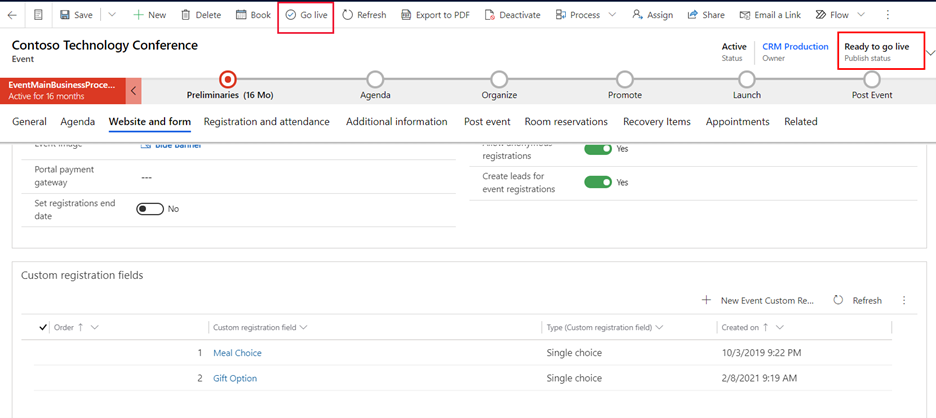

عندما تنطلق مباشرةً مع حدث ما ، فإن Dynamics 365 Marketing يجعل هذا الحدث متاحاً لموقع ويب الحدث. يعرض موقع الويب الحدث العديد من أنواع المعلومات التي تم تحديدها في سجل الأحداث وربطها به. يبقى الحدث وجميع إعداداته قابلة للتعديل حتى بعد بدء البث المباشر، وستنعكس التغييرات التي تجريها على الحدث المباشر والسجلات المباشرة المرتبطة به على موقع الويب على الفور. 

لنشر حدث، اتبع الخطوات التالية:

1.  انتقل إلى **الأحداث** منطقة العمل ثم انتقل إلى **التخطيط للحدث> الأحداث**.

1.  افتح الحدث بحالة **المسودة**.

1.  (اختياري) في القائمة أعلى عملية الأعمال، حدد سهم القائمة المنسدلة. يُمكنك تغيير الحقل **حالة النشر** إلى **‏‫جاهز للعرض المباشر‬** ثم حدد **حفظ**.

1.  في شريط الأوامر، حدد زر **‬‏‫العرض المباشر**. الآن، تم تغيير حقل **حالة النشر** إلى **مباشر"**.

    > [!div class="mx-imgBorder"]
    > 

> [!NOTE]
> كما يجب نشر الجلسات ومسارات الجلسة حتى تظهر على موقع الويب. إذا لم تنشر بالفعل جميع الجلسات ومسارات الجلسات، انتقل إلى علامة تبويب **جدول الأعمال**، ثم افتح جلسات العمل ومسارات الجلسات كل على حدة، وقم بتغيير **حالة النشر** إلى **مباشر**.

لمزيد من المعلومات، راجع [نشر الحدث وجلسات العمل والمسارات والسجلات المرتبطة](/dynamics365/marketing/set-up-event-portal?azure-portal=true#publish-events-sessions-tracks-and-related-records-to-the-website).
