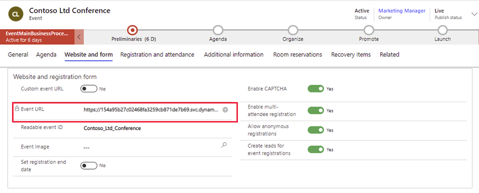
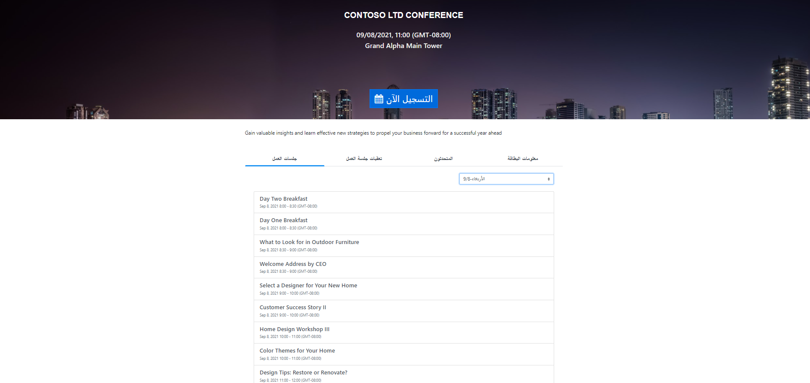

عندما يكون الحدث مباشراً، ستتمكن من الوصول إلى موقع ويب الحدث.
في كل مرة بث حدث مباشر، تتم إضافة رابط لهذا الحدث في موقع ويب الحدث إلى سجل الحدث. وهو أيضاً عنوان URL الذي ستشاركه مع جهات الاتصال التي تريد التسجيل في الحدث.

انتقل إلى سجل الحدث المباشر المناسب. من علامة تبويب **عام** في قسم **المعلومات الأساسية**، سوف يتم ملء حقل **عنوان URL الحدث** بعنوان URL موقع ويب الحدث. حدد رمز الكرة الأرضية الموجود على حافة هذا الحقل لفتح عنوان URL موقع ويب الحدث.

> [!div class="mx-imgBorder"]
> 

يتوفر عنوان URL تلقائياً إذا كنت تستخدم موقع ويب الحدث الذي تم تثبيته مع Dynamics 365 Marketing. يتخذ عنوان URL لأي حدث محدد الشكل التالي:

`https://<domainAndPath>/?event=<ReadableEventID>`

حيث:

-   `<domainAndPath>` هو الموقع الذي قمت بتثبيت موقع ويب للأحداث فيه على المدخل أو الموقع الخارجي.

-   `<ReadableEventID>` هو معرف قابل للقراءة تم إنشاؤه في المرة الأولى التي قمت فيها بحفظ سجل الحدث (بناءً على اسم الحدث). للعثور على هذه القيمة، افتح سجل الحدث ذي الصلة، وانتقل إلى علامة التبويب **عام**، وانتقل إلى قسم **موقع الويب**، حيث ستجد **قابل للقراءة معرف الحدث**. إذا تجاهلت هذا المعرّف، فسوف يفتح موقع ويب للأحداث عندئذٍ على قائمة بالأحداث المتوفرة.

إذا كنت ترغب في تخصيص عنوان URL، راجع [تغيير عنوان URL لمواقع ويب الحدث المستضافة في مداخل Power Apps](/dynamics365/marketing/events-change-url?azure-portal=true).

> [!div class="mx-imgBorder"]
> 
