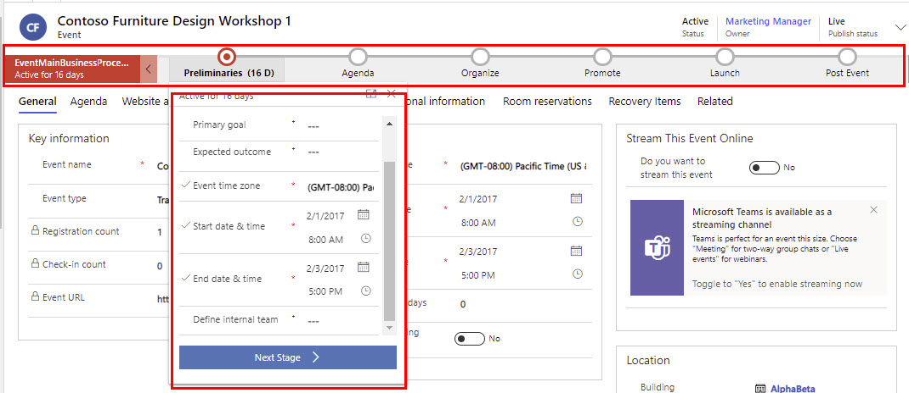

يتم توفير سير إجراءات العمل القياسي للأحداث جاهزًا، ويُمكنك تخصيصه كي يتطابق مع العملية الموجودة في مؤسستك.

> [!div class="mx-imgBorder"]
> 

توجد جميع الحقول المطلوبة والمهمة للعمل في الجزء العلوي من الصفحة في سير إجراءات العمل، حيث يُمكنك ملئها بسرعة عند إنشاء الحدث. تظهر جميع الإعدادات التي تقوم بإدخالها في سير إجراءات العمل بين التفاصيل الأخرى للحدث أسفل الصفحة. سيظل بإمكانك رؤية تلك الإعدادات وتحريرها حتى بعد الانتقال إلى المرحلة التالية في سير العمل.

لمزيد من المعلومات، راجع [نظرة عامة على سير إجراءات العمل](/dynamics365/customerengagement/on-premises/customize/business-process-flows-overview/?azure-portal=true)
