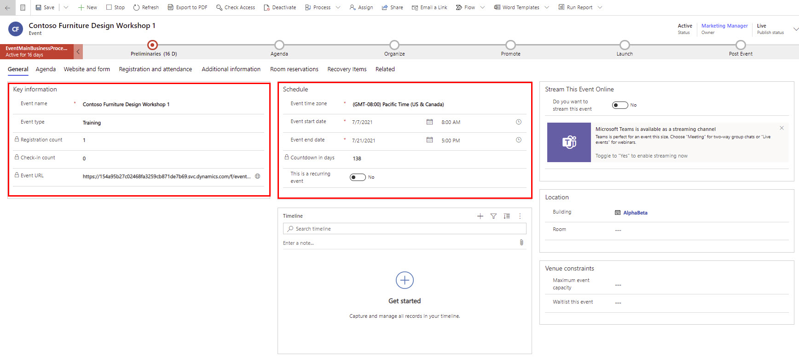

تتطلّب استضافة حدث شخصي التنظيم والتخطيط لعدة تفاصيل وخدمات لوجستية مختلفة. للبدء، ينبغي عليك إنشاء سجل حدث. تأكد من تحديد قيم كل حقل مطلوب تم تمييزه بعلامة النجمة الحمراء. بالإضافة إلى ذلك، ‏‏من المستحسن تعبئة الحقول المهمة للأعمال المميزة بعلامة زائد زرقاء (**+**).

> [!div class="mx-imgBorder"]
> 

## تعبئة التفاصيل العامة

من المستحسن ملء بعض الحقول الرئيسية في علامة التبويب **عام** عند إنشاء حدث جديد. توضّح الأقسام التالية تلك الحقول الرئيسية بالتفصيل.

### معلومات أساسية

املأ الحقول التالية في منطقة **معلومات أساسية**:

-   **اسم الحدث** - هذا الحقل مطلوب. نظرًا لأن الاسم سيظهر على مدخل الحدث، نُوصي بإدخال اسم وصفي يبدو منطقيًا لمسجلي الحدث.

-   **نوع الحدث** - حدد نوع الحدث، مثل مؤتمر أو عرض توضيحي أو تدريب، وما إلى ذلك. يوفر النظام العديد من الخيارات الجاهزة، ولكن يمكنك تعديلها لتلائم احتياجات عملك. هذا الحقل مخصص لأغراض التعقب/إعداد التقارير الداخلية ولا يؤثر على ميزات الأحداث الأخرى.

-   **عنوان URL للحدث** - يعرض عنوان [موقعك على الويب للأحداث](/dynamics365/marketing/set-up-event-portal/?azure-portal=true).
    إذا كنت تستخدم الموقع الافتراضي على حل مداخل Microsoft Dynamics 365، فستكون هذه القيمة حينئذ للقراءة فقط ويتم توفيرها تلقائيًا عندما يكون الحدث مباشرًا. إذا كنت تستضيف موقع الويب لديك في موقع مخصص، فيمكنك تشغيل ميزة  **‏‫عنوان URL لحدث مخصص** في علامة تبويب **موقع الويب والنموذج**، وبعد ذلك، سيصبح هذا الحقل مطلوبًا، ويجب عليك إدخال عنوان URL للحدث. 

    > [!NOTE]
    > لن يكون عنوان URL للحدث متاحًا إلا عندما يكون الحدث مباشرًا،
    وحينئذٍ يمكنك تحديد زر الكرة الأرضية بجوار هذا الحقل لفتح موقع ويب الحدث. لمزيد من المعلومات، راجع [‏‫فتح موقع ويب للأحداث](/dynamics365/marketing/set-up-event-portal?azure-portal=true#open-site).

-   **إنشاء عملاء متوقعين لتسجيلات الأحداث‬** - يمكنك تعيين هذا الخيار إلى **نعم** لإنشاء عميل متوقع جديد لكل جهة اتصال تم تسجيلها لحضور هذا الحدث، وتعيينه إلى **لا** لإيقاف إنشاء عملاء متوقعين للأحداث.
    يوجد هذا الحقل الآن في علامة التبويب **ويب ونموذج**. لمزيد من المعلومات، راجع [إنشاء ومطابقة جهات اتصال وعملاء متوقعين من تسجيلات الأحداث](/dynamics365/marketing/set-up-event-portal?azure-portal=true#generate-leads).

### جدولة

املأ الحقول التالية في منطقة **جدولة**:

-   **المنطقة الزمنية للحدث** - هذا الحقل مطلوب. يتم تعيين المنطقة الزمنية افتراضيًا إلى المنطقة الزمنية المقترنة بالمستخدم الذي يُنشئ الحدث. يُمكنك تغيير هذا الحقل حسب الحاجة في كل حدث.

-   **تاريخ بدء الحدث** - هذا الحقل مطلوب. حدد تاريخ بدء الحدث. سيظهر هذا التاريخ في موقع ويب الحدث.

-   **تاريخ انتهاء الحدث** - هذا الحقل مطلوب. حدد تاريخ انتهاء الحدث. سيظهر هذا التاريخ في موقع ويب الحدث.
    بعد حفظ سجل الحدث، سيتم ملء حقل **العد التنازلي بالأيام** كحقل للقراءة فقط.

### المخطط الزمني

استخدم قسم **المخطط الزمني** لإنشاء الأنشطة وتعقّبها، مثل المهام ورسائل البريد الإلكتروني والمكالمات المتعلقة بالحدث. يمكنك أيضًا مشاركة الملاحظات مع فريقك للمساعدة في إدارة التخطيط للأحداث.

### الموقع

في منطقة **الموقع**، يمكنك تحديد الموقع الذي سيُقام فيه الحدث.
يكون الموقع هرمي، ويمكنك فقط تحديده بمقدار التفاصيل التي تريدها. على سبيل المثال، بعد تحديد مبنى، سيظهر لك خيار لتحديد غرفة مرتبطة بالمبنى، بما في ذلك المباني الإضافية والغرف والتخطيطات. 

تكون هذه المعلومات غير معروفة غالبًا عند إنشاء الحدث لأول مرة، لذا يمكنك العودة لتحريرها لاحقًا. ستتم مناقشة كيفية إعداد أماكن إقامة الأحداث لاحقًا في هذه الوحدة.

### قيود مكان إقامة الحدث

سيظهر قسم **قيود مكان إقامة الحدث** للأحداث في الموقع فقط. في حالة تعيين موقع جديد، سيتم تحديث **قيمة السعة القصوى للحدث‬‏‫** لمطابقة السعة التي تم تكوينها لآخر مبنى أو غرفة أو تخطيط محدد، إن وجدت. يمكنك تحرير القيمة لتجاوز رقم السعة إذا لزم الأمر. ويمكنك أيضًا تمكين قائمة الانتظار في هذه المنطقة.

### قائمة الانتظار

سيظهر قسم **قائمة الانتظار** فقط في حالة تمكين قائمة الانتظار في قسم **‏‫قيود مكان إقامة الحدث‬**. يمكنك في هذا القسم تكوين الخيارات المتعلقة بكيفية دعوة جهات الاتصال قيد الانتظار عند توفر أماكن. لمزيد من المعلومات، راجع [‏‫إعداد قائمة انتظار للأحداث وإدارتها‬](/dynamics365/marketing/event-waitlist?azure-portal=true).

لمزيد من المعلومات، راجع [علامة التبويب "عام"](/dynamics365/marketing/set-up-event?azure-portal=true#the-general-tab).

## إعداد أماكن الإقامة 

مكان الإقامة هو أي مكان فعلي يُعقَد فيه حدث أو جلسة عمل.
قد يُقام الحدث في مبنى واحد يحتوي على غرفة واحدة فقط، أو عدة غرف في مبنى. لكل مكان إقامة، يمكنك تسجيل العديد من أنواع التفاصيل الهامة، بما في ذلك الاسم والموقع والمرافق والسعة والتخطيط والأحداث التي ستنعقد أو انعقدت بالفعل وغير ذلك الكثير.

في منطقة عمل **الأحداث**، يُتيح لك قسم **إدارة مكان الإقامة** إمكانية إنشاء نموذج هرمي لموقع الحدث، ومن ثم يمكن لمؤسستك إدارة الخدمات اللوجستية المستمرة طيلة الحدث.

بعدما تقوم بإعداد مكان الإقامة، يمكن أن تعيّن له أحداث وجلسات عمل حسب الحاجة. يُتيح لك Dynamics 365 Marketing إمكانية تعقّب جميع التفاصيل حول أماكن الإقامة. 

تتوفر الكيانات التالية في قسم **إدارة مكان الإقامة‬**:

-   **المباني** - تمثّل هياكل قائمة بذاتها يمكن أو لا يمكن تقسيمها إلى غرف.

-   **الغرف**- هي تقسيمات فرعية للمباني، ويجب تعيين كل منها لسجل مبنى مخزّن أيضًا في النظام.

-   **التخطيطات** - أثناء انعقاد حدث ما، قد تستخدم غرفة واحدة لاستضافة أنواع مختلفة من جلسات العمل، قد يتطلّب كل منها ترتيبًا مختلفًا للكراسي وغير ذلك من المرافق. قد يكون لتخطيط الغرفة نتائج عملية تؤثر على عدد المقاعد على سبيل المثال. يجب أن يقترن كل تخطيط بغرفة معينة، ولكن يمكنك إعداد أي عدد من التخطيطات لكل غرفة.

لإنشاء مبنى وغرفة وتخطيط جديد، اتبع الخطوات التالية:

1.  انتقل إلى منطقة عمل **الأحداث**، ثم إلى **إدارة مكان الإقامة > المباني**.

1.  من شريط الأوامر، حدد **+ جديد**.

1.  يمكنك تعبئة جميع التفاصيل حسب الحاجة، ثم حدد **حفظ**.

1.  إذا كنت تريد إضافة غرفة إلى المبنى، فحدد علامة تبويب **الغرف**.

1.  حدد **+ غرفة جديدة**.

1.  أدخل اسمًا ثم املأ الحقول المتبقية حسب الحاجة.

1.  حدد **حفظ وإغلاق**.

1.  حدد اسم الغرفة لملء التفاصيل الإضافية المتعلقة بها. إذا كنت تريد إضافة تخطيط إلى الغرفة، فانتقل إلى قسم **تخطيطات (غرفة)**.

1.  حدد علامة الحذف (**...**) ثم حدد **+ تخطيط جديد**.

1.  أدخل اسمًا ثم املأ الحقول المتبقية حسب الحاجة.

1.  حدد **حفظ وإغلاق**.

1.  حدد اسم التخطيط لملء تفاصيل إضافية عنه، ثم تأكد من حفظ التغييرات التي أجريتها.

لإضافة مكان إقامة إلى حدث، اتبع الخطوات التالية:

1.  انتقل إلى منطقة عمل **الأحداث** ثم إلى **الحدث > الأحداث**.

1.  افتح الحدث.

1.  في علامة التبويب **عام**، انتقل إلى قسم **الموقع**.

1.  في حقل **المبنى**، ابحث عن المبنى المناسب وحدده أو استخدم الخيار **+ جديد** لإنشاء مبنى جديد.

1.  بعد تحديد مبنى، سيصبح حقل **الغرفة** متاحًا، ويمكنك تعبئته إذا لزم الأمر.

1.  بعد تحديد غرفة، سيصبح حقل **التخطيط** متاحًا، ويمكنك تعبئته حسب الحاجة.

1.  تأكد من حفظ التغييرات.

لمزيد من المعلومات، راجع [‏‫إعداد مكان إقامة الحدث‬](/dynamics365/marketing/set-up-event?azure-portal=true#set-up-the-event-venue).
