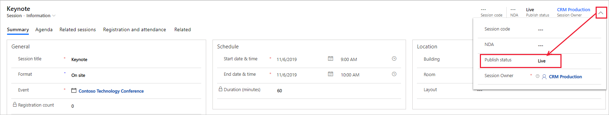

عادة ما تكون جلسات العمل والمتحدثين هم مواطن الجذب الأساسية لعرض الأحداث الخاصة بك. قد يضم الحدث البسيط جلسة عمل واحدة فقط، بينما يحتوي المؤتمر عادةً على عدة جلسات عمل تمتد لعدة أيام ويشارك فيها العديد من المتحدثين. كما سيكون هناك جهات راعية‬ للكثير من الأحداث تريد ربطها بسجل الحدث لديك المخزّن في Dynamics 365 Marketing. ويتم عرض المتحدثين وجلسات العمل والجهات الراعية عادةً على موقع ويب الحدث، لذلك نُشجعك على إعداد هذه السجلات عند التخطيط لحدثك وإنشائه. 

كما أن الميزات المتقدمة في وحدة إدارة الأحداث ستساعدك على الارتقاء بأحداثك. وتتوفر أيضاً ميزات مثل قائمة الانتظار والتسجيل على مستوى جلسة العمل إذا تطلّب الحدث ذلك. 

## إعداد جلسات العمل 

بعد الانتهاء من إعداد التفاصيل الأولية للحدث، قد تصبح جاهزاً لبدء التخطيط لجدول الحدث، الذي تتم إدارته من خلال جلسات العمل ومساراتها.

وتكون جلسة العمل عادةً ندوة أو كلمة رئيسية.  ولكن هذا المفهوم مرن تماماً يمكنك مواءمته حسب احتياجاتك.‬ على سبيل المثال، إذا كان الحدث عبارة عن عروض تجاري وليس مؤتمراً، فيمكنك استخدام جلسات العمل لتمثيل مقصورات المؤتمر. ‏‫قد تضم المؤتمرات الكبيرة جلسات عمل متعددة تنعقد في الوقت نفسه، وقد تحتوي على العديد من ‬‏‫*مسارات‬‏‫ جلسات العمل*، التي تنظّم حشداً من جلسات العمل المتنوعة غير المتعارضة والمرتبطة فيما بينها حسب الجمهور.

تقترن كل جلسة عمل بحدث ومتحدث معيّنين، كما أنها تتضمن تفاصيل الجدولة، مثل عنوان جلسة العمل وتاريخ بدئها وانتهائها وتنسيقها (في الموقع أو ندوة إنترنت أو الأحداث المختلطة) والسعة القصوى لها.

تعمل جلسات عمل الأحداث بشكل مشابه للحدث، وتعمل بشكل أساسي كأحداث فرعية، تنشئ معاً جدول الحدث الكلي. يُظهر موقع ويب للأحداث جدول جلسات العمل التي تنتمي إلى كل حدث. قد يتضمن الحدث جلسات عمل منشورة وغير منشورة، ولكن جلسات العمل المنشورة الخاصة بالأحداث المنشورة هي وحدها التي تظهر في موقع الويب للأحداث.

يمكنك عرض قائمة جلسات العمل المرتبطة بحدث معيّن وتحريرها عن طريق فتح الحدث المناسب، والانتقال إلى علامة التبويب **جدول الأعمال** والبحث في قسم **جلسات العمل**. تعرض القائمة في هذا القسم جلسات العمل ذات الصلة بهذا الحدث.

> [!div class="mx-imgBorder"]
> 

لإضافة جلسة عمل إلى حدث، اتبع الخطوات التالية:

1.  انتقل إلى منطقة **الأحداث** ثم إلى **الحدث > الأحداث**.

1.  افتح الحدث.

1.  انتقل إلى علامة تبويب **جدول الأعمال**.

1.  في قسم **جلسات العمل**، حدد **+ جلسة عمل جديدة**.

1.  املأ الحقول المطلوبة والحقول الأخرى حسب الحاجة.

    > [!NOTE]
    > ستتلقى رسالة تحذير في حالة تعيين وقت انتهاء جلسة العمل خارج الأوقات المحددة الحدث.

1.  حدد **حفظ وإغلاق**.

> [!IMPORTANT]
> ستكون جلسات العمل التي تقوم بإنشائها في علامة تبويب **جدول الأعمال** تلقائياً بحالة **مسودة**.
إذا كنت تريد بدء العرض المباشر لجلسات العمل وكذلك عرضها على مدخل الحدث، فيجب عليك نشر كل جلسة عمل من خلال الانتقال إلى سجل جلسة العمل وتغيير **حالة النشر** إلى **مباشر**. لمزيد من المعلومات، راجع [الأحداث وجلسات العمل والمسارات وعمليات العرض المباشر لها وحالتها‬](/dynamics365/marketing/go-live?azure-portal=true#events-session-and-tracks-go-live-operations-and-status).

لمزيد من المعلومات، راجع [‏‫إعداد جلسات عمل الأحداث والمسارات](/dynamics365/marketing/set-up-event#set-up-event-sessions-and-tracks).

## إعداد مسارات جلسات العمل

مسارات جلسات العمل هي مجموعة جلسات العمل التي تتعلق عادةً بنسق أو جمهور. توفر المسارات طريقة ملائمة للحضور للتسجيل لجلسات عمل مرتبطة متعددة في نفس الوقت.

يمكنك في كل مسار تعيين جمهور وبعض التفاصيل الوصفية الأخرى ثم إضافة جلسات عمل الأعضاء؛ جلسة في كل مرة. يجب أن تكون جميع جلسات العمل في المسار من نفس الحدث.

ثمة نوعان من المسارات هما:

-   **داخلية** - تُستخدم أثناء مرحلة التخطيط لتجميع جلسات العمل في جميع بنود المؤسسة، حسب موارد الفريق أو المعدات المطلوبة على سبيل المثال.

-   **خارجية** - تُستخدم لتجميع جلسات العمل حسب المحتوى أو الجمهور وتمكين إصدار التذاكر والتسجيل. يتم نشر المسارات الخارجية على الأنظمة الأساسية الموجهة للعملاء مثل مواقع ويب للأحداث وتطبيقات المحمول.

وعلى غرار جلسات عمل الأحداث، يجب عليك نشر كل مسار ليظهر على موقع الويب للحدث ذي الصلة به. قد يتضمن الحدث مسارات منشورة وغير منشورة. ومع ذلك، يتم عرض المسارات المنشورة الخاصة بالأحداث المنشورة فقط على موقع ويب للأحداث.

يمكنك عرض قائمة مسارات جلسة العمل المقترنة بحدث معين وتحريرها. افتح الحدث المناسب ثم راجع قسم **مسارات جلسة العمل** في علامة تبويب **جدول الأعمال**. تعرض القائمة في هذا القسم مسارات جلسة العمل ذات الصلة بهذا الحدث.

> [!div class="mx-imgBorder"]
> 

لإضافة مسار جلسة عمل إلى حدث، اتبع الخطوات التالية:

1.  انتقل إلى منطقة عمل **الأحداث** ثم إلى **الحدث > الأحداث**.

1.  افتح الحدث.

1.  انتقل إلى علامة تبويب **جدول الأعمال**.

1.  في قسم **مسارات جلسة العمل**، حدد **+ مسار جلسة عمل جديد**.

1.  املأ الحقول المطلوبة والحقول الأخرى حسب الحاجة.

1.  حدد **حفظ وإغلاق**.

> [!IMPORTANT]
> ستكون مسارات جلسة العمل التي تقوم بإنشائها في هذا القسم بحالة **مسودة** تلقائياً. إذا كنت تريد بدء العرض المباشر لمسارات جلسة العمل وكذلك عرضها على مدخل الحدث، فيجب عليك نشر كل مسار جلسة عمل من خلال الانتقال إلى السجل وتغيير **حالة النشر** إلى **مباشر**. لمزيد من المعلومات، راجع [الأحداث وجلسات العمل والمسارات وعمليات العرض المباشر لها وحالتها‬](/dynamics365/marketing/go-live?azure-portal=true#events-session-and-tracks-go-live-operations-and-status).

لمزيد من المعلومات، راجع [‏‫إعداد جلسات عمل الأحداث والمسارات](/dynamics365/marketing/set-up-event?azure-portal=true#set-up-event-sessions-and-tracks).

## تمكين التسجيل المستند إلى جلسة العمل

يسمح التسجيل على مستوى جلسة العمل لمنظّمي الأحداث بتمكين الحضور من تجميع الأحداث الخاصة بهم من بين جميع جلسات العمل المتاحة.
في معظم الأحوال، تعمل الأحداث التي تمتاز بالتسجيل على مستوى جلسة العمل بنفس الطريقة التي تعمل بها الأحداث المسجلة على مستوى الحدث، ولكن مع وجود بعض الاختلافات الرئيسية، كما هو موضّح في الجدول التالي.

|                                                              | التسجيل على مستوى الحدث                                                                                                | التسجيل على مستوى جلسة العمل                                                                                                                             |
|-------------------------------------------------------------------|-------------------------------------------------------------------------------------------------------------------------|--------------------------------------------------------------------------------------------------------------------------------------------------------|
| **تحديد جلسة العمل أثناء التسجيل**                             | مكوّن مسبقاً: قد توفر الأحداث عدة بطاقات، كل منها يتيح إمكانية الوصول إلى مجموعة جلسات عمل محددة مسبقاً | مخصص: يختار المسجلون جلسات العمل التي يريدونها بالتحديد                                                                                         |
| **السعة القصوى** (في الموقع فقط، وليس لندوات الإنترنت أو الأحداث المختلطة) | تعيين على مستوى الحدث                                                                                                  | تعيين على مستوى جلسة العمل                                                                                                                               |
| **قوائم الانتظار** (في الموقع فقط، وليس لندوات الإنترنت أو الأحداث المختلطة)        | قائمة انتظار واحدة لكل حدث                                                                                                  | قائمة انتظار فردية لكل جلسة عمل                                                                                                                        |
| **بطاقات الأحداث**                                                      | اختياري (مطلوب للدفع عبر الإنترنت)                                                                                  | غير مدعوم                                                                                                                                          |
| **دفع عبر الإنترنت**                                                    | اختياري، لكل بطاقة                                                                                                      | غير مدعوم                                                                                                                                          |
| **قائمة التسجيل**                                                 | متوفر في سجل الحدث فقط                                                                                      | يسرد سجل الحدث كل جهة اتصال سجلت لجلسة عمل واحدة على الأقل في هذا الحدث؛ يعرض سجل كل جلسة عمل تسجيلات تلك الجلسة |

لتمكين التسجيل المستند إلى جلسة العمل، ابدأ بإعداد الحدث كالمعتاد. في علامة تبويب **جدول الأعمال** للحدث، عيِّن زر التبديل **‏‫السماح للمسجلين بإنشاء جدول الأعمال الخاص بهم‬** إلى **نعم**.

> [!div class="mx-imgBorder"]
> 

> [!NOTE]
> التسجيل المستند إلى جلسة عمل غير مدعوم للأحداث التي لها بطاقات محددة. إذا لم تشاهد إعداد **‏‫السماح للمسجلين بإنشاء جدول الأعمال الخاص بهم‬**، فقد يكون ذلك بسبب وجود بطاقة محددة واحدة أو أكثر (يمكنك رؤية هذه البطاقات في علامة تبويب **‏‫التسجيل والحضور‬**). إذا قمت بتحديد بطاقة بعد تمكين التسجيل المستند إلى جلسة العمل، فسيتم تعطيل التسجيل المستند إلى جلسة العمل تلقائياً.

باستخدام التسجيل المستند إلى جلسة عمل، يتعقّب النظام تسجيلات كل جلسة عمل وليس الحدث. عند تمكينها، تكون سعة جلسة العمل حقلاً مطلوباً ويتطلبها أيضاً نموذج الإنشاء السريع لجلسات العمل. ومع ذلك، ففي حالة تمكين التسجيل المستند إلى جلسة العمل بعد إنشاء الجلسة، قد يلزمك الرجوع إلى هذا الإعداد وتعيين سعة لكل جلسة عمل.

لمزيد من المعلومات، راجع [‏‫تمكين التسجيل المستند إلى جلسة العمل‬](/dynamics365/marketing/session-level-registration?azure-portal=true#enable-session-based-registration) و[تعيين السعة القصوى لجلسة العمل](/dynamics365/marketing/session-level-registration?azure-portal=true#set-the-maximum-capacity-for-each-session) و[عرض تسجيلات الأحداث وجلسات العمل وتحريرها](/dynamics365/marketing/session-level-registration?azure-portal=true#view-and-edit-event-and-session-registrations).

> [!IMPORTANT]
> يسمح موقع ويب الأحداث للزائرين بالتسجيل في حدث ما بشكل غير تقليدي، ولكن دون التسجيل في جلسات العمل الفردية للحدث. ومع هذا، يمكنك الآن تمكين التسجيل لجلسات العمل في عملية تتألّف من خطوتين. تتضمّن الخطوة الأولى الكتابة فوق موقع ويب نموذج الحدث. الخطوة الثانية كما سبقت الإشارة إليها، عند الانتقال إلى أحد الأحداث في Dynamics 365 Marketing وتعيين الخيار **‏‫السماح للمسجلين بإنشاء جدول الأعمال الخاص بهم‬** إلى **نعم**.
لمزيد من المعلومات، راجع [‏‫تسجيلات جلسة العمل في Dynamics 365 Marketing](https://community.dynamics.com/crm/b/microsoftlystavlen/posts/session-registrations-in-dynamics-365-for-marketing?azure-portal=true).

من المستحسن أن يكون لديك مورد تطوير يساعدك في هذه الخطوات.

إذا كنت تستخدم التسجيل المستند إلى جلسة العمل للحدث، فقد ينبغي عليك أيضاً إعداد قائمة انتظار على مستوى جلسة العمل لإدارة الحدث.

تعمل قائمة الانتظار على مستوى جلسة العمل بشكل مشابه لقائمة الانتظار على مستوى الحدث باستثناء أنها تدير قائمة انتظار منفصلة لكل جلسة عمل. يتم عرض أعضاء قائمة الانتظار في سجل جلسة العمل وليس سجل الحدث. أما إذا كنت تريد إنشاء شريحة من المسجلين في قائمة الانتظار لجلسة عمل معينة، فسوف تستخدم معرّف جلسة العمل وليس معرّف الحدث. لمزيد من المعلومات، راجع [إعداد قائمة الانتظار والتسجيل على مستوى جلسة العمل](/dynamics365/marketing/session-level-registration?azure-portal=true).

## ‏‫إعداد المتحدثين ومشاركاتهم

تُتيح لك الأحداث تعقّب المعلومات ذات الصلة بالمتحدثين في الأحداث. بالإضافة إلى ذلك، يمكنك تعقّب تكلفة المتحدثين. يتضمن المتحدثون مكونين رئيسيين: هما المتحدثون ومشاركات المتحدثين.

قد يحتوي كل *سجل متحدث* على صورة وتفاصيل جهة الاتصال وتفاصيل السيرة الذاتية التي يمكنك نشرها في النهاية على موقع ويب للأحداث لتمكين الحضور من مراجعتها. وهو يتضمن أيضًا سجلاً لكل مشاركات المتحدثين وجلسات العمل التي حضرها المتحدث أو سيحضرها. يمكنك اختيار ربط متحدث بسجل جهة اتصال، ولكن ذلك ليس أمراً لازمًا. تعتبر جهة الاتصال والصورة ومعلومات السيرة الذاتية في سجل المتحدث مستقلة عن سجل جهة الاتصال، وبالتالي يمكنك الاحتفاظ بمعلومات جهة الاتصال الخاصة بأمان (المخزنة في سجل جهة الاتصال) بعيداً عن معلومات المتحدث العامة (المخزنة في سجل المتحدث) التي سيتم نشرها على موقعك على الويب للأحداث.

*مشاركة المتحدث* هي جلسة عمل حضرها المتحدث أو سيحضرها. عند إعداد مشاركة متحدث، يجب عليك تعيين متحدث لجلسة عمل محددة لسجل الحدث الذي تستخدمه، لذلك يجب أن يكون سجل المتحدث وسجل جلسة العمل موجودين بالفعل.

> [!div class="mx-imgBorder"]
> 

لإنشاء متحدث جديد، اتبع الخطوات التالية:

1.  انتقل إلى منطقة **الأحداث** ثم إلى **المشاركون > المتحدثون**.

1.  حدد **+ جديد** لإنشاء متحدث جديد.

1.  تأكد من تعبئة أكبر قدر ممكن من المعلومات حول المتحدث.

    > [!NOTE]
    > تتوفر بعض التفاصيل فقط لمستخدمي النظام الداخليين لأغراض مرجعية. تتضمن التفاصيل التي يتم نشرها على موقع ويب للأحداث والتي سيمكن للحضور عرضها ما يلي: **الاسم** و **العنوان** و **موقع ويب** و **LinkedIn** و **Twitter** و **المدونة‬** و **حول**.

1.  حدد **حفظ**.

1.  بعد حفظ سجل المتحدث، يمكنك تغيير صورة المتحدث.
    تظهر صور المتحدث على موقع ويب للأحداث لديك، لذلك من المستحسن إضافة صورة لكل متحدث. لتحميل صورة، حدد الصورة الدائرية بالأحرف الأولى من اسم المتحدث أعلى اليمين. حدد صورة، ثم حدد **تحميل صورة**.

    

يتم نشر المتحدثين تلقائياً عند نشر جلسة عمل تم تعيينهم لها، ويتم إدراجهم في الصفحة الأولى لكل حدث على صفحة المتحدثين وعلى صفحات جلسات العمل لكل جلسة قاموا بإدارتها.
يساعد هذا العامل المسجلين في تحديد الجلسات التي سيحضرونها، وفقاً للمتحدثين الأكثر اهتماماً بهم.

لإنشاء مشاركة متحدث جديدة، اتبع الخطوات التالية:

1.  انتقل إلى منطقة عمل **الأحداث** ثم إلى **الحدث > الأحداث**.

1.  افتح الحدث.

1.  انتقل إلى علامة تبويب **جدول الأعمال**.

1.  في قسم، **مشاركات المتحدثين**، حدد **+ مشاركة متحدث جديدة**.

1.  أدخل **اسماً** للمشاركة وحدد **المتحدث** واملأ **تكلفة المتحدث** ثم حدد **جلسة عمل** إذا كان يلزم ذلك.

1.  حدد **حفظ وإغلاق**.

لمزيد من المعلومات، راجع [‏‫إعداد متحدثي جلسات العمل وتعيينهم‬](/dynamics365/marketing/set-up-event?azure-portal=true#set-up-and-assign-session-speakers).

## إدارة رعاية الأحداث

الجهات الراعية هي الأشخاص أو الشركات التي تساهم بأموال أو معدات أو خدمات مقابل وضع شعاراتها ورسائلها على مواد الحدث (بما في ذلك موقع ويب الحدث) أو الحدث الفعلي.

يجب أن يكون كل سجل رعاية مقترناً بسجل حدث، ويجب على الشركات الراعية تخزينه في Dynamics 365 Marketing.
يشتمل السجل على معلومات حول الرعاية ونوعها (أموال أو خدمات أو معدات) وقيمتها وتفاصيل أخرى. في حالة وجود مقالات مرتبطة بهذه الرعاية، يتم سردها في هذا القسم.

> [!IMPORTANT]
> ترِد صور الجهة الراعية من كل سجل رعاية وليس من سجل الحساب ذي الصلة. سيتم عرض صور الجهة الراعية على موقع ويب للأحداث، لذا تأكد من تحديث الصور قبل نشر الحدث والترويج له. يمكن إضافة صور الجهة الراعية من داخل الحدث عن طريق فتح الحدث، والانتقال إلى علامة تبويب **جدول الأعمال** وتحديد موقع سجل الرعاية في قسم **الجهات الراعية**، ثم إضافة الصورة. يمكنك أيضاً الانتقال إلى منطقة عمل **الأحداث** ثم إلى **‏‫إدارة الرعاية ‬ > ‏‫الرعايات** لعرض قائمة كاملة بسجلات الرعاية. حدد موقع سجل الرعاية المناسب وافتحه، ثم أضف الصورة.

لإضافة جهة راعية إلى حدث، اتبع الخطوات التالية:

1.  انتقل إلى منطقة عمل **الأحداث** ثم إلى **الحدث > الأحداث**.

1.  افتح الحدث.

1.  في علامة تبويب **جدول الأعمال**، حدد موقع قسم **‏‫الجهات الراعية‬**.

1.  حدد **+ رعاية جديدة**.

1.  ابحث عن **‏‫الجهة الراعية للحدث** وحددها.

1.  حدد **فئة رعاية** إن أردت ذلك.

1.  أدخل **‏‫موضوع الرعاية‬** وهو اسم/وصف قصير لسجل الرعاية، سيُستخدَم فقط لأغراض التعريف الداخلي ولن يظهر على موقع ويب للأحداث.

1.  أدخل **مبلغ الرعاية** إن لزم الأمر، ثم حدد **نوع الرعاية** إن أردت ذلك.

1.  حدد **حفظ وإغلاق**.

1.  من قسم **الجهات الراعية** في الحدث، افتح سجل الرعاية الذي أنشأته الآن.

1.  حدد الصورة الدائرية بالأحرف الأولى من اسم الجهة الراعية أعلى اليمين.

1.  حدد صوره ثم حدد **تغيير**.

    

المقالات القابلة للرعاية هي عناصر تظهر بشكل واضح في الحدث وتتميز بشعار الجهة الراعية أو رسالته. وتشمل في العادة هدايا ترويجية صغيرة توزع على الحضور في الحدث، وقد تشمل أيضاً نوعاً من البنية الأساسية أو المرافق المقدمة للحضور في الحدث. انتقل إلى منطقة عمل **الأحداث** ثم إلى **إدارة الرعاية > مقالات يمكن رعايتها‬** لعرض هذه السجلات وتحريرها وإنشائها. يجب أن يرتبط كل سجل مقالة يمكن رعايتها بسجل رعاية أصلي ويتضمن معلومات حول السعر والكمية.

لمزيد من المعلومات، راجع [إدارة رعايات الأحداث](/dynamics365/marketing/manage-event-sponsorships?azure-portal=true) و[‏‫تكوين خيارات الرسومات والتسجيلات في موقع الويب](/dynamics365/marketing/set-up-event-portal?azure-portal=true#website-graphics-options).
