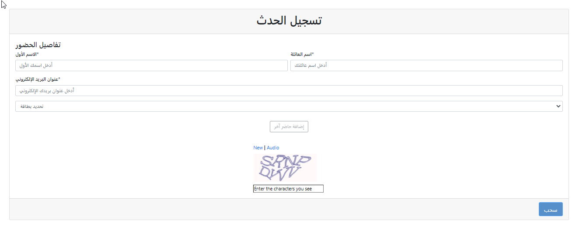
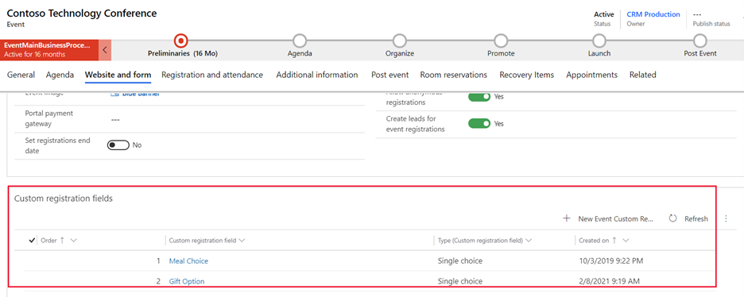
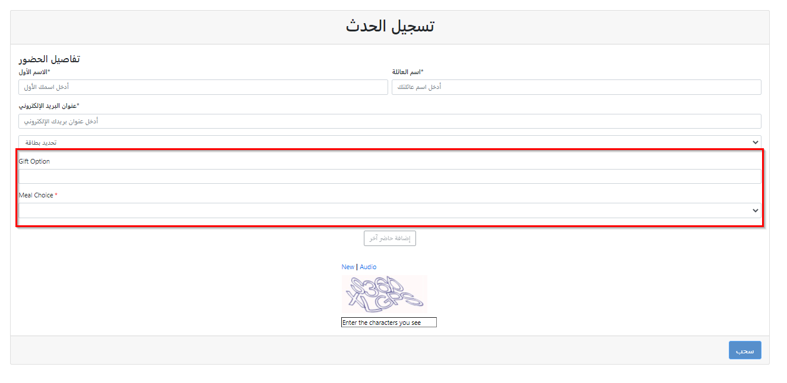
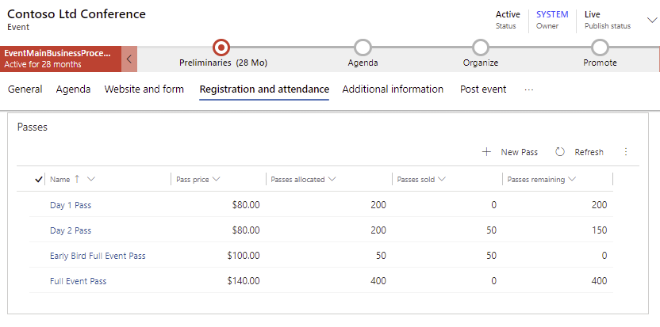
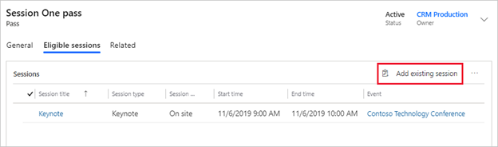

يوفر Dynamics 365 Marketing مجموعة متنوعة من خيارات التسجيل التي يمكنك تكوينها وتمكينها للحدث الخاص بك. يتيح التسجيل المتقدم للمسوق إمكانية إعداد القدرة الاستيعابية للجلسة والحدث مع التأكد من حجز موضع للحاضرين بالحدث أو الجلسة التي يرغبون في حضورها. 

تساعدك ميزات التسجيل المتقدمة على التخطيط لأحداثك وتنفيذها على أرض الواقع، وتتضمن تلك الميزات: حقول التسجيل المخصصة وتذاكر الحدث وعمليات الدفع عبر الإنترنت.

## تمكين خيارات التسجيل

يستخدم مديرو الحدث سجلات التسجيل لمعرفة عدد الموردين الذين يلزم توفرهم لعقد حدث محدد.
غالباً ما يحدد المديرون أيضاً الجلسات التي تتطلب غرفاً أكبر أو الجلسة التي ينبغي إلغاؤها. يسمح التسجيل أيضاً للحاضرين بالتيقن من حجز مكانٍ لهم في جميع الجلسات التي يرغبون في حضورها.

تتوفر إعدادات تسجيل متنوعة تتيح لك تمكين وتكوين أحداثك. يمكنك أيضاً إضافة حقول تسجيل مخصصة إلى نموذج التسجيل لالتقاط معلومات إضافية عن المسجلين الخاصين بك.

تظهر خيارات التسجيل في علامة التبويب **موقع الويب والنموذج** الخاصة بالحدث. تتضمن الإعداد الرئيسية خيارات التسجيل التالية التي يمكنك تكوينها:

- **تعيين تاريخ انتهاء التسجيل** - من المفيد تعيين تاريخ انتهاء للتسجيل إذا كنت ترغب في تعيين حد زمني يتيح لك إغلاق قائمة الحاضرين قبل بدء الحدث. في هذه الحالة، يجب عليك تعيين زر التبديل **تاريخ انتهاء التسجيل** على **نعم** لتعيين تاريخ ووقت لا يمكن لجهات الاتصال التسجيل في الحدث بعده.
يمكنك أيضاً تضمين رسالة على **موقع الويب** تتعلق بتاريخ إيقاف التسجيل بالحدث. يمكنك تعيين زر التبديل على **لا** لإتاحة التسجيل حتى بداية الحدث.

- **استخدام نموذج التسويق للتسجيل** - إذا كنت تريد استضافة نموذج تسجيل الحدث على موقع الويب الخاص بك أو ترغب في تضمينه على الصفحة المنتقل إليها، فقم بتعيين زر التبديل على **نعم** لاستخدام نموذج التسويق المعد مسبقاً للتسجيل بالحدث. عند تعيين زر التبديل على **نعم**، يظهر الخيار **نموذج التسويق**، مما يتيح لك البحث عن نموذج التسويق الذي تريد استخدامه. إذا حددت **لا**، فسيستخدم الحدث نموذج تسويق الحدث الافتراضي. إذا حددت استخدام نموذج التسويق للتسجيل، فبعد البدء الفوري للحدث، سيقوم النموذج بإنشاء نص يمكنك استخدامه لإضافة نموذج إلى الصفحة المقصودة أو صفحة الويب التي تختارها.

- **تمكين CAPTCHA** - يمكنك تعيين هذا الخيار إلى **نعم** لتضمين حقل CAPTCHA في صفحة التسجيل. عيّن هذا الخيار إلى **لا** لإخفائه. يناسب هذا الإعداد المدخل المستضاف ومواقع ويب الأحداث المستضافة خارجياً. إذا حددت تمكين حقل CAPTCHA، فيجب على الزائر ملء حقل CAPTCHA لمتابعة إدخال التفاصيل المتعلقة بكل مسجل.

- **التسجيل المتعدد للحضور** - يمكن أن يتيح التسجيل إمكانية تسجيل عدة أشخاص في آن واحد، أو يمكنك تعيينه على السماح بتسجيل حاضر واحد فقط في كل مرة. يمكنك تعيين هذا الخيار على **نعم** للسماح لمستخدمي موقع ويب الحدث بتسجيل عدة حاضرين في نفس الوقت.
يمكنك تعيين الخيار على **لا** للسماح بتسجيل مستخدم واحد فقط.  

- **السماح بعمليات التسجيل المجهولة** - إذا كنت تستضيف موقع ويب علي مداخل Dynamics 365، فيمكنك تعيين هذا الخيار على **لا** لمطالبة الزوار بإنشاء حساب بموقع ويب الحدث ليتمكنوا من تسجيل أنفسهم أو الآخرين في الحدث، ويمكنك تعيين هذا الحل على **نعم** للسماح للزوار بالتسجيل دون الحاجة لإنشاء حساب بموقع ويب الحدث. تتمثل إحدى مزايا إنشاء حساب تسجيل في قدرة جهات الاتصال تلك على تسجيل الدخول مجدداً لعرض جداول الأحداث الخاصة بهم وإلغاء عمليات تسجيل إذا لم الأمر. إذا كنت تستضيف موقع ويب الحدث في مداخل Dynamics 365، فيجب على الزوار الذين يستخدمون الموقع لإنشاء حساب تسجيل القيام بذلك باستخدام عنوان بريد إلكتروني لا يخص أي جهة اتصال موجودة في قاعدة بياناتك بالفعل. لن يؤثر عليك هذا الإعداد إذا كنت تستضيف موقع ويب الحدث الخاص بك بشكل خارجي. للمزيد من المعلومات، راجع [نظرة عامة على تطبيق ويب إدارة الحدث](/dynamics365/marketing/developer/event-management-web-application?azure-portal=true).

لمزيد من المعلومات، راجع [تعيين خيارات التسجيل](/dynamics365/marketing/set-up-event-portal?azure-portal=true#set-registration-options) و [علامة تبويب النموذج وموقع الويب](/dynamics365/marketing/set-up-event?azure-portal=true#the-website-and-form-tab).

## إنشاء حقول تسجيل مخصصة

نموذج التسجيل الافتراضي الموجود في موقع ويب الحدث يتضمن حقول للاسم الأول، والاسم الأخير، وعنوان البريد الإلكتروني، ونوع التذكرة (للأحداث المدفوعة التي تتضمن تذكرة واحدة على الأقل).

إذا حصلت على معلومات إضافية من الحضور، عن احتياجات خاصة مثلاً أو حساسيات الطعام أو تفضيلات الهدايا، فيمكنك إضافتها كحقول مخصصة لنموذج التسجيل. يمكنك اختيار الحقول المخصصة التي تريد إضافتها لكل حدث، وستشتمل سجلات التسجيل الخاصة بك على القيم التي يقدمها المسجلون.

لعرض حقول التسجيل المخصصة في نظامك، انتقل إلى منطقة العمل **الأحداث** ثم انتقل إلى **تخطيط الحدث> حقول التسجيل المخصصة**.
يعرض هذا القسم جميع الحقول المخصصة المتاحة للاستخدام مع الأحداث المختلفة الخاصة بك. يمكنك أيضاً إنشاء حقل مخصص جديد عن طريق تحديد **+ جديد** في شريط الأوامر.

لإضافة حقول تسجيل مخصصة إلى حدث، افتح الحدث الملائم ثم انتقل إلى علامة التبويب **موقع الويب والنموذج**. في قسم **حقول التسجيل المخصصة**، يمكنك إضافة حقول مخصصة تم إنشاؤها بالفعل أو إنشاء حقول جديدة مباشرة من هذا القسم عن طريق تحديد **+ حقل تسجيل جديد مخصص للحدث**.

بعد إضافة الحقول، يمكنك تحديد طريقة عرض نموذج التسجيل من خلال تحديث الحقل **أمر** في كل حقل من حقول التسجيل المخصصة وفقاً لرغبتك.

> [!div class="mx-imgBorder"]
> 

يمكنك أيضاً إنشاء حقول تسجيل مخصصة وإضافتها عند استخدام نموذج تسجيل حدث التسويق بدلاً من استخدام نموذج التسجيل الموجود في موقع ويب الحدث. لمزيد من المعلومات، راجع [استخدام نماذج التسويق لتسجيل الحدث](/dynamics365/marketing/event-forms?azure-portal=true).

لمزيد من المعلومات، راجع [إعداد حقل تسجيل مخصص](/dynamics365/marketing/custom-registration-fields?azure-portal=true#set-up-a-custom-registration-field)، و[إضافة حقل تسجيل مخصص لحدث](/dynamics365/marketing/custom-registration-fields?azure-portal=true#add-a-custom-registration-field-to-an-event)، و[قراءة جميع قيم الحقول المخصصة والمقدمة لحدث](/dynamics365/marketing/custom-registration-fields?azure-portal=true#read-all-custom-field-values-submitted-for-an-event).

## إعداد تذاكر الحدث

تذكرة الحدث هي تذكرة يمكنك شراؤها أو الحصول عليها لتمكينك من الوصول إلى الحدث أو جلسات مختلفة أو مسارات تعقب الجلسات، ومن الممكن عرضها في موقع ويب الحدث. بالنسبة للأحداث البسيطة، من الممكن إعداد نوع تذكرة مفرد يمنحك وصولاً إلى جميع الجلسات لكل أنواع الحاضرين.
بالنسبة للأحداث المعقدة، يمكنك إعداد تذاكر لكل مسار من مسارات التعقب المختلفة.
قد تشترط وجود أنوع تذاكر محددة حتى يمكن الوصول إلى أماكن محددة مثل تخصيص القاعة للصحفيين فقط. نظراً لأن التذكر لا تهم سوى الأشخاص الذين سيحضرون بشكل شخصي، فلن تحتاج لإعداد تذاكر لحاضري مؤتمرات الويب فقط أو الأحداث أو الجلسات.

لعرض التذاكر وإنشائها لحدث، قم بفتح سجل الحدث المناسب وانتقل إلى علامة التبويب **التسجيل والحضور**، حيث يمكنك عرض التذاكر وتحريرها وإنشاؤها من خلال العمل في قسم **التذاكر**.

بالنسبة لكل نوع تذكرة، يمكنك تعيين فئة وحاضر ومتحدث وراعي وصحفي أو شخص مماثل. يمكنك أيضاً تعيين سعر، وتحديد التخصيصات المتاحة، وإدخال تفاصيل أخرى.

بالإضافة إلى ما سبق، يمكنك تعيين جلسة أو جلسات متعددة للتذكرة، مما يعمل على منح الوصول لجميع الجلسات في مسار التعقب هذا، ولكن ليس بالضرورة لجميع جلسات الحدث.

> [!div class="mx-imgBorder"]
> 

يجب عليك إيلاء الاهتمام للحقل **التذاكر المخصصة**، والذي تقوم خلالها بتعيين عدد التذاكر المتاح. كما ينبغي عليك التأكد من متابعة حقليها المرتبطين بها: **التذاكر المباعة** و **التذاكر المتبقية**. في كل مرة تُمنح تذكرة لحاضر يزيد عدد **التذاكر المباعة** تلقائياً ويقل عدد **التذاكر المتبقية**. عند يصل عدد **التذاكر المتبقية** إلى الرقم صفر، ستظهر العبارة *مباعة بالكامل* على التذكرة في موقع ويب الحدث، ولن تتاح للشراء بواسطة الحضور المحتملين.

إذا قمت بتعيين **التذاكر المخصصة** على الصفر، فلن يتم عرض هذه التذكرة على موقع الويب على الإطلاق. قد تخصص هذا النهج للتذاكر المهمة أو لإبقاء التذكرة كمسودة لنشرها لاحقاً حالما تكون مستعداً عن طريق تعيين **التذاكر المخصصة** على قيمة موجبة.

بعد إعداد التذكرة، يمكنك الانتقال إلى السجل لتحديد تفاصيل التذكرة، مثل **الجلسات المؤهلة**. هذه المعلمة مهمة للأحداث المعقدة والتي قد تشتمل على تذاكر لمسارات تعقب جلسات مختلفة.

لإضافة جلسات إلى تذكرة، قم أولاً بإنشاء تذكرة وحفظها في قسم **التذاكر**، ثم افتحها للتحرير، واستخدم علامة التبويب **الجلسات المؤهلة** لإضافة جلسات إليها.

> [!div class="mx-imgBorder"]
> 

لمزيد من المعلومات، راجع [إعداد تذاكر حدث](/dynamics365/marketing/set-up-event?azure-portal=true#set-up-event-passes).

## إعداد الدفع عبر الإنترنت للأحداث

إذا كان لديك حدث واحد أو أكثر ينبغي على جهات الاتصال خلاله شراء تذكرة، فستدين جهات الاتصال بالشكر لك إذا تمكنوا من شراء التذاكر عبر الإنترنت خلال تسجيلهم في حدثك على موقع ويب الحدث.

> [!NOTE]
> لا يشتمل مدخل الحدث على موفر دفع خارجي.
لتمكين الدفع عبر الإنترنت لأحداثك، يجب عليك عقد اتفاقية مع موفر دفع خارجي يمكنه مصادقة تفاصيل الدفع وتسجيلها.

بعد تمكين الدفع عبر الإنترنت لموفر الدفع الخاص بك، سيمدك بتفاصيل حول كيفية تطبيق نظامه. وستقوم عادةً بتضمين الرمز الإضافي الذي يدخله موفر الدفع إلى صفحة ويب قيد التشغيل في موقع ويب الحدث الخاص بك. وسيتعين عليك أيضاً إخبار موفرك بعنوان URL لطلب إرسال توضيح من خلاله عند إجراء عملية دفع ناجحة من Dynamics 365 Marketing.

عندما تتوفر بوابة دفع جديدة لموقع ويب الحدث الخاص بك، يمكنك تكوين أحداث مختلفة لاستخدامها بها، أو تعيينها افتراضياً لجميع الأحداث.

تعتمد إجراءات إنشاء وتمكين بوابة الدفع على كيفية استضافتك لموقع ويب الحدث.

-   إذا كنت تستضيف الحدث في مدخل Dynamics 365، فراجع [إنشاء بوابة دفع عند استضافة مدخل Power Apps](/dynamics365/marketing/event-payment-gateway?azure-portal=true#portal) للحصول على تعليمات. ستشرح هذا المقالة خطوات إضافة صفحة الدفع وكيفية إرسال تأكيد عند شراء حاضر لتذكرة حضور. 

-   إذا كنت تستضيف موقع ويب الحدث في خادم خارجي، فراجع [إنشاء بوابة دفع عندما تتم الاستضافة على موقع خارجي](/dynamics365/marketing/event-payment-gateway?azure-portal=true#external) للحصول على تعليمات.

> [!NOTE]
> ونحن ننصحك بالاستعانة بمورد تطوير لمساعدتك عند تكوين موفر دفع خارجي في بوابة الأحداث الخاصة بك. 

لمزيد من المعلومات، راجع [إعداد عمليات الدفع عبر الإنترنت للأحداث](/dynamics365/marketing/event-payment-gateway?azure-portal=true).

## التشغيل التلقائي لعملية تسجيل الوصول 

يستطيع طاقم عمل الحدث تسجيل وصول المسجلين يدوياً في Dynamics 365 Marketing أو مسح رمز استجابة سريع من المسجل في يوم الحدث.

عند تسجيل الأشخاص في بوابة الحدث، يتم إنشاء سجل تسجيل حدث. يتضمن هذا السجل معرف تسجيل يتم حفظه كرمز أبجدي رقمي وكرمز استجابة سريع يمكن قراءته بواسطة جهاز. يمثل رمز الاستجابة السريع ترميزاً مباشراً لمعرف التسجيل، حتى يتمكن عاملو الحدث في يوم الحدث من مسح الرمز سريعاً باستخدام ماسح ضوئي لرمز الاستجابة السريع أو بواسطة تطبيق هاتف ذكي. لاستخدام هذه الوظيفة سيتعين عليك إنشاء تطبيق ماسح للرموز لاستخدامه في يوم الحدث. قد يستعلم تطبيق ماسح الرموز عن قاعدة بيانات التسجيل في Dynamics 365 Marketing للتأكد من الصلاحية أو لتسجيل الحاضر,

> [!NOTE]
> يلزم التطوير المخصص لإنشاء تطبيق المسح الضوئي وتنفيذ التكامل مع نظام Dynamics 365 Marketing لديك.

لتسجيل وصول الشخص الحاضر للحدث باستخدام رمز الاستجابة السريعة في سجل التسجيل الخاص به، ينبغي عليك اتباع الخطوات التالية:

1.  باستخدام تطبيق ذكي، قم بمسح رمز الاستجابة السريعة من رسالة بريد إلكتروني أو شارة مطبوعة.

1.  بعد مسح رمز الاستجابة السريعة المحدد، سيتم تسجيل وصول الحاضر إلى الحدث.

1.  يمكنك عرض عملية تسجيل الوصول عن طريق فتح الحدث، والانتقال إلى علامة التبويب **التسجيل والحضور**، ثم التمرير حتى الوصول إلى القسم **تسجيلات الوصول للحدث**.

لمزيد من المعلومات، راجع [عناصر رمز الاستجابة السريعة لتسجيل الحدث](/dynamics365/marketing/content-blocks-reference?azure-portal=true#event-registration-qr-code-elements). 
