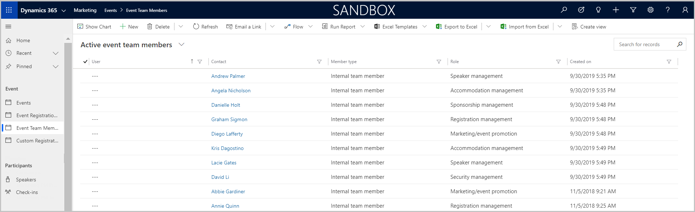
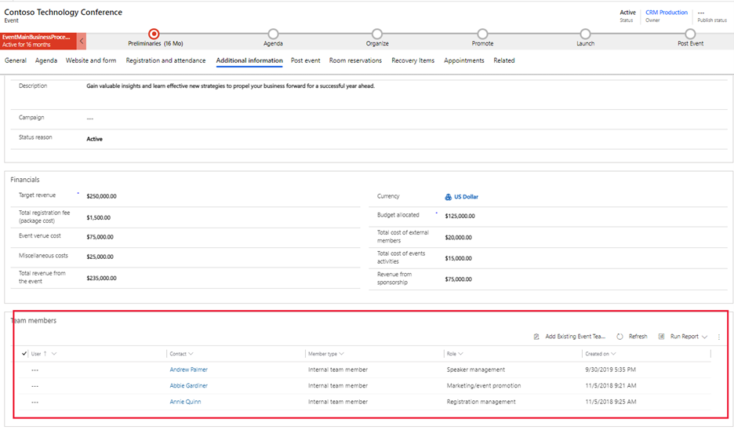

في علامة تبويب **المعلومات الإضافية**، يُمكنك الحصول على معلومات إضافية عن الحدث مثل الأهداف والتفاصيل المالية المتعلقة بالحدث. كما أنه المكان الذي ستؤسس فيه فريق الحدث. لعرض هذه السمات وتحريرها، افتح الحدث المناسب وانتقل إلى علامة تبويب **المعلومات الإضافية**.

## المعلومات الإضافية

يسمح لك قسم **المعلومات الإضافية** بإدخال الناتج المتوقع والأهداف الاساسية والوصف العام للحدث. يجب تعبئة هذه التفاصيل حسب الحاجة لتلبية احتياجات عملك.

## الماليات

قسم **الماليات** هو المكان الذي يمكنك فيه عرض التفاصيل المالية للحدث وتسجيلها مثل الإيرادات المستهدفة وتكاليف المكان والميزانية وغيره.
تظهر هذه القيم في مخططات وتحليلات لوحة المعلومات، ولكنها لغرض الاطلاع فقط، وليست للمحاسبة ومسك الدفاتر الرسمية.

لمزيد من المعلومات، راجع [‏‫تسجيل البيانات المالية العامة للأحداث ومراجعتها‬](/dynamics365/marketing/event-financials?azure-portal=true#record-and-review-overall-event-financial-data).

> [!TIP]
> يُمكنك تتبع معلومات مالية إضافية عن الأحداث، ومنها تكاليف المتحدثين وتكاليف المكان وغيره. لمزيد من المعلومات، راجع [‏‫تسجيل المعلومات المالية للأحداث ومراجعتها‬](/dynamics365/marketing/event-financials?azure-portal=true). 

## أعضاء فريق الحدث

يضم فريق الحدث زملاء العمل وجهات الاتصال الخارجية الذين يساعدونك في تنظيم الحدث. يحتوي سجل الحدث على اسم كل عضو في الفريق والدور الذي يؤديه، بالإضافة إلى ارتباطات لمزيد من المعلومات، بحيث تستطيع رؤية العضو الذي ستتصل به وتعثر على معلومات الاتصال الخاصة به عند الحاجة.

يمكنك عرض وتحرير قائمة بكافة أعضاء الفريق الذين عملوا أو يعملون أو سيعملون على الأحداث الخاصة بك عن طريق الانتقال إلى **الأحداث > الحدث > أعضاء فريق الحدث**. تسمح لك منطقة الأحداث بإعداد قاعدة بيانات بالأشخاص الذين يمكنهم مساعدتك في أحداثك المتنوعة.

> [!TIP]
> لربط أحد أعضاء الفريق بحدث فردي، عليك أولًا إعداد الشخص بصفته عضو في فريق الحدث. يُمكنك إنشاء أعضاء الفريق من عرض قائمة **أعضاء فريق الحدث** أو من داخل حدث.

إذا كنت تعرف أشخاصًا معينين سيعملون على الأحداث، فيُمكنك إعداد أعضاء فريق الحدث مسبقًا للأحداث التي يتم إنشاؤها.
يوفر هذا النهج وقت منشئي الأحداث عن طريق ربط أعضاء الفريق بأحداثهم (بدلًا من الاضطرار إلى إنشاء أعضاء الفريق ثم ربطهم بالحدث).

لعرض قائمة أعضاء الفريق المرتبطين بحدث معين وتحريرها، افتح الحدث المناسب ثم انتقل إلى علامة تبويب **المعلومات الإضافية**. يعرض قسم **أعضاء فريق الحدث** أعضاء الفريق الذين تم تعيينهم لهذا الحدث.

لإضافة أعضاء فريق، حدد **إضافة عضو فريق حدث موجود**. إذا كان الشخص موجودًا بالفعل كعضو في فريق الحدث، فيمكنك البحث عنه وتحديده. وإذا لم يكن عضوًا، فلديك خيار إنشاء عضو فريق حدث جديد من هذا القسم.

> [!div class="mx-imgBorder"]
> 

لمزيد من المعلومات، راجع [علامة تبويب المعلومات الإضافية](/dynamics365/marketing/set-up-event?azure-portal=true#the-additional-information-tab) و [إعداد فريق حدث](/dynamics365/marketing/set-up-event?azure-portal=true#set-up-your-event-team).
