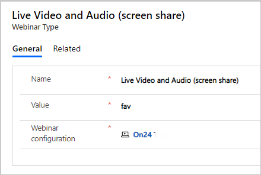

قبل أن تتمكن من إعداد ندوة الإنترنت باستخدام ON24 أو موفر خارجي آخر، توجد خطوات يجب اتخاذها.

1.  يجب أن تمتلك مؤسستك حسابًا لدى موفر ندوة، وبيانات اعتماد تسجيل الدخول للوصول إلى حساب مؤسستك باستخدامهم. موفر ندوة الإنترنت عبارة عن شركة خارجية تستضيف الندوات. يقبل الموفر التسجيلات، ويوفر عناوين URL حيث يستطيع المقدم والمشاركون الانضمام إلى كل ندوة إنترنت.

1.  يجب تكوين Dynamics 365 لاستخدام حساب ندوة الإنترنت الخاص بمؤسستك. قد يكون مسؤول Dynamics 365 قد أجرى ذلك التكوين نيابة عنك. إذا كنت أنت المسؤول، راجع المزيد من المعلومات عن كيفيه تكوين إعدادات ندوة الإنترنت.

[ON24](https://www.on24.com/?azure-portal=true) موفر ندوة الإنترنت الوحيد الجاهز والمدعوم حاليًا لاستخدامه مع Dynamics 365 Marketing للتخطيط للأحداث وإدارتها إذا كان لديك ترخيص ON24. 

بإمكان الموفرين الآخرين لندوة الإنترنت تنفيذ واجهة برمجة تطبيقات (API) الجديدة لملحق ندوة الإنترنت كي يصبحوا موفري ندوة الإنترنت المدعومين لاستخدامهم مع تطبيق Dynamics 365 Marketing، تمامًا مثل On24. بعد تنفيذ موفر API الجديدة في خدمة ندوة الإنترنت، يمكنه تكوين Dynamics 365 Marketing لاستخدام خدمة ندوة الإنترنت لإدارة الأحداث. لقد ناقشنا هذا الإجراء بمزيد من التفصيل في الوحدة اللاحقة.

تُدار إعدادات ندوة الإنترنت في منطقة عمل **الإعدادات**. الإعدادات الأساسية: **موفرو ندوات الإنترنت** و **تكوينات الندوات**.
عليك تكوين إعدادات ندوة الإنترنت قبل إنشاء حدث ندوة. وخطوات الإعداد مذكورة في الموضوعات اللاحقة.

## موفرو ندوات الإنترنت

يجب أن يكون لدى كل موفر ندوة إنترنت سجل مدرج في صفحة **موفرو ندوات الإنترنت**. وبالنسبة إلى كل حساب تمتلكه لدى موفر ندوة الإنترنت، يجب عليك أيضًا إعداد سجل **تكوين ندوة الإنترنت** كما هو موضح في القسم التالي.

> [!IMPORTANT]
> في معظم الحالات، ينبغي عدم تعديل أو إضافة أي سجلات في صفحة **موفرو ندوات الإنترنت**. لقد تشاركت Microsoft مع **ON24**، موفر الندوات الوحيد الجاهز والمدعوم حاليًا لاستخدامه مع Dynamics 365 Marketing. عند فتح صفحة قائمة **‏‫موفرو ندوات الإنترنت‬**، سوف ترى سجل **ON24** المكوّن سابقًا موجود هنا بالفعل. تقريبًا في جميع الحالات، ينبغي عدم تحرير هذا السجل أو حذفه إلا إذا كنت تريد تحديد شروط خدمة بديلة أو عنوان URL لسياسة الخصوصية. وبالمثل، عادةً لا يوجد سبب لإضافة سجل موفر آخر هنا ما لم تكن قد اشتركت مع مطور قد أضاف حلًا مخصصًا للغاية لمؤسستك. كما أن إدارة بيانات اعتماد التفويض لحساب ON24 لا تتم بواسطة سجل موفر ندوة الإنترنت، ولكن من خلال سجل تكوين ندوة الإنترنت. راجع موضوع **إعدادات تكوين ندوة الإنترنت** في هذه الوحدة، لمزيد من التفاصيل عن كيفيه الاتصال بحساب ON24.

يُمكنك عرض موفري الندوات عن طريق الانتقال إلى منطقه عمل **الإعدادات**، ثم تحديد **إدارة الاحداث > ‏‫موفرو ندوات الإنترنت‬**. وكما ذكرنا سابقًا، عادة ينبغي عدم فعل أي شيء هنا. 

لمزيد من المعلومات، راجع [‏‫موفرو ندوات الإنترنت‬](/dynamics365/marketing/events-settings?azure-portal=true#webinar-providers).

## تطبيقات الويب

عند تطوير ميزات مخصصة تستخدم API الأحداث للتفاعل برمجيًا مع ميزات الحدث، فستحتاج إلى تسجيل تطبيق الويب في Dynamics. يُمكنك العمل مع أحد المطورين لتحديد ما إذا كان لدى موفر الندوة API يحتاج إلى الاتصال بـ Dynamics.

تُدار تطبيقات الويب داخل منطقة عمل الإعدادات. حدد **إدارة الأحداث** > **تطبيقات الويب**. 

لمزيد من المعلومات عن كيفية استخدام API الأحداث، مثل كيفيه استخدام إعدادات **تطبيقات الويب**، راجع [استخدام API الأحداث](/dynamics365/marketing/developer/using-events-api?azure-portal=true) و [تسجيل تطبيق الويب لاستخدام API الأحداث](/dynamics365/marketing/developer/register-web-application-events-api?azure-portal=true).

كما تحتاج إلى تسجيل تطبيق ويب إذا قررت استضافة موقع ويب الحدث في Azure. لمزيد من المعلومات، راجع [استضافه موقع الحدث المخصص في Azure](/dynamics365/marketing/developer/host-custom-event-website-on-azure?azure-portal=true).

## إعدادات تكوين ندوة الإنترنت

بعد إعداد حساب مع موفر ندوة الإنترنت (مثل ON24)، عليك إدخال تفاصيل الحساب لتمكين Dynamics 365 Marketing للمصادقة والتفاعل معه. حتى إذا كنت تستخدم موفر ندوة إنترنت واحدًا فقط، يجوز لك امتلاك العديد من الحسابات لدى هذا الموفر، ويمكنك تكوين كل منها حسب الحاجة.

للاتصال بحساب الندوة أو تحديث بيانات اعتماد الحساب، راجع [تكوينات الندوة](/dynamics365/marketing/events-settings?azure-portal=true#webinar-configurations) 

بعد إعداد الحساب والتحقق من صحته، أضف **أنواع ندوات الإنترنت** إلى سجل تكوين ندوة الإنترنت. هذا الحقل مطلوب وعلى صاحب الحدث إنشاؤه عند إعداد حدث ندوة إنترنت جديد.  

لإنشاء نوع ندوة إنترنت:

1.  افتح منطقة عمل **الإعدادات** وانتقل إلى **إدارة الأحداث** > 
    **تكوينات ندوات الإنترنت**.

1.  افتح سجل تكوين ندوة الإنترنت المناسب.

1.  انقر فوق **ذات الصلة**، ثم حدد **أنواع ندوات الإنترنت**.

1.  انقر فوق **+ نوع ندوة جديد**.

1.  لقد أسس موفر ندوة الإنترنت الخيارات المتوفرة. 
    اتصل بالموفر للحصول على هذه المعلومات، ثم أدخل **الاسم** و **القيمة**.

1.  انقر فوق **حفظ**.

1.  كرر العملية مع جميع أنواع ندوات الإنترنت.

     

> [!IMPORTANT]
> تُعد إعدادات تكوين الندوة جزءًا واحدًا من إعداد ندوة الإنترنت. كما ستحتاج إلى العمل مع أحد المطورين لإنشاء حل مخصص لمزامنة البيانات من موفر ندوة الإنترنت إلى Dynamics. وهذا يتضمن معلومات مثل التسجيل أو الحضور وتفاصيل ندوة الإنترنت الأخرى التي يمكن استخدامها داخل رسائل البريد الكتروني التسويقية.
