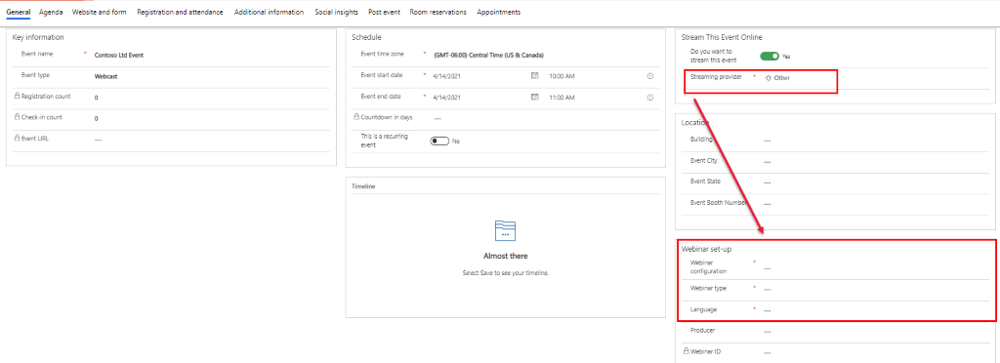
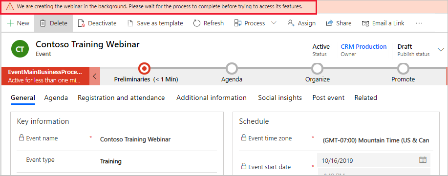
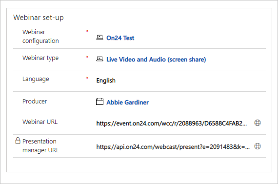

لإنشاء حدث ندوة باستخدام ON24 أو موفر ندوة خارجي آخر، اتبع الخطوات التالية.

1.  افتح منطقة عمل الأحداث وانتقل إلى **تخطيط الأحداث** > **الأحداث**. 

1.  لإنشاء حدث جديد، حدد **+ جديد** في شريط الأوامر. 

1.  املأ التفاصيل الموجودة في قسم **المعلومات الأساسية**.

    -   **اسم الحدث**: هذا الحقل مطلوب.

    -   **نوع الحدث**: حدد نوعاً مثل العرض التوضيحي أو التدريب أو النشرة الاخبارية وغير ذلك. يوجد في النظام العديد من الخيارات الجاهزة التي يُمكنك تعديلها لتتوافق مع احتياجات أعمالك. لا يؤثر هذا الحقل، الخاص بأغراض التعقب/إعداد التقارير الداخلية، في أي من ميزات الأحداث الأخرى.

1.  املأ التفاصيل الموجودة في قسم **الجدولة**.

    -   **المنطقة الزمنية للحدث**: هذا الحقل مطلوب. يتم تعيين المنطقة الزمنية إلى المنطقة الزمنية المقترنة بالمستخدم الذي يُنشئ الحدث. يُمكنك تغيير هذا الإعداد حسب الحاجة في كل حدث.

    -   **تاريخ بدء الحدث**: هذا الحقل مطلوب. حدد تاريخ بدء الحدث. سيظهر التاريخ في موقع ويب الحدث.

    -   **تاريخ انتهاء الحدث**: هذا الحقل مطلوب. حدد تاريخ انتهاء الحدث. سيظهر التاريخ في موقع ويب الحدث. بمجرد حفظ سجل الحدث، ستشاهد العد التنازلي للحدث في شكل أيام وهو حقل للقراءة فقط.

1.  املأ التفاصيل في قسم **‏‫بث هذا الحدث عبر الإنترنت‬**.

    -   **هل تريد بث هذا الحدث**: التبديل إلى **نعم**.

    -   سيظهر حقل **موفر البث**. سيكون لديك ثلاثة خيارات لتختار منهما. لعرض موفر الندوة الخارجي والتكوين، سوف تحتاج إلى تحديد خيار **آخر**. 
        بمجرد التحديد، سوف تظهر الحقول الإضافية لتكوين الندوة. 

        > [!div class="mx-imgBorder"]
        > 

1.  املأ التفاصيل الموجودة في قسم **إعداد ندوة**.

    -   **تكوين الندوة**: هذا الحقل مطلوب. حدد سجل تكوين الندوة الذي ستستخدمه لهذا الحدث أو جلسة العمل. على المسؤول إنشاء إدخال تكوين لكل موفر ندوة تستخدمه مؤسستك؛ عادةً، سوف يكون لديك إدخال واحد فقط هو موفر الندوة الذي تستخدمه.

    -   **نوع الندوة**: هذا الحقل مطلوب. سيأتي هذا مع قائمة مكونة سابقاً لموفر الندوة. قد يؤثر هذا الإعداد في مجموعه الميزات المتوفرة لمقدمي الندوة والحضور، لذا يُرجى الاتصال بالمسؤول إذا كنت بحاجة إلى مساعدة في تحديد الخيار الذي سيُستخدم.

    -   **اللغة:** هذا حقل مطلوب. حدد لغة الندوة.

    -   **المنتج**: حدد عضو فريق الحدث المسؤول عن إدارة الندوة في أثناء الحدث. لاحظ أنه يجب إعداد هذا الشخص على أنه عضو فريق حدث قبل تحديدهم. لمزيد من المعلومات، راجع [إعداد فريق الحدث](/dynamics365/marketing/set-up-event?azure-portal=true#set-up-your-event-team).

1.  احفظ الحدث. سوف تتلقى رسالة لإعلامك بتكوين موقع التسجيل على الويب. يُمكن تخصيص تسجيل موقع الويب بالانتقال إلى حساب موفر الندوة وتكوين الحدث هناك.

    

1.  بمجرد حفظ الحدث، مع تكوين ندوة صالحة، سينشئ Dynamics 365 الندوة في نظام موفر الندوة. سيتم إرجاع القيم التالية:

    -   **عنوان URL لندوة الإنترنت**: ارتباط إلى ندوة الإنترنت في موفر ندوة الإنترنت.
        يستخدم Dynamics 365 هذا الرابط لمزامنة التسجيلات والمقاييس بين النظامين.

    -   **‏‫عنوان URL لمدير العرض التقديمي‬**: ارتباط يُمكن للمُقدم استخدامه للتحكم في عرضه التقديمي.

    

1.  الخطوة التالية في تخطيط الندوة هي إعداد نموذج تسجيل الحدث. راجع وحدة **بناء نموذج تسجيل الحدث** لمعرفه المزيد عن خيارات التسجيل المتنوعة داخل Dynamics 365 Marketing. 

لمزيد من المعلومات، راجع [تكوين حدث أو جلسة عمل للبث على أنها ندوة](/dynamics365/marketing/set-up-webinar?azure-portal=true#configure-an-event-or-session-for-broadcast-as-a-webinar).
