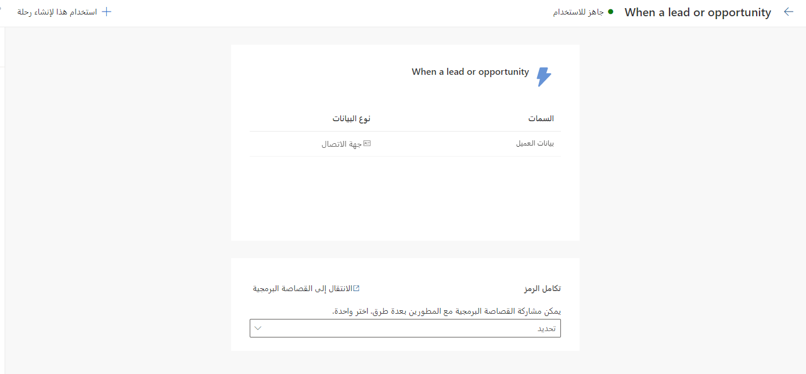

المشغل المخصص عبارة عن إشارة يحددها المستخدم يمكنها أن تحتوي على وتنقل أي نوع من المعلومات التي يمكن أن تعمل رحلة العميل عليها. يتحكم مستخدمو التسويق في الوقت الحقيقي بشكل كامل في ما تمثله المشغلات المخصصة ونوع المعلومات التي تنقلها.

يعد إنشاء مشغل مخصص في التسويق في الوقت الحقيقي أمراً سهلاً.
ومع ذلك، تتطلب المشغلات المخصصة التعاون بين مستخدمي التسويق وفريق المطور الذي سيكون مسؤولاً عن تكامل مقتطفات صغيرة من التعليمات البرمجية في الأنظمة التي ستسمح في النهاية بتشغيل المشغل.

يمكنك استخدام المشغلات المخصصة لبدء رحلة، كهدف لرحلة، أو كظروف ضمن رحلة، أو كمعايير خروج لرحلة. بالإضافة إلى ذلك، يمكنك دمج المشغلات المخصصة مع التطبيقات أو مواقع الويب الخارجية. يمكنك أيضا دمجها مع تدفقات Microsoft Power Automate.

علاوة على ذلك، يمكنك استخدام المشغلات لتنشيط العمليات المخصصة أو تدفقات Power Automate في نقاط معينة في رحلة العميل. تتم مناقشة هذا المفهوم بشكل أكبر في الوحدة التالية.

لإنشاء مشغل مخصص، ستحتاج أولاً إلى تحديد المكان الذي سيتم فيه دمج المشغل، سواء كان مصدراً خارجياً أو Power Automate، وبعد ذلك يمكنك اتباع الخطوات المبينة في الأقسام اللاحقة.

## دمج مشغل في تطبيق خارجي أو موقع ويب

فيما يلي خطوات دمج مشغل في تطبيق خارجي أو موقع ويب.

### الخطوة 1: إنشاء المشغل في Dynamics 365 Marketing

لإنشاء مشغل مخصص، انتقل إلى **التسويق في الوقت الحقيقي > المشاركة > المشغلات**.

1.  حدد **+ مشغل جديد** من الشريط العلوي، ثم اتبع التعليمات التي تظهر على الشاشة.

1.  أدخل **العنوان** و **الوصف**. أعط المشغل عنواناً وصفياً قصيراً. قم بتضمين وصف لمساعدة المستخدمين الآخرين في العثور على المشغل الصحيح في الكتالوج.

1.  أضف **السمات** للمشغل. تعمل سمات المشغل على إثراء المشغل وتوفر المزيد من السياق للرحلة لإنشاء فروع أو إضافة محتوى مخصص داخل رسائل البريد الإلكتروني والرسائل النصية والإعلامات المنبثقة.

    1.  السمة الأولى التي يجب إضافتها هي **بيانات العميل**. هذه السمة موجودة بشكل افتراضي في كل مشغل مخصص. تحتوي هذه السمة على معلومات حول العميل الذي يقوم بتنفيذ إجراء المشغل. يمكن أن يكون نوع البيانات جهة اتصال أو عميلاً متوقعاً في Microsoft Dynamics 365 أو يمكن أن يكون ملف تعريف Microsoft Dynamics ‏365 Customer Insights. في التعليمات البرمجية، يُشار إلى هذه السمة باسم *authID*.

        -  **contactpoint_email** هي سمة خاصة موجودة في مشغل مخصص مرتبط بملف تعريف Customer Insights. سيتم استخدام هذه السمة كإجراء احتياطي في حالة عدم توفر ملف تعريف Customer Insights الكامل. يجب على المطورين تضمين البريد الإلكتروني للعميل في هذه السمة لضمان إمكانية الوصول إلى العميل عبر البريد الإلكتروني حتى إذا كانت معلومات ملف التعريف الكامل الخاصة بهم غير متوفرة.

        - **contactpoint_phone** هي سمة خاصة موجودة في مشغل مخصص مرتبط بملف تعريف Customer Insights. سيتم استخدام هذه السمة كإجراء احتياطي في حالة عدم توفر ملف تعريف Customer Insights الكامل. يجب على المطورين تضمين رقم هاتف العميل في هذه السمة لضمان إمكانية الوصول إلى العميل عن طريق الرسائل النصية، حتى إذا كانت معلومات ملف التعريف الكامل الخاصة بهم غير متوفرة.

    1.  أضف سمات أخرى إلى المشغل عن طريق تحديد **+ إضافة سمة** وإدخال **الاسم**  **ونوع البيانات**. من المهم أن تختار نوع البيانات الصحيح (النص، أو الرقم، أو صواب أو خطأ، أو تاريخ/وقت) للتأكد من أن رحلات العميل يمكن أن توفر مقارنات مناسبة في الظروف.
        على سبيل المثال، إذا كانت السمة من نوع البيانات **رقم**، فستوفر الرحلة مقارناً، مثل *أقل من* أو *يساوي*. إذا كانت السمة من نوع  **التاريخ/الوقت**، ستوفر الرحلة المقارنات، مثل *قبل*،  *وفي*،  *وبعد*.

لمزيد من المعلومات، راجع [إنشاء المشغل الأولي](/dynamics365/marketing/real-time-marketing-custom-triggers?azure-portal=true#1-initial-trigger-creation).

### الخطوة 2: دمج المشغل في تطبيق خارجي أو موقع ويب

بعد إنشاء المشغل، سيتم إنشاء قصاصة برمجية بواسطة النظام. يمكنك تنزيل القصاصة البرمجية ومشاركتها مع المطورين. بدلاً من ذلك، يمكن للمطورين الوصول إلى القصاصة البرمجية مباشرةً من خلال الرابط الذي يوفره التطبيق.

تتيح القصاصة البرمجية إجراء العميل على تطبيق خارجي أو موقع ويب لبدء رحلة العميل في التسويق في الوقت الحقيقي. على سبيل المثال، عندما يحدد العميل زر الخروج على موقع التجارة الإلكترونية، يبدأ الرمز رحلة عميل تأكيد الطلب باستخدام مشغل **تأكيد الأمر** الذي يتم استدعاؤه عند تحديد الزر. من خلال إضافة القصاصة البرمجية، يمكن للمطور ربط تحديد الزر بمشغل **تأكيد الأمر**.

تحتوي القصاصة البرمجية على إرشادات تفصيلية حول كيفية دمج رمز المشغل في الأنظمة الخارجية. يمكنك دمج المشغل باستخدام JavaScript (لصفحات الويب) أو C# أو Python (للأنظمة المستقلة) أو من خلال iOS وحزم Android ‏SDK.

> [!TIP]
> يمكن أن يترك بعض تكامل المشغلات المخصصة آثاراً أمنية. تحتوي القصاصة البرمجية التي يتم توفيره مع المشغل على *مفتاح العرض* الذي يحدد مثيل التسويق في الوقت الحقيقي بشكل فريد. قد يرسل المهاجم الذي لديه حق الوصول إلى مفتاح العرض مشغلات زائفة يمكن أن تؤدي إلى رحلات العميل غير المقصودة. إنها ممارسة جيدة أن:
> 
> -   تحمي مفتاح العرض كلما أمكن ذلك.
> 
> -   تحد من استخدام السمات في المشغلات المخصصة، خاصةً عندما يمكن استخدام هذه السمات لتخصيص المحتوى والعمل كموجهات هجوم محتملة، مثل البرمجة النصية عبر المواقع.

لمزيد من المعلومات، راجع [تكامل المشغلات](/dynamics365/marketing/real-time-marketing-custom-triggers?azure-portal=true#2-trigger-integration).

### الخطوة 3: إنهاء المشغل في Dynamics 365 Marketing

بعد الانتهاء من التكامل، ستعرض صفحة **المشغلات** معلومات لتأكيد عمل المشغل المخصص على النحو المتوقع. مع اكتمال التكامل والتحقق منه، سيتم وضع علامة على المشغل على أنه **جاهز للاستخدام**، مما سيجعل المشغل مرئياً ومتوفراً في الرحلات.

لمزيد من المعلومات، راجع [إنهاء المشغل](/dynamics365/marketing/real-time-marketing-custom-triggers?azure-portal=true#3-finalize-the-trigger).

## دمج المشغل مع تدفق Power Automate

توضح الأقسام التالية خطوات دمج المشغل مع تدفق Power Automate.

### الخطوة 1: إنشاء المشغل في Dynamics 365 Marketing

لإنشاء مشغل مخصص، انتقل إلى **التسويق في الوقت الحقيقي > المشاركة > المشغلات**.

1.  حدد **+ مشغل جديد** من الشريط العلوي، واتبع التعليمات التي تظهر على الشاشة.

1.  أدخل **العنوان** و **الوصف**. أعط المشغل عنواناً وصفياً قصيراً. قم بتضمين وصف لمساعدة المستخدمين الآخرين في العثور على المشغل الصحيح في الكتالوج.

1.  أضف **السمات** للمشغل. تعمل سمات المشغل على إثراء المشغل وتوفر المزيد من السياق للرحلة لإنشاء فروع أو إضافة محتوى مخصص داخل رسائل البريد الإلكتروني والرسائل النصية والإعلامات المنبثقة.

    1.  السمة الأولى التي يجب إضافتها هي **بيانات العميل**. هذه السمة موجودة بشكل افتراضي في كل مشغل مخصص. تحتوي هذه السمة على معلومات حول العميل الذي ينفذ إجراء المشغل. يمكن أن يكون نوع البيانات جهة اتصال أو عميلاً متوقعاً في Dynamics 365 أو يمكن أن يكون ملف تعريف Customer Insights.
        في التعليمات البرمجية، يُشار إلى هذه السمة باسم *authID*.

    1.  أضف سمات أخرى إلى المشغل عن طريق تحديد **+ إضافة سمة** وإدخال **الاسم**  **ونوع البيانات**. من المهم أن تختار نوع البيانات الصحيح (النص، أو الرقم، أو صواب أو خطأ، أو تاريخ/وقت) للتأكد من أن رحلات العميل يمكن أن توفر مقارنات مناسبة في الظروف.
        على سبيل المثال، إذا كانت السمة من نوع البيانات **رقم**، فستوفر الرحلة مقارناً، مثل *أقل من* أو *يساوي*. إذا كانت السمة من نوع  **التاريخ/الوقت**، ستوفر الرحلة المقارنات، مثل *قبل*،  *وفي*،  *وبعد*.

1.  في شريط الأوامر، حدد **جاهز للاستخدام** لجعل المشغل متاحاً للتحديد داخل تدفق Power Automate.

> [!div class="mx-imgBorder"]
> 

### الخطوة 2: دمج المشغل مع تدفق Power Automate

اتبع الخطوات التالية لدمج المشغل مع تدفق Power Automate:

1.  أنشئ تدفق سحابة يبدأ بتغيير في جدول Microsoft Dataverse، مثل **عند إضافة صف أو تعديله أو حذفه**. قم بتعبئة معلومات **نوع التغيير**،  **واسم الجدول**،  **والنطاق** ذات الصلة.

1.  يعتبر المشغل المخصص في Dynamics 365 Marketing إجراءً غير مرتبط، لذا سترغب في إضافة إجراء إلى التدفق الخاص بك إلى **تنفيذ إجراء غير مرتبط**.

1.  في حقل **اسم الإجراء** ، اختر المشغل المخصص الخاص بك. سيكون تنسيق اسم المشغل الخاص بك *mdynmky_yourtriggersnamewithoutspaces*.

1.  بعد تحميل المشغل المخصص، ستظهر السمات التي حددتها في تطبيق Marketing.

> [!NOTE]
> بالإضافة إلى السمات التي حددتها، سيتم عرض المعلومات التالية:
> 
> -   **msdynmkt_signaltimestamp** - الوقت الذي تم فيه إرسال المشغل إلى العميل.
> 
> -   **msdynmkt_signalingestiontimestamp** - الوقت الذي تم فيه عرض بيانات المشغل.
> 
>     قم بتعيين هذه السمات إلى **utcNow()** أو أي تاريخ/وقت من اختيارك.
> 
> -   **msdynmkt_signaluserauthid** - قم بتعيين إلى **معرف جهة الاتصال**.
> 
> -   **msdynmkt_profileid** - قم بالتعيين إلى **معرف جهة الاتصال**.

> [!IMPORTANT]
> لتنفيذ المشغل بنجاح، ستحتاج إلى تحديد كل السمات.

> [!TIP]
> إذا لم تتمكن من العثور على اسم مشغلك المخصص في قائمة **اسم الإجراء** ، فانتقل إلى **التسويق في الوقت الحقيقي > المشغلات**، حدد المشغل المخصص الذي تريد استخدامه، ثم حدد **الانتقال إلى القصاصة البرمجية**. سيتم عرض اسم المشغل (يبدأ بـ *msdynmkt*) في الشطر الأول من الرمز.

> [!div class="mx-imgBorder"]
> 

لمزيد من المعلومات، راجع [تشغيل تدفقات Power Automate من رحلات التسويق في الوقت الحقيقي](/dynamics365/marketing/real-time-marketing-custom-actions?azure-portal=true#trigger-power-automate-flows-from-real-time-marketing-journeys)، و[نظرة عامة على كيفية دمج تدفقات Power Automate مع Dataverse](/power-automate/dataverse/overview/?azure-portal=true)، و[تشغيل التدفقات مع الإجراءات](/power-automate/dataverse/action-trigger/?azure-portal=true).

## استخدم معرفات الربط للربط بين المشغلات

بالنسبة إلى الرحلات المستندة إلى المشغل والقابلة للتكرار، يمكن للعميل تكرار رحلة دون إكمال التشغيل السابق. على سبيل المثال، ضع في اعتبارك رحلة ترسل تأكيدات موعد وتذكيرات. عندما يسجل شخص ما موعده الأول، فسوف يدخل الرحلة ويتلقى تأكيداً. سيستمرون في الانتظار في الرحلة حتى يتلقوا تذكيراً قبل الموعد بيوم واحد. خلال هذا الوقت، يمكن لنفس الشخص التسجيل لموعد ثان. سيبدأ المشارك في الرحلة نفس الرحلة مرة ثانية للموعد الثاني. بشكل أساسي، سيخوض نفس الشخص الآن حالتين من نفس الرحلة.

في مثل هذه الحالة، إذا ألغى المشارك في الرحلة أحد المواعيد، فيجب عليه الخروج فقط من الرحلة المرتبطة بالموعد الملغى. على سبيل المثال، إذا قاموا بإلغاء الموعد الأول، فيجب عليهم الخروج من الرحلة المرتبطة بالموعد الأول ولكنهم يواصلون الرحلة المرتبطة بالموعد الثاني. إذا كنت تستخدم أحداثاً جاهزة تستند إلى Dataverse، فسيكون السلوك تلقائياً ولا يلزم اتخاذ أي إجراء آخر. ومع ذلك، إذا كنت تستخدم مشغلات مخصصة، فستحتاج إلى إعداد المشغل بحيث يتعرف بشكل صحيح على المثيل المحدد للرحلة التي يجب أن يرتبط بها المشغل.

لمزيد من المعلومات، راجع [استخدام معرفات الربط للربط بين المشغلات](/dynamics365/marketing/real-time-marketing-correlate-triggers/?azure-portal=true).
