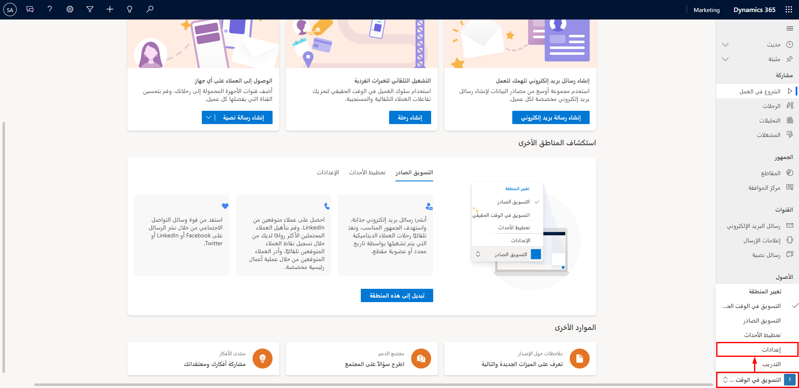

يستخدم المسؤولون منطقة **الإعدادات** لتحسين سلوك تطبيق Microsoft Dynamics 365 Marketing. يُمكنك تعيين الإعدادات الافتراضية وتمكين الندوات عبر الإنترنت والتحقق من الحصص وغيره. 

قد تكوِّن جميع الإعدادات المحددة في هذه الوحدة أو لا، ولكن الأهم أن تكون على دراية بها ومعرفة كيفية استخدامها.
يأتي Dynamics 365 Marketing مزوداً بسجلات افتراضية في بعض هذه المناطق، ولكنك سوف تحتاج إلى إنشاء سجلات جديدة في مناطق أخرى. بالنسبة للمناطق التي لها سجلات افتراضية، تأكد من مراجعتها وتعديلها حسب الحاجة لتتوافق مع متطلبات مؤسستك.

للوصول إلى منطقة **الإعدادات** في Dynamics 365 Marketing، اتبع الخطوات التالية:

1.  قم بتسجيل الدخول كمستخدم لديه امتيازات المسؤول.

1.  قم بتوسيع القائمة في منطقة العمل أسفل المتصفح الجانبي ثم حدد **الإعدادات**.

    > [!div class="mx-imgBorder"]
    > 

1.  سوف يتم تحديث المتصفح الجانبي لعرض الصفحات المتوفرة في منطقة عمل **الإعدادات**. سوف يتم توجيهك افتراضيا إلى صفحة **الإعدادات** في قسم **نظرة عامة**.

تم تنظيم منطقة عمل **الإعدادات** في الأقسام التالية:  

-   **نظرة عامة**

-   **التسويق عبر البريد الإلكتروني** 

-   **مشاركة العملاء**
 
-   **التعاون**

-   **إدارة الأحداث**

-   **إدارة العملاء المتوقعين**

-   **إدارة البيانات** 

-   **الإعدادات الأخرى**
