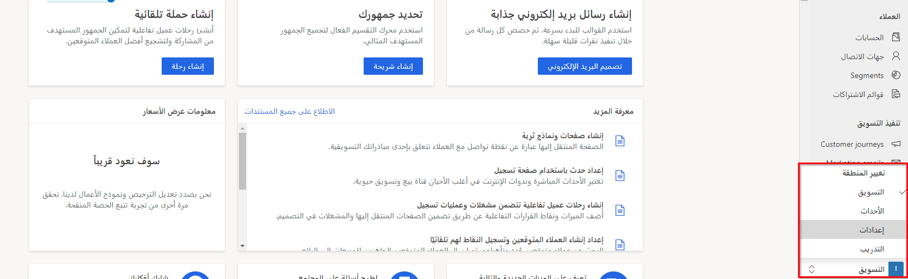
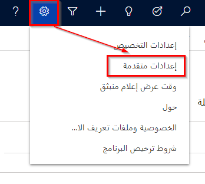
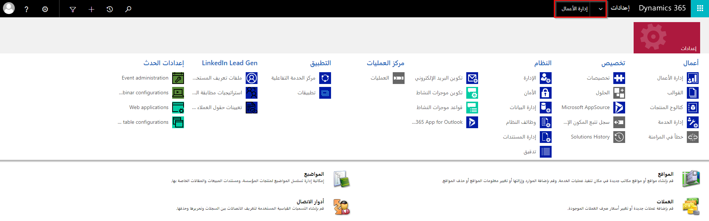

يستخدم المسؤولون منطقة **الإعدادات** لتحسين سلوك تطبيق Microsoft Dynamics 365 Marketing. يُمكنك تعيين الإعدادات الافتراضية وتمكين الندوات عبر الإنترنت والتحقق من الحصص وغيره. إذا كنت تستخدم أيضًا Microsoft Dynamics 365 Sales، فإن العديد من الإعدادات التي تجدها في تطبيق "Marketing" تنطبق أيضًا على هذا التطبيق، رُغم أن بعض الإعدادات مخصصة للمبيعات أو التسويق.

قد تكوِّن جميع الإعدادات المحددة في هذه الوحدة أو لا، ولكن الأهم أن تكون على دراية بها ومعرفة كيفية استخدامها.
يأتي Dynamics 365 Marketing مزودًا بسجلات افتراضية في بعض هذه المناطق، ولكنك سوف تحتاج إلى إنشاء سجلات جديدة في مناطق أخرى. بالنسبة للمناطق التي لها سجلات افتراضية، تأكد من مراجعتها وتعديلها حسب الحاجة لتتوافق مع متطلبات مؤسستك.

## الوصول إلى إعدادات تطبيق Marketing
للوصول إلى منطقة **الإعدادات** في Dynamics 365 Marketing، اتبع الخطوات التالية:

1.  قم بتسجيل الدخول كمستخدم لديه امتيازات المسؤول.

2.  قم بتوسيع القائمة في منطقة العمل أسفل المتصفح الجانبي ثم حدد **الإعدادات**.

    > [!div class="mx-imgBorder"]
    > 

3.  سوف يتم تحديث المتصفح الجانبي لعرض الصفحات المتوفرة في منطقة عمل **الإعدادات**. سوف يتم توجيهك افتراضيا إلى صفحة **الإعدادات** في قسم **نظرة عامة**.

تنقسم منطقة عمل **الإعدادات** إلى أقسام مثل **نظرة عامة**، **التسويق عبر البريد الإلكتروني**، **مشاركة العميل**، **إدارة الحدث**، **إدارة العملاء المتوقعين**، **إدارة البيانات** و **الإعدادات الأخرى**.

## الوصول إلى التخصيص والإعدادات الأخرى
للوصول إلى التخصيص والإعدادات الأخرى، اتبع الخطوات التالية:

1.  افتح قائمة **الإعدادات** من أعلى الصفحة وحدد **الإعدادات المتقدمة**.

    وبعد ذلك، تفتح منطقة **الإعدادات المتقدمة** في علامة تبويب مستعرض جديدة.

    > [!NOTE]
    > تستخدم هذه المنطقة متصفحًا أفقيًا أعلى الصفحة بدلًا من المتصفح الجانبي.

    > [!div class="mx-imgBorder"]
    > 

2.  تُعرض إعدادات **إدارة الأعمال** أولًا. حدد قائمة **الإعدادات** المنسدلة لعرض المزيد من إعدادات Dynamics 365.

    > [!div class="mx-imgBorder"]
    > 

لمزيد من المعلومات، راجع [فتح إعدادات الإدارة](/dynamics365/marketing/open-settings?azure-portal=true) و[‏‫تعرف على كيفية التنقل في Marketing‬](/dynamics365/marketing/navigation?azure-portal=true).
