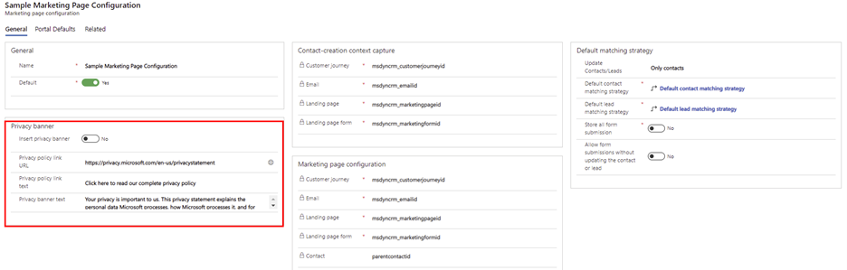
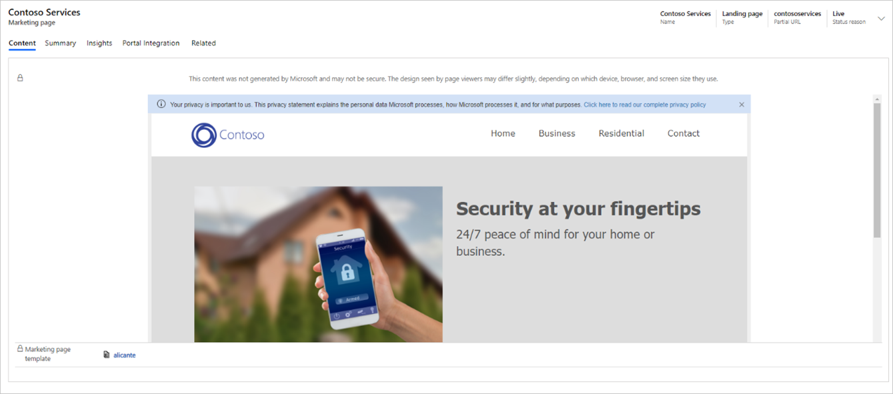
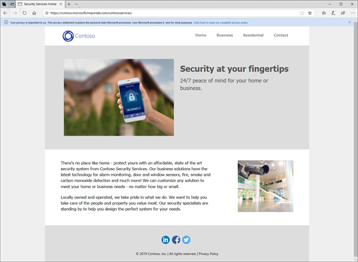
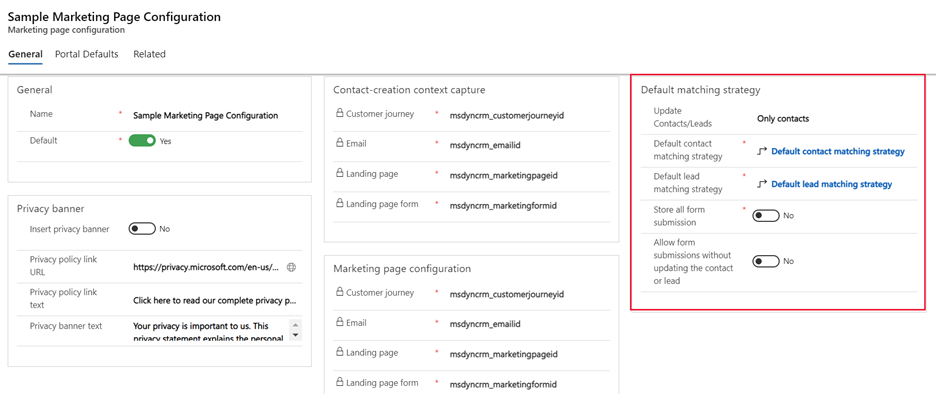
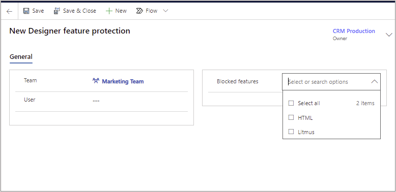
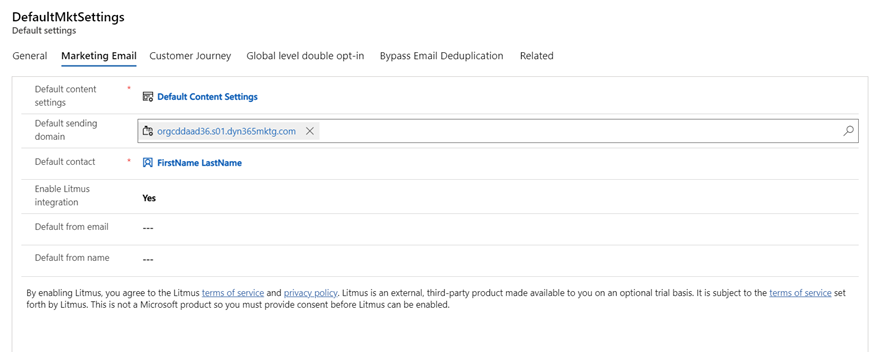
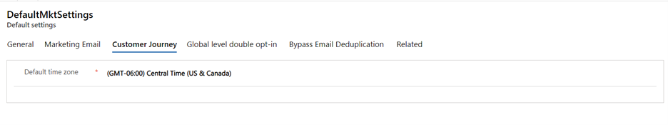
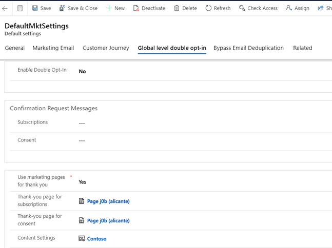
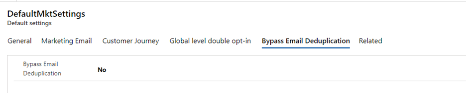

يحتوي قسم **التسويق عبر البريد الإلكتروني** في منطقة عمل **الإعدادات** على صفحات تتيح لك إعداد الإعدادات التالية وتكوينها:

-   **‏‫المجالات** - تسمح لك بمصادقة مجالاتك لزيادة إمكانية تسليم رسائل الرسالة الإلكترونية إلى أقصى حد من خلال استخدام البريد المعرّف بمفاتيح المجال (DKIM) وتمكين تضمين نماذج Dynamics 365 Marketing في موقعك على الويب.

-   **الصفحات المقصودة** - لإعداد لافتة الخصوصية وتعيين الإعدادات الافتراضية للاستضافة وتكوين الإعدادات الافتراضية لكيفية مطابقة البيانات المُرسلة من خلال نموذج صفحة منتقل إليها مع سجل جهة اتصال موجودة أو سجل عميل متوقع وتحديد كيفية مطابقة عمليات إرسال النماذج مع جهات الاتصال الموجودة أو العملاء المتوقعين عندما تقرر تحديث سجل موجود أو إنشاء سجل جديد.

-   تُتيح لك **‏‫حماية ميزات المصمم‬** إمكانية التحكم في تعيين المستخدمين وميزات مصممي المحتوى التي يحق لهم الوصول إليها، بما في ذلك مصممي الرسالة الإلكترونية وصفحات التسويق والنماذج ومجموعات المحتوى.

-   **الإعدادات الافتراضية** - قم بإعداد مجموعات من الإعدادات التي تحدد الإعدادات الافتراضية المختلفة المستخدمة في جميع أنحاء التطبيق.  

## المجالات

يتمثّل الغرض الأساسي من مصادقة مجال الرسالة الإلكترونية في الكشف عن الرسائل والمجالات المزيفة، مما يساعد في منع البريد العشوائي والتصيد الاحتيالي وأي نشاط احتيالي آخر. توجد طريقة تُسمى البريد المعرف بمفاتيح المجال (‏DKIM) تساعد في إجراء عمليات المصادقة هذه. يتم تنفيذ مصادقة المجال من خلال نظام DNS عبر الإنترنت، وتستند إلى تشفير المفتاح العام/الخاص والتوقيعات.

لعرض سجلات مصادقة المجال لديك، افتح منطقة عمل **الإعدادات** وانتقل إلى **التسويق عبر البريد الإلكتروني > المجالات**.

على نحوٍ افتراضي، تتوفر جميع عمليات تثبيت Dynamics 365 Marketing الجديدة مع مجال إرسال تمت مصادقته مسبقاً ينتهي بـ **-dyn365mktg.com**. ‏‫ويعني هذا المجال أنه يُمكنك البدء في إرسال رسائل بريد إلكتروني تمت مصادقتها على الفور. ومع ذلك، لا يزال يجب عليك مصادقة مجالات الإرسال الفعلية لديك على الفور، ومن ثمّ ستُظهر رسائلك التي تمت مصادقتها **عنوان المرسِل** الذي سيتعرّف عليه المستلمون على أنه وارد من مؤسستك. 

سترِد مناقشة هذا الموضوع بمزيد من التفصيل في الوحدة التالية من مسار التعليم هذا.
لمزيد من المعلومات، راجع [مصادقة المجالات](/dynamics365/marketing/mkt-settings-authenticate-domains?azure-portal=true). 

## الصفحات المقصودة 

استخدم منطقة **الصفحات المقصودة** لتكوين الإعدادات الخاصة بصفحات التسويق لديك. على سبيل المثال، يمكنك اختيار لافتة خصوصية لصفحتك. بالإضافة إلى ذلك، يمكنك تعيين الإعدادات الافتراضية للاستضافة وعرض البيانات الواردة المطابقة للسجلات الموجودة و‏‫الإعدادات الافتراضية للمدخل‬.

يمكنك إعداد أي عدد من مجموعات التكوينات كما تريد، ولكن يمكن تنشيط مجموعة واحدة فقط في كل مرة. يجب دائماً تعيين تكوين صفحة منتقل إليها واحد كافتراضي.

للوصول إلى إعدادات صفحة التسويق الافتراضية، افتح منطقة عمل **الإعدادات** وانتقل إلى **التسويق عبر البريد الإلكتروني > الصفحات المقصودة**. 

‏‫لمزيد من المعلومات، راجع [تكوين الصفحات المنتقل إليها‬](/dynamics365/marketing/mkt-settings-landing-pages?azure-portal=true).

### إعداد لافتة الخصوصية للصفحات المقصودة

إن تضمين لافتة الخصوصية في صفحاتك المنتقل إليها يُبيِّن لعملائك أنك تُولي الخصوصية اهتماماً بالغاً، وقد يكون مطلوباً أيضاً في بعض الولايات القضائية.

عند تمكين لافتة الخصوصية، ستتم إضافة النص والارتباط المحددين في الإعدادات الأخرى بهذا القسم إلى كل صفحة تسويق جديدة.
كما ستُضاف أيضاً اللافتة إلى أي صفحة موجودة تفتحها للتحرير. ولكن لن تتم إضافتها إلى الصفحات المنشورة بالفعل لأنها للقراءة فقط.

لمزيد من المعلومات، راجع [إعداد لافتة الخصوصية للصفحات المقصودة](/dynamics365/marketing/mkt-settings-landing-pages?azure-portal=true#set-up-a-privacy-banner-for-landing-pages).

> [!div class="mx-imgBorder"]
> 

يحدد هذا الإعداد طريقة عرض لافتة الخصوصية لمستخدمي Dynamics 365 Marketing في منطقة صفحات التسويق.

> [!div class="mx-imgBorder"]
> 

تُظهر لقطة الشاشة التالية طريقة عرض لافتة الخصوصية لزائري صفحات التسويق.

> [!div class="mx-imgBorder"]
> 

### تكوين كيفية مطابقة بيانات النماذج الواردة مع السجلات الموجودة

ستتضمن معظم صفحاتك المنتقل إليها نموذج إدخال يمكن للزائر استخدامه لتسجيل الاشتراك في عرض أو حدث أو قائمة بريدية عن طريق إدخال اسمه وعنوان بريده الإلكتروني وغير ذلك من المعلومات. عندما يُرسل الزائر نموذجاً، فإن Dynamics 365 Marketing يقبل القيم المُرسلة، ثم يتحقق منها لمعرفة ما إذا كان يجب تحديث سجل موجود أو إنشاء سجل جديد.

يعرض قسم **التقاط سياق إنشاء جهة اتصال** المكان الذي يتم فيه تخزين أنواع مختلفة من المعلومات حول سياق التسويق عندما ينتج عن الإرسال جهة اتصال جديدة. يمكنك في هذا القسم معرفة الحقول الموجودة في جهة الاتصال وأنواع معلومات السياق التي تحتوي عليها.

استخدم قسم **إستراتيجية المطابقة الافتراضية** لتعيين الإعدادات الافتراضية لأنواع الكيانات التي ستقوم نماذج التسويق بإنشائها وتحديثها (العملاء المتوقعون و/أو جهات الاتصال)، وكيفية مطابقة القيم الواردة مع السجلات الموجودة لتحديد ما إذا كان سيتم إنشاء سجل جديد أو تحديث سجل موجود. سوف تُطبَّق هذه الإعدادات الافتراضية على كل نموذج تسويق جديد تقوم بإنشائه، ويتم حفظها بالنموذج، ومن ثمّ يمكنك تجاوزها على مستوى النموذج من خلال تغييرها هناك. لن يؤثر تغيير هذه الإعدادات على النماذج الموجودة. تتوفر الإعدادات التالية:

-   **تحديث جهات الاتصال/العملاء المتوقعين** - ‏‫عند تلقي عملية إرسال صفحة منتقل إليها، يحدد هذا الإعداد أنواع السجلات التي يمكن إنشاؤها أو تحديثها: العملاء المتوقعون أو جهات الاتصال أو كلاهما.

-   **‏‫إستراتيجية مطابقة جهات الاتصال الافتراضية‬** - تعرض اسم إستراتيجية مطابقة الحقول التي أعددتها لمطابقة البيانات الواردة مع سجلات جهات الاتصال الموجودة. في حالة العثور على تطابق وفقاً لهذه الاستراتيجية، فسوف تقوم بتحديث هذا السجل. إذا لم يتم العثور على مطابقة، فسيتم إنشاء جهة اتصال جديدة. يمكنك الاختيار من بين الإستراتيجيات الموجودة أو تحديد **جديد** لإنشاء إستراتيجية جديدة. يعرض القسم التالي مزيداً من المعلومات حول كيفية إعداد إستراتيجيات مطابقة الحقول.

-   **إستراتيجية مطابقة العملاء المتوقعين الافتراضية** - هذا الإعداد يشبه **إستراتيجية مطابقة جهات الاتصال الافتراضية**، ولكنه يختص بسجلات العملاء المتوقعين.

-   **‏‫تخزين جميع عمليات إرسال النماذج** - توفر سجلات نماذج التسويق علامة تبويب تُسمّى **عمليات إرسال النماذج**، يمكنك من خلالها عرض جميع عمليات الإرسال الواردة للنموذج الحالي التي لم تتم معالجتها بعد.
    حتى في حالة فشل بعض عمليات الإرسال، فإنها ستظل مدرجة في هذا القسم لكي تتمكّن من فحصها، وربما إصلاحها، وإعادة إرسالها. عيّن هذا الخيار إلى **نعم** إذا كنت تريد أيضاً الاحتفاظ بسجل لجميع عمليات الإرسال التي تمت معالجتها بنجاح. وسيمكنك أيضاً فحصها وتحديثها وإعادة إرسالها إذا لزم الأمر. عيّن هذا الخيار إلى **لا** للاحتفاظ بعمليات الإرسال المعلّقة والفاشلة فقط في القائمة. ستُطبَّق جميع عمليات الإرسال التي تمت معالجتها بنجاح على قاعدة بياناتك، وستتمكّن دائماً من عرض عمليات الإرسال هذه من خلال الانتقال إلى علامة تبويب **نتائج التحليلات > عمليات الإرسال** (ولكن لا يمكنك تحريرها أو إعادة إرسالها من هناك). لمزيد من المعلومات، راجع [تحرير عمليات إرسال النماذج وإعادة إرسالها](/dynamics365/marketing/failed-submissions?azure-portal=true).

-   **السماح بعمليات إرسال النماذج دون تحديث جهة الاتصال أو العميل المتوقع‬** - تتيح هذه الميزة للمسوّقين جمع عمليات إرسال النماذج وتخزينها ضمن كيان آخر. يمكنك تحسين عملية تلقي البيانات من العملاء من خلال اختيار عدم تعيين نماذج لجهات الاتصال أو العملاء المتوقعين. ويُتيح لك هذا المزيد من المرونة إنشاء مهام سير العمل لتخزين عمليات إرسال النماذج مثل أي كيان آخر.    

لمزيد من المعلومات، راجع [تعيين مطابقة النماذج‬](/dynamics365/marketing/mkt-settings-matching?azure-portal=true).

> [!div class="mx-imgBorder"]
> 

### تعيين الإعدادات الافتراضية للمدخل

يحتوي نموذج **‏‫تكوين صفحة التسويق** على علامة تبويب **‏‫الإعدادات الافتراضية للمدخل‬**، التي تتحكم في كيفية استضافة صفحات التسويق في Dynamics 365 Marketing. تتوفر الإعدادات التالية:

-   **موقع الويب** - يُحدد موقع ويب المدخل الموقع الذي سيتم فيه نشر جميع صفحات التسويق الجديدة بينما يكون سجل التكوين الحالي نشطاً. يتم تعيين هذا الإعداد افتراضياً إلى موقع ويب الحدث المتوفر لك عند التسجيل في Dynamics 365 Marketing، ولكن يمكنك اختيار موقع آخر في حالة وجوده. إذا قمت بتغيير هذا الإعداد، فإن الصفحات التي قمت بنشرها مسبقاً ستظل على مدخلها الحالي، ولكن سيتم نقل الصفحات الجديدة إلى المدخل الجديد.

-   **لغة الصفحة** - لتعيين اللغة الافتراضية لاستخدامها في المدخل.

-   **صفحة الحاوية** - لتعيين صفحة الحاوية المستخدمة لصفحات التسويق.

‏‫لمزيد من المعلومات، راجع [تكوين الصفحات المنتقل إليها‬](/dynamics365/marketing/mkt-settings-landing-pages?azure-portal=true).

## حماية ميزات المصمم 

تُتيح لك حماية ميزات المصمم إمكانية التحكم في تعيين المستخدمين وميزات مصممي المحتوى التي يحق لهم الوصول إليها، بما في ذلك مصممي الرسالة الإلكترونية وصفحات التسويق والنماذج ومجموعات المحتوى. يمكنك استخدام هذه الإعدادات لحظر وصول أي مستخدم أو فريق إلى إحدى ميزتي المصمم التاليتين أو كلتيهما:

-   **علامة تبويب HTML للمصمم** - بإمكان المستخدمين الذين لديهم حق الوصول إلى علامة تبويب **HTML** التعامل مع كافة الجوانب المتعلقة بتعليمات HTML البرمجية التي تمر عبر تصميماتك. من خلال حظر الوصول إلى علامة التبويب هذه، سوف تتأكد من أن عناصر التصميم التي وضعت علامة عليها على أنها مؤمنة في تعليمات HTML البرمجية (وكل المحتوى خارج عناصر التصميم) لن تكون قابلة للتحرير من بعض المستخدمين (أو معظمهم). توفر عناصر مجموعة المحتوى إعداداً بسيطاً يسمح لك بتأمينها أو إلغاء تأمينها، ولكن يمكنك أيضاً تأمين أي عنصر تصميم عن طريق إضافة سمة HTML *data-protected="true"* إلى علامة <div\> للفتح. لمزيد من المعلومات، راجع [استخدام السمات المخصصة لتمكين ميزات المصمم‬‏‫](/dynamics365/marketing/custom-template-attributes?azure-portal=true).

-   **معاينات بريد وارد Litmus‬** - توفر ميزة معاينة علبة وارد مصمم الرسالة الإلكترونية معاينات مثالية البكسل تعرض تماماً الشكل الذي سيبدو به التصميم عند عرضه في أي مجموعة معينة من العملاء/المستعرضات/الأنظمة الأساسية. تُوفر هذه الميزة شركة تُسمّى Litmus، وتتطلّب من المستخدمين شراء ترخيص إضافي بعد أن يتجاوز استخدام مؤسستك عدداً معيناً من المعاينات (راجع اتفاقية ترخيص Dynamics 365 Marketing لمعرفة التفاصيل). قد يلزمك تقييد الوصول إلى هذه الميزة للمساعدة في إدارة التكاليف و/أو التحكم بشكل أفضل في اختيار الأشخاص الذين يمكنهم استخدام المعاينات المجانية لمؤسستك.

للتحكم في الوصول إلى هذه الميزات، افتح منطقة عمل **الإعدادات** وانتقل إلى **التسويق عبر البريد الإلكتروني > حماية ميزات المصمم**. يمكنك في هذا القسم عرض أي سجل نشط لحماية ميزات المصمم أو إنشاء سجل جديد. لمزيد من المعلومات، راجع [التحكم في الوصول إلى ميزات المصمم](/dynamics365/marketing/designer-feature-protection?azure-portal=true).

> [!div class="mx-imgBorder"]
> 

## الإعدادات الافتراضية

تحدد إعدادات التسويق الافتراضية مجموعة من الإعدادات الافتراضية لرسائل الرسالة الإلكترونية التسويقي ورحلات العميل والاشتراك المزدوج وإلغاء تكرار الرسالة الإلكترونية. يمكنك إنشاء مجموعات خاصة بك، ولكن المجموعة المحددة كـ **افتراضية** هي التي ستكون نشطة دون غيرها.

للوصول إلى الإعدادات الافتراضية، افتح منطقة عمل **الإعدادات** وانتقل إلى **التسويق عبر البريد الإلكتروني > الإعدادات الافتراضية**. عند شراء Dynamics 365 Marketing، فإنه يوفر لك سجل *DefaultMktSettings*. يمكنك تكوين هذا السجل أو إنشاء سجل جديد. بعد فتح سجل الإعدادات الافتراضية، سوف يتعيّن عليك تكوين العديد من علامات التبويب والحقول.
سيرد وصف تفصيلي لعلامات التبويب هذه في الأقسام التالية. 

### الإعدادات العامة 

تُتيح لك علامة تبويب **الإعدادات العامة** تسمية سجل الإعداد وتحديد ما إذا كنت تريد أن يكون الإعداد الافتراضي. توجد الإعدادات التالية في علامة التبويب هذه:

-   **الاسم** - اسم مجموعة الإعدادات الافتراضية، كما هو موضّح في صفحة القائمة.

-   **المالك** - المستخدم الذي يملك المجموعة.

-   **افتراضي** - عيّن إلى **نعم** لتنشيط مجموعة الإعدادات الافتراضية الحالية على المثيل.

لمزيد من المعلومات، راجع [علامة التبويب "عام"](/dynamics365/marketing/mkt-settings-default-marketing?azure-portal=true#the-general-tab).

### إعدادات الرسالة الإلكترونية التسويقي

استخدم علامة تبويب **الرسالة الإلكترونية التسويقي** لتعيين الإعدادات الافتراضية التي تنطبق على رسائل الرسالة الإلكترونية التسويقي. يمكنك دائماً تجاوز هذه الإعدادات الافتراضية للرسائل الفردية. ومع ذلك، يُعد من الأفضل بالنسبة للمستخدمين أن تقوم بتعيين الإعدادات الافتراضية إلى القيم الأكثر استخداماً لديهم. ويمكنك أيضاً تمكين تكامل Litmus أو تعطيله لجميع المستخدمين. تتوفر الإعدادات التالية في علامة التبويب هذه:

-   **إعدادت المحتوى الافتراضية** - حدد سجل إعدادات المحتوى الافتراضية لتوفير قيم ديناميكية لعمليات إرسال رسائل الاختبار وميزة **المعاينة** في مصمم الرسالة الإلكترونية التسويقي. يمكن للمستخدمين تجاوز هذا الإعداد الافتراضي بتحديد جهة اتصال أخرى أثناء معاينة رسالة محددة أو إرسالها للاختبار، إذا لزم الأمر. لمزيد من المعلومات، راجع [‬‏‫استخدم إعدادات المحتوى لإعداد مستودعات القيم القياسية والمطلوبة لرسائل الرسالة الإلكترونية‬‏‫](/dynamics365/marketing/dynamic-email-content?azure-portal=true#content-settings).

-   **‏‫مجال الإرسال الافتراضي‬** - حدد مجالاً تمت مصادقته لاستخدامه كمجال إرسال في عنوان مرسِل الرسالة الإلكترونية. يُعد هذا الإجراء ضرورياً عندما يستخدم عنوان المرسِل الأولي مجالاً لم تتم مصادقته بعد باستخدام DKIM. سيساعد الإعداد في التأكد من أن المستخدمين لا يرسلون بريداً إلكترونياً عن طريق الخطأ باستخدام مجال غير مُصادق.
    كما أن استخدام مجال غير مُصادق سيؤثر سلباً على إمكانية التسليم.
    لمزيد من المعلومات، راجع [مصادقة المجالات](/dynamics365/marketing/mkt-settings-authenticate-domains?azure-portal=true) و [تعيين خيارات المرسل والمتلقي](/dynamics365/marketing/email-properties?azure-portal=true#send-receive-options).

-   **جهة اتصال افتراضية** - حدد سجل جهة اتصال افتراضية لتوفير قيم ديناميكية لعمليات إرسال رسائل الاختبار وميزة **معاينة** في مصمم الرسالة الإلكترونية التسويقي. يمكن للمستخدمين تجاوز هذا الإعداد الافتراضي. ويمكنهم اختيار جهة اتصال أخرى أثناء معاينة رسالة محددة أو إرسالها للاختبار إذا لزم الأمر.

-   **تمكين تكامل Litmus** - عيّن الحقل إلى **نعم** لتمكين [ميزة معاينة علبة الوارد](/dynamics365/marketing/email-preview?azure-portal=true#inbox-preview). يوفر هذا الإعداد عروضاً مثالية البكسل للشكل الذي ستظهر به رسائل بريدك الإلكتروني على مجموعات معينة من العملاء والأنظمة الأساسية.‬ تتوفر هذه الميزة من خلال شريك Microsoft، وهو شركة [Litmus Software, Inc.](https://litmus.com/?azure-portal=true)، وهي اختيارية.

-   **افتراضي من الرسالة الإلكترونية** - استخدم هذا الإعداد لتحديد عنوان *من* الافتراضي عند إنشاء رسالة إلكترونية جديدة.

-   **الافتراضي من الاسم** - حدد اسم المرسل الافتراضي للرسائل الإلكترونية الجديدة.

    > [!div class="mx-imgBorder"]
    > 

لمزيد من المعلومات، راجع [علامة التبويب الرسالة الإلكترونية التسويقي](/dynamics365/marketing/mkt-settings-default-marketing?azure-portal=true#the-marketing-email-tab).

### إعدادات رحلة العميل

تُتيح لك إعدادات **رحلة العميل** اختيار المنطقة الزمنية الافتراضية المستخدمة في رحلات العميل. يمكنك دائماً تجاوز هذه الإعدادات الافتراضية لرحلات العميل الفردية. وسيُعدّ من الأفضل بالنسبة للمستخدمين أن تقوم بتعيين الإعدادات الافتراضية إلى القيم الأكثر استخداماً لديهم.

> [!div class="mx-imgBorder"]
> 

> [!NOTE] 
> يتعذّر تغيير المنطقة الزمنية عندما تكون رحلة العميل مباشرة. تأكد من مراجعة المنطقة الزمنية الافتراضية وتحديثها قبل بدء العرض المباشر لرحلات العميل.

لمزيد من المعلومات، راجع [علامة التبويب رحلة العميل](/dynamics365/marketing/mkt-settings-default-marketing?azure-portal=true#the-customer-journey-tab).

### إعدادات الاشتراك المزدوج على المستوى العمومي

تُتيح إعدادات **الاشتراك المزدوج على المستوى العمومي** تمكين ميزات الاشتراك المزدوج في Dynamics 365 Marketing. كما أنه يُعرف أيضاً بـ *الاشتراك المؤكد*، حيث تطلب ميزة الاشتراك المزدوج من جهات الاتصال التي تسجل في قائمة اشتراك جديدة أو تعمل على زيادة مستوى [الموافقة على حماية البيانات](/dynamics365/marketing/gdpr) لديها، تأكيد طلبها. ويتم إرسال ارتباط إلى عنوان بريدها الإلكتروني المسجل للتأكيد. يساعد هذا النظام على التأكّد من أن الطلب مقصود وأن عنوان البريد الإلكتروني المتوفر قانوني ويعمل.

ميزة الاشتراك المزدوج عمومية لمثيل Dynamics 365. عند تمكينها، ستتطلّب جميع طلبات الاشتراك والموافقة على الزيادة الجديدة الاشتراك المزدوج وسيتم تطبيق نفس الإعدادات في كل مكان.

قبل البدء في إعداد ميزة الاشتراك المزدوج وتمكينها، يجب توفر العناصر التالية لنظامك:

-   رسالة بريد إلكتروني **لطلب تأكيد الاشتراك**

-   رسالة بريد إلكتروني **لطلب تأكيد الموافقة على الزيادة**

-   **سجل إعدادات محتوى** لاستخدامه مع جميع رسائل طلب التأكيد

-   **صفحة شكراً لك** لإعادة التوجيه لتأكيد جهة الاتصال نوع كل طلب

لمزيد من المعلومات، راجع [إعداد الاشتراك المزدوج العمومي للاشتراكات الجديدة والموافقة على التغييرات](/dynamics365/marketing/double-opt-in?azure-portal=true). 

بعد إنشاء العناصر، يمكنك تعبئة الإعدادات التالية:

-   **تمكين الاشتراك المزدوج**: عيّن هذا الخيار إلى **نعم** لتمكين الاشتراك المزدوج في مثيلك. وقم بالتعيين إلى **لا** لتعطيله.

-   **الاشتراكات** - حدد رسالة التأكيد لإرسال طلب إلى جهات الاتصال للانضمام إلى قائمة بريدية جديدة.

-   **الموافقة** - حدد رسالة التأكيد لإرسالها إلى جهات الاتصال لطلب زيادة مستوى موافقتها.

-   **استخدام صفحات التسويق لصفحة شكراً لك** – حدد **نعم** إذا كنت تخطط لاستخدام صفحات التسويق داخل Dynamics. وبخلاف ذلك، قم بالتعيين إلى **لا**.

    -   عند التعيين إلى **لا**، أدخل الحقول التالية:

        -   **عنوان URL لصفحة شكراً لك للاشتراكات‬** – أدخل عنوان URL للصفحة لإظهاره لجهات الاتصال بعد تأكيد اشتراك جديد.

        -   **عنوان URL لصفحة شكراً لك للموافقة** - أدخل عنوان URL للصفحة لإظهاره لجهات الاتصال بعد أن يؤكدوا زيادة مستوى موافقتهم.

        -   **إعدادات المحتوى** - تحديد سجل إعدادات المحتوى الذي حددته لاستخدامه لجميع رسائل الاشتراك المزدوج.
    
    -   عند التعيين إلى **نعم**، أدخل الحقول التالية:

        -   **صفحة شكراً لك للاشتراكات** - حدد صفحة تسويق لإظهارها لجهات الاتصال بعد قيامها بتأكيد اشتراك جديد.

        -   **صفحة شكراً لك للموافقة** - حدد صفحة تسويق لإظهارها لجهات الاتصال بعد قيامهم بتأكيد زيادة مستوى موافقتهم.

        -   **إعدادات المحتوى** - تحديد سجل إعدادات المحتوى الذي حددته لاستخدامه لجميع رسائل الاشتراك المزدوج.

    > [!div class="mx-imgBorder"]
    > 

لمزيد من المعلومات، راجع [‬‏‫إعداد وتمكين الاشتراك المزدوج العمومي في مثيلك](/dynamics365/marketing/double-opt-in?azure-portal=true#set-up-and-enable-global-double-opt-in-on-your-instance).

### تجاوز تكرارات الرسالة الإلكترونية

يحظر Dynamics 365 Marketing عادةً رسائل الرسالة الإلكترونية التسويقي الصادرة المكررة؛ وذلك للتأكد من إرسال كل رسالة مرة واحدة إلى عنوان بريد إلكتروني فريد. في حالة وجود عنوان بريد إلكتروني مماثل لدى أكثر من سجل جهة اتصال في الشريحة المستهدفة، فستتلقى جهة اتصال واحدة فقط الرسالة، وهذا هو الأسلوب المطلوب. تشير عناوين الرسالة الإلكترونية المكررة على الأرجح إلى تمثيل الشخص نفسه بسجلين مختلفين في قاعدة بياناتك. ربما تم تسجيل جهة اتصال في أوقات مختلفة باستخدام صيغتين مختلفتين للاسم الأول، مثل *Bob* و *Robert*.

تتطلّب بعض المؤسسات إرسال نسخ منفصلة من رسائل الرسالة الإلكترونية نفسها إلى جهات اتصال متعددة صادف أنها تستخدم عنوان البريد الإلكتروني نفسه. في هذه الحالة، قد يكون المحتوى المخصص، مثل تفاصيل الحساب، مختلفاً لكل مستلم على الأرجح. إذا كانت مؤسستك تتطلب هذا الأسلوب، فعيّن الخيار **تجاوز تكرارات الرسالة الإلكترونية‬** إلى **نعم**. عيّن الخيار إلى **لا** للعودة إلى الأسلوب القياسي لحظر التكرار.

> [!div class="mx-imgBorder"]
> 

لمزيد من المعلومات، راجع [علامة تبويب تجاوز تكرارات الرسالة الإلكترونية‬](/dynamics365/marketing/mkt-settings-default-marketing?azure-portal=true#the-bypass-email-deduplication-tab).

## عمليات حماية البيانات 

تسمح صفحة **حماية البيانات** في منطقة **التسويق عبر البريد الإلكتروني** للمسوّقين بتمكين ميزات خصوصية البيانات في Dynamics 365 Marketing. تُركّز هذه الميزات حالياً على مساعدة المؤسسات في الالتزام بلوائح القانون العام لحماية البيانات (GDPR) في الاتحاد الأوروبي. يرد وصف هذه المنطقة بمزيد من التفصيل في الوحدة التالية. 

لعرض سجل حماية البيانات أو إنشائه، افتح منطقة عمل **الإعدادات** وانتقل إلى **التسويق عبر البريد الإلكتروني > عمليات حماية البيانات**.

لمزيد من المعلومات، راجع [حماية البيانات والقانون العام لحماية البيانات (GDPR‎)](/dynamics365/marketing/gdpr?azure-portal=true).
