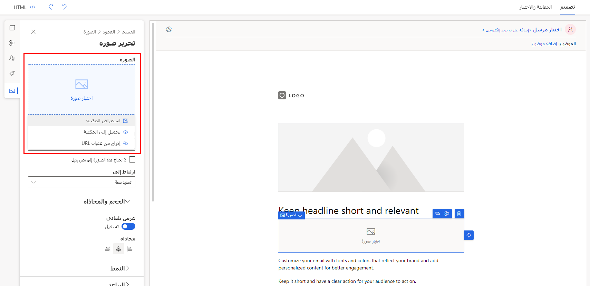

تُعد الصور جزءًا مهمًا من تصميمات صفحة التسويق والبريد الإلكتروني. يجب أن تكون الصور التي تستخدمها متوفرة للجمهور على الإنترنت حتى يمكن الوصول إلى رسائل البريد الإلكتروني والصفحات وعرضها. رُغم أنه يُمكنك استضافة صورك في أي مكان، إلا أن هناك مكانًا مناسبًا للاحتفاظ بها في مكتبة صور Dynamics 365 Marketing، التي تخزن الصور وتستضيفها بشكل عام وتوفر مستعرض صور يساعدك في العثور عليها ووضعها في أثناء العمل في Dynamics 365 Marketing.

كلما أضفت عنصر صورة إلى صفحة تسويق أو بريد إلكتروني، يصبح لديك خيار إضافة صورة موجودة مسبقًا في قاعدة بيانات Dynamics 365 أو تحميل صورة جديدة. بعد تحميل ملف، يصبح متاحًا للاستخدام في تصميمات أخرى. كما يُمكنك تحميل الصور مباشرة إلى مكتبة الملفات لاستخدامها في أنشطة التسويق المستقبلية.

> [!NOTE]
> لأغراض أمنية، يُسمح لك فقط بتحميل التنسيقات المدعومة التالية: GIF وBMP وJPEG وPNG. أقصى حجم مسموح به للصور التي تم تحميلها هو 5 ميغابايت.

## تحميل الصور إلى مكتبة الوسائط

لرؤية طريقة عرض القائمة لجميع الملفات المتوفرة لمؤسستك، انتقل إلى **التسويق > محتوى التسويق > الملفات**، حيثُ يُمكنك العثور علي الصور الموجودة وتحريرها. لإضافة ملف جديد، حدد **+تحميل**.

عند تحميل ملفات الصور إلى Dynamics 365 Marketing، سيأخذ اسم ملف الصورة الاسم ذاته من مكان تصديره، لذا تأكد من إعادة تسمية الملف إلى ما تريد إظهاره في التطبيق قبل التحميل إلى Dynamics 365 Marketing.

> [!IMPORTANT]
> إذا حذفت صورة، فلن تحصل على تحذير بشأن مكان استخدام هذه الصورة. قد ينتج عن هذا صورة تالفة في صفحة تسويق أو بريد إلكتروني. ولذا، توخ الحذر عند حذف الصور من مكتبة الملفات.

لمزيد من المعلومات، راجع [تحميل الملفات إلى Dynamics 365](/dynamics365/marketing/upload-images-files?azure-portal=true#upload-files-to-dynamics-365).

## استخدام الصور في محتوى التسويق

لإضافة صورة إلى صفحة تسويق أو بريد إلكتروني، ابدأ بسحب عنصر **صورة** من **صندوق الأدوات** إلى التصميم، ويكون مكانها عنصر نائب. يُمكنك تحديد رمز **معرض الصور** من العنصر النائب للصورة أو فتح علامة تبويب  **الخصائص** ، حيثُ يُمكنك تحديد رمز **معرض الصور** في حقل **المصدر**. سيؤدي هذا التحديد إلى فتح مربع حوار **حدد ملف** حيثُ يُمكنك اختيار ملف تم تحميله بالفعل أو يُمكنك إضافة ملف جديد. في أثناء تحديد الصورة، يُمكنك استخدام علامة التبويب **الخصائص** لإجراء تعديلات أو إضافات أخرى على الصورة مثل تعريف **نص بديل** أو تغيير **المحاذاة** أو ضبط **الارتفاع** أو **العرض**.

في حقل **الارتباط**، يُمكنك ربط الصورة بصفحه ويب خارجيه أو صفحه تسويق تم إنشاؤها داخل Dynamics.

-   لربط الصورة بصفحة غير مستضافة في Dynamics 365 Marketing، الصق عنوان URL في حقل الارتباط.

-   لربط الصورة بصفحه تسويقيه داخل Dynamics، حدد زر مساعدة التحرير **</>** في حقل **الارتباط**. من القائمة المنبثقة، حدد **محتوى ثابت**، ثم **MarketingPage** على أنها الكيان. ابحث عن الصفحة المطلوبة وحددها، ثم حدد **بلا علاقة** في الحقل التالي. في الحقل الأخير، حدد **msdyncrm_full_page_url**. 
    حدد **إدراج**. يجب ربط الصورة بصفحة التسويق المرتبطة. 

لمزيد من المعلومات، راجع [استخدام الصور في المحتوي](/dynamics365/marketing/upload-images-files?azure-portal=true#use-images-in-your-content).
