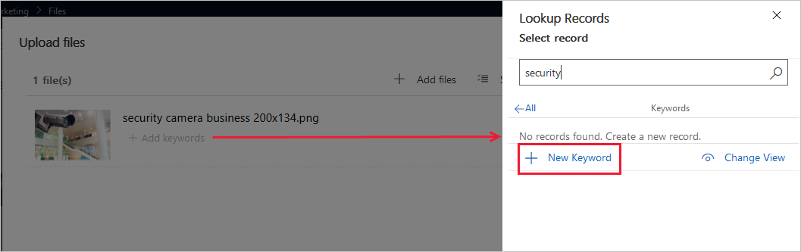
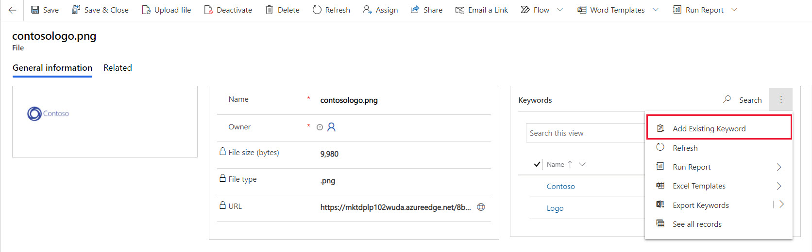

تُسهّل الكلمات الأساسية عليك العثور على الصور بسرعة. في كل مرة تقوم فيها بتحميل صورة جديدة، تتوفر لديك فرصة لتطبيق كلمة أساسية عليها.

لمساعدتك في التحكم في كلماتك الأساسية، يطلب Dynamics 365 منك إنشاء قائمة بالكلمات الأساسية المحددة التي يمكن للمستخدمين تطبيقها على ملفاتهم.
وبالتالي، على المستخدمين اختيار كلمات أساسية من قائمة بدلًا من إدخال نص حر. ويُساعد ذلك على منع المستخدمين من تطبيق أنطولوجية المنافسة، فضلًا عن المساعدة في منع الأخطاء الكتابية.

لعرض كلمة أساسية جديدة أو تحريرها أو إنشائها، انتقل إلى **التسويق > محتوى التسويق > الكلمات الأساسية**.

> [!IMPORTANT]
> إذا قمت بتحرير كلمة أساسية موجودة، ستعرض جميع الملفات الموجودة التي تستخدمها القيمة الجديدة من الآن فصاعدًا. إذا قمت بحذف كلمة أساسية، تتم إزالتها ببساطة من جميع الملفات التي تستخدمها. توخ الحذر عند تحرير الكلمات الأساسية أو حذفها.

لإنشاء كلمة أساسية جديدة عند تحميل صورة جديدة، حدد **+ إضافة كلمات أساسية** تحت اسم الصورة. ابحث لمعرفة ما إذا كانت الكلمة الأساسية موجودة بالفعل؛ وإذا لم يكن كذلك، فحدد **+ كلمة أساسية جديدة**، وأدخل **اسمًا** للكلمة الأساسية الجديدة، ثم حدد **حفظ وإغلاق**.

ويُمكنك أيضًا إضافة الكلمات الأساسية من الصور الموجودة أو إزالتها. انتقل إلى **التسويق > محتوى التسويق > الملفات**. حدد اسم الملف. في قسم الكلمات الأساسية، حدد التوسيع (**...**) بجوار العدسة المكبرة ثم حدد **أضف كلمة أساسية موجودة**. أضف الكلمات الأساسية حسب الحاجة.

> [!div class="mx-imgBorder"]
> 

للحصول على مزيد من المعلومات، راجع [إنشاء الكلمات الأساسية](/dynamics365/marketing/upload-images-files?azure-portal=true#establish-keywords).
