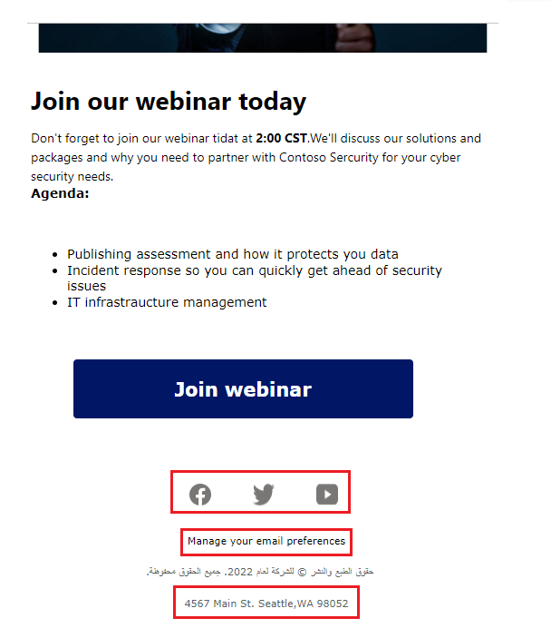
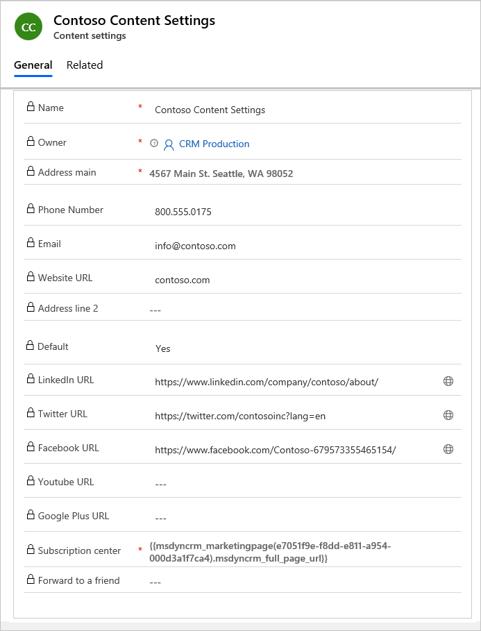

إعدادات المحتوى عبارة عن مجموعات من القيم القياسية والمطلوبة المتوفرة للاستخدام في رسائل البريد الإلكتروني التسويقية. ويتضمن كل سجل ارتباط مركز اشتراك، وارتباط إعادة التوجيه إلى صديق، وارتباطات الوسائط الاجتماعية، وعنوانك البريدي، والمعلومات الأخرى التي يمكن وضعها في رسالة بريد إلكتروني على أنها قيم ديناميكية.

## مراجعه إعدادات المحتوى وتحديثها وإنشاءها

لعرض سجل إعدادات محتوى أو تحريره أو إنشائه، انتقل إلى **التسويق > القوالب > إعدادات المحتوى**.

سيأتي Dynamics 365 Marketing مع سجل إعدادات محتوى افتراضي تم تكوينه مسبقًا لاستخدام مركز الاشتراك الافتراضي (تتضمن أيضًا العناصر الجاهزة). كما تتضمن إعدادات المحتوى العنوان الفعلي الأساسي لمؤسستك (المُحدد كجزء من الإعداد الأولي للموقع). يُمكنك إضافة المزيد من الإعدادات مثل رقم هاتف الشركة وموقع ويب الشركة والارتباطات إلى مواقع التواصل الاجتماعي مثل Facebook وكذلك Twitter. يُمكن سحب كل هذه القيم في رسائل البريد الإلكتروني التسويقية على أنه محتوى ديناميكي وقد تساعدك في الحفاظ على معايير متسقة عبر جميع رسائل البريد الإلكتروني، ولذا تأكد من مراجعة الإعدادات الافتراضية وتحديثها حسب الحاجة.

عند إعداد رحلة عميل، ستحدد سجل إعدادات محتوى محدد لاستخدامه، مما يعني أن جميع الرسائل المرسلة بواسطة تلك الرحلة ستستخدم السجل ذاته. ومع ذلك، يمكن لكل رحلة استخدام سجل مختلفة، وهذا يعني أنه يمكنك استخدام تصميم بريد إلكتروني تسويقي متطابق في رحلتي عميل أو أكثر، تُحدد كل منها سجل مختلف لإعدادات المحتوى. 

مثال، قد يكون لديك العديد من وحدات الأعمال التي تستخدم مركز الاشتراك وصفحات وسائل التواصل الاجتماعية. قد يكون لديك مكاتب في أماكن جغرافية مختلفة تريد تخصيص عنوان ورقم هاتف لها حيث تُعرض في رسائل البريد الإلكتروني الخاصة بها.

لإنشاء سجل **إعدادات محتوى** جديد، حدد **+جديد** من شريط الأوامر. يجب تعبئة الحقول ذات الصلة مع حقلي الاسم المطلوب والعنوان الفعلي. بمجرد الانتهاء من تحرير السجل، تأكد من **التحقق من الأخطاء** وانتقل إلى **العرض المباشر** حتى يمكن استخدام إعدادات المحتوى في رحلات العميل.

في حالة تحرير سجل إعدادات محتوى كان موجودًا في العرض المباشر بالفعل، فإنه تتم إعادة نشره تلقائياً عند حفظه. من الضروري أولاً تقييم قيم إعدادات المحتوى في وقت إرسال رحلة عميل، مما يعني أنه يمكنك تحرير سجل إعدادات المحتوى في أي وقت، وسوف تستخدم جميع رسائل البريد الإلكتروني المعلقة والمستقبلية أحدث قيم السجل.

> [!Tip]
> إذا كان لديك أنواع قيم أخرى تستخدمها غالبًا في رسائل البريد الإلكتروني أو تريد إدارتها على مستوى رحلة العميل، فيُمكنك إضافتها على أنها حقول مخصصة إلى كيان إعدادات المحتوى تمامًا كما تفعل مع أنواع الكيانات الأخرى في Dynamics 365. ومع ذلك، في الوقت الحالي، يجب أن تكون كل الحقول المخصصة لكيان إعدادات المحتوى من النوع النص (سلسلة). لمزيد من المعلومات، راجع [تخصيص التسويق](/dynamics365/marketing/customize/?azure-portal=true).

لمزيد من المعلومات، راجع [استخدام إعدادات المحتوى لإعداد مستودعات القيم القياسية والمطلوبة لرسالة البريد الإلكتروني](/dynamics365/marketing/dynamic-email-content?azure-portal=true#content-settings) و [‏‫عمليات العرض المباشر لإعدادات المحتوى وحالتها‬](/dynamics365/marketing/go-live?azure-portal=true#content-settings-go-live-operations-and-status).

## حدد إعدادات المحتوى في رحلات العميل

ستحدد سجل إعدادات المحتوى في كل رحلة عميل فردية. ونتيجة لذلك، ستستخدم جميع رسائل البريد الإلكتروني التسويقية، التي تم إرسالها بواسطة تلك الرحلة، مجموعة الإعدادات (مثال، العنوان الفعلي ومركز الاشتراك والروابط الاجتماعية وغير ذلك). يتم أولاً تقييم قيم إعدادات المحتوى في وقت الإرسال، مما يعني أنه يمكنك تحرير سجل إعدادات المحتوى في أي وقت، وسوف تستخدم جميع رسائل البريد الإلكتروني المعلقة والمستقبلية أحدث القيم.

> [!NOTE]
> إذا كان لديك أكثر من سجل لإعدادات المحتوى، فسيكون واحدًا منها السجل الافتراضي وسيتم تطبيقه تلقائياً لكل رحلة عميل جديدة تقوم بإنشائها. يُمكنك تغيير هذا التكرار عن طريق تحديث حقل **إعدادات المحتوى** في علامة التبويب **الملخص** لرحلة العميل. سنناقش إعدادات المحتوى مرة أخرى في وحدة رحلة العميل.

لمزيد من المعلومات، راجع [اختيار إعدادات المحتوي](/dynamics365/marketing/customer-journeys-create-automated-campaigns?azure-portal=true#choose-your-content-settings).

