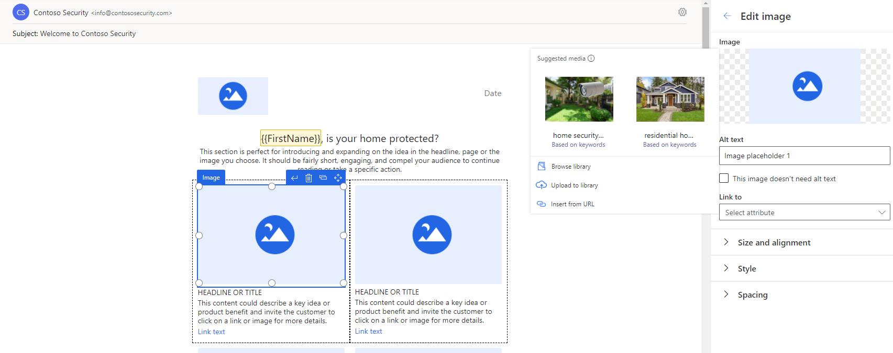

يشترك محرر البريد الإلكتروني التسويقي في الوقت الحقيقي في الكثير من مظهره وسلوكه مع [محرر البريد الإلكتروني التسويقي الصادر](/dynamics365/marketing/prepare-marketing-emails/?azure-portal=true). كما هو الحال مع محرر البريد الإلكتروني التسويقي الصادر، يتيح لك محرر البريد الإلكتروني التسويقي في الوقت الحقيقي إنشاء رسائل بريد إلكتروني ديناميكية بسرعة لجذب انتباه عملائك.

> [!IMPORTANT]
> مكتبات رسائل البريد الإلكتروني في التسويق الصادر والتسويق في الوقت الحقيقي مستقلة حالياً. لا تظهر رسائل البريد الإلكتروني التي يتم إنشاؤها داخل التسويق الصادر في التسويق في الوقت الحقيقي والعكس صحيح. عند الحاجة إلى بريد إلكتروني في كلا المكانين، فستحتاج إلى نسخه من منطقة عمل إلى أخرى.

تشبه عملية إنشاء بريد إلكتروني تسويقي صادر مع استثناءات قليلة. لمراجعه خطوات إنشاء رسائل بريد إلكتروني تسويقية، راجع وحدة [إنشاء بريد إلكتروني تسويقي](/learn/modules/manage-emails-journey/2-create-email/?azure-portal=true) داخل وحدة [إدارة البريد الإلكتروني والشرائح والرحلات في Dynamics 365 Marketing](/learn/modules/manage-emails-journey/?azure-portal=true).

لعرض أو تعديل أو حذف أو إنشاء إخطار مؤقت جديد، انتقل إلى **التسويق في الوقت الحقيقي > القنوات > رسائل البريد الإلكتروني**.

تشمل الميزات الفريدة لمحرر البريد الإلكتروني التسويقي في الوقت الحقيقي ما يلي:

- **التخصيص القوي للبريد الإلكتروني** - يحتوي محرر البريد الإلكتروني التسويقي في الوقت الحقيقي على عنصر تحكم جديد في تحرير المساعدة لربط البيانات المخصصة. يمكنك استخدام البيانات المخصصة لتعبئة المعلومات الخاصة بكل مستلم بريد إلكتروني ديناميكياً. بالإضافة إلى ذلك، يمكنك إضافة قيمة افتراضية للتخصيص. تسمح لك القيمة الافتراضية بإضافة محتوى للحالات التي تكون فيها هذه البيانات فارغة في نظامك. مثال، عند تضمين **الاسم الأول** على أنه محتوى ديناميكي في الرسالة، فقد ترغب في إضافة **عميل مهم** في حقل **القيمة الافتراضية** في حالة ما إذا كان حقل **الاسم الأول** فارغًا لأي من عملائك. إذا كانت البيانات فارغة ولم يتم عرض أي قيمة افتراضية، فسيظهر هذا الجزء من الرسالة فارغاً.

لمزيد من المعلومات، راجع [‬‏‫التخصيص القوي للبريد الإلكتروني](/dynamics365/marketing/real-time-marketing-email#powerful-email-personalization/?azure-portal=true).

> [!div class="mx-imgBorder"]
> 

- **اقتراحات الصور المعتمدة على الذكاء الاصطناعي** - يحلل المحرر الجديد محتوى نص البريد الإلكتروني، وباستخدام الذكاء الاصطناعي، يقترح الصور الأكثر صله من مكتبه الأصول الجديدة.
تُوضع علامات على الصور تلقائياً، مما يوفر لك الوقت. لمزيد من المعلومات، راجع [اقتراحات الصور المعتمدة على الذكاء الاصطناعي](/dynamics365/marketing/real-time-marketing-email?azure-portal=true#ai-driven-image-suggestions).

> [!div class="mx-imgBorder"]
> 

لمزيد من المعلومات، راجع [إنشاء البريد الإلكتروني التسويقي في الوقت الفعلي](/dynamics365/marketing/real-time-marketing-email/?azure-portal=true).
