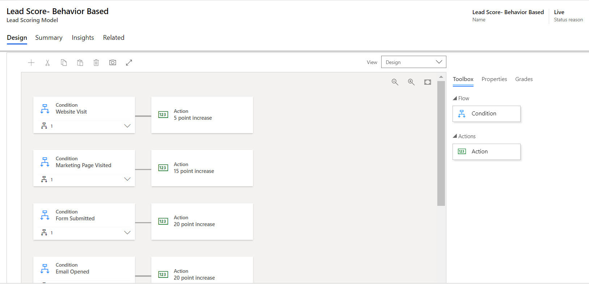
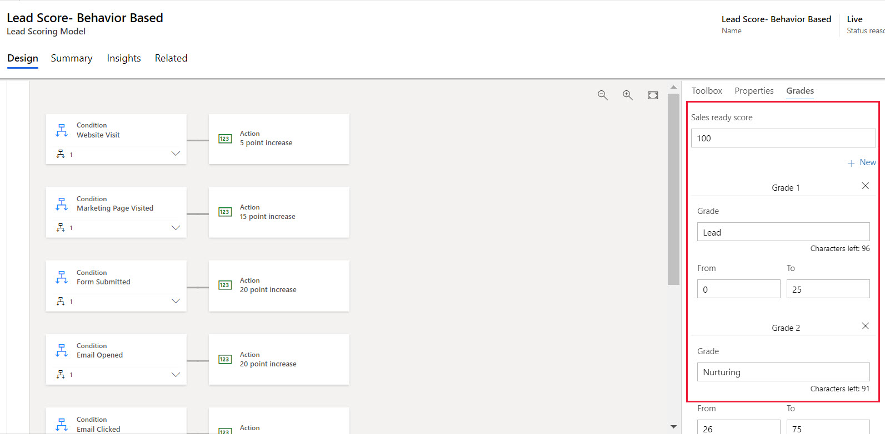
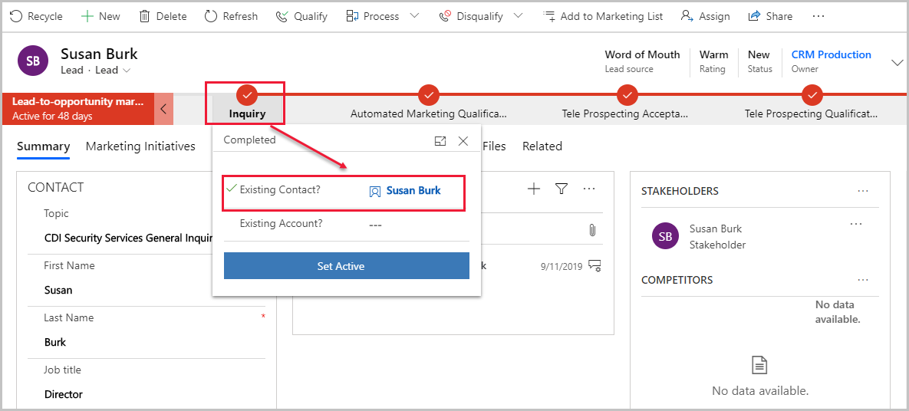

بعد إنشاء العملاء المتوقعين أو مطابقتهم مع سجل جهة اتصال معين، يكون لدى المؤسسات العديد من الطرق لتحديد كيفية تشجيع العملاء المتوقعين وتأهيلهم.

يمثل أي عميل متوقع اهتماماً واضحاً بمبادرة تسويقية محددة. قد يكون لبعض جهات الاتصال عدة سجلات عميل متوقع نشطة في الوقت ذاته، يتعقب كل منها مستوى اهتمام مختلف في حملة أو منتج مختلف.

يسمح نظام التسجيل التلقائي للنقاط لتطبيق Marketing بحساب نقاط كل عميل متوقع استناداً إلى البيانات السكانية والديمغرافية للمؤسسات والإجراءات المتخذة من قبل جهة الاتصال المقترنة (أو للعملاء المتوقعين القائمين على الحسابات، جهات الاتصال التي تنتمي إلى الحساب المقترن). تتضمن التفاعلات التي يمكن تسجيل نقاط لها، مثال: فتح رسالة بريد إلكتروني أو إرسال صفحة منتقل إليها أو زيارة موقعك على الويب أو حضور حدث. يُمكنك تصميم شرائحك ورحلات العميل لكي تتفاعل مع الأنماط الواعدة في سلوك جهات الاتصال، بحيث يمكنك تحقيق المزيد من التفاعل معها من خلال الرسائل المستهدفة والعروض الجذابة التي تعزز اهتمامها.

لمزيد من المعلومات، راجع [‏‫تشجيع العملاء المتوقعين وتسجيل نقاطهم‬](/dynamics365/marketing/lead-lifecycle?azure-portal=true#lead-nurturing-and-scoring).

## إنشاء نماذج نقاط العميل المتوقع وعرضها وإدارتها.

توفر نماذج نقاط العميل المتوقع قواعد عن كيفية زيادة أو إنقاص نقاط العميل المتوقع تلقائياً استناداً إلى أنشطة وتفاعلات معينة بالإضافة إلى المعلومات الديموغرافية على مدار الوقت.

يتكون نموذج نقاط العميل المتوقع من شروط وإجراءات. *الشروط* تُحدّد المعايير التي يحتاج العميل المتوقع تلبيتها. قد تتضمن الشروط بيانات ديموغرافية أو سكانية موجودة في سجلات العميل المتوقع أو جهات الاتصال أو البيانات السلوكية مثل البريد الإلكتروني المحدد أو الحدث المسجل أو موقع الويب الذي تمت زيارته. *الإجراءات* تُحدّد طريقة تعديل النقاط عند استيفاء الشرط.

> [!div class="mx-imgBorder"]
>  

يُنشيء النموذج أيضاً جدول *للدرجات* يميز نطاقات النقاط بلغة بسيطة (مثل ساخن، ودافئ، وبارد)، ويعّين حد نقاط محدد مثل "جاهز للمبيعات"، والذي يعني أنه يمكن إعادة توجيه العميل المتوقع الآن إلى البائع. ولذلك، عادة ما ستقوم بتعيين حد جاهزية المبيعات لكل نموذج تسجيل نقاط لعميل متوقع. كما يُمكنك إعداد جدول درجات لعرض تفسير النقاط (مثل بارد أو دافئ أو ساخن) في أثناء تقدم العميل المتوقع الجاهز للمبيعات.

> [!div class="mx-imgBorder"]
> 

يمكنك إنشاء العديد من نماذج النقاط التي تريدها. إذا كان لديك أكثر من نموذج، سوف يتم تسجيل نقاط جميع العملاء المتوقعين استناداً إلى كل نموذج، وسوف تكون قادراً على مشاهدة النقاط ودرجة كل منهم.

ستستخدم عادة نماذج التسويق على أنها جزء من إستراتيجية إنشاء العملاء المتوقعين وتسجيل النقاط. إذا كان الأمر كذلك، فمن الضروري معرفه كيفيه تأثير بعض الإعدادات، الموجودة في العنوان وعلامة تبويب **الملخص** في نموذج، في إنشاء جهة الاتصال، وإنشاء العميل المتوقع، وتحديثات السجل، وتسجيل نقاط العميل المتوقع وسجلات التفاعل. لمزيد من المعلومات عن كيفية تأثير هذه الإعدادات في تسجيل نقاط العميل المتوقع، راجع [كيفية تأثير إعدادات النموذج في نقاط العميل المتوقع وسجلات التفاعل](/dynamics365/marketing/marketing-forms?azure-portal=true#how-form-settings-affect-lead-scoring-and-interaction-records).

للوصول إلى نماذج تسجيل نقاط العميل المتوقع، انتقل إلى **التسويق > إدارة العميل المتوقع > نماذج تسجيل نقاط العميل المتوقع**. يفتح تحديد هذا المسار طريقة عرض قائمة قياسية، حيث يمكنك إنشاء بنود أو حذفها أو البحث عنها أو فرزها أو تصفيتها في القائمة.

للحصول على مزيد من المعلومات، راجع [إنشاء نماذج نقاط العميل المتوقع وعرضها وإدارتها](/dynamics365/marketing/score-manage-leads?azure-portal=true#create-view-and-manage-your-lead-scoring-models).

### يُمكن فقط تسجيل نقاط العملاء المتوقعين المربوطين بجهات اتصال أو بحسابات

يعمل التسجيل التلقائي لنقاط العميل المتوقع فقط مع العملاء المتوقعين المقترنين بجهة اتصال أو حساب. لن يظهر تسجيل نقاط العملاء المتوقعين الذين ليس لديهم جهة اتصال أو حساب يقترن بهم.

فيما يتعلق بالعملاء المتوقعين الذين تم إنشاؤهم أو تحديثهم من خلال نماذج التسويق المكونة لتحديث كل من العملاء المتوقعين وجهات الاتصال، دائماً ما يقوم نموذج التسويق بالبحث عن أو إنشاء السجلات المطلوبة لإنشاء زوج العميل المتوقع/جهة الاتصال.

يمكن لأي مستخدم ربط أي عميل متوقع بجهة اتصال أو حساب يدوياً بفتح سجل العميل المتوقع واستخدام مرحلة **الاستعلام** من سير إجراءات **عملية مبيعات تسويقية من عميل متوقع إلى فرصة‬** . في مرحلة **الاستعلام**، يتم تسمية الحقول ذات الصلة **جهة الاتصال الموجودة؟** و **الحساب الموجود؟**

في قاعدة البيانات، يُحدد حقل البحث **‏‫جهة الاتصال الأصلية للعميل المتوقع‬** جهة الاتصال المقترنة، بينما يُحدد حقل البحث **‏‫الحساب الأصل للعميل المتوقع‬** الحساب المقترن. هذه هي الحقول ذاتها التي تم تعيينها بواسطة **جهة الاتصال الموجودة؟** و **الحساب الموجود؟** حقول إدخال سير إجراءات عمل **‏‫عملية مبيعات تسويقية من عميل متوقع إلى فرصة‬** .

قد تتضمن الشرائح في Dynamics 365 Marketing جهات الاتصال فقط، وليس العملاء المتوقعين أو الحسابات، وهذا سبب وجيه آخر للتأكد من أن جميع العملاء المتوقعين الذين تستخدمهم للتسويق لديهم جهة اتصال أو حساب (مع جهات اتصال ذات صلة) مقترن بهم.
