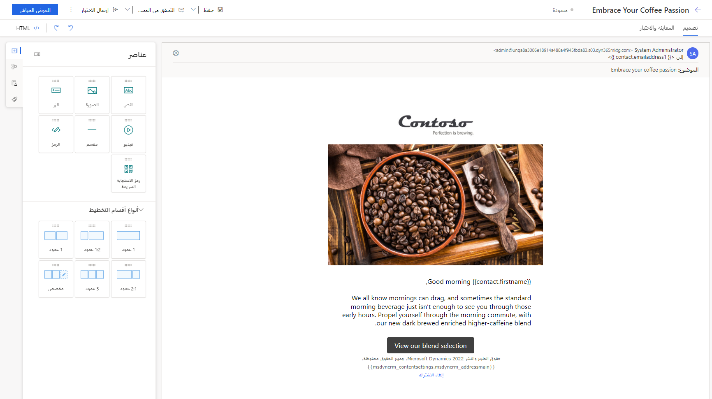

لتطبيق معلومات المعرفية المتعلقة بـ Dynamics 365 Marketing على أرض الواقع، الخاص بك في الاجراء، وفرنا لك سيناريو لمساعدتك على إنشاء وإطلاق رحلة عميل بسيطة. تشتمل أجزاء السيناريو الأربعة على عناصر: إنشاء نماذج جهات اتصال بسيطة، وإنشاء شريحة، وتصميم رسالة بريد الكتروني وإعداد رحلة لإرسالها عبر الرسالة الإلكترونية إلى الشريحة المحددة.

ويتمثل الغرض من إجراء هذا التدريب العملي في تعريفك ببعض ميزات تسويق Dynamics 365 الأساسية.

## الأهداف التعليمية

في نهاية هذه التمارين، ستكون قادراً على:

-   إنشاء جهات اتصال.

-   إنشاء مقطع.

-   إنشاء بريد إلكتروني تسويقي.

-   إنشاء رحلة العميل.

## نظرة عامة

تريد شركة Contoso Coffee استهداف جهات الاتصال التي تعيش في نيويورك بحملة بريد إلكتروني بسيطة.

تتمثل مهمتك الأولى في إنشاء نماذج جهات اتصال. بعد ذلك ستنشئ شريحة عن طريقة استقطاب جهات اتصال محددة من نيويورك، وستنشئ رسالة بريد إلكتروني، ثم ستقوم بإعداد رحلة عميل لإرسالها عبر الرسالة الإلكترونية إلى جهات الاتصال المحددة في الشريحة.

## إنشاء جهات اتصال

1.  افتح تطبيق Dynamics 365 Marketing.

1.  انتقل إلى منطقة عمل **التسويق الصادر**.

1.  انتقل إلى **العملاء > جهات الاتصال**.

1.  من شريط الأوامر، حدد **+ جديد**. 

1.  املأ حقول **الاسم الأول** و **الاسم الأخير** و **عنوان البريد الإلكتروني** باسمك وببريدك الإلكتروني. في الحقل **العنوان 1: الولاية/المقاطعة**، أدخل **نيويورك**. حدد **حفظ وإغلاق**.

1.  أنشئ جهة اتصال ثانية. أدخل بيانات نموذجية للحقول **الاسم الأول** و **الاسم الأخير** و **الرسالة الإلكترونية**. في الحقل **العنوان 1: الولاية/المقاطعة**، أدخل **نيويورك**. حدد **حفظ وإغلاق**. (نقترح استخدام عنوان بريد إلكتروني مختلف لكل جهة اتصال.)

1.  أنشئ جهة اتصال ثالثة. أدخل بيانات نموذجية للحقول **الاسم الأول** و **الاسم الأخير** و **الرسالة الإلكترونية**. في الحقل **العنوان 1: الولاية/المقاطعة**، أدخل **نيويورك**. حدد **حفظ وإغلاق**.

## إنشاء مقطع

1.  افتح تطبيق Dynamics 365 Marketing.

1.  انتقل إلى منطقة عمل التسويق الصادر.

1.  انتقل إلى **العملاء > المقاطع**.

1.  من شريط الأوامر، حدد **+ جديد**.

1.  من شريط الأوامر، حدد **شريحة ديناميكية جديدة**.

1.  عندما يفتح مربع الحوار **قوالب الشرائح**، حدد **تخطي** لإغلاقه وقم بالمتابعة حتى تصل إلى الشاشة **شريحة جديدة**.

1.  اكتب اسماً للشريحة **جهات اتصال نيويورك**.

1.  في علامة التبويب **تعريف**، حدد **إضافة كتلة استعلام** لإنشاء استعلام مقابل كيان جهة الاتصال. يمكنك رؤية الكيان الذي يتم الاستعلام عنه عن طريق الاطلاع على القيمة المعروضة في القائمة المنسدلة الموجودة في أعلى كتلة الاستعلام. ستنشئ كتلة الاستعلام الجديدة افتراضياً استعلاماً بدور جديد يستند إلى "جهة اتصال". لا تشتمل شريحتك حالياً على أي عوامل تصفية (صفوف العبارات)، مما يعني انه سيتم العثور على جميع جهات الاتصال الموجودة في قاعدة بياناتك. ولكنك تريد فقط العثور علي جهات اتصال الاختبار الجديدة التي أنشأتها للتو.

1.  حدد القائمة المنسدلة **تحديد سمة**. 
    
1.  حدد **العنوان : الولاية/المقاطعة**.

1.  تغيير **يتماثل** إلى **يتضمن**.

1.  في الموضع **أدخل النص**، أدخل **نيويورك**.

1.  حدد **حفظ** ثم حدد **التحقق من الأخطاء**. صحح أي أخطاء إذا لزم الأمر.

1.  حدد **البدء الفوري**.

1.  حدد **تحديث**.

1.  يجب أن تظهر لك الآن علامة التبويب **الأعضاء**. تحقق من أن جهات الاتصال التي أنشأتها مدرجة كأعضاء.

    > [!NOTE] 
    > إذا لم تظهر لك علامة التبويب **الأعضاء** حتى الآن، فانتظر حتى يقوم النظام بالتحديث. قد تظهر لك أيضاً جهات اتصال إضافية مدرجة في علامة التبويب هذه وفقاً للبيانات التي تم إعدادها بالفعل في النظام. في حالة عدم ظهور جهات الاتصال الثلاثة التي أنشأتها، قم بالرجوع إلى منطقة **جهات الاتصال** وتحقق من إدراج **نيويورك** في حقل **العنوان 1:الولاية/المقاطعة** بكل جهة اتصال، ثم تحقق مجدداً من أن هذا هو الحقل الذي تم سحبه إلى شريحتك.

## إنشاء رسالة بريد إلكتروني

1.  افتح تطبيق Dynamics 365 Marketing.

1.  انتقل إلى منطقة عمل التسويق الصادر.

1.  انتقل إلى **تنفيذ التسويق > رسائل الرسالة الإلكترونية التسويقية**.

1.  من شريط الأوامر، حدد **+ جديد**.

1.  من معرض القوالب، انقر فوق **تخطي** للبدء من نقطة البداية.

1.  في أعلى اليسار، أدخل **احتضن شغفك بالقهوة** في حقل **الاسم**.

1.  حدد **حفظ**.

1.  في حقل **سطر الموضوع**، أدخل **احتضن شغفك بالقهوة**.

1.  في الحقل **رأس مسبق**، أدخل **ابدأ يومك مع Contoso Coffee**.

1.  قم بتحديث الأنماط العامة للبريد الإلكتروني.

    -   من **مربع الأدوات**، انتقل إلى علامة التبويب **الأنماط العامة**.

    -   قم بتغيير **عائلة الخطوط** إلى **Segoe UI**. 

    -   قم بتغيير **حجم النص الأساسي** إلى **18px**.   

    -   قم بتغيير **حجم النص الأساسي** إلى **#404040**.

1.  قم بتحميل شعار.

    -   من **مربع الأدوات**، حدد علامة التبويب **العناصر**. اسحب وأفلت عنصر **الصورة** في المقطع الأول من المصمم.

    -   على اليمين، انقر فوق **اختيار صورة**، ثم حدد **استعراض المكتبة**.

    -   انقر فوق **+ تحميل**. اسحب صورة نموذج الشعار إلى مربع الحوار **تحميل الملفات** ثم حدد **تحميل**. عند الانتهاء من تحميل الصورة، حدد **تم**. 

    -   حدد الصورة، وانقر فوق **تحديد**.

    -   على الجانب الأيمن، أضف **النص البديل** (للشعار).

    -   في **حقل الارتباط بـ**، حدد **عنوان URL** وأضف ارتباطاً من اختيارك.

    -   قم بتوسيع قسمي **الحجم والمحاذاة** و **التباعد** واستخدم الأدوات المتوفرة لإجراء أي تعديلات إضافية على الشعار (التحجيم والحشو وما إلى ذلك).

1.  إضافة صورة رئيسية.

    -   من **مربع الأدوات**، اسحب وأفلت قسم عمود واحد أسفل القسم الذي يحتوي على صورة الشعار.

    -   حدد **العمود** داخل القسم. قم بتوسيع قسم **التباعد** وقم بتغيير كل التباعد إلى **0px**.

    -   حدد **القسم**. قم بتوسيع قسم **التباعد** وقم بتغيير كل التباعد إلى **0px**.

    -   من **مربع الأدوات**، اسحب وأفلت عنصر **صورة** إلى هذا القسم الجديد.

    -   على اليمين، حدد **اختيار صورة**، ثم حدد **استعراض المكتبة**.

    -   حدد **+ تحميل**. اسحب نموذج صورة رئيسية إلى مربع الحوار **تحميل الملفات** ثم حدد **تحميل**. عند الانتهاء من تحميل الصورة، حدد **تم**.

    -   حدد الصورة، وانقر فوق **تحديد**.

    -   في الجانب الأيمن، أضف **النص البديل**.

1.  أضف نسخة.

    -   من **مربع الأدوات**، اسحب وأفلت قسم عمود واحد أسفل القسم الذي يحتوي على الصورة الرئيسية.

    -   من **مربع الأدوات**، اسحب وأفلت عنصر **النص** أسفل صورة الشعار.

    -   قم بتغيير **التباعد الخارجي** إلى **30px**.

    -   أضف نسخة: 
    
        صباح الخير FirstName،

        نعلم جميعاً أن أوقات الصباح قد تتأخر، وأحياناً لا يكفي مشروب الصباح العادي لرؤيتك خلال تلك الساعات المبكرة. ادفع نفسك خلال فترة التنقل في الصباح، مع مزيجنا الجديد من الكافيين الغني المخصب الداكن.

1.  إضافة محتوى ديناميكي.

    -   في مربع النص، حدد **FirstName**.
    
    -   انقر فوق **إضفاء الطابع الشخصي** في شريط أدوات النص.

    -   في مربع حوار **مساعدة المحتوى**، حدد **المحتوى الديناميكي**، ثم حدد ما يلي:

        -   **تحديد الكيان**: جهة الاتصال
        
        -   **تحديد العلاقة**: لا توجد علاقة

        -   **تحديد الحقل**: الاسم الأول

    -   انقر فوق **إدراج**.

    -   سيتم استبدال FirstName بـ {{contact.firstname}}. عندما يتم إرسال الرسالة الإلكترونية إلى المستلمين المعنيين، سيتم استبدال {{contact.firstname}} بالاسم الأول لجهة الاتصال.

1.  أضف زراً.

    -   من **مربع الأدوات**، اسحب وأفلت عنصر **الزر** أسفل النص.

    -   في حقل **الارتباط بـ**، حدد **عنوان URL** وأضف ارتباطاً من اختيارك.

    -   قم بتغيير **نص الزر** إلى **عرض تحديد المزيج**.

    -   قم بتغيير **الخط** إلى **Segoe UI**.

    -   قم بتغيير **لون الزر** إلى **#404040**.

    -   قم بتوسيع قسمي **الحجم والمحاذاة** و **التباعد** واستخدم الأدوات المتوفرة لإجراء أي تعديلات إضافية على الشعار (التحجيم والحشو وما إلى ذلك).

1.  قم بإجراء أي تغييرات إضافية حسب الطلب.

1.  احفظ تغييراتك.

1.  تحقق من الأخطاء. قم بتصحيح أي أخطاء، إذا لزم الأمر.

1.  انقر فوق **إصدار أولي واختبار**، ثم قم بمعاينة الرسالة الإلكترونية على سطح المكتب والكمبيوتر اللوحي والجهاز المحمول.

1.  حدد **إرسال الاختبار**.

1.  أدخل عنوان البريد الإلكتروني. قم بتغيير **جهة اتصال الاختبار** إلى أي جهة من جهات الاتصال التي أنشأتها سابقاً. 

1.  حدد **إرسال الاختبار**.

1.  انتقل إلى علبة الوارد الخاصة بك. تحقق من استلامك الرسالة الإلكترونية. راجع المحتوى. (قد ينتهي الحال بهذه الرسالة الإلكترونية بوضعها في مجلد البريد العشوائي، لذا احرص على فحص ذلك المجلد أيضاً.)

1.  ارجع إلى Dynamics 365 Marketing وافتح الرسالة الإلكترونية. حدد **العرض المباشر** في شريط الأوامر.

> [!div class="mx-imgBorder"]
> 

## إنشاء رحلة العميل

1.  افتح تطبيق Dynamics 365 Marketing.

1.  انتقل إلى منطقة عمل التسويق الصادر.

1.  انتقل إلى **تنفيذ التسويق > رحلة العميل**.

1.  من شريط الأوامر، حدد **+ جديد**. 

1.  من معرض القوالب، حدد **رحلة الرسالة الإلكترونية البسيطة**.

1.  انقر فوق **تحديد**.

1.  في قسم الرأس، انقر فوق سهم القائمة المنسدلة لعرض التفاصيل المتعلقة بالرحلة وتعديلها. قم بتحديث المعلومات التالية:

       -   **الاسم** - رحلة التنشئة

       -   **تاريخ البدء** - حدد اليوم بعد 15 دقيقة من الآن

       -   **متكرر** - لا
       
1.  احفظ تغييراتك.

1.  حدد جمهور الرحلة.

    -   تمت بالفعل إضافة إطار متجانب لجمهور من القالب. حدد **تعيين جمهور**. 

    -   سيظهر جزء الخصائص **الجمهور** في الجانب الأيسر من الصفحة.

    -   في حقل البحث **المقطع**، ابحث عن الشريحة التي أنشأتها سابقاً؛ **جهات اتصال نيويورك**. تذكر أن هذه الشريحة يجب أن تكون بالحالة المباشرة لتظهر في البحث، لذا إذا لم تظهر لك شريحتك، فقد يتعين عليك الرجوع إلى منطقة الشرائح ونشر الشريحة.

    -   بعد تحديد شريحتك، سيمتلئ الإطار المتجانب الأول باسم الشريحة وسيعرض جزء **الجمهور** خصائص الشريحة، مثل عدد المحتوى.
                
1.  أضف الرسالة الإلكترونية التي سيتم إرسالها خلال الرحلة.

    -   تمت بالفعل إضافة الإطار المتجانب **اختيار رسالة إلكترونية** من القالب. 
        حددها.

    -   في حقل **البحث عن الرسالة الإلكترونية**، ابحث عن الرسالة الإلكترونية التي أنشأتها سابقاً.
        
    -   بعد تحديد الرسالة الإلكترونية، يتم ملء الإطار المتجانب الرسالة الإلكترونية باسم الرسالة الإلكترونية ويعرض جزء **إرسال رسالة إلكترونية** خصائص الرسالة الإلكترونية.

1.  انتقل إلى علامة التبويب **عام**.

    -   تأكد من تعيين **الهدف** على **جهة الاتصال**.

    -   قم بتغيير **تاريخ الانتهاء** إلى يومين من اليوم.

    -   قم بالتغيير إلى **المنطقة الزمنية** المحلية الخاصة بك.

1.  حدد **حفظ**.

1.  حدد **تحقق من وجود أخطاء** وقم بتصحيحها إذا لزم الأمر.

1.  حدد **البدء الفوري**.

1.  عند حلول تاريخ/وقت البدء الخاص بالرحلة، ستتلقى الرسالة الإلكترونية. انتقل إلى علبة الوارد الخاصة بك وافتح الرسالة الإلكترونية. 
    (قد ينتهي الحال بهذه الرسالة بوضعها في مجلد الرسالة الإلكترونية العشوائي، لذا احرص على التحقق من ذلك المجلد أيضاً). انقر فوق بضع ارتباطات داخل الرسالة الإلكترونية.

1.  عُد إلى Dynamics 365 Marketing، وافتح رحلة العميل الخاصة بك.

1.  انقر فوق التجانب **الجمهور**. مراجعة مؤشرات الأداء الأساسية على الجانب الأيمن.

1.  انقر فوق التجانب **الرسالة الإلكترونية**. مراجعة مؤشرات الأداء الأساسية على الجانب الأيمن.

1.  انقر فوق اسم الرسالة الإلكترونية لفتح الرسالة الإلكترونية. انتقل إلى علامة التبويب **الرؤى**. راجع الرؤى المختلفة الناشئة من رسالتك الإلكترونية.
