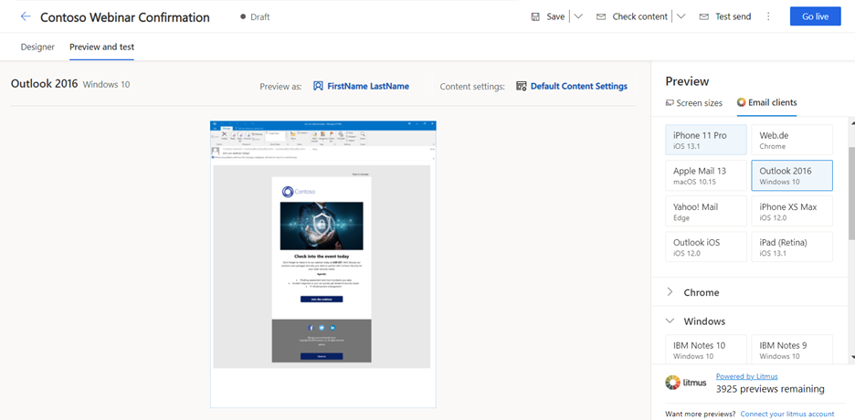

يُعدّ البريد الإلكتروني قناة تسويق مهمة لمعظم المؤسسات الحديثة، كما أنه ميزة أساسية في تطبيق Dynamics 365 Marketing. يمكن لتطبيق Dynamics 365 Marketing إرسال أعداد كبيرة من رسائل البريد الإلكتروني التسويقي المخصصة ومراقبة كيفية تفاعل كل مستلم معها ودفع التنفيذ التلقائي لرحلات العميل استنادًا إلى هذه التفاعلات وعرض النتائج لجهات الاتصال الفردية والتحليلات الإحصائية المجمعة. يتم تنفيذ رسائل البريد الإلكتروني في تطبيق Dynamics 365 Marketing من خلال رحلات العميل.

للوصول إلى رسائل البريد الإلكتروني التسويقي، انتقل إلى **التسويق > تنفيذ التسويق > ‬‏‫رسائل البريد الإلكتروني التسويقي**. 

> [!IMPORTANT] 
> تعتبر إمكانية التسليم من أهم مقاييس الأداء المتعلقة بالتسويق عبر البريد الإلكتروني، والتي تقيس إمكانية وصول رسائلك إلى عُلب البريد الوارد للمستلمين بدلاً من تصنيفها كبريد عشوائي وتصفيتها بعيدًا عن الأنظار. تُكرّس Microsoft جهودها لمساعدة عملاء Dynamics 365 for Marketing على تحقيق أقصى قدر من إمكانية التسليم. يمكنك مراجعة المستند [Dynamics 365 for Marketing: إعداد DKIM لمجال الإرسال لديك لمواكبة التغييرات الأخيرة في Microsoft 365](https://blogs.msdn.microsoft.com/crm/2018/11/05/dynamics-365-for-marketing-set-up-dkim-for-your-sending-domain-to-keep-up-with-recent-office-365-changes/?azure-portal=true) لمعرفة المزيد.

لمعرفة مزيد من المعلومات حول التسويق عبر البريد الإلكتروني، راجع [نظرة عامة على التسويق عبر البريد الإلكتروني](/dynamics365/marketing/prepare-marketing-emails?azure-portal=true)

## تصميم بريد إلكتروني تسويقي

لعرض بريد إلكتروني تسويقي جديد أو تحريره أو حذفه أو إنشائه، انتقل إلى **التسويق > تنفيذ التسويق > رسائل البريد الإلكتروني التسويقي**.

1.  لإنشاء بريد إلكتروني تسويقي جديد، حدد **+ جديد** ‬‏‫في شريط الأوامر‬‏‫.

1.  يمكنك تحديد قالب أو حدد **تخطي** للبدء من الصفر. 

      -   في Dynamics 365 Marketing، يمكنك اختيار قالب من مجموعة نماذج قوالب أو إنشاء القوالب الخاصة بك. إذا حددت البدء من قالب، فسيتم إنشاء تخطيط البريد الإلكتروني ونموذج المحتوى لك.

      > [!NOTE] 
      > عندما تُنشئ رسالة جديدة من قالب، يتم نسخ محتوى القالب إلى رسالتك الجديدة. ليس ثمة ارتباط بين الرسالة والقالب، لذا، يمكنك تحرير الرسالة ولن يتغير القالب؛ وبالمثل، لا تؤثر أي تغييرات مستقبلية تجريها على القالب على أي رسائل موجودة تم إنشاؤها باستخدامه. لمزيد من المعلومات، راجع [العمل مع البريد الإلكتروني والصفحة وقوالب النموذج](/dynamics365/marketing/email-templates?azure-portal=true)

      - عند البدء من الصفر، يجب وضع جميع عناصر التصميم (غير عناصر القسم) في عنصر القسم. تتوفر عناصر القسم في لوحة **مربع الأدوات** ضمن نوع **قسم التخطيط**. توفر القوالب الفارغة قسمًا يحتوي على عمود واحد بشكل افتراضي، ولكن يمكنك تحرير تخطيط العمود و/أو إضافة المزيد من عناصر القسم حسب الحاجة.

      - عند إضافة عنصر قسم جديد، سيكون لديك مجموعة متنوعة من التخطيطات للاختيار من بينها. ومع ذلك، بعد وضع العنصر لديك، يمكنك تغيير تخطيط العمود و/أو خيارات التصميم.

    -   لمزيد من المعلومات، راجع [إضافة عناصر القسم لتخطيط التصميم](/dynamics365/marketing/design-digital-content?azure-portal=true#add-section-elements-to-layout-your-design).

1.  تصميم البريد الإلكتروني.

    -   يمكنك إضافة العناصر النصية والرسومية المختلفة التي يتطلبها بريدك الإلكتروني وتكوينها وترتيبها. 

    -   اسحب عناصر التصميم من **مربع الأدوات** إلى اللوحة أو حدد عنصر تصميم موجود بالفعل في تصميمك.

        -   حال إضافتك للعناصر، يمكنك استخدام شريط الأدوات المنبثق في اللوحة لتعديلها. تختلف الأدوات التي يعرضها شريط الأدوات المنبثق حسب نوع عنصر التصميم الذي حددته. يشتمل شريط الأدوات على أوامر لنقل العنصر المحدد أو نسخه أو حذفه. بالنسبة لعناصر النص، يوفر شريط الأدوات أوامر لتطبيق تنسيق النص الأساسي بالشكل الذي ترغبه في Microsoft Word.

        -   يمكنك أيضًا تحديد عنصر ثم استخدام خيارات **التحرير**  الموجودة في اليسار لتخصيصه.

    -   إذا كنت تفضل استخدام تعليمات HTML البرمجية مباشرةً، فحدد أيقونة **</>** في أعلى يسار الصفحة. ويمكنك إجراء ذلك لتحسين بعض الخصائص التي يتعذّر الوصول إليها باستخدام المحرر الرسومي، أو يمكنك لصق تعليمات HTML البرمجية التي قمت بإنشائها باستخدام برنامج آخر. يمكنك أيضاً إضافة نصوص متقدمة وتصميمات لتقديم وظيفة جديدة.

        > [!NOTE] 
        > يطبّق Marketing بعض التغييرات على HTML للبريد الإلكتروني (تظهر في علامة التبويب **HTML** ضمن **إخراج HTML**) لضمان عرض البريد الإلكتروني بشكل صحيح عبر موفري البريد الإلكتروني (بما في ذلك Outlook) وعبر الأجهزة. في بعض الحالات، قد ترغب في إنشاء رسائل البريد الإلكتروني التسويقي باستخدام قوالب بريد إلكتروني معدّة مسبقًا. لاستخدام قوالب البريد المعدّة مسبقًا، يمكنك ببساطة لصق HTML في علامة تبويب **HTML**. وقد تحتاج أيضًا إلى تطبيق التعديلات الخاصة بموفر البريد الإلكتروني. في هذه الحالة، يمكنك تمكين تبديل المستوى لكل بريد إلكتروني لمنع التعديل التلقائي غير المضمن لـ HTML للبريد الإلكتروني. يُرجى ملاحظة أنك ستتطلب من المسؤول لديك تشغيل الميزة لوظيفة **تبديل المعالجة اللاحقة‬** قبل أن تتمكن من الوصول إليها في مصمم البريد الإلكتروني. لمزيد من المعلومات، راجع [تعطيل التعديل التلقائي لـ HTML لجميع الموفرين](/dynamics365/marketing/email-postprocessing?azure-portal=true). 
    
    -   لإضافة نمط ينطبق على البريد الإلكتروني بالكامل، انقر فوق أي مكان على الحواف الخارجية للبريد الإلكتروني لعرض مربع الأدوات، ثم حدد علامة التبويب **أنماط عامة**. سيعرض هذا خيارات مثل مجموعة الخطوط وحجم النص ولون النص ولون الخلفية التي ستنطبق على البريد الإلكتروني بأكمله. 

    -   للحصول على مزيد من المعلومات، راجع [‏‫إنشاء بريد إلكتروني جديد وتصميم محتواه](/dynamics365/marketing/email-design#create-a-new-email-marketing-message?azure-portal=true) و[تصميم المحتوى](/dynamics365/marketing/email-design/?azure-portal=true#design-your-content).

    > [!NOTE] 
    > يدعم Microsoft Outlook التخصيصات المحلية والمكونات الإضافية التي قد تؤثر على طريقة عرض الرسائل. في بعض الحالات، قد يرى المستلمون الذين يستخدمون تثبيتات Outlook المخصصة تخطيطات فردية أو عناصر صفحة متكررة عند عرض الصفحات المصممة في Dynamics 365 Marketing. ولا يمكن للمصمم محاكاة هذه التأثيرات. وإذا لزم الأمر، يمكنك استخدام **إرسال رسالة اختبار** لمعرفة كيفية ظهور تصميماتك في تكوينات Outlook معيّنة.

1.  إضافة محتوى ديناميكي إلى رسائل البريد الإلكتروني.

    -   يساعدك الزر  **تخصيص** **{ }** في إنشاء تعبيرات ديناميكية صالحة لوضع قيم الحقول من سجلات جهات اتصال المستلمين وإعدادات محتوى الرسائل وقيم قواعد البيانات الأخرى.

    -   ضع المؤشر في الحقل أو عنصر النص الذي تريد إدراج نص ديناميكي فيه، ثم حدد **{ } تخصيص**. 
        عندئذٍ يفتح مربع الحوار مساعدة المحتوى. اتبع المطالبات لإضافة المحتوى الديناميكي المطلوب إلى البريد الإلكتروني. 

        > [!div class="mx-imgBorder"]
        > 

    -   يتم حل المحتوى الديناميكي تمامًا قبل إرسال الرسالة إلى شخص محدد. سوف تستخدم عادةً المحتوى الديناميكي لدمج معلومات من سجل جهة اتصال المستلم (مثل الاسم الأول والأخير) لوضع ارتباطات خاصة ووضع معلومات وارتباطات من إعدادات المحتوى.

    -   لمزيد من المعلومات، راجع [إضافة محتوى ديناميكي إلى رسائل البريد الإلكتروني](/dynamics365/marketing/dynamic-email-content/?azure-portal=true) و[استخدام مساعدة التحرير لوضع قيم حقول ديناميكية](/dynamics365/marketing/dynamic-email-content?azure-portal=true#assist-edit).

1.  إضافة ارتباطات قياسية ومطلوبة ومتخصصة إلى رسالتك.

    -   **الرسائل التسويقية** - يتم تسليمها بتنسيق HTML، وبالتالي تدعم الارتباطات التشعبية. توفر بعض أنواع الارتباطات إمكانية الوصول إلى ميزات خاصة يستضيفها Dynamics 365 Marketing، في حين قد تكون أنواع أخرى ببساطة ارتباطات قياسية للمحتوى في أي مكان على الويب. 

    -   يمكن ربط **ارتباطات النص/الزر/الصورة** بما يلي:

        -   أي **عنوان URL** أو سجلات Dynamics 365 مثل **الأحداث** أو **عمليات تسجيل الدخول إلى Teams** أو **صفحات التسويق** أو **‏‫الاستطلاعات**. 
            لإضافة عنوان URL إلى نص، حدد النص ثم انقر فوق أيقونة **الارتباط** في شريط الأدوات. انسخ عنوان URL والصقه. 
            لإضافة عنوان URL إلى صورة أو زر، حدد العنصر ثم استخدم الميزات الموجودة في القائمة **تحرير** في اليسار لتحديد وجهة الارتباط. 

        -   **مركز الاشتراك**، الذي يعدّ ضروريًا لجميع رسائل البريد الإلكتروني التجارية. يمكنك إضافة هذا الارتباط من خلال تمييز نص الارتباط وتحديد **ارتباط** في شريط أدوات النص. انقر فوق أيقونة **</> مساعدة التحرير** لفتح مربع الحوار مساعدة المحتوى. حدد محتوى ديناميكي > ContentSettings > بلا علاقة > SubscriptionCenter، ثم حدد **إدراج**.

        -   **إعادة التوجيه إلى صديق**. يفتح هذا النوع من الارتباط نموذجًا يمكن لجهات الاتصال استخدامه لإعادة توجيه بريد إلكتروني تسويقي إلى أصدقائها أو زملائها عن طريق إدخال عناوين البريد الإلكتروني للمستلمين. ‏‫من الأفضل تضمين هذا النوع من الخدمة لجهات اتصالك لأن الرسائل المُعاد توجيهها باستخدام نموذج إعادة التوجيه يتم حسابها بشكل صحيح في نتائج بريدك الإلكتروني وتحليلاته. يمكنك إضافة هذا الارتباط من خلال تمييز نص الارتباط وتحديد **ارتباط** في شريط أدوات النص. انقر فوق أيقونة **</> مساعدة التحرير** لفتح مربع الحوار مساعدة المحتوى. حدد محتوى ديناميكي > ContentSettings > بلا علاقة > ForwardToAFriend، ثم حدد **إدراج**.

        -   **عرض كصفحه ويب**. يفتح هذا الارتباط البريد الإلكتروني في مستعرض ويب.‬ يمكنك إضافة هذا الارتباط من خلال تمييز نص الارتباط وتحديد **ارتباط** في شريط أدوات النص. انقر فوق أيقونة **</> مساعدة التحرير** لفتح مربع الحوار مساعدة المحتوى. حدد محتوى ديناميكي > رسالة > بلا علاقة > ViewAsWepageURL، ثم حدد **إدراج**.

    -   لمعرفة مزيد من المعلومات، راجع [إضافة ارتباطات قياسية ومطلوبة ومتخصصة إلى رسالتك](/dynamics365/marketing/email-design?azure-portal=true#add-standard-required-and-specialized-links-to-your-message).

1.  مراجعة المحتوى المطلوب.

    -   يجب أن يتضمن نص جميع رسائل البريد الإلكتروني التجارية ارتباطًا لمركز الاشتراك والعنوان الفعلي لمؤسستك. ولن يسمح لك Dynamics 365 for Marketing بنشر أي بريد إلكتروني تسويقي دونهما.

    -   عند استخدام قالب بريد إلكتروني جاهز، سيتم تضمين هذه السمات بالفعل في تذييل البريد الإلكتروني لديك. ويتم تحديد هذه السمات الديناميكية في سجلات إعدادات المحتوى لديك. ‏‫المحتوى الديناميكي هو محتوى يتم حله تمامًا قبل إرسال الرسالة. يتم تحديد إعدادات المحتوى في رحلات العميل، وليس في رسائل البريد الإلكتروني. ستظهر هذه الإعدادات في بريدك الإلكتروني بطريقة مشابهة للمثال التالي:

    

    -   إذا كنت تُنشئ بريدك الإلكتروني من قالب فارغ، فإنه سيتعيّن تضمين القيم الديناميكية لإعداد المحتوى لديك، بما في ذلك العنوان الفعلي ومركز الاشتراك. لمزيد من المعلومات، راجع [استخدام مساعدة التحرير لوضع قيم حقول ديناميكية](/dynamics365/marketing/dynamic-email-content?azure-portal=true#assist-edit).

1.  تحديث الإعدادات الإضافية.

    -   في الجانب الأيمن أعلى المصمم، يمكنك إدخال **اسم** وصفي لبريدك الإلكتروني. ويُستخدَم هذا لتحديد البريد الإلكتروني في طرق عرض القوائم وخلال رحلات العميل. 
    
    -   حدد **رأس البريد الإلكتروني** (قسم في البريد الإلكتروني يتضمن عنوان المرسل والموضوع وتحديث بعض الإعدادات الأساسية، وتشمل ما يلي:

        -   **الموضوع** - إدخال موضوع. يعتبر واجهة مهمة للغاية في البريد الإلكتروني؛ لأنه أول شيء سيراه المستلمون عند تلقيهم البريد الإلكتروني.

        -   **رأس مسبق** - يظهر بجانب سطر الموضوع أو أسفله في علبة الوارد لدى المستلم. يُتيح لك الرأس المسبق إنشاء نص مخصص يتم عرضه في علبة الوارد الخاصة بالمستلم قبل فتح رسالة البريد الإلكتروني.

    -   إن منطقة إعدادات الإرسال بقسم رأس البريد الإلكتروني توجد أيضًا في رأس البريد الإلكتروني للمنطقة ويجب أن تعرض القيم الافتراضية التي يتعين أن تكون مناسبة في معظم الحالات. 
        تتضمن هذه الإعدادات:

        -   **اسم المرسل**: الاسم الموضح للمستلمين أنه الشخص الذي أرسل البريد الإلكتروني. بشكل افتراضي، يُمثِّل هذا الإعداد اسم المستخدم الذي أنشأ البريد الإلكتروني. يمكنك تحرير هذا الإعداد لاستخدام قيمة ثابتة أو تحديد الزر **{ } تخصيص** لتحديد قيمة ديناميكية بديلة.

        -   **عنوان مرسل**: عنوان البريد الإلكتروني الموضح للمستلمين على أنه عنوان الشخص الذي أرسل البريد الإلكتروني. بشكل افتراضي، يُمثِّل هذا الإعداد عنوان البريد الإلكتروني للمستخدم الذي أنشأ الرسالة. يمكنك تحرير هذا الإعداد لاستخدام قيمة ثابتة أو تحديد أيقونة **{ } تخصيص** لتحديد قيمة ديناميكية بديلة.

        -   **الرد علي البريد الإلكتروني** - عنوان البريد الإلكتروني الذي ترسل إليه رسائل الرد عندما تريد نقل الرسائل إلى عنوان بريد إلكتروني مختلف عن عنوان المرسل.

    -   **إعدادات البريد الإلكتروني** - تشمل هذه المنطقة ما يلي:

        -   **قالب البريد الإلكتروني** - يعرض اسم القالب الذي حددته عند إنشاء البريد الإلكتروني. يمكنك تغيير القالب من خلال تحديد اسم القالب.

            > [!IMPORTANT]
            > في حالة تغيير القالب، لن يتم الاحتفاظ بمحتوى بريدك الإلكتروني الحالي (بصرف النظر عن رأس البريد الإلكتروني).

        -   **نوع البريد الإلكتروني** - يؤثر هذا الحقل على المتطلبات المتعلقة بما يجب أن (ويجب ألا) تحتوي عليه الرسالة، وقد يكون إما تجاريًا أو معاملات.

        -   **نوع المحتوى** - قد يكون إما بريدًا إلكترونيًا عاديًا (نوع محتوى افتراضي)، أو طلب تأكيد لسيناريوهات الاشتراك المزدوج.

        -   **اللغة** - لغة بريدك الإلكتروني.

    -   **نص عادي** – تشمل الإعدادات ما يلي:

        -   **إنشاء نص عادي تلقائياً** - يتم تعيين هذا الخيار إلى **نعم** افتراضيًا. ومع ذلك، يمكنك تعيينه إلى **لا** وتوفير إصدار نص عادي خاص بك للبريد الإلكتروني.

        -   **معاينة نص عادي** - يعرض هذا الحقل معاينة إصدار النص العادي للبريد الإلكتروني.

        -   لمعرفة مزيد من المعلومات، راجع [إجراء الإعدادات الأساسية والمطلوبة](/dynamics365/marketing/email-design?azure-portal=true#make-basic-and-required-settings).

1.  احفظ تغييراتك.

> [!IMPORTANT] 
> تعتبر مصادقة المجال باستخدام DKIM جانبًا متزايد الأهمية للتأكد من وصول رسائلك إلى علب الوارد الخاصة بالمستلمين بدلاً من تصفيتها كبريد غير هام. يساعد DKIM في إثبات أن الرسائل التي تدعي أنها صادرة من مؤسستك قد وردت منها بالفعل. ويتطلب ذلك أن يستخدم حقل **عنوان المرسل** لكل رسالة ترسلها مجالاً قمت بمصادقته باستخدام DKIM (تستخدم عناوين البريد الإلكتروني النموذج *account-name@domain-name*). على نحوٍ افتراضي، تتوفر جميع عمليات تثبيت Dynamics 365 Marketing الجديدة مع مجال إرسال تمت مصادقته مسبقًا ينتهي بـ \-dyn365mktg.com\. ربما قمت أيضًا بمصادقة مجال واحد أو أكثر من مجالات الإرسال الخاصة بك (التي نوصي بها بشدة).
>
> عندما تُنشئ بريدًا إلكترونيًا جديدًا، يتم تعيين حقل **عنوان مرسل** تلقائياً إلى عنوان البريد الإلكتروني المسجّل لحساب مستخدم Dynamics 365 Marketing. ومع ذلك، ففي حالة استخدام عنوان البريد الإلكتروني مجال لم تتم مصادقته بعد باستخدام DKIM، سيتم تعديل **عنوان المرسل** الأولي لاستخدام مجال تمت مصادقته. سيظل **عنوان المرسل** الناتج يعرض *اسم حساب*  المستخدم الذي أنشأ الرسالة، ولكنه سيعرض الآن *اسم المجال* الذي تمت مصادقته باستخدام DKIM والمُسجّل لمثيل Marketing، (على سبيل المثال، \MyName\@contoso-dyn365mktg.com\)، وسوف يوفر ميزة إمكانية التسليم، ولكن ربما لا يكون عنوان المرسل صالحًا.
> يمكنك التحكم في هذا الإعداد من خلال تحرير **عنوان المرسل** بعد إنشاء الرسالة، ولكن قد يؤدي ذلك إلى انخفاض إمكانية تسليمها. إذا كنت تريد إرسال رسائل تعرض عنوان بريدك الإلكتروني الحقيقي كعنوان مرسل، فإننا نوصي بشدة بأن تطلب من المسؤول مصادقة مجال عنوان بريدك الإلكتروني (إذا لم تتم مصادقته من قبل). لمزيد من المعلومات، راجع [مصادقة المجالات](/dynamics365/marketing/mkt-settings-authenticate-domains/?azure-portal=true).

لمعرفة مزيد من المعلومات، راجع [إنشاء بريد إلكتروني جديد وتصميم محتواه](/dynamics365/marketing/email-design#create-a-new-email-marketing-message?azure-portal=true).

## اعتبارات مهمة عند تصميم رسائل البريد الإلكتروني

عند تصميم محتوى البريد الإلكتروني، يجب أن تحرص دائمًا على تقليل حجم رسائلك قدر الإمكان. عندما يتعلق الأمر بمحتوى النصوص والتعليمات البرمجية (لا يشمل محتوى الصور المشار إليه)، نوصيك بأن يكون حجم ملفاتك أقل من 100 كيلوبايت دائمًا للأسباب التالية:

-   يتم غالبًا تصنيف رسائل البريد الإلكتروني التي يزيد حجمها عن 100 كيلوبايت كبريد عشوائي من خلال عوامل تصفية البريد العشوائي.

-   يقتطع Gmail الرسائل بعد أول 102 كيلوبايت من النص المصدر والترميز.

-   يتعذّر تسليم رسائل البريد الإلكتروني التي يزيد حجمها عن 128 كيلوبايت من خلال رحلة العميل (سوف تفشل الرحلة في التحقق من الأخطاء إذا كانت تتضمن رسائل حجمها أكثر من 128 كيلو بايت).

-   يستغرق تحميل رسائل البريد الإلكتروني الكبيرة وقتًا أطول، مما قد يُزعج المستلمين.

يسمح بريد HTML القياسي للرسائل أن تتضمن كل من إصدار HTML وإصدار النص العادي للمحتوى الخاص بك. يتمثّل الغرض من إصدار النص العادي في السماح لرسائلك أن تكون واضحة عند عرضها من خلال عملاء البريد الإلكتروني الذين لا يدعمون HTML (أو تم إيقاف تشغيل HTML لديهم).
لمزيد من المعلومات حول معرفة لماذا تتطلب رسائل البريد الإلكتروني إصدار نص للبريد الإلكتروني والخطوات المتضمنة لفحص إصدار النص لبريدك الإلكتروني وتحريره، راجع [فحص إصدار النص فقط لرسالتك وتحريرها](/dynamics365/marketing/email-design?azure-portal=true#inspect-and-edit-the-text-only-version-of-your-message).

يدعم Microsoft Outlook التخصيصات المحلية والمكونات الإضافية التي قد تؤثر على طريقة عرض الرسائل. في بعض الحالات، قد يرى المستلمون الذين يستخدمون تثبيتات Outlook المخصصة تخطيطات فردية أو عناصر صفحة متكررة عند عرض الصفحات المصممة في Dynamics 365 Marketing. ولا يمكن للمصمم محاكاة هذه التأثيرات. وإذا لزم الأمر، يمكنك استخدام **إرسال رسالة اختبار** لمعرفة كيفية ظهور تصميماتك في تكوينات Outlook معيّنة.

## مدقق الوصول إلى البريد الإلكتروني

يوفر Dynamics 365 Marketing ‏‫مدقق الوصول لمساعدتك في جعل المحتوى سهل القراءة بالنسبة لجميع الأشخاص بمختلف قدراتهم. يمكنك بفضل هذه الميزة التحقق من إمكانية الوصول إلى رسائل بريدك الإلكتروني التي تم إنشاؤها باستخدام مصمم المحتوى المتوفر في Marketing والحصول على إرشادات حول الإصلاحات المقترحة. كما تساعدك هذه الميزة في استكشاف أي من مشاكل إمكانية الوصول التي تم العثور عليها للحصول على مساعدة بشأن كيفية إصلاح المشكلة المحددة.

> [!div class="mx-imgBorder"]
> 

للحصول على مزيد من المعلومات، راجع [‏‫مدقق الوصول إلى البريد الإلكتروني‬](/dynamics365/marketing/email-accessibility?azure-portal=true).

> [!Note] 
> ستتطلّب من المسؤول لديك تشغيل الميزة لوظيفة **مدقق الوصول‬‬** قبل أن تتمكّن من الوصول إليها في مصمم البريد الإلكتروني.

## معاينة بريد إلكتروني تسويقي

سيشاهد العديد من العملاء المحتملين رسائل البريد الإلكتروني التسويقي الخاصة بك، لذلك يجب التأكد من أنها تبدو أكثر مهنية واحترافية. يوفر Dynamics 365 Marketing العديد من الأدوات التي تساعدك في اختبار تصميمك وتقييمه على مجموعة متنوعة من الأجهزة وعملاء البريد الإلكتروني.

> [!IMPORTANT] 
> تُتيح لك المعاينات وإرسال رسائل الاختبار طريقة سريعة وملائمة لاختبار تصميمك. ومع ذلك، لا تعمل جميع الميزات مع المعاينات وإرسال رسائل الاختبار. تُطبق القيود التالية:
> - [تكرار لكل](/dynamics365/marketing/dynamic-email-content?azure-portal=true#for-each) لا يعرض.
> - ستفتح [ارتباطات مركز الاشتراك](/dynamics365/marketing/set-up-subscription-center?azure-portal=true#test-sub-center) صفحة مركز الاشتراك ولكنها لن تعمل.
> - لا يمكنك اختبار إرسال رسائل طلب التأكيد. 
>
> لاختبار هذه الميزات، يمكنك إنشاء رحلة عميل بسيطة تستهدف شريحة صغيرة (مثل تلك التي تتضمن جهة اتصال واحدة مع عنوان بريدك الإلكتروني) وتُرسل الرسالة التي تريد اختبارها.

يوفر مصمم المحتوى نوعين من المعاينات لرسائل البريد لإلكتروني التسويقي: أساسية وعلبة الوارد.

### المعاينة

انتقل إلى علامة تبويب **المصمم > معاينة واختبار** للاطلاع على معاينة في المستعرض التي تُحاكي كيفية عرض رسالتك عادةً على عوامل تصميم مختلفة (جهاز مكتبي أو لوحي أو هاتف)، والاتجاه (عمودي أو أفقي).

استخدم القوائم المنسدلة التالية الموجودة أعلى علامة التبويب **معاينة واختبار** لاختبار تأثيرات المحتوى الديناميكي والمنطق لديك:

-   **جهة اتصال** - حدد سجل جهة اتصال ممثل لتوفير قيم الحقول. سوف يتم عرض قيم الحقول من جهة اتصالك المحددة، وغيرها من المحتوي الديناميكي الذي يتفاعل مع هذه القيم، في المعاينة.

-   **إعدادات المحتوى**: تنشئ هذه الإعدادات سياقًا تسويقيًا لرسائلك، وقد تؤثر القيم المخزنة في هذه القائمة على محتوى رسالتك. تتضمن إعدادات المحتوى أيضًا معلومات حول مؤسستك، وتشمل عنوان الرمز البريدي ومُعرّف صفحة مركز الاشتراك في Dynamics 365 Marketing. في الإعداد الأساسي، قد تكون لديك مجموعة واحدة فقط من إعدادات المحتوى لمؤسستك بأكملها. ‏‫ولكن، في التكوينات الأكثر تقدمًا، يمكنك إعادة استخدام رسالة بريد إلكتروني تسويقي واحدة بعدة سياقات مختلفة (مثل للمنتجات المختلفة أو الأحداث المختلفة). ومن ثمّ، قد تختلف إعدادات المحتوى لكل رحلة عميل عندما تستخدم الرسالة.‬ لمزيد من المعلومات، راجع [‬‏‫استخدم إعدادات المحتوى لإعداد مستودعات القيم القياسية والمطلوبة لرسائل البريد الإلكتروني‬‏‫](/dynamics365/marketing/dynamic-email-content?azure-portal=true#content-settings).

    

لمزيد من المعلومات، راجع [‏‫استخدام ميزة المعاينة الأساسية](/dynamics365/marketing/email-preview?azure-portal=true#use-the-basic-preview-feature).

### عملاء البريد الإلكتروني

انتقل إلى **المصمم > معاينة واختبار، وفي خصائص **المعاينة**، قم بالتبديل إلى علامة تبويب **‏‫عملاء البريد الإلكتروني** لمشاهدة معاينات علبة الوارد الفعلية التي تعرض تصميمك بالضبط كما سوف يظهر في مجموعة كبيرة من عملاء البريد الإلكتروني والأنظمة الأساسية المستهدفة.

تتوفر معاينة **عملاء البريد الإلكتروني** من خلال شريك Microsoft partner وهو شركة Litmus Software, Inc. ([litmus.com](https://litmus.com/?azure-portal=true)). يتضمن ترخيص Dynamics 365 Marketing عددًا محدودًا من المعاينات كل شهر، وتتشارك المؤسسة بأكملها في هذه الحصة النسبية. يجب تمكين Litmus لمثيلك قبل استخدامه. لمزيد من المعلومات، راجع [تكوين إعدادات التسويق الافتراضية](/dynamics365/marketing/mkt-settings-default-marketing/?azure-portal=true).

تعرض علامة تبويب **عملاء البريد الإلكتروني‬** قائمة المعاينات المتوفرة، كل منها مسمى باسم نظام أساسي لوجهة مختلفة أو عميل بريد إلكتروني. تُصنَّف علامة التبويب هذه إلى أقسام مختلفة بما في ذلك المعاينات الأكثر شيوعًا ومعاينات Chrome وWindows وغير ذلك.‬ حدد أحد خيارات البريد الإلكتروني المتاحة لإنشاء تلك المعاينة. في كل مرة تقوم فيها بعرض معاينة، ستتلقى رسالة تخبرك أن المعاينة ستستهلك أحد أرصدة Litmus لديك. سيتعيّن عليك تحديد **متابعة** قبل إنشاء المعاينة. سوف تستخدم معاينة واحدة إما من حصة مؤسستك أو حصتك الشخصية. تظل المعاينة المعروضة متاحة للعرض حتى تقوم بتغيير التصميم أو إعدادات **خصائص** (نص ديناميكي)، وفي هذا الوقت لن تعد جميع المعاينات الموجودة صالحة.

لمزيد من المعلومات، راجع [‬‏‫التحقق من العمل باستخدام المعاينات وإرسال رسالة اختبار‬‏‫.](/dynamics365/marketing/email-preview?azure-portal=true).

### التحقق من مخاطر البريد العشوائي في محتوى البريد الإلكتروني

عند معاينة بريدك الإلكتروني، قد ترغب أيضًا في التحقق من مدى احتمالية تصنيف رسالتك كبريد عشوائي. تطبِّق ميزة مدقق البريد العشوائي الذكاء الاصطناعي لتحليل محتوى كل رسالة بريد إلكتروني تسويقي. وبعد ذلك يُنشئ مدقق البريد العشوائي نطاقًا يتنبأ بمدى احتمالية وضع علامة على الرسالة وتصنيفها حسب عوامل تصفية البريد العشوائي المستندة إلى المحتوى.

يجب على المسؤول تمكين مدقق البريد العشوائي وتكوينه حتى يمكنك استخدامه. إذا لم تشاهد الميزات الموضحة في هذا الموضوع، فيُرجى مطالبة المسؤول لديك بتمكين مدقق البريد العشوائي لموقعك. لمزيد من المعلومات، راجع [تمكين ميزات الذكاء الاصطناعي وتكوينها](/dynamics365/marketing/admin-machine-learning?azure-portal=true).

ثمة طريقتان لعرض مخاطر البريد العشوائي:

-   **تلقائياً** - يتم إجراء عملية تدقيق البريد العشوائي دائمًا باعتبارها جزءًا من عمليات **‏‫التحقق من المحتوى‬** و **العرض المباشر** القياسية. وتظهر نتائج مخاطر البريد العشوائي مع نتائج أخرى لعملية التحقق من الأخطاء. تُصنّف نتائج مخاطر البريد العشوائي‬‬‬ على أنها عالية أو متوسطة أو منخفضة (كلما انخفضت، كان أفضل). إذا حصلت على مستوى مخاطر بريد عشوائي عالٍ أو متوسط، فيجب عليك مراجعة محتواك.

-   **يدويًا**: أثناء تصميم بريدك الإلكتروني، يمكنك التحقق من مخاطر البريد العشوائي في أي وقت عن طريق الانتقال إلى أعلى تصميم البريد الإلكتروني وتحديد سهم القائمة المنسدلة بجوار زر **‏‫التحقق من المحتوى‬** وتحديد **‏‫مدقق البريد العشوائي**. سيؤدي ذلك إلى تشغيل عملية التحقق في المحتوى الحالي، والتي قد تستغرق بضع دقائق ولكنها تتم عادةً بشكل أسرع. 
    وعلى عكس نتائج التحقق التلقائي من الأخطاء، تعرض هذه الشاشة أيضًا معلومات حول أنواع المشكلات التي تؤدي على الأرجح إلى زيادة مستوى المخاطر.

> [!div class="mx-imgBorder"]
> 

لمزيد من المعلومات، راجع [‏‫التحقق من مخاطر البريد العشوائي في محتوى البريد الإلكتروني‬](/dynamics365/marketing/spam-checker?azure-portal=true).

## ‏‫التحقق من المحتوى وإرسال رسالة اختبار‬‏‫ والعرض المباشر‬

عند الانتهاء من تصميم بريدك الإلكتروني ومعاينته، تكون مستعدًا لبدء إرساله. أولاً، يجب عليك **‏‫التحقق من المحتوى** من أجل التحقق من عدم وجود أخطاء في بريدك الإلكتروني. وبعد ذلك، يمكنك ‏‫إرسال بريد إلكتروني اختبار لمراجعة التصميم والتحقق جيدًا من جميع الارتباطات الموجودة في البريد الإلكتروني. وأخيرًا، يجب إجراء العرض المباشر لتنشيطه وإتاحته في خدمات التسويق. عند اكتمال جميع الخطوات، سيكون بريدك الإلكتروني جاهزًا لإضافته إلى رحلة العميل لإنشاء الشريحة المستهدفة وجدول التسليم وإجراءات المتابعة.

### التحقق من المحتوى

قبل أن تتمكن من العرض المباشر لرسالتك أو اختبار إرسالها، يجب أن تجتاز مرحلة التحقق من الأخطاء. يمكنك تشغيل التحقق من الأخطاء في أي وقت عن طريق تحديد 
**‏‫التحقق من المحتوى** أعلى تصميم البريد الإلكتروني . يتم أيضًا تشغيل التحقق من الأخطاء تلقائياً في كل مرة تُحدد فيها **العرض المباشر** أو **إرسال رسالة اختبار**.

يجب أن تتضمن جميع الرسائل المعلومات التالية:

-   ارتباط مركز الاشتراك المأخوذ من إعدادات المحتوى كـ ContentSettings.SubscriptionCenter

-   العنوان الفعلي للمرسل، المأخوذ من إعدادات المحتوى كـ ContentSettings.SenderAddress

-   موضوع صالح أو تعبير ديناميكي يتحول إلى نص صالح

-   اسم مرسِل وعنوان مرسِل صالحان، أو تعبير ديناميكي يتحول إلى اسم وعنوان صالحين

-   نص HTML (محتوى رسالتك)

-   إصدار النص العادي للرسالة. يجب أن يتواجد هذا الإصدار ويجب أيضًا أن يحتوي على ارتباط مركز الاشتراك وعنوان المرسل الفعلي (يتم عادةً إنشاء هذه المعلومات تلقائياً، ولكن يجب عليك مراجعتها).

يتم تأكيد العناصر التالية أيضًا من خلال عملية التحقق:

-   يجب تجميع كل التعبيرات الديناميكية وتعليمات HTML البرمجية وإنشاء قيم صالحة.

-   يجب أن تكون جميع الصور المشار إليها موجودة في Dynamics 365.

-   يجب أن يكون حقل **إلى** تعبيرًا (غير ثابت) ينتج عنه عنوان بريد إلكتروني صالح؛ حيث تُعالج هذه المعلومات تلقائياً عادةً من خلال رحلة العميل التي ترسل البريد الإلكتروني، ولكن بعض السيناريوهات المتقدمة تُتيح التخصيص في هذا الحقل.

-   يجب أن يستخدم عنوان المرسل مجالاً تمت مصادقته وتسجيله باستخدام DKIM على أنه خاص بمؤسستك. يمكنك الانتقال إلى وضع العرض المباشر باستخدام عنوان مرسل يستخدم مجالاً لم تتم مصادقته، ولكنك ستتلقى رسالة تحذير لأن هذه الممارسة غير مستحسنة. ويتعذر عليك إجراء العرض المباشر باستخدام مجال تمت مصادقته على أنه خاص بمؤسسة أخرى (يؤدي هذا النهج إلى حدوث خطأ).

لمزيد من المعلومات، راجع [‏‫التحقق من عدم وجود أخطاء بالرسائل والعرض المباشر لها وتسليمها](/dynamics365/marketing/email-check-golive?azure-portal=true).

### إرسال رسالة اختبار

حدد الزر **إرسال رسالة اختبار** أعلى تصميم البريد الإلكتروني لإرسال التصميم الحالي لديك إلى عنوان بريد إلكتروني واحد أو أكثر. يبدأ هذا الأمر عملية التحقق من الأخطاء وبعد ذلك، بشرط أن تجتاز رسالتك مرحلة التحقق من الأخطاء، تظهر لوحة قائمة منبثقة تطلب منك تحديد المعلومات التالية:

-   **عنوان البريد الإلكتروني** - أدخل واحدًا أو أكثر من عناوين البريد الإلكتروني المستهدفة (مفصولة بفواصل). ستستخدم عادةً عنوان بريدك الإلكتروني الخاص أثناء إرسال رسالة الاختبار.

-   **جهة اتصال الاختبار‬** - حدد سجل جهة اتصال لتوفير قيم للمحتوى الديناميكي (مثل الاسم الأول في التحية). بالنسبة لرسالة مباشرة، تأتي هذه القيم من سجل جهة الاتصال لكل مستلم فردي.

-   **اختبار إعدادات المحتوى‬** - حدد سجل إعدادات المحتوى لتوفير قيم للمحتوى الديناميكي (مثل عنوان URL لمركز الاشتراك أو العنوان البريدي للمرسل). وبالنسبة لرسالة مباشرة، يتم تحديد سجل إعدادات المحتوى بواسطة رحلة العميل التي ترسل الرسالة.

حدد الزر **حفظ** أسفل لوحة القائمة المنبثقة لإرسال الرسالة إلى عنوان (عناوين) بريدك الإلكتروني المحدد.

يمكنك اختبار إرسال كل من رسائل البريد الإلكتروني المباشرة والمسودة، حتى لا تضطر إلى الانتقال إلى العرض المباشر لإرسال رسالة اختبار.

لمزيد من المعلومات، راجع [‏‫إرسال رسالة اختبار‬](/dynamics365/marketing/email-preview?azure-portal=true#send-a-test-message).

### العرض المباشر

لنشر رسالة، افتحها ثم حدد زر **العرض المباشر** في الزاوية العلوية اليسرى. سوف يُجري Dynamics 365 عملية تحقق من الصحة نهائية، وفي حالة اجتيازها، سوف ينشر الرسالة. وإذا نتج عن التحقق أخطاء، فعليك قراءة رسالة الخطأ ومعالجة المشكلة، ثم تحقق مرةً أخرى من عدم وجود أخطاء بها حتى تجتاز الرسالة عملية التحقق من الصحة.

لمزيد من المعلومات، راجع [العرض المباشر لرحلة عميل وإعدادها لتسليم رسالتك‬](/dynamics365/marketing/email-check-golive?azure-portal=true#go-live-and-set-up-a-customer-journey-to-deliver-your-message) و[‏‫عمليات العرض المباشر للبريد الإلكتروني التسويقي وحالتها](/dynamics365/marketing/go-live?azure-portal=true#marketing-email-go-live-operations-and-status).

## إجراء عمليات تحرير للبريد الإلكتروني التسويقي المباشر

عندما تكون الرسالة في حالة **العرض المباشر**، يتم تأمينها للتحرير في Dynamics 365 Marketing. ومع ذلك، يظل بإمكانك إجراء تغييرات بعد بدء العرض المباشر لرسالة البريد الإلكتروني. لتحرير رسالة بريد إلكتروني مباشرة، يمكنك الانتقال إلى **التسويق > تنفيذ التسويق > رسائل البريد الإلكتروني التسويقي** وفتح رسالة البريد الإلكتروني التسويقي المباشرة التي تريد تحريرها وتحديد الزر **تحرير** أعلى تصميم البريد الإلكتروني لديك. يمكنك إجراء التغييرات اللازمة على البريد الإلكتروني التسويقي ثم تحديد **حفظ**. سيقوم النظام تلقائياً بالتحقق من الأخطاء، وسيبدأ في إرسال الرسائل.
