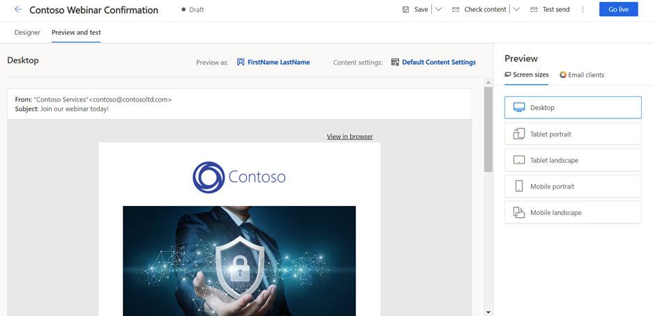

يُعدّ الرسالة الإلكترونية قناة تسويق مهمة للمؤسسات الحديثة، كما أنه ميزة أساسية في تطبيق Dynamics 365 Marketing. يمكن لتطبيق Dynamics 365 Marketing إرسال أعداد كبيرة من رسائل الرسالة الإلكترونية التسويقي المخصصة ومراقبة كيفية تفاعل كل مستلم معها ودفع التنفيذ التلقائي لرحلات العميل استناداً إلى هذه التفاعلات وعرض النتائج لجهات الاتصال الفردية والتحليلات الإحصائية المجمعة. يتم إرسال الرسائل الإلكترونية في تطبيق Dynamics 365 Marketing من خلال رحلات العميل.

> [!IMPORTANT] 
> تعتبر إمكانية التسليم من أهم مقاييس الأداء المتعلقة بالتسويق عبر البريد الإلكتروني، والتي تقيس إمكانية وصول رسائلك إلى عُلب البريد الوارد للمستلمين بدلاً من تصنيفها كبريد عشوائي وتصفيتها بعيداً عن الأنظار. تُكرّس Microsoft جهودها لمساعدة عملاء Dynamics 365 for Marketing على تحقيق أقصى قدر من إمكانية التسليم. راجع [Dynamics 365 for Marketing: إعداد DKIM لمجال الإرسال لديك لمواكبة التغييرات الأخيرة في Microsoft 365](https://blogs.msdn.microsoft.com/crm/2018/11/05/dynamics-365-for-marketing-set-up-dkim-for-your-sending-domain-to-keep-up-with-recent-office-365-changes/?azure-portal=true) لمعرفة المزيد.

## تصميم بريد إلكتروني تسويقي

لعرض بريد إلكتروني تسويقي جديد أو تحريره أو حذفه أو إنشائه، انتقل إلى **التسويق الصادر > تنفيذ التسويق > رسائل الرسالة الإلكترونية التسويقي**.

1.  لإنشاء بريد إلكتروني تسويقي جديد، حدد **+ جديد** ‬‏‫في شريط الأوامر‬‏‫.

1.  يمكنك تحديد قالب أو حدد **تخطي** للبدء من الصفر. 

      - في Dynamics 365 Marketing، يمكنك اختيار قالب من مجموعة نماذج قوالب أو إنشاء القوالب الخاصة بك. إذا حددت البدء من قالب، فسيتم إنشاء تخطيط الرسالة الإلكترونية ونموذج المحتوى لك.

        > [!NOTE] 
        > عندما تُنشئ رسالة جديدة من قالب، يتم نسخ محتوى القالب إلى رسالتك الجديدة. ليس ثمة ارتباط بين الرسالة والقالب، لذا، يمكنك تحرير الرسالة ولن يتغير القالب؛ وبالمثل، لا تؤثر أي تغييرات مستقبلية تجريها على القالب على أي رسائل موجودة تم إنشاؤها باستخدامه. لمزيد من المعلومات، راجع [العمل مع الرسالة الإلكترونية والصفحة وقوالب النموذج](/dynamics365/marketing/email-templates?azure-portal=true)

      - عند البدء من الصفر، يجب وضع جميع عناصر التصميم (غير عناصر القسم) في عنصر القسم. تتوفر عناصر القسم في لوحة **مربع الأدوات** ضمن نوع **قسم التخطيط**. توفر القوالب الفارغة قسماً يحتوي على عمود واحد بشكل افتراضي، ولكن يمكنك تحرير تخطيط العمود و/أو إضافة المزيد من عناصر القسم حسب الحاجة.

1.  تحديث الإعدادات الإضافية.

    -   في الجانب الأيمن أعلى المصمم، يمكنك إدخال **اسم** وصفي لبريدك الإلكتروني. ويُستخدَم هذا لتحديد الرسالة الإلكترونية في طرق عرض القوائم وخلال رحلات العميل.

    -   حدد **رأس الرسالة الإلكترونية** (قسم في الرسالة الإلكترونية يتضمن **عنوان المرسل** و **الموضوع**) وتحديث بعض الإعدادات الأساسية، بما في ذلك:

        -   **الموضوع** - إدخال موضوع. يعتبر واجهة مهمة للغاية في الرسالة الإلكترونية؛ لأنه أول شيء سيراه المستلمون عند تلقيهم الرسالة الإلكترونية.

        -   **رأس مسبق** - يظهر بجانب سطر الموضوع أو أسفله في علبة الوارد لدى المستلم. يُتيح لك الرأس المسبق إنشاء نص مخصص يتم عرضه في علبة الوارد الخاصة بالمستلم قبل فتح رسالة الرسالة الإلكترونية.

    -   إن منطقة إعدادات الإرسال بقسم رأس الرسالة الإلكترونية توجد أيضاً في رأس الرسالة الإلكترونية للمنطقة ويجب أن تعرض القيم الافتراضية التي يتعين أن تكون مناسبة في معظم الحالات. تتضمن هذه الإعدادات:

        -   **اسم المرسل**: الاسم الموضح للمستلمين أنه الشخص الذي أرسل الرسالة الإلكترونية. بشكل افتراضي، يُمثِّل هذا الإعداد اسم المستخدم الذي أنشأ الرسالة الإلكترونية. يمكنك تحرير هذا الإعداد لاستخدام قيمة ثابتة أو تحديد الزر **{ } تخصيص** لتحديد قيمة ديناميكية بديلة.

        -   **عنوان مرسل**: عنوان البريد الإلكتروني الموضح للمستلمين على أنه عنوان الشخص الذي أرسل الرسالة الإلكترونية. بشكل افتراضي، يُمثِّل هذا الإعداد عنوان البريد الإلكتروني للمستخدم الذي أنشأ الرسالة. يمكنك تحرير هذا الإعداد لاستخدام قيمة ثابتة أو تحديد الزر **{ } تخصيص** لتحديد قيمة ديناميكية بديلة.

        -   **الرد علي الرسالة الإلكترونية** - عنوان البريد الإلكتروني الذي ترسل إليه رسائل الرد عندما تريد نقل الرسائل إلى عنوان بريد إلكتروني مختلف عن عنوان المرسل.

    -   تتضمن منطقة **إعدادات الرسالة الإلكترونية** ما يلي:

        -   **قالب الرسالة الإلكترونية** - يعرض اسم القالب الذي حددته عند إنشاء الرسالة الإلكترونية. يمكنك تغيير القالب من خلال تحديد اسم القالب.

            > [!IMPORTANT] 
            > في حالة تغيير القالب، لن يتم الاحتفاظ بمحتوى بريدك الإلكتروني الحالي (بصرف النظر عن رأس الرسالة الإلكترونية).

        -   **نوع الرسالة الإلكترونية** - يؤثر هذا الحقل على المتطلبات المتعلقة بما يجب أن (ويجب ألا) تحتوي عليه الرسالة، وقد يكون إما تجارياً أو حركات.

        -   **نوع المحتوى** - قد يكون إما بريداً إلكترونياً عادياً (نوع محتوى افتراضي)، أو طلب تأكيد لسيناريوهات الاشتراك المزدوج.

        -   **اللغة** - لغة بريدك الإلكتروني.

    -   تتضمن إعدادات **النص العادي**:

        -   **إنشاء نص عادي تلقائياً** - يتم تعيين هذا الخيار إلى **نعم** افتراضياً. ومع ذلك، يمكنك تعيينه إلى **لا** وتوفير إصدار نص عادي خاص بك للبريد الإلكتروني.

        -   **معاينة نص عادي** - يعرض هذا الحقل معاينة إصدار النص العادي للبريد الإلكتروني.

    -   لمعرفة مزيد من المعلومات، راجع [إجراء الإعدادات الأساسية والمطلوبة](/dynamics365/marketing/email-design?azure-portal=true#make-basic-and-required-settings).

1.  تصميم الرسالة الإلكترونية.

    -   يمكنك إضافة العناصر النصية والرسومية المختلفة التي يتطلبها بريدك الإلكتروني وتكوينها وترتيبها. 

    -   اسحب عناصر التصميم من **مربع الأدوات** إلى اللوحة أو حدد عنصر تصميم موجود بالفعل في تصميمك.

        -   حال إضافتك للعناصر، يمكنك استخدام شريط الأدوات المنبثق في اللوحة لتعديلها. تختلف الأدوات التي يعرضها شريط الأدوات المنبثق حسب نوع عنصر التصميم الذي حددته. يشتمل شريط الأدوات على أوامر لنقل العنصر المحدد أو نسخه أو حذفه. بالنسبة لعناصر النص، يوفر شريط الأدوات أوامر لتطبيق تنسيق النص الأساسي بالشكل الذي ترغبه في Microsoft Word.

        -   يمكنك أيضاً تحديد عنصر ثم استخدام خيارات  **التحرير** الموجودة في اليسار لتخصيصه.

        -   عند إضافة عنصر قسم جديد، سيكون لديك مجموعة متنوعة من التخطيطات للاختيار من بينها. بعد وضع العنصر لديك، يمكنك تغيير تخطيط العمود و/أو خيارات التصميم.

    -   إذا كنت تفضل استخدام تعليمات البرمجية مباشرةً، فحدد رمز **</> HTML** في أعلى يسار الصفحة. ويمكنك إجراء ذلك لتحسين بعض الخصائص التي يتعذّر الوصول إليها باستخدام المحرر الرسومي، أو يمكنك لصق تعليمات HTML البرمجية التي قمت بإنشائها باستخدام برنامج آخر. يمكنك أيضاً إضافة نصوص متقدمة وتصميمات لتقديم وظيفة جديدة.

        > [!NOTE] 
        > عند لصق تعليمات HTML البرمجية، تأكد من عدم وجود أقسام متداخلة. الأقسام المتداخلة غير مدعومة في مصمم الرسالة الإلكترونية. على سبيل المثال، يجب ألا يتم لصق العناصر التي تحتوي على سمات "قسم البيانات" أو "حاوية البيانات" في عناصر تحتوي بالفعل على هذه السمات. سيؤدي القيام بذلك إلى مشكلات في عرض التخطيط. لمزيد من المعلومات، راجع [العمل مباشرةً في HTML](/dynamics365/marketing/design-digital-content?azure-portal=true#work-directly-in-html) و[استخدام  السمات المخصصة لتمكين ميزات المصمم في الرسائل الإلكترونية والصفحات والنماذج](/dynamics365/marketing/custom-template-attributes?azure-portal=true).
 
    
    -   لإضافة نمط ينطبق على الرسالة الإلكترونية بالكامل، انقر فوق أي مكان على الحواف الخارجية للبريد الإلكتروني لعرض مربع الأدوات، ثم حدد علامة التبويب **أنماط عامة**. سيعرض هذا خيارات مثل مجموعة الخطوط وحجم النص ولون النص ولون الخلفية التي ستنطبق على الرسالة الإلكترونية بأكمله. 

    -   للحصول على مزيد من المعلومات، راجع [‏‫إنشاء بريد إلكتروني جديد وتصميم محتواه](/dynamics365/marketing/email-design#create-a-new-email-marketing-message?azure-portal=true) و[تصميم المحتوى](/dynamics365/marketing/email-design/?azure-portal=true#design-your-content).

    > [!IMPORTANT] 
    > عند تصميم محتوى الرسالة الإلكترونية، يجب أن تحرص دائماً على تقليل حجم رسائلك قدر الإمكان. عندما يتعلق الأمر بمحتوى النصوص والتعليمات البرمجية (لا يشمل محتوى الصور المشار إليه)، نوصيك بأن يكون حجم ملفاتك أقل من 100 كيلوبايت دائماً للأسباب التالية:

    -   يتم غالباً تصنيف رسائل الرسالة الإلكترونية التي يزيد حجمها عن 100 كيلوبايت كبريد عشوائي من خلال عوامل تصفية البريد العشوائي

    -   يقتطع Gmail الرسائل بعد أول 102 كيلوبايت من النص المصدر والترميز.

    -   يتعذّر تسليم رسائل الرسالة الإلكترونية التي يزيد حجمها عن 128 كيلوبايت من خلال رحلة العميل (سوف تفشل الرحلة في التحقق من الأخطاء إذا كانت تتضمن رسائل حجمها أكثر من هذا)

    -   يستغرق تحميل رسائل الرسالة الإلكترونية الكبيرة وقتاً أطول، مما قد يُزعج المستلمين.

    > [!NOTE] 
    > يدعم Microsoft Outlook التخصيصات المحلية والمكونات الإضافية التي قد تؤثر على طريقة عرض الرسائل. في بعض الحالات، قد يرى المستلمون الذين يستخدمون تثبيتات Outlook المخصصة تخطيطات فردية أو عناصر صفحة متكررة عند عرض الصفحات المصممة في Dynamics 365 Marketing. ولا يمكن للمصمم محاكاة هذه التأثيرات. وإذا لزم الأمر، يمكنك استخدام **إرسال رسالة اختبار** لمعرفة كيفية ظهور تصميماتك في تكوينات Outlook معيّنة.

1.  إضافة محتوى ديناميكي إلى رسائل الرسالة الإلكترونية.

    -   يساعدك الزر  **تخصيص** **{ }** في إنشاء تعبيرات ديناميكية صالحة لوضع قيم الحقول من سجلات جهات اتصال المستلمين وإعدادات محتوى الرسائل وقيم قواعد البيانات الأخرى.

    -   ضع المؤشر في الحقل أو عنصر النص الذي تريد إدراج نص ديناميكي فيه، ثم حدد **{ } تخصيص**. 
        عندئذٍ يفتح مربع الحوار مساعدة المحتوى. اتبع المطالبات لإضافة المحتوى الديناميكي المطلوب إلى الرسالة الإلكترونية. 

        > [!div class="mx-imgBorder"]
        > 

    -   يتم حل المحتوى الديناميكي تماماً قبل إرسال الرسالة إلى شخص محدد. سوف تستخدم عادةً المحتوى الديناميكي لدمج معلومات من سجل جهة اتصال المستلم (مثل الاسم الأول والأخير) لوضع ارتباطات خاصة ووضع معلومات وارتباطات من إعدادات المحتوى.

    -   لمزيد من المعلومات، راجع [إضافة محتوى ديناميكي إلى رسائل الرسالة الإلكترونية](/dynamics365/marketing/dynamic-email-content/?azure-portal=true) و[استخدام مساعدة التحرير لوضع قيم حقول ديناميكية](/dynamics365/marketing/dynamic-email-content?azure-portal=true#assist-edit).

1.  إضافة ارتباطات قياسية ومطلوبة ومتخصصة إلى رسالتك.

    -   **الرسائل التسويقية** يتم تسليمها بتنسيق HTML، وبالتالي تدعم الارتباطات التشعبية. توفر بعض أنواع الارتباطات إمكانية الوصول إلى ميزات خاصة يستضيفها Dynamics 365 Marketing، في حين قد تكون أنواع أخرى ببساطة ارتباطات قياسية للمحتوى في أي مكان على الويب. 

    -   يمكن ربط **ارتباطات النص/الزر/الصورة** بما يلي:

        -   **عنوان URL**: يمكنك إضافة ارتباطات قياسية إلى أي محتوى نص من خلال تمييز نص الارتباط وتحديد **ارتباط** في شريط أدوات النص. يمكنك أيضاً إضافة عناوين URL إلى العديد من الأنواع الأخرى لعناصر التصميم، ويشمل ذلك الصور والأزرار. يستبدل Dynamics 365 Marketing كل ارتباط بعنوان إعادة توجيه URL فريد يستهدف خادم Dynamics 365 Marketing الخاص بك، ويحدد مستلم الرسالة ومُعرف الرسالة والوجهة المُحددة للارتباط. عندما تقوم جهة اتصال بالنقر فوق ارتباط، يُسجل Dynamics 365 Marketing النقرة، ثم يقوم بإعادة توجيه جهة الاتصال مباشرة إلى عنوان URL الذي حددته. 

        -   **الحدث أو تسجيل الدخول إلى Teams أو صفحة تسويق أو استطلاع**: تنتقل هذه الارتباطات إلى موقع ويب حدث أو تسجيل الدخول إلى Teams أو صفحة تسويق أو استطلاع. 
            يمكنك إضافتها كارتباطات نصية في عنصر نص، أو على شكل أزرار ملونة تشير إلى الدعوة إلى اتخاذ إجراء أو الصور. لإنشاء زر، قم بسحب حدث أو استطلاع أو عنصر صفحة منتقل إليها إلى تصميم الرسالة الإلكترونية الخاص بك، ثم قم بتكوين العنصر الذي يجب ربط العنصر به. لإنشاء ارتباط نص، قم بتحديد جزء من النص في عنصر النص ثم استخدم ميزة مساعدة-تحرير.

        تشمل الأنواع الأخرى من الارتباطات:

        -   **مركز الاشتراك**، الذي يعدّ ضرورياً لجميع رسائل الرسالة الإلكترونية التجارية. يمكنك إضافة هذا الارتباط من خلال تمييز نص الارتباط وتحديد **ارتباط** في شريط أدوات النص. انقر فوق أيقونة **</> مساعدة التحرير** لفتح مربع الحوار مساعدة المحتوى. حدد **محتوى ديناميكي > ContentSettings > بلا علاقة > SubscriptionCenter**، ثم حدد **إدراج**.

        -   **إعادة التوجيه إلى صديق**. يفتح هذا النوع من الارتباط نموذجاً يمكن لجهات الاتصال استخدامه لإعادة توجيه بريد إلكتروني تسويقي إلى أصدقائها أو زملائها عن طريق إدخال عناوين الرسالة الإلكترونية للمستلمين. ‏‫من الأفضل تضمين هذا النوع من الخدمة لجهات اتصالك لأن الرسائل المُعاد توجيهها باستخدام نموذج إعادة التوجيه يتم حسابها بشكل صحيح في نتائج بريدك الإلكتروني وتحليلاته. يمكنك إضافة هذا الارتباط من خلال تمييز نص الارتباط وتحديد **ارتباط** في شريط أدوات النص. انقر فوق أيقونة **</> مساعدة التحرير** لفتح مربع الحوار مساعدة المحتوى. حدد محتوى ديناميكي > ContentSettings > بلا علاقة > ForwardToAFriend، ثم حدد **إدراج**.

        -   **عرض كصفحه ويب**. يفتح هذا الارتباط الرسالة الإلكترونية في مستعرض ويب.‬ يمكنك إضافة هذا الارتباط من خلال تمييز نص الارتباط وتحديد **ارتباط** في شريط أدوات النص. انقر فوق أيقونة **</> مساعدة التحرير** لفتح مربع الحوار مساعدة المحتوى. حدد محتوى ديناميكي > رسالة > بلا علاقة > ViewAsWepageURL، ثم حدد **إدراج**.

    -   لمعرفة مزيد من المعلومات، راجع [إضافة ارتباطات قياسية ومطلوبة ومتخصصة إلى رسالتك](/dynamics365/marketing/email-design?azure-portal=true#add-standard-required-and-specialized-links-to-your-message).

1.  مراجعة المحتوى المطلوب.

    -   يجب أن يتضمن نص جميع رسائل الرسالة الإلكترونية التجارية ارتباطاً لمركز الاشتراك والعنوان الفعلي لمؤسستك. ولن يسمح لك Dynamics 365 for Marketing بنشر أي بريد إلكتروني تسويقي دونهما.

    -   عند استخدام قالب بريد إلكتروني جاهز، سيتم تضمين هذه السمات بالفعل في تذييل الرسالة الإلكترونية لديك. ويتم تحديد هذه السمات الديناميكية في سجلات إعدادات المحتوى لديك. ‏‫المحتوى الديناميكي هو محتوى يتم حله تماماً قبل إرسال الرسالة. يتم تحديد إعدادات المحتوى في رحلات العميل، وليس في رسائل الرسالة الإلكترونية. ستظهر هذه الإعدادات في بريدك الإلكتروني بطريقة مشابهة للمثال التالي:

    

    -   إذا كنت تُنشئ بريدك الإلكتروني من قالب فارغ، فإنه سيتعيّن تضمين القيم الديناميكية لإعداد المحتوى لديك، بما في ذلك العنوان الفعلي ومركز الاشتراك. لمزيد من المعلومات، راجع [استخدام مساعدة التحرير لوضع قيم حقول ديناميكية](/dynamics365/marketing/dynamic-email-content?azure-portal=true#assist-edit).

1.  احفظ تغييراتك.

> [!IMPORTANT] 
> تعتبر مصادقة المجال باستخدام DKIM جانباً متزايد الأهمية للتأكد من وصول رسائلك إلى علب الوارد الخاصة بالمستلمين بدلاً من تصفيتها كبريد غير هام. يساعد DKIM في إثبات أن الرسائل التي تدعي أنها صادرة من مؤسستك قد وردت منها بالفعل. ويتطلب ذلك أن يستخدم حقل **عنوان المرسل** لكل رسالة ترسلها مجالاً قمت بمصادقته باستخدام DKIM (تستخدم عناوين الرسالة الإلكترونية النموذج *account-name@domain-name*). على نحوٍ افتراضي، تتوفر جميع عمليات تثبيت Dynamics 365 Marketing الجديدة مع مجال إرسال تمت مصادقته مسبقاً ينتهي بـ \-dyn365mktg.com\. ربما قمت أيضاً بمصادقة مجال واحد أو أكثر من مجالات الإرسال الخاصة بك (التي نوصي بها بشدة).
>
> عندما تُنشئ بريداً إلكترونياً جديداً، يتم تعيين حقل **عنوان مرسل** تلقائياً إلى عنوان البريد الإلكتروني المسجّل لحساب مستخدم Dynamics 365 Marketing. ومع ذلك، ففي حالة استخدام عنوان البريد الإلكتروني مجال لم تتم مصادقته بعد باستخدام DKIM، سيتم تعديل **عنوان المرسل** الأولي لاستخدام مجال تمت مصادقته. سيظل **عنوان المرسل** الناتج يعرض *اسم حساب*  المستخدم الذي أنشأ الرسالة، ولكنه سيعرض الآن *اسم المجال* الذي تمت مصادقته باستخدام DKIM والمُسجّل لمثيل Marketing، (على سبيل المثال، \MyName\@contoso-dyn365mktg.com\)، وسوف يوفر ميزة إمكانية التسليم، ولكن ربما لا يكون عنوان المرسل صالحاً.
> يمكنك التحكم في هذا الإعداد من خلال تحرير **عنوان المرسل** بعد إنشاء الرسالة، ولكن قد يؤدي ذلك إلى انخفاض إمكانية تسليمها. إذا كنت تريد إرسال رسائل تعرض عنوان بريدك الإلكتروني الحقيقي كعنوان مرسل، فإننا نوصي بشدة بأن تطلب من المسؤول مصادقة مجال عنوان بريدك الإلكتروني (إذا لم تتم مصادقته من قبل). لمزيد من المعلومات، راجع [مصادقة المجالات](/dynamics365/marketing/mkt-settings-authenticate-domains/?azure-portal=true).

لمعرفة مزيد من المعلومات، راجع [إنشاء بريد إلكتروني جديد وتصميم محتواه](/dynamics365/marketing/email-design#create-a-new-email-marketing-message?azure-portal=true).

## معاينة بريدك الإلكتروني التسويقي

سيشاهد العديد من العملاء المحتملين رسائل الرسالة الإلكترونية التسويقي الخاصة بك، لذلك يجب التأكد من أنها تبدو أكثر مهنية واحترافية. يوفر Dynamics 365 Marketing العديد من الأدوات التي تساعدك في اختبار تصميمك وتقييمه على مجموعة متنوعة من الأجهزة وعملاء الرسالة الإلكترونية.

> [!IMPORTANT] 
> تُتيح لك المعاينات وإرسال رسائل الاختبار طريقة سريعة وملائمة لاختبار تصميمك. ومع ذلك، لا تعمل جميع الميزات مع المعاينات وإرسال رسائل الاختبار. تُطبق القيود التالية:
> - [تكرار لكل](/dynamics365/marketing/dynamic-email-content?azure-portal=true#for-each) لا يعرض.
> - ستفتح [ارتباطات مركز الاشتراك](/dynamics365/marketing/set-up-subscription-center?azure-portal=true#test-sub-center) صفحة مركز الاشتراك ولكنها لن تعمل.
> - لا يمكنك اختبار إرسال رسائل طلب التأكيد. 
>
> لاختبار هذه الميزات، يمكنك إنشاء رحلة عميل بسيطة تستهدف شريحة صغيرة (مثل تلك التي تتضمن جهة اتصال واحدة مع عنوان بريدك الإلكتروني) وتُرسل الرسالة التي تريد اختبارها.

يوفر مصمم المحتوى نوعين من المعاينات لرسائل الرسالة الإلكترونية التسويقي.

### أحجام الشاشات

في رسالة الرسالة الإلكترونية التسويقي، انتقل إلى **معاينة واختبار** للاطلاع على معاينة في المستعرض التي تُحاكي كيفية عرض رسالتك عادةً على عوامل تصميم مختلفة (جهاز مكتبي أو لوحي أو هاتف)، والاتجاه (عمودي أو أفقي).

استخدم خيارات القوائم المنسدلة التالية الموجودة أعلى علامة التبويب **معاينة واختبار** لمعاينة تأثيرات المحتوى الديناميكي والمنطق لديك:

-   **جهة اتصال** - حدد سجل جهة اتصال ممثل لتوفير قيم الحقول. سوف يتم عرض قيم الحقول من جهة اتصالك المحددة، وغيرها من المحتوي الديناميكي الذي يتفاعل مع هذه القيم، في المعاينة.

-   **إعدادات المحتوى**: تنشئ هذه الإعدادات سياقاً تسويقياً لرسائلك، وقد تؤثر القيم المخزنة في هذه القائمة على محتوى رسالتك. تتضمن إعدادات المحتوى أيضاً معلومات حول مؤسستك، وتشمل عنوان الرمز البريدي ومُعرّف صفحة مركز الاشتراك في Dynamics 365 Marketing. في الإعداد الأساسي، قد تكون لديك مجموعة واحدة فقط من إعدادات المحتوى لمؤسستك بأكملها. ‏‫ولكن، في التكوينات الأكثر تقدماً، يمكنك إعادة استخدام رسالة بريد إلكتروني تسويقي واحدة بعدة سياقات مختلفة (مثل للمنتجات المختلفة أو الأحداث المختلفة). ومن ثمّ، قد تختلف إعدادات المحتوى لكل رحلة عميل عندما تستخدم الرسالة.‬ لمزيد من المعلومات، راجع [‬‏‫استخدم إعدادات المحتوى لإعداد مستودعات القيم القياسية والمطلوبة لرسائل الرسالة الإلكترونية‬‏‫](/dynamics365/marketing/dynamic-email-content?azure-portal=true#content-settings).

    

لمزيد من المعلومات، راجع [‏‫استخدام ميزة المعاينة الأساسية](/dynamics365/marketing/email-preview?azure-portal=true#use-the-basic-preview-feature).

### عملاء الرسالة الإلكترونية

داخل الرسالة الإلكترونية التسويقي، انتقل إلى علامة التبويب **معاينة واختبار**، وفي خصائص **المعاينة** قم بالتبديل إلى **عملاء الرسالة الإلكترونية** لمشاهدة معاينات علبة الوارد الفعلية التي تعرض تصميمك بالضبط كما سوف يظهر في مجموعة كبيرة من عملاء الرسالة الإلكترونية والأنظمة الأساسية المستهدفة.

تتوفر معاينة **عملاء الرسالة الإلكترونية** من خلال شريك Microsoft partner وهو شركة Litmus Software, Inc. ([litmus.com](https://litmus.com/?azure-portal=true)). يتضمن ترخيص Dynamics 365 Marketing عدداً محدوداً من المعاينات كل شهر، وتتشارك المؤسسة بأكملها في هذه الحصة النسبية. يجب تمكين Litmus لمثيلك قبل استخدامه. لمزيد من المعلومات، راجع [تكوين إعدادات التسويق الافتراضية](/dynamics365/marketing/mkt-settings-default-marketing/?azure-portal=true).

تعرض علامة تبويب **عملاء الرسالة الإلكترونية‬** قائمة المعاينات المتوفرة، كل منها مسمى باسم نظام أساسي لوجهة مختلفة أو عميل بريد إلكتروني. تُصنَّف علامة التبويب هذه إلى أقسام مختلفة بما في ذلك المعاينات الأكثر شيوعاً ومعاينات Chrome وWindows وغير ذلك.‬ حدد أحد خيارات الرسالة الإلكترونية المتاحة لإنشاء تلك المعاينة. في كل مرة تقوم فيها بعرض معاينة، ستتلقى رسالة تخبرك أن المعاينة ستستهلك أحد أرصدة Litmus لديك. سيتعيّن عليك تحديد **متابعة** قبل إنشاء المعاينة. سوف تستخدم معاينة واحدة إما من حصة مؤسستك أو حصتك الشخصية. تظل المعاينة المعروضة متاحة للعرض حتى تقوم بتغيير التصميم أو إعدادات **خصائص** (نص ديناميكي)، وفي هذا الوقت لن تعد جميع المعاينات الموجودة صالحة.

لمزيد من المعلومات، راجع [‏‫استخدام ميزة معاينة علبة الوارد المتقدمة](/dynamics365/marketing/email-preview?azure-portal=true#use-the-advanced-inbox-preview-feature).

## ‏‫التحقق من المحتوى وإرسال رسالة اختبار‬‏‫ والعرض المباشر‬

عند الانتهاء من تصميم ومعاينة بريدك الإلكتروني، هناك بضع خطوات أخيرة لتجهيز الرسالة الإلكترونية للإرسال. 

-   أولاً، يجب عليك **‏‫التحقق من المحتوى** من أجل التحقق من عدم وجود أخطاء في بريدك الإلكتروني.

-   في الخطوة التالية، نوصيك بإرسال **رسالة اختبار** للبريد الإلكتروني إلى نفسك لمراجعة التصميم والتحقق جيداً من جميع الارتباطات الموجودة في الرسالة الإلكترونية. 
    
-   أخيراً، يجب أن تبدأ مع الرسالة الإلكترونية مباشرة لإتاحته لإضافته إلى رحلة العميل.  
    
عند اكتمال جميع الخطوات، سيكون بريدك الإلكتروني جاهزاً لإضافته إلى رحلة العميل حيث ستنشئ المقطع الهدف وجدول التسليم وإجراءات المتابعة.

### التحقق من المحتوى

قبل أن تتمكن من العرض المباشر لرسالتك أو اختبار إرسالها، يجب أن تجتاز مرحلة التحقق من الأخطاء. يمكنك تشغيل التحقق من الأخطاء في أي وقت عن طريق تحديد‏‫ **التحقق من المحتوى** أعلى تصميم الرسالة الإلكترونية. يتم أيضاً تشغيل التحقق من الأخطاء تلقائياً في كل مرة تُحدد فيها **العرض المباشر** أو **إرسال رسالة اختبار**.

يجب أن تتضمن جميع الرسائل المعلومات التالية:

-   ارتباط مركز الاشتراك المأخوذ من إعدادات المحتوى كـ ContentSettings.SubscriptionCenter

-   العنوان الفعلي للمرسل، المأخوذ من إعدادات المحتوى كـ ContentSettings.SenderAddress

-   موضوع صالح أو تعبير ديناميكي يتحول إلى نص صالح

-   اسم مرسِل وعنوان مرسِل صالحان، أو تعبير ديناميكي يتحول إلى اسم وعنوان صالحين

-   نص HTML (محتوى رسالتك)

-   إصدار النص العادي للرسالة. يجب أن يتواجد هذا الإصدار ويجب أيضاً أن يحتوي على ارتباط مركز الاشتراك وعنوان المرسل الفعلي (يتم عادةً إنشاء هذه المعلومات تلقائياً، ولكن يجب عليك مراجعتها).

يتم تأكيد العناصر التالية أيضاً من خلال عملية التحقق:

-   يجب تجميع كل التعبيرات الديناميكية وتعليمات HTML البرمجية وإنشاء قيم صالحة.

-   يجب أن تكون جميع الصور المشار إليها موجودة في Dynamics 365.

-   يجب أن يكون حقل **إلى** تعبيراً (غير ثابت) ينتج عنه عنوان بريد إلكتروني صالح؛ حيث تُعالج هذه المعلومات تلقائياً عادةً من خلال رحلة العميل التي ترسل الرسالة الإلكترونية، ولكن بعض السيناريوهات المتقدمة تُتيح التخصيص في هذا الحقل.

-   يجب أن يستخدم عنوان المرسل مجالاً تمت مصادقته وتسجيله باستخدام DKIM على أنه خاص بمؤسستك. يمكنك الانتقال إلى وضع العرض المباشر باستخدام عنوان مرسل يستخدم مجالاً لم تتم مصادقته، ولكنك ستتلقى رسالة تحذير لأن هذه الممارسة غير مستحسنة. ويتعذر عليك إجراء العرض المباشر باستخدام مجال تمت مصادقته على أنه خاص بمؤسسة أخرى (يؤدي هذا النهج إلى حدوث خطأ).

لمزيد من المعلومات، راجع [‏‫التحقق من عدم وجود أخطاء بالرسائل والعرض المباشر لها وتسليمها](/dynamics365/marketing/email-check-golive?azure-portal=true).

### مدقق الوصول إلى الرسالة الإلكترونية

يوفر Dynamics 365 Marketing ‏‫مدقق الوصول لمساعدتك في جعل المحتوى سهل القراءة بالنسبة لجميع الأشخاص بمختلف قدراتهم. يمكنك بفضل هذه الميزة التحقق من إمكانية الوصول إلى رسائل بريدك الإلكتروني التي تم إنشاؤها باستخدام مصمم المحتوى المتوفر في Marketing والحصول على إرشادات حول الإصلاحات المقترحة. كما تساعدك هذه الميزة في استكشاف أي من مشاكل إمكانية الوصول التي تم العثور عليها للحصول على مساعدة بشأن كيفية إصلاح المشكلة المحددة.

أثناء وجودك في بريدك الإلكتروني التسويقي، انقر فوق **سهم القائمة المنسدلة** بجوار **التحقق من المحتوى**، ثم حدد **مدقق الوصول**.

> [!div class="mx-imgBorder"]
> 

سينشئ مدقق الوصول نتائج لتحسين الرسالة الإلكترونية.

> [!div class="mx-imgBorder"]
> 

للحصول على مزيد من المعلومات، راجع [‏‫مدقق الوصول إلى الرسالة الإلكترونية‬](/dynamics365/marketing/email-accessibility?azure-portal=true).

### مدقق البريد العشوائي

يوفر Dynamics 365 Marketing مدققاً للبريد العشوائي لمساعدتك في التحقق من احتمالية وضع علامة على رسالتك كبريد عشوائي. تطبِّق ميزة مدقق البريد العشوائي الذكاء الاصطناعي لتحليل محتوى كل رسالة بريد إلكتروني تسويقي. وبعد ذلك يُنشئ مدقق البريد العشوائي نطاقاً يتنبأ بمدى احتمالية وضع علامة على الرسالة وتصنيفها حسب عوامل تصفية البريد العشوائي المستندة إلى المحتوى.

ثمة طريقتان لعرض مخاطر البريد العشوائي:

-   **تلقائياً** - يتم إجراء عملية تدقيق البريد العشوائي دائماً باعتبارها جزءاً من عمليات **‏‫التحقق من المحتوى‬** و **العرض المباشر** القياسية. وتظهر نتائج مخاطر البريد العشوائي مع نتائج أخرى لعملية التحقق من الأخطاء. تُصنّف نتائج مخاطر البريد العشوائي‬‬‬ على أنها عالية أو متوسطة أو منخفضة (كلما انخفضت، كان أفضل). إذا حصلت على مستوى مخاطر بريد عشوائي عالٍ أو متوسط، فيجب عليك مراجعة محتواك.

-   **يدوياً**: أثناء تصميم بريدك الإلكتروني، يمكنك التحقق من مخاطر البريد العشوائي في أي وقت عن طريق الانتقال إلى أعلى تصميم الرسالة الإلكترونية وتحديد سهم القائمة المنسدلة بجوار زر **‏‫التحقق من المحتوى‬** وتحديد **‏‫مدقق البريد العشوائي**. سيؤدي ذلك إلى تشغيل عملية التحقق في المحتوى الحالي، والتي قد تستغرق بضع دقائق ولكنها تتم عادةً بشكل أسرع. 
    وعلى عكس نتائج التحقق التلقائي من الأخطاء، تعرض هذه الشاشة أيضاً معلومات حول أنواع المشكلات التي تؤدي على الأرجح إلى زيادة مستوى المخاطر.

أثناء وجودك في بريدك الإلكتروني التسويقي، انقر فوق **سهم القائمة المنسدلة** بجوار **التحقق من المحتوى**، ثم حدد **مدقق البريد العشوائي**.

> [!div class="mx-imgBorder"]
> 

سيقدم مدقق البريد العشوائي نتائج لمساعدتك في تحديد ما إذا كان يجب عليك إجراء تغييرات على بريدك الإلكتروني.

> [!div class="mx-imgBorder"]
> 

لمزيد من المعلومات، راجع [‏‫التحقق من مخاطر البريد العشوائي في محتوى الرسالة الإلكترونية‬](/dynamics365/marketing/spam-checker?azure-portal=true).

### إرسال رسالة اختبار

حدد الزر **إرسال رسالة اختبار** أعلى تصميم الرسالة الإلكترونية لإرسال التصميم الحالي لديك إلى عنوان بريد إلكتروني واحد أو أكثر. يبدأ هذا الأمر عملية التحقق من الأخطاء وبعد ذلك، بشرط أن تجتاز رسالتك مرحلة التحقق من الأخطاء، تظهر لوحة قائمة منبثقة تطلب منك تحديد المعلومات التالية:

-   **عنوان البريد الإلكتروني** - أدخل واحداً أو أكثر من عناوين الرسالة الإلكترونية المستهدفة (مفصولة بفواصل). ستستخدم عادةً عنوان بريدك الإلكتروني الخاص أثناء إرسال رسالة الاختبار.

-   **جهة اتصال الاختبار‬** - حدد سجل جهة اتصال لتوفير قيم للمحتوى الديناميكي (مثل الاسم الأول في التحية). بالنسبة لرسالة مباشرة، تأتي هذه القيم من سجل جهة الاتصال لكل مستلم فردي.

-   **اختبار إعدادات المحتوى‬** - حدد سجل إعدادات المحتوى لتوفير قيم للمحتوى الديناميكي (مثل عنوان URL لمركز الاشتراك أو العنوان البريدي للمرسل). وبالنسبة لرسالة مباشرة، يتم تحديد سجل إعدادات المحتوى بواسطة رحلة العميل التي ترسل الرسالة.

حدد الزر **حفظ** أسفل لوحة القائمة المنبثقة لإرسال الرسالة إلى عنوان (عناوين) بريدك الإلكتروني المحدد.

يمكنك اختبار إرسال كل من رسائل الرسالة الإلكترونية المباشرة والمسودة، حتى لا تضطر إلى الانتقال إلى العرض المباشر لإرسال رسالة اختبار.

لمزيد من المعلومات، راجع [‏‫إرسال رسالة اختبار‬](/dynamics365/marketing/email-preview?azure-portal=true#send-a-test-message).

### العرض المباشر

لنشر رسالة، افتحها ثم حدد زر **العرض المباشر** في الزاوية العلوية اليسرى. سوف يُجري Dynamics 365 عملية تحقق من الصحة نهائية، وفي حالة اجتيازها، سوف ينشر الرسالة. وإذا نتج عن التحقق أخطاء، فعليك قراءة رسالة الخطأ ومعالجة المشكلة، ثم تحقق مرةً أخرى من عدم وجود أخطاء بها حتى تجتاز الرسالة عملية التحقق من الصحة.

لمزيد من المعلومات، راجع [العرض المباشر لرحلة عميل وإعدادها لتسليم رسالتك‬](/dynamics365/marketing/email-check-golive?azure-portal=true#go-live-and-set-up-a-customer-journey-to-deliver-your-message) و[‏‫عمليات العرض المباشر للبريد الإلكتروني التسويقي وحالتها](/dynamics365/marketing/go-live?azure-portal=true#marketing-email-go-live-operations-and-status).
