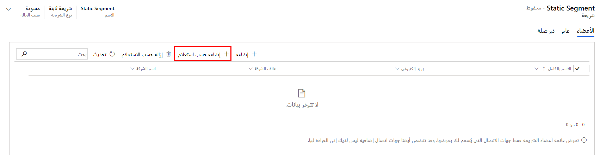

تُنشئ الشرائح مجموعات جهات الاتصال ذات الصلة التي ستستهدفها مبادراتك التسويقية. يمكنك إنشاء الشرائح باستخدام مصمم التقسيم الذي يُتيح لك الاستعلام عبر العديد من الكيانات ذات الصلة، ومنها جهات الاتصال والعملاء المتوقعون والحسابات والأحداث وقوائم التسويق، وغير ذلك.
كما تُمكّنك الشرائح أيضاً من الاستعلام عن خدمة Marketing Insights للعثور على جهات الاتصال التي تفاعلت مع مبادراتك التسويقية أو التي قد لا يمكنك الوصول إليها (بسبب مشكلات مثل ارتداد الرسالة الإلكترونية).

يتعلق إنشاء الشرائح بالوصول إلى بيانات العملاء المتوفرة لديك. يُتيح لك Dynamics 365 Marketing إمكانية استهداف بيانات العملاء استناداً إلى البيانات السلوكية وبيانات ملفات التعريف. 

-   **البيانات السلوكية** يتم إنشاؤها تلقائياً استجابة لتفاعلات جهات الاتصال، مثل فتح بريد إلكتروني أو النقر فوق ارتباط في رسالة إلكترونية أو إرسال نموذج أو التسجيل في حدث. 
    
-   **بيانات ملف التعريف** هي المعلومات التي يتم رصدها وتخزينها في الكيانات التي تستخدمها بانتظام، كجهات الاتصال والحسابات والعملاء المتوقعين وأي كيانات أخرى تحددها للمزامنة معها. يمكنك إضافة بيانات الملف الشخصي الموجودة في النظام عن طريق إنشاء نماذج تسويق جديدة (أو توسيع النماذج الحالية) للحصول على معلومات إضافية حول عملائك.

قد تكون الشرائح ديناميكية أو ثابتة. 

-   يتم إعداد **شرائح ديناميكية** باستخدام تعبيرات منطقية، مثل "جميع جهات الاتصال من نيويورك" أو "جميع جهات الاتصال التي تحب فريق The Mets." 
    تتغير العضوية في الشرائح الديناميكية باستمرار لتعكس جهات الاتصال الجديدة أو التي تم حذفها ومعلومات جهات الاتصال المُحدثة. وتعتبر كل من شرائح البيانات السكانية والديمغرافية للمؤسسات أمثلة على الشرائح الديناميكية.

-   تُنشئ **الشرائح الثابتة** قائمة ثابتة من جهات الاتصال التي يتم تحديدها على أساس كل جهة اتصال ولا يتم إنشاؤها منطقياً استناداً إلى قيم الحقل. 
    يمكن للمسوّقين وأفراد المبيعات إنشاء قائمة ثابتة ونشرها استناداً إلى المعرفة الخاصة أو التفاعلات دون الاتصال.

## تصميم شريحة ديناميكية

لعرض قالب شريحة جديد أو تحريره أو حذفه أو إنشائه، انتقل إلى **التسويق الصادر > العملاء > المقاطع‬**.

1.  لإنشاء مقطع ديناميكي جديد، حدد + **جديد** ‬‏‫في شريط الأوامر‬‏‫.

1.  حدد **+شريحة ديناميكية جديدة**.

1.  عند إنشاء شريحة ديناميكية جديدة، يفتح مربع الحوار **قالب الشريحة** ويعرض قائمة القوالب المتوفرة. ويوفر كل قالب منها استعلاماً محدداً بالكامل أو جزئياً ومصمماً لغرض معين، كما هو موضّح في اسم القالب.

    -   للبدء من قالب، حدد القالب ثم انقر فوق **تحديد**.
    -   للبدء من الصفر، حدد **تخطي**.

1.  أدخل **اسماً** للشريحة.

1.  تصميم الشريحة.

    -   إذا حددت قالباً، فستتم إضافة كتل الشرائح لك. 
        يمكنك تعديل أي كتلة من هذه الكتل أو إضافتها أو إزالتها. 
    
    -   إذا حددت تخطي القالب، يفتح مصمم فارغ، مما يُتيح لك بدء التقسيم من الصفر.

    -   في مصمم الشريحة، يوجد 3 خيارات لإنشاء الشريحة:

        -   **كتلة الاستعلام** - كتلة الاستعلام عبارة عن مجموعة من الجمل المنطقية ومجموعات العبارات. يمكن أن تكون كتلة الاستعلام بسيطة (ربما تتكون من عبارة واحدة فقط)، أو معقدة (تضم مجموعات وعلاقات متعددة متداخلة).  يمكنك الاستعلام عن أي كيان تمت مزامنته مع خدمة رؤى التسويق. ومع ذلك، يجب أن تنتهي كل كتلة طلب بحث بكيان جهة الاتصال. 

            لمزيد من المعلومات، راجع [إنشاء مقطع بيانات سكانية أو ديمغرافية أو تحريره](/dynamics365/marketing/segments-profile?azure-portal=true#create-or-edit-a-demographic-or-firmographic-segment).
            
        -   **الكتلة السلوكية** - تستعلم هذه الكتلة عن سجلات التفاعل المخزّنة في قاعدة بيانات Marketing Insights. يتم إنشاء كل من هذه السجلات تلقائياً استجابةً لشيء فعلته جهة اتصال (مثل فتح بريد إلكتروني أو زيارة صفحة ويب) ويكون مرتبطاً بسجل جهة اتصال معين مرتبط بهذا الإجراء (إذا كان معروفاً). يمكن استخدام سجلات التفاعل لإنشاء رؤى متنوعة يتم عرضها في واجهة مستخدم Dynamics 365 Marketing. 
            ولا تتم مزامنة سجلات التفاعل مع قاعدة بيانات Dynamics 365 التنظيمية، 

            لمزيد من المعلومات، راجع [‏‫تصميم المقاطع السلوكية](/dynamics365/marketing/segments-interaction?azure-portal=true).

        -   **كتلة المقطع** - يمكنك تصميم المقطع الخاص بك لتضمين كتل استعلام متعددة ثم تعيين قواعد لكيفية دمج المجموعات. تعمل هذه العملية عن طريق إضافة أي شريحة موجودة حالياً في شريحتك الجديدة. في كثير من الأحيان، يمكنك الحصول على نفس النتائج باستخدام كتلة استعلام واحدة ومعقدة، ولكن قد يكون من الأسهل أحياناً تصميم وتصور المقطع الخاص بك باستخدام كتل استعلام متعددة بدلاً من ذلك. أثناء إضافة كتل الاستعلام، يحدد عامل تشغيل كتلة الاستعلام المنطق لتجميع المجموعات.   

            للعثور على جهات الاتصال التي تظهر في أي من الكتلتين، حدد **أو**. للعثور على جهات الاتصال التي تظهر في الكتلتين، حدد **وأيضاً**. للعثور على جهات الاتصال التي تظهر في الكتلة الأولى وليست في الثانية، حدد **لكن ليس**. 
            
            لمزيد من المعلومات، راجع [دمج كتل استعلام متعددة](/dynamics365/marketing/segments-profile?azure-portal=true#combine-multiple-query-blocks).

    > [!Tip] 
    > استخدم **محدد طريقة العرض** لتحديد طريقة العرض المفضلة لديك لمصمم الاستعلام. حدد  **طريقة عرض الشجرة** لعرض مجموعات العبارات بالطريقة التي تراها في هذا الرسم التخطيطي، مع عامل (و/أو) الذي ينطبق على المجموعة المعروضة أعلى المجموعة. حدد **عادي** لإظهار عامل (و/أو) في بداية كل صف.

1.  احفظ تغييراتك.

1.  عند الانتهاء من تصميم الشريحة، حدد **عرض مباشر** على شريط الأدوات لبدء تشغيل الشريحة والعثور على جميع أعضائها وإتاحتها للاستخدام مع رحلات عملائك.

1.  راجع أعضاء الشريحة.

    -   عند بدء العرض المباشر لشريحتك، ستتوفر علامة تبويب **الأعضاء**، حيث يمكنك رؤية جهات الاتصال المضمّنة في الشريحة بالتحديد.

    -   قد يزيد عدد الأعضاء أو ينقص في الشرائح الديناميكية باستمرار كلما تتم إضافة جهات اتصال جديدة إلى قاعدة بياناتك أو عندما تتفاعل هذه الجهات مع أنشطتك التسويقية.

    -   لتصدير أعضاء شريحة ديناميكية إلى ملف Excel، حدد **تصدير أعضاء** في شريط الأوامر. لمزيد من المعلومات، راجع [تصدير أعضاء الشريحة الديناميكية إلى ملف Excel](/dynamics365/marketing/segments-export-members?azure-portal=true).

لمزيد من المعلومات، راجع [استخدام الشرائح](/dynamics365/marketing/segmentation-lists-subscriptions?azure-portal=true) و[عمليات العرض المباشر للشرائح وحالتها‬](/dynamics365/marketing/go-live?azure-portal=true#segment-go-live-operations-and-status).

> [!IMPORTANT] 
> يعمل Dynamics 365 Marketing مع خدمة Marketing-Insights، التي تعمل باستخدام قاعدة بيانات Marketing-Insights الخاصة بها لتوفير تعريفات شرائح وتحليلات عملاء متقدمة. يكون التكامل متسقاً وينتج عنه وظيفة مدمجة فعّالة عندما يعمل النظامين معاً. تتم مزامنة سجلات جهات الاتصال وقوائم التسويق بشكل مستمر بين النظامين، مما يُتيح لخدمة Marketing Insights تطبيق معالجتها الفعّالة للبيانات والأدوات التحليلية على جهات اتصالك، ودمج هذه الأدوات مع معلومات من أنواع أخرى من سجلات Dynamics 365. لمزيد من المعلومات، راجع [العناصر في بيئة Marketing](/dynamics365/marketing/manage-marketing-environments?azure-portal=true#elements-in-a-marketing-environment) و[مزامنة الكيانات وتتبع المعلومات باستخدام تكوين مجموعة البيانات.](/dynamics365/marketing/mkt-settings-sync?azure-portal=true).

## تصميم شريحة ثابتة

لعرض قالب شريحة جديد أو تحريره أو حذفه أو إنشائه، انتقل إلى **التسويق الصادر > العملاء > المقاطع‬**.

1. لإنشاء مقطع ثابت جديد، حدد **+جديد** على شريط الأوامر.

1.  حدد **+مقطع ثابت جديد**.

1.  في نافذة إنشاء سريع، أدخل **اسماً** للشريحة ثم حدد **حفظ وإغلاق**.

1.  لإضافة أعضاء يدوياً (واحداً تلو الآخر):

    -   حدد الزر **إضافة** من علامة تبويب الأعضاء في محرر الشريحة الثابتة. بعد تحديد الزر، سيظهر جزء **سجلات البحث** على اليسار. للبحث عن سجل معيّن، أدخل اسم جهة اتصال في مربع البحث **‏‫بحث عن سجلات**. لعرض القائمة الكاملة لجهات الاتصال، حدد مربع البحث **بحث عن سجلات** واضغط على **إدخال**.

    -   لإضافة جهات اتصال، حدد كل اسم تريد إضافته. ستظهر جهات الاتصال المحددة في الحقل الرمادي أعلى الجزء. عند الانتهاء من عملية التحديد، حدد **إضافة** أسفل الجزء. ستتم إضافة جهات الاتصال المحددة إلى الشريحة لديك.

1.  لإضافة أعضاء حسب الاستعلام (تحديد جهات اتصال متعددة مرة واحدة):

    -   حدد الزر **‏‫إضافة حسب استعلام** من علامة تبويب **الأعضاء** في محرر الشريحة الثابتة. ستظهر نافذة بعنوان إدارة أعضاء الشريحة‬. في نافذة إدارة أعضاء الشريحة، يمكنك تحرير الاستعلام وتنفيذه عن طريق تحديد الزر **بحث**.

    -   يمكنك في قائمة نتائج الاستعلام تحديد جهات الاتصال يدوياً بالتحديد على يسار اسم جهة الاتصال. سترى علامة اختيار تظهر بجانب كل جهة اتصال محددة. لإضافة جهات الاتصال المحددة إلى الشريحة، حدد الزر **إضافة المحدد** في أسفل النافذة وأغلق نافذة الاستعلام. لإضافة قائمة الاستعلام بالكامل، حدد **إضافة الكل** في أسفل النافذة. 
        إذا كنت تريد تحسين الاستعلام لديك، فحدد الزر **‬‏‫تحرير استعلام**.

1.  احفظ تغييراتك.

1.  عند الانتهاء من تصميم الشريحة، حدد **عرض مباشر** على شريط الأدوات لبدء تشغيل الشريحة وإتاحتها للاستخدام مع رحلات عملائك.

لمزيد من المعلومات، راجع [‏‫تصميم الشرائح الثابتة‬](/dynamics365/marketing/segments-static?azure-portal=true). 

## استخدام لغة طبيعية لإنشاء المقاطع

يمكّنك إدخال اللغة الطبيعية من استخدام الكلمات والعبارات الشائعة لوصف الأشخاص الذين تريد تضمينهم في مقاطع ديناميكية وثابتة دون تعلم جميع تفاصيل Common Data Model ‏(CDM) وأفضل الممارسات لبناء الاستعلامات.

لاستخدام لغة طبيعية عند إنشاء مقطع ديناميكي:

1.  أنشئ مقطعاً ديناميكياً جديداً.

1.  حدد **إضافة كتلة استعلام**.

1.  ضمن **حقل استعلام اللغة الطبيعية** (الموجود أعلى محدد الكيان)، حدد من إحدى العينات المقدمة أو اكتب العبارة في الحقل أعلى محدد الكيان.

1.  اضغط على **enter** أو انقر فوق **رمز السهم** لإنشاء الاستعلام.

    > [!div class="mx-imgBorder"]
    > 

لاستخدام لغة طبيعية عند إنشاء مقطع ثابت:

1.  أنشئ مقطعاً ثابتاً جديداً.

1.  انقر فوق **إضافة حسب الاستعلام**.

1.  حدد **إضافة كتلة استعلام**.

1.  ضمن **حقل استعلام اللغة الطبيعية** (الموجود أعلى محدد الكيان)، حدد من إحدى العينات المقدمة أو اكتب العبارة في الحقل أعلى محدد الكيان.

1.  اضغط على **enter** أو انقر فوق **رمز السهم** لإنشاء الاستعلام.

    > [!div class="mx-imgBorder"]
    > 

بمجرد إنشاء المقاطع الجديدة، يمكنك تحديد كيفيه استخدام مقاطعك.

> [!div class="mx-imgBorder"]
> 

> [!NOTE] 
> ستحتاج من المسؤول الخاص بك **تشغيل مفتاح الميزة** لوظيفة **استعلامات اللغة الطبيعية للتجزئة‬** ضمن **التجزئة** قبل أن تتمكّن من الوصول إليها.

> [!IMPORTANT] 
> تدعم ميزة اللغة الطبيعية للمقاطع حالياً الاستعلامات باللغة الإنجليزية فقط. لمزيد من المعلومات، راجع [استخدام لغة طبيعية لإنشاء المقاطع](/dynamics365/marketing/nl-segment-build?azure-portal=true).

## إدارة عضويات الشرائح من سجل جهة اتصال

بدلاً من استخدام تعريف شريحة مباشرةً، يمكنك إضافة جهة اتصال إلى أي شريحة ثابتة أو إزالتها منها أثناء عرض سجل جهة الاتصال، مما يُتيح للمستخدمين - مثل مندوبي المبيعات - الذين يعرفون جهات اتصالهم جيداً ولكن لا يمكنهم الوصول إلى كيان الشريحة، إدارة الشرائح التي تنتمي إليها جهة اتصال أثناء استخدام سجل جهة الاتصال هذه بشكل مباشر.

> [!NOTE] 
> يمكنك فقط استخدام سجلات جهات الاتصال لإضافة جهات اتصال إلى **الشرائح الثابتة**  أو إزالتها منها، وليس الشرائح الديناميكية. ومع ذلك، فكل من الشرائح المباشرة والمسودة مدعومة.

لإضافة جهة اتصال إلى شريحة ثابتة أو إزالتها منها باستخدام سجل جهة الاتصال الخاص بها:

1.  انتقل إلى **التسويق الصادر > العملاء > جهات الاتصال**.

1.  افتح سجل جهة اتصال أو قم بإنشائه.

1.  في شريط الأوامر، انقر فوق **سهم القائمة المنسدلة** بجوار **القوائم والمقاطع** وحدد مما يلي:

    -   **إضافة إلى قائمة اشتراك** - لإضافة جهة الاتصال الحالية إلى قائمة واحدة أو أكثر من قوائم الاشتراك الموجودة.

    -   **إضافة إلى قائمة التسويق** - لإضافة جهة الاتصال الحالية إلى قائمة واحدة أو أكثر من قوائم التسويق الموجودة.

    -   **إضافة إلى شريحة** - لإضافة جهة الاتصال الحالية إلى شريحة واحدة أو أكثر من الشرائح الثابتة الموجودة.

    -   **‏‫إزالة من شريحة** - لإزالة جهة الاتصال الحالية من شريحة واحدة أو أكثر من الشرائح الثابتة الموجودة.

1.  يجب فتح مربع حوار يعرض قائمة بالمقاطع أو القوائم المتوفرة. 
    حدد كل مقطع أو قائمة تريد تحديثها، ثم حدد **تحديد** لتطبيق التغييرات.

لمزيد من المعلومات، راجع [‏‫إدارة عضويات الشرائح من سجل جهة اتصال‬](/dynamics365/marketing/manage-segments-from-contacts?azure-portal=true).

## الشرائح مقابل القوائم

حتى دون تثبيت Dynamics 365 Marketing، توفر بعض تطبيقات Dynamics 365 بعض ميزات التسويق الأساسية، التي تتضمن إمكانية إنشاء قوائم تسويق ثابتة وديناميكية يمكنك استخدامها مع ميزة الحملات الدعائية السريعة المضمنة في هذه التطبيقات أيضاً. ومع ذلك، يستخدم Dynamics 365 Marketing في الغالب *مقاطع التسويق* لاستهداف *رحلات العميل* كاملة الميزات، والتي ينفرد بها تطبيق Marketing عما سواه.

لإنشاء شريحة، يجب عليك استخدام Dynamics 365 Marketing مباشرةً، بينما يمكن إنشاء قوائم التسويق باستخدام أي من تطبيقات Dynamics 365 العديدة ووظائفها الإضافية المختلفة.

بخلاف قوائم التسويق، تعمل شرائح التسويق على خدمة Marketing Insights، المصممة لمعالجة كم هائل من البيانات دون التأثير على أداء واجهة مستخدم Dynamics 365 ووظائفها الأخرى.

يتمثّل الدور الأساسي لشرائح التسويق في إنشاء مجموعات من جهات الاتصال ذات الصلة التي يمكنك استهدافها من خلال استخدام رحلة عميل. كما يمكنك استخدام شريحة ديناميكية أو شريحة ثابتة أو قائمة اشتراك لاستهداف رحلة عميل، إلا أنه لا يمكنك استخدام قائمة تسويق ديناميكية، لذلك يُعدّ إنشاء شريحة ديناميكية الطريقة الوحيدة لاستهداف رحلة عميل استناداً إلى استعلامات قاعدة بيانات ديناميكية.

يستخدم Dynamics 365 Marketing قوائم التسويق الثابتة لإنشاء قوائم الاشتراك، التي تُمكّن جهات الاتصال من التسجيل في قوائمك البريدية المتنوعة. قوائم الاشتراك هي نوع خاص من قوائم التسويق الثابتة التي قد تحتوي على جهات اتصال فحسب. وخلافاً لمعظم قوائم التسويق، بإمكانك أيضاً استخدام قوائم الاشتراك لاستهداف رحلة العميل مباشرةً.

لمزيد من المعلومات، راجع [شرائح التسويق مقابل قوائم التسويق](/dynamics365/marketing/segments-vs-lists/?azure-portal=true).
