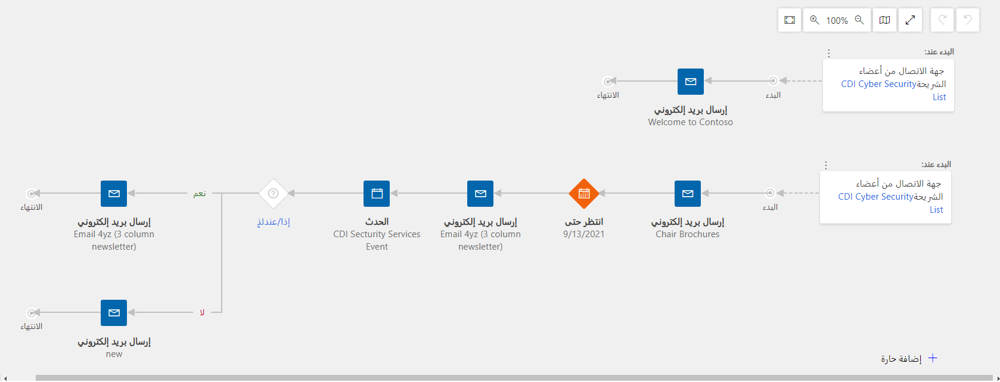

تشير رحلات العميل إلى العمليات التي يمكنك من خلالها التفاعل مع عملاء محتملين أو موجودين. يتيح Dynamics 365 Marketing لك إمكانية تصور وأتمتة الرحلة التي ستقطعها جهات اتصالك أثناء تفاعلهم مع مبادراتك التسويقية. يمكنك إنشاء تدفقات تساعد على توجيه أعضاء شريحة التسويق المحددة خلال عملية المراسلة التلقائية وإنشاء الأنشطة ونقاط القرارات التفاعلية والمزيد.

يمكنك إنشاء رحلات عملاء لتشجيع العملاء المتوقعين وتحسين التفاوض عند البيع وعقد الفعاليات وتهيئة العملاء واستبقائهم والمزيد. يمكن للرحلات أن تكون بسيطة وقد تكون معقدة. يمكن أن تتضمن الرحلة البسيطة رسالة بريد إلكتروني واحدة بينما يمكن أن تمثل الرحلة المعقدة حملة متعددة الوجهات تصطحب جهات الاتصال إلى مسارات فريدة عند تفاعلهم مع رسائلك.

للوصول إلى رحلات العميل، انتقل إلى **التسويق > تنفيذ التسويق > رحلات العميل**. 

## إعداد رحلة عميل

1.  لإنشاء رحلة عميل، انتقل إلى **رحلات العميل** وحدد **+ جديد** في شريط الأوامر.

1.  يمكنك تحديد قالب أو النقر فوق **تخطي** للبدء من نقطة البداية.

    -   في Dynamics 365 Marketing، يمكنك اختيار قالب من مجموعة نماذج قوالب أو إنشاء القوالب الخاصة بك. إذا حددت البدء من قالب، فسيؤدي ذلك إلى إنشاء بنية الرحلة لك. 

    -   تعمل المسارات التي يوفرها القالب على توفير نموذج ومنطق الحملة الخاصة بك، ولكنك ستظل بحاجة لتكوين تفاصيل الإطارات المتجانبة المختلفة. علي سبيل المثال، سيتعين عليك تعيين رسالة البريد الإلكتروني التسويقي المحددة التي يجب أن يرسلها كل إطار بريد إلكتروني متجانب. 

        > [!NOTE] 
        > عندما تُنشئ رحلة جديدة من قالب، يتم نسخ محتوى القالب إلى رسالتك الجديدة. لا يوجد ارتباط بين الرحلة والقالب، لذا يمكنك تحرير مسار الرحلة؛ ولن يتغير القالب، وبالمثل، فإن أي تغييرات مستقبلية تجريها على القالب لن تؤثر على أي رحلات موجودة تم إنشاؤها باستخدامه. للحصول على المزيد من المعلومات، راجع [إنشاء قوالب رحلات العميل وإدارتها](/dynamics365/marketing/journey-templates?azure-portal=true).

1.  املأ المعلومات الأساسية الخاصة بالرحلة.

    -   **الاسم** - أدخل اسماً وصفياً لبريدك الإلكتروني. يُستخدم هذا لتحديد الرحلة في طرق عرض القوائم.

    -   **تاريخ ووقت البدء**- حدد التاريخ والوقت الذي تريد بدء الرحلة فيه.

    -   انقر فوق الزر **المزيد من حقول الرأس** الموجود بجانب الرأس لعرض حقلي **الاسم** و **تاريخ البدء** أثناء العمل في علامة التبويب المصمم.

1.  تكوين رحلة العميل الخاصة بك.

    -   عند إنشاء رحلة عميل أو تحريرها، ستعمل في علامة التبويب **المصمم**. وستظهر لك هنا اللوحات التي ستقوم بإنشاء مسارات الحملة فيها من خلال إضافة الإطارات المتجانبة إلى تدفق منطقي. بعد ذلك، ستقوم بإنشاء إعدادات التكوين لتحديد ما يحدث في كل خطوة من هذه الخطوات. 

    -   يمكنك إضافة إطارات متجانبة إلى المسارات عن طريق تحديدها من القائمة المخفية والتي تظهر في كل مرة تقوم بتحديد **+ الزر** في اللوحة. يقوم الإطار المتجانب الأول في المسار بتحديد الجمهور المستهدف لرحلة العميل. وهذا ما يحدد جهات الاتصال التي يتم إرسالها إلى أسفل المسار. 

    -   عند تحديد الجمهور المستهدف، سيتوفر لديك خيار لاختيار حقل بحث مصدري يمثل **شريحة** أو **نموذج مرسل** أو **سجل محدث**.

        -   **الشريحة**: عبارة عن مجموعة من جهات الاتصال التي تم تجميعها وفقاً لسمة مشتركة أو تعيين صريح. 

        -   إذا حددت استهداف الجمهور حسب نوع المصدر **النموذج المرسل**، فسيتم إرسال جميع جهات الاتصال الجديدة أو الموجودة التي ترسل النموذج الذي قمت بتحديده مقترنة برحلة العميل.

        -   استخدم **السجل المحدث** لمراقبة جميع السجلات التي تنتمي إلى كيان معين، ثم ابحث عن جهة الاتصال التي تقترن بأي من هذه السجلات والتي يتم إنشاؤها أو حذفها أو تحديثها أثناء الرحلة. سيتم إرسال جميع جهات الاتصال التي تم العثور عليها بواسطة هذا الإطار المتجانب مقترنة برحلة العميل.

        -   لمزيد من المعلومات حول كيفية تحديد جمهورك، راجع [الجمهور](/dynamics365/marketing/customer-journey-tiles-reference?azure-portal=true#audience).

    -   بعد تحديد جمهورك المستهدف، يمكنك إضافة إطارات متجانبة باستخدام **الزر +** في اللوحة أو بتحديد عنصر إطار متجانب موجود بالفعل في مسارات رحلتك. 

        -   سيوضح كل إطار متجانب في لوحتك **نوع الإطار المتجانب** سواء كان الإطار المتجانب يخص **شريحة** أو **إرسال بريد إلكتروني** أو **انتظار**، كما سيعرض **اسم الكيان** الذي عينته للإطار المتجانب، **والحالة** في الإطار المتجانب، وما إذا كان قد تم تكوينه أم لا. 
            لتكوين إطار متجانب، قم بتحديده في المسار، ثم انتقل إلى علامة التبويب "إعدادات الإطار المتجانب" على يسار اللوحة. ستُظهر لك علامة التبويب جميع الإعدادات التي تنطبق على نوع الإطار المتجانب الذي حددته. عندما تقوم بإضافة إطار متجانب جديد، يتم تنشيط علامة التبويب "إعدادات" الخاصة به تلقائياً حتى يمكنك البدء في تكوين هذا الإطار المتجانب فوراً.

            > [!TIP] 
            > سيظهر الإطار المتجانب المكوَن كمربع ملون، سيتم وسيظهر الإطار المتجانب غير المكوَن كمربع أبيض.

        -   **الإطارات المتجانبة للرسائل** تمثل المحتوى الذي تقدمه رحلة عميلك لجهات الاتصال خلال مرورهم في مساراتهم.

            -   ومن المهم ملاحظة أنه في بعض الحالات، سيتضمن المحتوى ارتباطاً إلى صفحة منتقل إليها أو حدث قادم أو نموذج سترغب في استخدامه لمنطق الشروط في رحلة العميل الخاصة بك. علي الرغم من اشتمال رسالة البريد الإلكتروني الخاصة بك على ارتباط إلى صفحة وجهة أو حدث، إلا أن رحلة العميل تجهل الارتباط الذي ترغب في استخدامه، وفي هذه الحالة سيتعين عليك الإشارة إلى تبعية البريد الإلكتروني في فئة العناصر أو إلى الإطار المتجانب للبريد الإلكتروني في علامة التبويب **الخصائص**. 

            -   تتيح الإطارات المتجانبة التي تخص **إرسال بريد إلكتروني** لك إمكانية تعيين تواريخ انتهاء صلاحية في البريد الإلكتروني الخاص بك في حالة اشتمال رحلتك على محتوى حساس للوقت. لمزيد من المعلومات راجع [تعيين تاريخ انتهاء صلاحية لرسالة بريد إلكتروني](/dynamics365/marketing/email-expire?azure-portal=true#set-an-expiration-date-for-an-email-message). 

            -   تتضمن الإطارات المتجانبة **إرسال بريد إلكتروني** أيضاً ميزة **الجدولة التلقائية** يتم خلالها تطبيق تقنية الذكاء الاصطناعي لتحديد الأيام والأوقات التي غالباً ما تكون جهة اتصال رحلة العميل الخاصة بك نشطة ومستعدة لقراءة رسالة البريد الإلكتروني الخاصة بها، ومن ثم جدولة عمليات تسليم الرسائل لكل جهة اتصال بحيث تتم في الأوقات التي يحددها الذكاء الاصطناعي بأنها أفضل أوقات إرسال رسائل بريد إلكتروني لجهة الاتصال تلك. لمزيد من المعلومات حول كيفية إنشاء رحلة عميل تستخدم الجدولة التلقائية، راجع [إنشاء رحلة عميل ترسل الرسائل تلقائياً في الوقت الأمثل](/dynamics365/marketing/automated-scheduler?azure-portal=true#create-a-customer-journey-that-automatically-sends-messages-at-the-optimal-time).

                > [!NOTE] 
                > قبل استخدام الجدولة التلقائية، يجب على المسؤول تمكينها وتكوينها. إذا لم تظهر هذه الميزة لك في منطقة **الخصائص** بالإطار المتجانب لبريدك الإلكتروني، فاطلب من المسؤول تمكين الجدولة التلقائية لموقعك. لمزيد من المعلومات، راجع [تمكين ميزات الذكاء الاصطناعي وتكوينها](/dynamics365/marketing/admin-machine-learning?azure-portal=true).

        -   يتم استخدام **الإطارات المتجانبة للفروع** لتقسيم الجمهور المستهدف إما باستخدام الإطار المتجانب **إذا/ثم** الذي يتم الاحتفاظ بجهات الاتصال به حتى يكون الشرط المحدد صحيحاً، أو حتى تنتهي مدة الوقت المحددة، ومن ثم يرسل جهة الاتصال إلى أحد المسارين باستخدام الإطار المتجانب **تقسيم** الذي يضيف تفرعاً إلى مسار رحلة العميل، مما يعمل على إرسال مجموعة جهات اتصال عشوائية لكل مسار متوفر. لمزيد من المعلومات، راجع [الفروع](/dynamics365/marketing/customer-journey-tiles-reference?azure-portal=true#branches).

        -   تعمل الإطارات المتجانبة **انتظار/تأخير** على الاحتفاظ بجهات الاتصال لفترة من الوقت أو لوقت محدد قبل إرسال جهات الاتصال إلى الإطار المتجانب التالي في رحلتك. لمزيد من المعلومات، راجع [انتظار/تأخير](/dynamics365/marketing/customer-journey-tiles-reference?azure-portal=true#waitdelay).

        -   تتيح لك الإطارات المتجانبة **إجراء** إمكانية الوصول إلى خيارات مثل إنشاء فرصة أو تشغيل عملية سير عمل أو إضافة جهة اتصال إلى إحدى حملات LinkedIn بعد وصولها إلى إطار متجانب في رحلة العمل الخاصة بك. للمزيد من المعلومات، راجع [الإجراءات](/dynamics365/marketing/customer-journey-tiles-reference?azure-portal=true#actions).

        -   تقوم الإطارات المتجانبة **أنشطة المبيعات** بإنشاء نشاط Dynamics 365 Marketing جديد مرتبط بجهة الاتصال هذه (أو الشركة أو المؤسسة التي تعمل بها). وبعد ذلك تتجه جهة الاتصال مباشرةً إلى الإطار المتجانب التالي في الرحلة. الأنشطة التي يمكنك استخدامها تتضمن تحديد موعد، إجراء مكالمة هاتفية، أو تعيين مهمة. لمزيد من المعلومات، راجع [أنشطة المبيعات](/dynamics365/marketing/customer-journey-tiles-reference?azure-portal=true#sales-activities).

        -   توفر **الإطارات المتجانبة المخصصة** إمكانات مشابهة مثل الإطارات المتجانبة القياسية الموضحة سابقاً (مثل إرسال اتصال وتعقب تفاعلات العملاء وإضافة المشغلات)، ولكن يتم إنشاؤها بواسطة شركاء ومطوري جهات خارجية لتوسيع الإمكانات التسويقية في Dynamics 365 Marketing. وستظهر هذه الإطارات المتجانبة المخصصة في المصمم إذا قمت بتثبيت قناة مخصصة مطورة بواسطة شريك لرحلات العميل أو قمت بإنشاء ونشر قناتك المخصصة لمثيل Dynamics 365 Marketing الخاص بك. 
            لمزيد من المعلومات، راجع [الإطارات المتجانبة المخصصة](/dynamics365/marketing/customer-journey-tiles-reference?azure-portal=true#custom-tiles) و[توسيع نطاق رحلات العميل باستخدام القنوات المخصصة](/dynamics365/marketing/developer/extend-customer-journeys-custom-channels?azure-portal=true).

        -   للحصول علي قائمة كاملة بجميع الإطارات المتجانبة والمعلومات المتوفرة حول كيفية استخدامها، راجع [مرجع الإطارات المتجانبة لرحلات العميل](/dynamics365/marketing/customer-journey-tiles-reference?azire-portal=true).

        -   تمنحك **الحارات** القدرة علي تحديد فئات جمهور متعددة ضمن رحلة عميل واحدة ومن ثم إرسالهم نحو مسارات مختلفة استناداً إلى المعايير الديموغرافية أو الإجراءات التي نفذوها. 
            يمكنك تنفيذ ذلك بتحديد الزر **+الحارة** حيث سيجري معك خطوات إنشاء مسار آخر لرحلة العميل، بدءاً بتحديد الجمهور المستهدف. 

            > [!div class="mx-imgBorder"]
            > 

        > [!TIP] 
        > يمكنك أيضاً تخصيص لوحة مصمم لتفضيلاتك باستخدام خيارات التخطيط الأفقي والرأسي. علي الرغم من أن معظم الأشخاص يقومون بإضافة الإطارات المتجانبة وترتيبها عن طريق تحديدها من القائمة المخفية باستخدام الماوس، إلا أنه يمكنك أيضاً إضافة إطارات متجانبة دون استخدام الماوس على الإطلاق. وتعمل طرق الإدخال الاختيارية تلك على جعل مصمم رحلة العميل أكثر قابلية للتكيف مع تفضيلات عملك مع إتاحة الوصول إليه بشكل أكبر للأشخاص الذين لديهم مشكلة في العمل باستخدام الماوس. لمزيد من المعلومات عن هذه الأمر، راجع [إضافة الإطار المتجانب باستخدام مفاتيح الأسهم](/dynamics365/marketing/customer-journeys-create-automated-campaigns?azure-portal=true#add-tiles-using-the-arrow-keys). 
  
1.  تحديث الإعدادات الإضافية. 

    -   من علامة التبويب **عام**، يمكنك مراجعة بعض الإعدادات الرئيسية وتحديثها، والتي تشمل:

    -   **الهدف** - تعيين كل رحلة عميل على هدف سواء كان يمثل جهات اتصال أو حسابات.

        -   عندما تستهدف **جهات الاتصال**، ستعامل الرحلة كل جهة اتصال كفرد، من دون مراعاة الشركة (الحساب) التي تعمل فيها جهة الاتصال.

        -   عندما تستهدف **الحسابات**، بإمكان الرحلة تجميع جهات الاتصال حسب الشركة (حساب) التي تعمل فيها كل جهة اتصال، مما قد يؤثر على الطريقة التي تتم بها معالجة جهات الاتصال أثناء اجتيازها الرحلة.

        -   لمزيد من المعلومات، راجع [جهات الاتصال أو الحسابات المستهدفة](/dynamics365/marketing/customer-journeys-create-automated-campaigns?azure-portal=true#target-contacts-or-accounts).

    -   تعيين مستوى **الموافقة الأدنى**.

        -   في حالة تمكين حماية البيانات للمثيل الخاص بك، استخدم هذا الإعداد للتحكم في الحد الأدنى لمستوى الموافقة الذي يجب أن تكون عليه كل جهة اتصال متوفرة ليتم تضمينها في هذه الرحلة.
            ينبغي أن يستند المستوى الذي تختاره إلى أنواع العمليات التي ستقوم رحلتك بتنفيذها.

        -   لمزيد من المعلومات، راجع [تعيين الحد الأدنى لمستوى الموافقة](/dynamics365/marketing/customer-journeys-create-automated-campaigns?azure-portal=true#set-the-minimum-consent-level) و[حماية البيانات والقانون العام لحماية البيانات](/dynamics365/marketing/gdpr?azure-portal=true).

    -   تعيين **نطاق وحدة الأعمال**.

        -   نطاقات وحدات الأعمال هي ميزة اختيارية. عند تمكينها للمثيل الخاص بك، ستشتمل علامة التبويب **عام** على إعداد **النطاق**، الذي يتحكم في تحديد جهات الاتصال التي سيتم السماح لها بالانضمام للرحلة استناداً إلى ملكية وحدة الأعمال.

        -   لمزيد من المعلومات، راجع [تعيين نطاق وحدة الأعمال](/dynamics365/marketing/customer-journeys-create-automated-campaigns?azure-portal=true#set-the-business-unit-scope) و[استخدم وحدات الأعمال للتحكم في الوصول إلى سجلات التسويق](/dynamics365/marketing/business-units?azure-portal=true).

    -   تعيين جدول التنفيذ.

        -   **تاريخ البدء**: هذا الحقل مطلوب. حدد تاريخ البدء الذي ينبغي أن تبدأ رحلة العميل فيه.

        -   **تاريخ الانتهاء** - هذا الحقل مطلوب. حدد تاريخ الانتهاء الذي ينبغي أن تنتهي رحلة العميل فيه. يمكنك تحرير هذا الحقل بعد بدء الرحلة.

        -   **المنطقة الزمنية** - هذا الحقل مطلوب. يتم تعيين المنطقة الزمنية بشكل افتراضي على المنطقة الزمنية المرتبطة بالمستخدم الذي أنشأ الحدث. يمكنك تغيير هذا الحقل لكل رحلة عميل إذا تطلب الأمر، ولكن *لا يمكنك* تحرير هذا الحقل بعد بدء الرحلة.

    -   حدد إعدادات المحتوى.

        -   تستخدم رحلة العميل سجل إعدادات محتوى محدد.
            وهذا يعني أن جميع الرسائل التي يتم إرسالها بواسطة هذه الرحلة ستستخدم نفس إعدادات المحتوى.

        -   وبشكل افتراضي، يتم تعيين رحلات العميل لاستخدام سجل **إعدادات المحتوى الافتراضية**، لذا سيتعين عليك تغيير هذا الحقل إذا أردت استخدام سجل إعداد محتوى مختلف لرحلتك.

        -   *لا يمكنك* تغيير إعدادات المحتوى بعد انطلاق الرحلة.

        -   لمزيد من المعلومات، راجع [اختيار إعدادات المحتوى](/dynamics365/marketing/customer-journeys-create-automated-campaigns#choose-your-content-settings) و[استخدام إعدادات المحتوى لإعداد مستودعات القيم المطلوبة والقياسية لرسائل البريد الإلكتروني](/dynamics365/marketing/dynamic-email-content#content-settings).

    -   قم بإدارة إعداد الرحلة المتكررة (إذا لزم الأمر).

        -   عادة ما تصطحب الرحلة كل جهة اتصال في مسارها مرة واحدة على وجه التحديد. وبالرغم من ذلك، يمكنك إعداد رحلة متكررة تتم خلالها إعادة معالجة جميع جهات الاتصال على فترات منتظمة خلال فترة النشاط.

        -   لمزيد من المعلومات، راجع [إعداد رحلة متكررة](/dynamics365/marketing/customer-journeys-create-automated-campaigns#set-up-a-recurring-journey).

    -   قم بإضافة شريحة خاملة (إذا لزم الأمر).

        -   تشتمل شريحة الرحلة الخاملة على قائمة بجهات الاتصال التي لن ترسل لها الرحلة أي رسائل، حتى وإن كانت جهات الاتصال هذه مضمنةً أيضاً في المقاطع التي تستهدفها الرحلة بشكل صريح، بل وحتى إذا كانت جهات الاتصال هذه تمثل جزءاً من تلك الرحلة.

        -   يمكنك استخدام أي شريحة موجودة كشريحة خاملة.

        -   لمزيد من المعلومات، راجع [إضافة شريحة خاملة](/dynamics365/marketing/customer-journeys-create-automated-campaigns#add-a-suppression-segment).

    -   احفظ تغييراتك.

لمزيد من المعلومات، راجع [استخدام رحلات العميل لإنشاء حملات مؤتمتة](/dynamics365/marketing/customer-journeys-create-automated-campaigns).

## التحقق من الأخطاء وبدء التنشيط

قبل أن تتمكن من بدء إطلاق رحلة العميل، يجب أن تجتاز الرحلة مرحلة التحقق من الأخطاء. يمكنك إجراء عملية التحقق من الأخطاء في أي وقت عن طريق تحديد **التحقق من الأخطاء** في شريط الأوامر. يتم إجراء عملية التحقق من الأخطاء تلقائياً كلما حددت **البدء الفوري**. عندما يحل **تاريخ البدء** المحدد، ستبدأ الرحلة في معالجة جميع جهات الاتصال الموجودة في شريحتها المستهدفة.

## إجراء عمليات تحرير لرحلة عميل جارية

عندما تكون الرحلة جارية، فإنها تكون مؤمنة ضد التحرير في Dynamics 365 for Marketing. ومع ذلك، سيظل بمقدورك إجراء تغييرات بعد بدء العميل للرحلة.

لتحرير رحلة عميل جارية، انتقل إلى **التسويق > التنفيذ التسويقي > رحلات العميل**، وافتح رحلات العميل الجارية التي تريد تحريرها، ثم حدد **تحرير** في شريط الأوامر. يمكنك إجراء التغييرات اللازمة على البريد الإلكتروني التسويقي ثم تحديد **حفظ**. سيقوم النظام تلقائياً بالتحقق من الأخطاء، وسيبدأ في إرسال الرسائل.

نظراً لطبيعة رحلات العميل، فإن Dynamics 365 Marketing تحد من القدرة على تغيير بنية ودفق رحلة العميل. ومع ذلك، يستطيع المستخدمون تغيير وتحديث إطارات متجانبة محددة أو تفاصيل أخرى للرحلة، مثل تاريخ الانتهاء. ينبغي أن تحكم وعيك عند إجراء تغييرات أساسية على محتوى الرحلة. لن تظهر التغييرات للعملاء الذين تمت معالجتهم بالفعل خلال الإطار المتجانب.

يمكنك إيقاف رحلة العميل عن طريق تحديد **إيقاف** في شريط الأوامر. عند تكون رحلة العميل بالحالة **تم الإيقاف**، فهذا يعني أنه تم إطلاقها من قبل، ومن المحتمل أنها عالجت بعض جهات الاتصال، ولكنها متوقفة الآن، وبالتالي لن تقوم بمعالجة أي جهات اتصال إضافية ولن تتخذ أي إجراءات أخرى. ستتوقف رحلة العميل تلقائياً، حينما يحل تاريخ الانتهاء. حينما تتوقف الرحلة، يمكنك تحرير الرحلة وحفظها دون الحاجة لإطلاقها. حدد **بدء فوري** عندما تكون مستعداً.

لمزيد من المعلومات، راجع [البدء الفوري لتشغيل الرحلة ومعالجة جهات الاتصال](/dynamics365/marketing/customer-journeys-create-automated-campaigns#go-live-to-start-running-the-journey-and-processing-contacts) و

[البدء الفوري للكيانات القابلة للنشر وتتبع حالاتها](/dynamics365/marketing/go-live).
