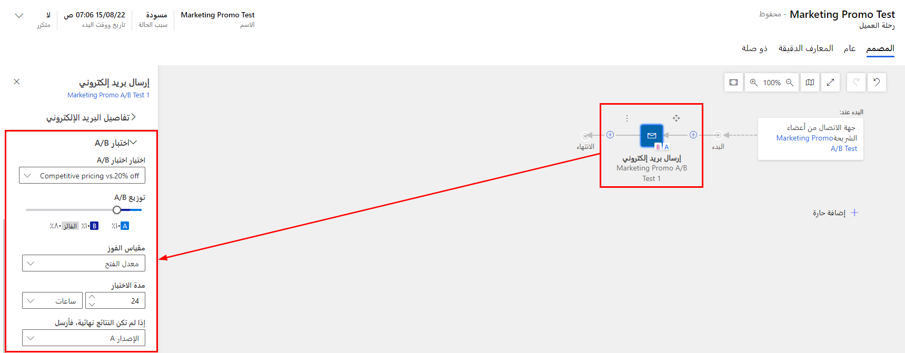

يُمكنك استخدام اختبار A/B لمعرفة أي من النموذجين المتشابهين لرسائل الرسالة الإلكترونية قد يكون أكثر نجاحاً عند إرساله إلى جمهورك المستهدف. يُساعد الاختبار على ضمان إرسال التصميم الفائز تلقائياً إلى الجمهور المتبقي في رحلة العميل. 

تم ذكر الخطوات المتضمنة في تصميم اختبار A/B لرسالة بريد إلكتروني في وحدة سابقة. لبدء A/B، تحتاج إلى إعداد رحلة العميل وتحديد تفاصيل الاختبار.

ضمن رحلة العميل، يمكنك إضافة إطار بريد إلكتروني متجانب وتحديد رسالة الرسالة الإلكترونية باستخدام اختبار A/B. عندما يكون للرسالة اختبار A/B مصمم لها، فإن الإطار المتجانب الموجود داخل الرحلة يظهر رمزي A وB في الزاوية. تبدأ هذه الإطارات المتجانبة باللون الرمادي لأنك لم تقم بعد بإعداد الاختبار لهذا الإطار المتجانب (ستتحول إلى اللون الأزرق بعد تمكين الاختبار). بمجرد إضافة الرسالة الإلكترونية، تحتاج إلى تحديد تفاصيل الاختبار، بما في ذلك:

-   **اختر اختبار A/B**: يجب أن يحتوي تصميم الرسالة الإلكترونية المحدد على إعداد اختبار واحد على الأقل لم يتم استخدامه، ولكن قد يحتوي على أكثر من ذلك. حدد اسم الاختبار الذي تريد تشغيله على هذا المربع. يمكنك تشغيل اختبار واحد فقط في كل مرة.

-   **النسبة المئوية لتوزيع A/B**: يحدد هذا عدد جهات الاتصال (كنسبة مئوية من العدد الإجمالي لجهات الاتصال في المقطع الهدف) الذي ترغب في تضمينه في الاختبار. يمكنك الاختيار من 10 أو 20 أو 30 أو 40 أو 50. 
    على سبيل المثال، إذا اخترت 10%، فهذا يعني أن 10% من مقطعك ستتلقى الإصدار A و10% ستتلقى الإصدار B. يتم تحديد كافة جهات اتصال الاختبار، والإصدارات التي يتلقاها كل منها، عشوائياً.

-   **مقياس الفائز**: يحدد هذا التصميم الفائز بناءً على معدل النقر بالماوس (عدد المرات التي نقر فيها المستلم على رابط في الرسالة) أو على معدل الفتح (عدد المرات التي فتح فيها المستلم الرسالة). في كل حالة، الفائز هو الإصدار الذي حقق أكبر عدد من النقرات أو تم فتحه كنسبة من إجمالي عدد مرات إرسال هذا الإصدار.

-   **مدة الاختبار**: تقوم هذه الإعدادات بتأسيس مدة تشغيل الاختبار. للحصول على أفضل النتائج، نوصي بإجراء كل اختبار لمدة 24 ساعة على الأقل، أو أكثر إذا كان ذلك ممكناً. خاصةً إذا كنت تستهدف جمهوراً عالمياً (لتعويض فروق المناطق الزمنية). في نهاية هذا الوقت، سيقوم النظام بتحليل النتائج وإرسال التصميم الفائز إلى جهات الاتصال المتبقية في المقطع. لن تتم إعادة إرسال جهات الاتصال التي تلقت تصميم *خاسر* إلى الفائز. 

بمجرد بدء الرحلة، سيبدأ الاختبار. يبدأ بإرسال الإصدار A إلى جزء صغير من المقطع الخاص بك بينما يرسل أيضاً الإصدار B إلى جزء آخر من المقطع. ينتظر فترة زمنية تختارها ثم يحلل نتائج التفاعل ويختار فائزاً بناءً على المعايير التي حددتها. ثم ترسل الرحلة النموذج الفائز إلى بقية الشريحة تلقائياً.

> [!div class="mx-imgBorder"]
> 

> [!IMPORTANT] 
> للحصول على نتائج اختبار موثوقة، يجب عليك دائماً إرسال كل إصدار (A وB) إلى ما لا يقل عن 100 مستلم قبل السماح للنظام باختيار الفائز. قد يستخدم الإعداد النموذجي الموصى به مقطع مكون من 1000 عضو (أو أكبر)، مع توزيع اختباري يرسل الإصدار A إلى 10% من المقطع، والإصدار B إلى 10% أخرى، ثم يرسل التصميم الفائز إلى نسبة 80% المتبقية.

من الممكن إجراء اختبار A/B بأقل قدر من المستلمين لكل إصدار، ولكن هذا يمكن أن يؤدي في كثير من الأحيان إلى توزيع غير متكافئ أو غير عشوائي للإصدارات ونتائج نهائية غير موثوقة. نوصي بإجراء ذلك فقط أثناء تجربة الميزة.

لمزيد من المعلومات، راجع [الإعداد لتنفيذ الاختبار من رحلة العميل](/dynamics365/marketing/email-a-b-testing?azure-portal=true#prepare-to-execute-your-test-from-a-customer-journey).
