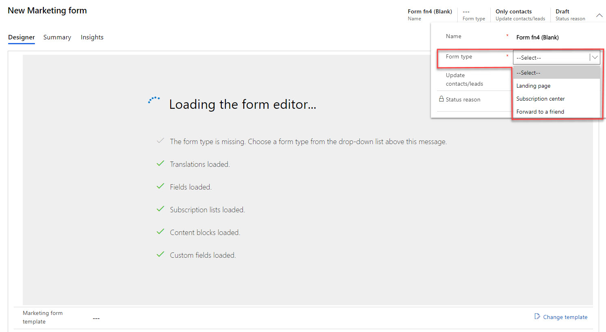
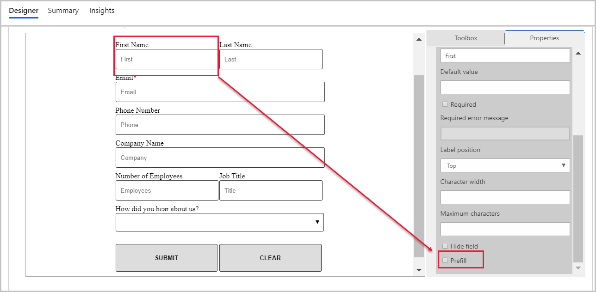

نموذج التسويق هو نموذج إدخال يُضاف إلى صفحة التسويق. تُتيح نماذج التسويق للزائرين إرسال معلوماتهم للتفاعل مع مبادرات التسويق وإدارة اشتراكاتهم في القوائم البريدية، والمزيد غير ذلك. يحصل Dynamics 365 تلقائياً على جميع المعلومات المرسلة عبر نموذج التسويق ويتم تطبيقها مباشرةً على سجلات جهات الاتصال والعملاء المتوقعين.

يمكن إضافة نماذج التسويق إلى صفحات التسويق في Dynamics 365 أو صفحات ويب خارجية.

الأنواع الأربعة لنماذج التسويق هي:

-   **الصفحة المقصودة** - هو نموذج لأغراض عامة لتجميع معلومات جهات الاتصال في صفحات التسويق التي ليست مراكز اشتراكات ولا نماذج إعادة توجيه.

-   **الاشتراك** - يوفر الحقول حيث يمكن لجهات الاتصال عرض تفاصيل جهات الاتصال الخاصة بهم وتحريرها ويعرض مجموعة من القوائم البريدية (مع مربعات الاختيار) حيث يمكن لجهة الاتصال إضافة أو إزالة الاشتراكات.

-   **إعادة توجيه إلى صديق** - يوفر مجموعة قصيرة من الحقول، سيقبل كلُّ منها عنوان بريد إلكتروني تُدخله جهات الاتصال عند إعادة توجيه رسالة تسويقية إلى زملاء آخرين.

-   **تسجيل الأحداث** - نموذج يمكن استخدامه لإنشاء سجلات تسجيل الأحداث في أحداث Dynamics 365. يمكن إضافة نماذج تسجيل الأحداث إلى صفحات التسويق في Dynamics 365، أو موقع الويب الخاص بك، أو استخدامها مباشرة في سجل الحدث بدلاً من حقول تسجيل الأحداث الجاهزة.

لمزيد من المعلومات، راجع [إنشاء نماذج التسويق وعرضها وإدارتها](/dynamics365/marketing/marketing-forms/?azure-portal=true) و[استخدام نماذج التسويق لتسجيل الأحداث](/dynamics365/marketing/event-forms?azure-portal=true).

## تحديد احتياجات النموذج

لبدء إنشاء نموذج تسويق، حدد المعلومات التي تريد تضمينها في النموذج لديك. يجب إعداد كل حقل مضمن في النموذج الخاص بك في Dynamics 365 Marketing كحقل نموذج تسويق، والذي ينشئ خيارات لكيفية تقديم هذا الحقل في النماذج التي يظهر فيها، وحقول العميل المتوقع أو جهة الاتصال التي يعيِّنها في قاعدة البيانات.  عند تصميم نموذج، تعرض علامة تبويب **‏‫مربع الأدوات** في **المصمم** قائمة الحقول التي تم إعدادها بالفعل، ومن ثمّ يمكنك إضافة هذا الحقل عن طريق سحب عنصر الحقل المطابق إلى النموذج لديك. يتم إعداد الحقول الأكثر استخداماً (مثل، الاسم الأول واسم العائلة والعنوان والبريد الإلكتروني) بشكل افتراضي. إذا كنت تريد استخدام حقول إضافية، فيجب عليك تكوينها قبل إنشاء النموذج.

لمراجعة الحقول المكوّنة مسبقاً، انتقل إلى **التسويق الصادر> القوالب > حقول نماذج التسويق**.

يجب إعداد كل حقل مضمن في النموذج الخاص بك في Dynamics 365 Marketing كحقل نموذج تسويق، والذي ينشئ خيارات لكيفية تقديم هذا الحقل في النماذج التي يظهر فيها، وحقول العميل المتوقع أو جهة الاتصال التي يعيِّنها في قاعدة البيانات. اعتماداً على المكان الذي تريد تعيين بيانات حقل نموذج التسويق فيه، ستحتاج إلى:

1. إنشاء حقل نموذج العميل المتوقع. لمزيد من المعلومات، راجع [‏‫إنشاء الحقول وتحريرها (السمات)‬](/dynamics365/customerengagement/on-premises/customize/create-edit-fields/?azure-portal=true).

1. إنشاء حقل نموذج جهة الاتصال. لمزيد من المعلومات، راجع [‏‫إنشاء الحقول وتحريرها (السمات)‬](/dynamics365/customerengagement/on-premises/customize/create-edit-fields/?azure-portal=true).

1. إنشاء حقل نموذج التسويق وتعيينه لحقول العملاء المتوقعين وجهات الاتصال المطابقة. لمعرفة مزيد من المعلومات، راجع [إنشاء حقل نموذج تسويق أو تحريره](/dynamics365/marketing/marketing-fields/?azure-portal=true).

تأكد من عدم تعيين أكثر من حقل نموذج تسويق إلى الحقل نفسه في قاعدة البيانات. وفي حالة تعيين أكثر من حقل، قد تواجه مشاكل مثل قوائم منسدلة فارغة للحقل مزدوج التعيين. إذا واجهت مشاكل ذات صلة بتعيينات الحقول المتكررة، فاحذف جميع الحقول المتكررة، وأنشئ حقلاً جديداً لاستبدالها، ثم حدّث النماذج كما تقتضي الحاجة.

## تصميم نموذج

لعرض نموذج تسويق جديد أو تحريره أو حذفه أو إنشائه، انتقل إلى **التسويق > التسويق عبر الإنترنت> نماذج التسويق**.

1.  لإنشاء نموذج تسويق جديد، حدد **+ جديد** ‬‏‫في شريط الأوامر‬‏‫.

1.  تحديد قالب. حدد **تخطي** للبدء من الصفر.

    -   في Dynamics 365 Marketing، يمكنك الاختيار من بين مجموعة من نماذج القوالب أو إنشاء القوالب الخاصة بك أو إنشاء نموذج جديد.
        إذا حددت البدء من خلال قالب، فسيؤدي ذلك إلى إنشاء نوع النموذج وتخطيط العمود ونموذج المحتوى لك.

        > [!Note]
        > عندما تُنشئ نموذجاً جديداً من قالب، يتم نسخ محتوى القالب إلى النموذج الجديد لديك. ليس ثمة ارتباط بين النموذج والقالب، لذا يمكنك تحرير النموذج ولن يتغير القالب؛ وبالمثل، فإن أي تغييرات مستقبلية تجريها على القالب لن تؤثر على أي نماذج موجودة تم إنشاؤها باستخدامه.

        > [!Tip]
        > عند البدء من جديد، يجب عليك تحديد **نوع النموذج** قبل البدء في إنشائه. حدد الزر **المزيد من حقول الرأس** في جانب الرأس لعرض حقل **نوع النموذج**. بمجرد تحديد النوع، سيتم تحميل المصمم وسوف تُضاف بعض العناصر (مثل البريد الإلكتروني والإرسال) إلى النموذج من أجلك.

        > [!div class="mx-imgBorder"]
        > 

1.  املأ المعلومات الأساسية حول النموذج.

    -   انقر فوق الزر **المزيد من حقول الرأس** في جانب الرأس لعرض الحقول التالية:

        -   **الاسم** - أدخل أدخل اسماً وصفياً للنموذج. يُستخدَم لتحديد النموذج في طرق عرض القائمة وصفحات التسويق. 

        -   **نوع النموذج** - يحدد ما إذا كان النموذج سيعمل كصفحة منتقل إليها أو مركز اشتراك أو إعادة توجيه إلى صديق أو تسجيل حدث.

            > [!Tip]
            > يُتيح لك تطبيق إدارة الأحداث الآن استخدام نماذج التسويق لتسجيلات الأحداث. يمكنك إنشاء نماذج تحتوي على مجموعة متنوعة من الحقول وتضمينها في موقعك على الويب واستخدامها لتسجيل الحدث. سترى **تسجيل الحدث** فقط كخيار في هذا الحقل إذا تم تشغيل ميزة نماذج تسجيل الحدث. لمزيد من المعلومات ، راجع [استخدام نماذج التسويق لتسجيل الحدث](/dynamics365/marketing/event-forms/?azure-portal=true).

            يجب على المسؤول تمكين نماذج تسجيل الحدث من قبل، حتى يمكنك إنشاؤها. إذا كنت لا ترى هذا الخيار في حقل **نوع النموذج**، فاطلب من المسؤول تمكين نماذج تسجيل الحدث لموقعك. لمزيد من المعلومات، راجع [استخدام تبديل الميزات لتمكين ميزات المعاينة والاختيارية أو تعطيلها](/dynamics365/marketing/admin-feature-switches/?azure-portal=true).

        -   **تحديث جهات الاتصال/العملاء المتوقعين** - يحدد هذا الحقل أنواع السجلات التي يمكن إنشاؤها أو تحديثها استجابةً لعملية إرسال نموذج.

            - يتوفر هذا الحقل لنماذج **الصفحة المنتقل إليها** و **مركز الاشتراك** فقط. سيتم تأمين هذا الحقل لنماذج **إعادة التوجيه إلى صديق** ولن يظهر لنماذج **تسجيل الحدث**. 

            - ثمة أربعة خيارات للاختيار من بينها هي: **جهات اتصال وعملاء متوقعون** و **جهات اتصال فقط** و **عملاء متوقعون فقط** و **لا تحديث**. تظهر الخيارات الثلاثة الأولى بشكل افتراضي. يجب تمكين المسؤول للخيار **لا تحديث**. ومن الضروري فهم مدى تأثير تحديثات النماذج على إنشاء جهات الاتصال والعملاء المتوقعين وتحديثات السجلات ونقاط العملاء المتوقعين وسجلات التفاعل. راجع المقالة [كيف تؤثر إعدادات النموذج على نقاط العميل المتوقع وسجلات التفاعل](/dynamics365/marketing/marketing-forms?azure-portal=true#how-form-settings-affect-lead-scoring-and-interaction-records) لتحديد الخيار المراد اختياره لكل نموذج تسويق.

    لمزيد من المعلومات، راجع [الإعدادات في الرأس](/dynamics365/marketing/marketing-forms?azure-portal=true#settings-in-the-header).

1.  تصميم النموذج الخاص بك.

    -   بعد ملء المعلومات الأساسية حول النموذج لديك، يمكنك البدء في إضافة الحقول والأزرار والعناصر الرسومية المختلفة التي يتطلبها النموذج وتكوينها وترتيبها. يشبه مصمم النماذج أنواعاً أخرى من مصممي المحتوى الرقمي في Dynamics 365 Marketing، ولكنه يوفر فقط عناصر التصميم والإعدادات المناسبة لنماذج التسويق.

    -   لمزيد من المعلومات، راجع [‏‫إنشاء نماذج التسويق وتحريرها](/dynamics365/marketing/marketing-forms?azure-portal=true#create-and-edit-marketing-forms). 

1.  تحديث الإعدادات الإضافية.

    -   من علامة تبويب **الملخص**، يمكنك مراجعة بعض الإعدادات الرئيسية وتحديثها، والتي تشمل:

        -   **إستراتيجيات مطابقة جهات الاتصال** و **‏‫إستراتيجيات مطابقة العملاء المتوقعين** - عيِّن هذه الخيارات للتحكم في قيم حقول النماذج الواردة التي التي تتم مطابقتها مع سجلات جهات الاتصال والعملاء المتوقعين الموجودة. هذه الإعدادات افتراضية للإستراتيجيات المحددة كافتراضية، ولكن إذا تم تكوين إستراتيجيات إضافية، فسوف يمكنك تغيير هذه الإعدادات حسب الحاجة.

        -   **‏‫إنشاء عملاء متوقعين دون مطابقة** - يتحكم في ما إذا كان النموذج سيحاول مطابقة عميل متوقع موجود أم لا.

        -   **التعبئة المسبقة للحقول‬** - يمكنك تعيين هذا الخيار إلى **نعم** لتمكين التعبئة المسبقة للنموذج؛ وتعيينه إلى **لا** لتعطيله. يمكنك تغيير هذا الخيار لنماذج الصفحة المنتقل إليها فقط. تستخدم نماذج مركز الاشتراك التعبئة المسبقة دائماً، في حين لا تستخدمها نماذج إعادة التوجيه إلى صديق إطلاقاً.‬ ستتم مناقشة الخطوات المتبعة لتمكين التعبئة المسبقة لاحقاً في هذه الوحدة.

    -   **غرض النموذج** و **النمط المرئي** - لا يؤثر هذان الإعدادان على التخطيط الفعلي للنموذج أو وظائفه بأي حال من الأحوال. تؤثر هذه القيم على كيفية العثور على النموذج في معرض القوالب. في حالة إنشائك قالب نموذج، نوصي بتعبئة هذه الحقول لمساعدة المستخدمين في البحث عن قالب نموذج في معرض القوالب.

        لمزيد من المعلومات، راجع [الإعدادات في علامة تبويب الملخص](/dynamics365/marketing/marketing-forms?azure-portal=true#settings-on-the-summary-tab).

1.  تحديد أسلوب الإرسال للنموذج.

    -   في علامة تبويب **الملخص**، تحدد الإعدادات الموجودة في قسم أسلوب الإرسال طريقة تفاعل النموذج مع الأشخاص الذين يرسلونه. وهي إعدادات افتراضية لوقت وضع النموذج في صفحة تسويق باستخدام عنصر نموذج، إلا أنه يمكنك تجاوزها عن طريق تحرير خصائص عنصر النموذج في صفحة التسويق. 

    -   كما أنها تحدد أيضاً الأسلوب لحين تضمين النموذج في موقع ويب خارجي. 

    -   صُممت نماذج التسويق لإرسال قيم جميع الحقول الإلزامية والحقول المستخدمة في مطابقة جهات الاتصال والعملاء المتوقعين والكشف عن التكرارات‬. قد يؤدي وجود أخطاء في تصميم النموذج أو التغيير في إعدادات النظام إلى فشل عمليات إرسال النموذج في بعض الأحيان. 
        عند فشل الإرسال، سيقوم النظام بتخزين ما يمكنه من عملية الإرسال الخاطئة حتى يمكنك فحصها لاحقاً وربما استرداد المعلومات الأساسية منها. لمزيد من المعلومات، راجع [ما سبب فشل عمليات الإرسال](/dynamics365/marketing/failed-submissions?azure-portal=true#why-submissions-can-fail).

    -   يمكنك، بشكل اختياري، تكوين النظام للاحتفاظ أيضاً بجميع عمليات إرسال النماذج الواردة، بما في ذلك عمليات الإرسال التي تمت بنجاح وتم معالجتها وتطبيقها على قاعدة بياناتك بالفعل. وإذا كنت تريد تخزين جميع عمليات إرسال النماذج، فقم بتعيين حقل **تخزين إرسال النماذج** إلى **نعم**. لمزيد من المعلومات، راجع [حدد ما إذا كنت تريد الاحتفاظ بكافة عمليات الإرسال الواردة أو الفاشلة فقط](/dynamics365/marketing/failed-submissions?azure-portal=true#choose-whether-to-keep-all-incoming-submissions-or-just-failures).

1.  احفظ تغييراتك.

1.  معاينه النموذج.

    - بعد الانتهاء من تصميم النموذج، يمكنك استخدام ميزات المراجعة المضمّنة لعرض كيفية ظهور النموذج.
     
    - انتقل إلى علامة التبويب **معاينة**. يمكنك التبديل بين **جهاز مكتبي** و **كمبيوتر لوحي** و **محمول** لرؤية طريقة ظهور النموذج على مختلف الأجهزة.
    
    - إذا كنت ترغب في إجراء أي تغييرات، فارجع إلى علامة التبويب **المصمم**.

1.  احفظ أي تغييرات إضافية.

لمزيد من المعلومات، راجع [تصميم محتوى النموذج والتحقق من صحته‬](/dynamics365/marketing/marketing-forms?azure-portal=true#design-and-validate-your-form-content).

## تمكين التعبئة المسبقة للنماذج

يمكن للمسوّقين تمكين ميزات التعبئة المسبقة في نماذج التسويق لديهم التي تُوفر لجهات الاتصال المرسلة نموذجاً يعرض بالفعل معلومات خاصة بها تم إدخالها مسبقاً، مثل الاسم وعنوان البريد الإلكتروني. تجد جهات الاتصال غالباً أن النماذج المعبأة مسبقاً أكثر ملاءمة، مما قد يعمل على تحسين معدل الإرسال وجودة بياناتك على الأرجح.

> [!IMPORTANT]
> عند تمكين ميزة التعبئة المسبقة في النماذج لديك، يجب عليك أيضاً مراعاة خصوصية جهات الاتصال حتى يمكنك التحكم في حقول النماذج التي ستسمح فيها بالتعبئة المسبقة. بالإضافة إلى ذلك، يمكن لكل جهة اتصال أن تختار لنفسها ما إذا كانت تريد السماح بنماذج الصفحات المنتقل إليها المعبأة مسبقاً أم لا. ومع ذلك، تدعم نماذج مراكز الاشتراك دائماً التعبئة المسبقة بفضل الدور الذي تؤديه في النظام.

يدعم Dynamics 365 Marketing ثلاثة أنواع مختلفة من نماذج التسويق: **الصفحات المنتقل إليها** و **مراكز الاشتراك** و **إعادة التوجيه إلى صديق**.
ونظراً لاختلاف كل نموذج عن الآخر، فإن كلاً منها يتعامل مع التعبئة المسبقة بشكل مختلف. لعرض طريقة تعامل كل نموذج مع التعبئة المسبقة، راجع [‏‫كيفية عمل التعبئة المسبقة لأنواع النماذج المختلفة‬](/dynamics365/marketing/form-prefill?azure-portal=true#how-prefilling-works-for-different-types-of-forms).

تمكين النموذج هو عملية تتألف من خطوتين. لإنشاء نموذج مع تمكين التعبئة المسبقة، اتبع الخطوات التالية:

1.  انتقل إلى **التسويق الصادر > التسويق عبر الإنترنت > نماذج التسويق**، ثم افتح نموذجاً موجوداً. انتقل إلى علامة تبويب **الملخص** وابحث عن قسم **المحتوى** . تأكد من تعيين إعداد **التعبئة المسبقة للحقول** إلى **نعم**. (إذا تم تعيين هذا الإعداد إلى **لا**، فلن يدعم النموذج التعبئة المُسبَقة لأي حقول.)

1.  لا يسمح أي حقل من الحقول المضافة إلى النموذج بالتعبئة المسبقة افتراضياً.
    بعد تمكين التعبئة المسبقة لنموذج، انتقل إلى علامة تبويب **المصمم** في النموذج، وحدد عنصر الحقل في اللوحة التي تريد تمكين التعبئة المسبقة لها، وافتح علامة التبويب **خصائص** في اللوحة الجانبية، ثم حدد خانة الاختيار **تعبئة مسبقة**.

    تأكد من أنّ نموذجك يتضمن عنصر **تذكرني**. يؤدي هذا التحديد إلى إنشاء خانة الاختيار التي يمكن لجهات الاتصال استخدامها للتحكم في ميزة التعبئة المسبقة. (تتم عادةً إضافة هذا الحقل تلقائياً عندما تقوم بتمكين التعبئة المسبقة للنموذج.)

لمزيد من المعلومات، راجع [تمكين التعبئة المسبقة للنماذج](/dynamics365/marketing/form-prefill/?azure-portal=true).

## التحقق من الأخطاء وبدء التنشيط

يبقى نموذج التسويق في حالة **مسودة** أثناء إنشائه، ومن ثمّ يكون قابلاً للتحرير في Dynamics 365 Marketing، إلا أنه لن يكون متاحاً للاستخدام في صفحات التسويق. عندما يصبح نموذجك جاهزاً للاستخدام، يجب عليك نشره عن طريق تحديد **عرض مباشر** من شريط الأوامر. سيتم التحقق من عدم وجود أخطاء في التصميم، وفي حالة اجتياز هذه المرحلة، سوف يُنقل إلى حالة **عرض مباشر**، وبالتالي يصبح متاحاً للاستخدام على صفحة تسويق أو لتضمينه في موقع خارجي. وفي حالة وجود مشكلة، يُرجى قراءة رسالة الخطأ أعلى صفحة النموذج، وحل هذه المشكلة، ثم المحاولة مرة أخرى.

لمزيد من المعلومات، راجع [الانتقال إلى وضع العرض المباشر لجعل نموذج التسويق متاحاً للاستخدام](/dynamics365/marketing/marketing-forms?azure-portal=true#go-live-to-make-your-marketing-form-available-for-use) و[‏‫عمليات العرض المباشر لنماذج التسويق وحالتها‬](/dynamics365/marketing/go-live?azure-portal=true#marketing-forms-go-live-operations-and-status).

## إجراء عمليات تحرير لنموذج مباشر

يمكنك تحرير نموذج مباشر عن طريق تحديد **تحرير** في شريط الأوامر. وأثناء قيامك بتحرير النموذج، فإنه يظل يعمل في جميع الصفحات المباشرة التي يجري استخدامه بها بالفعل ويكون متاحاً للاستخدام في صفحات جديدة. بعد تحرير النموذج، حدد **حفظ**. سيخضع تصميمك لعملية تحقق من الأخطاء وفور تجاوزها سيتم نشر تحديثاتك.

لمزيد من المعلومات، راجع [‬‏‫الانتقال إلى وضع العرض المباشر لجعل نموذج التسويق متاحاً للاستخدام‬‏‫](/dynamics365/marketing/marketing-forms?azure-portal=true#go-live-to-make-your-marketing-form-available-for-use).
