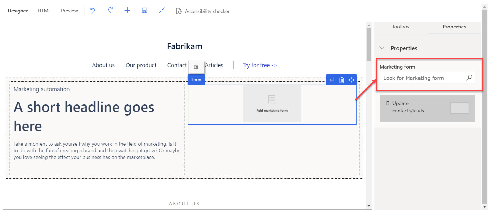
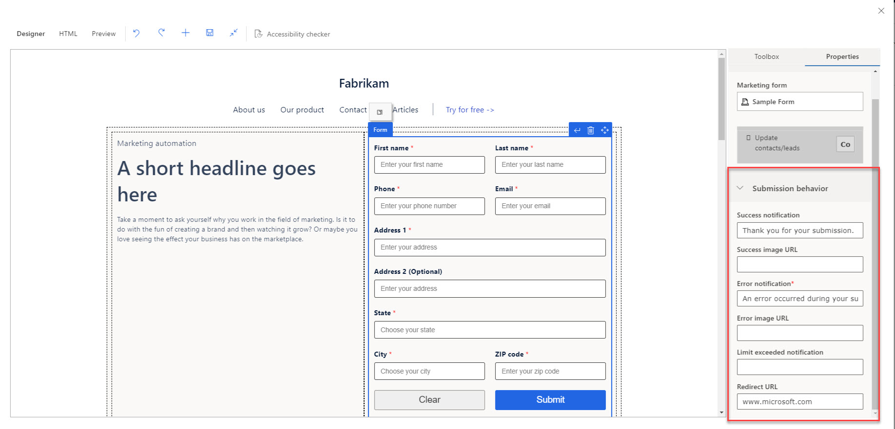

بمجرد أن يكون النموذج في وضع مباشر، سيكون متاحًا للاختيار في صفحات Dynamics 365 Marketing. في صفحة التسويق، سوف تُضيف عنصر نموذج ثم تحديد النموذج المحدد. وستتمكن بعد ذلك من تعيين سلوكيات الإرسال للنموذج مثل رسالة التأكيد ورسالة الخطأ وعنوان URL لإعادة التوجيه.

> [!NOTE]
> يجب أن يتطابق نوع النموذج مع نوع صفحة التسويق التي تعمل عليها (الصفحة المنتقل إليها أو مركز الاشتراك أو إعادة التوجيه إلى صديق).

لإضافة نموذج تسويقي إلى صفحة تسويقية، انتقل إلى **التسويق** > **التسويق عبر الإنترنت** > **صفحات التسويق**.

1.  افتح صفحة التسويق التي تريد إضافة النموذج إليها.

1.  حدد عنصر **نموذج التسويق** في المصمم. (في حالة عدم ظهور عنصر نموذج حاليًا في الصفحة، حدد **مربع الأدوات** على اليمين واسحب عنصر **النموذج** إلى الصفحة.

1.  من قائمة **الخصائص** الموجودة على اليمين، وحدد النموذج في حقل **نموذج التسويق**. تذكر أن النماذج المباشرة فقط ستكون متاحة للاختيار.

1.  سوف تُعرض إعدادات **سلوك الإرسال** التي تم تكوينها في نموذج التسويق علي اليمين. يُمكنك تجاوز تلك الإعدادات حسب الحاجة.

> [!div class="mx-imgBorder"]
> 

> [!div class="mx-imgBorder"]
> 

> [!NOTE]
> في الوقت الحالي لا يُمكنك تضمين **نموذج تسجيل حدث** من منطقه "المصمم" في صفحه التسويق. عليك استخدام برنامج نصي لنموذج لإضافة النموذج إلى صفحة التسويق. 

إذا حددت تضمين نموذج تسجيل حدث في صفحة Dynamics 365 Marketing، فأنت بحاجة إلى إنشاء نموذج تسجيل الحدث ونشره مباشرة، وربط النموذج بالحدث المقابل في علامة تبويب **‏‫موقع ويب والنموذج‬** للحدث، وإنشاء برنامج نصي لنموذج التسويق ، وإنشاء برنامج نصي لنموذج التسويق، ثم إضافة البرنامج النصي مباشرةً إلى HTML لصفحة Dynamics 365 Marketing.

لمزيد من المعلومات، راجع [‏‫إضافة نموذج صفحة تسويق‬](/dynamics365/marketing/marketing-forms?azure-portal=true#add-a-form-to-a-marketing-page).
