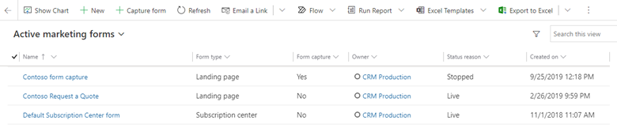

يُمكنك أيضاً إنشاء نماذج أو تضمينها على موقع الويب الخارجي الذي يرسل القيم مرة أخرى إلى Dynamics 365 Marketing. وتعمل الصفحات الخارجية مثل صفحات Dynamics 365 Marketing المنتقل إليها، لذا فإنها ستنشئ جهات اتصال أو عملاء متوقعين في قاعدة البيانات عند إرسالها. ورُغم ذلك، تُطبق بعض القيود، بناءً على كيفية تنفيذ النماذج الخارجية.

هناك طريقتان أساسيتان لدمج صفحة نموذج خارجية مع Dynamics 365 Marketing:

-   تضمين نموذج Dynamics 365 Marketing في صفحة خارجية.

-   استخدم التقاط نموذج لدمج Dynamics 365 Marketing مع نموذج تم إنشاؤه خارجياً.

يلخص الجدول الموجود في صفحة [تضمين النماذج على مواقع الويب الخارجية](/dynamics365/marketing/embed-forms?azure-portal=true) القدرات المتاحة مع كل من هذه الأساليب. 

## تضمين نموذج Dynamics 365 Marketing في صفحة خارجية

النموذج المضمن هو نموذج تسويق تصممه باستخدام مصمم نموذج Dynamics 365 Marketing، ثم تقوم بتضمينه في صفحة خارجية باستخدام كود JavaScript تم إنشاؤه لك.

يُمكنك تصميم النموذج تماماً كما تفعل مع نموذج تسويق قياسي. وبعد أن يكون النموذج مباشراً، تظهر علامة التبويب **استضافه النموذج** في سجل النموذج. من علامة التبويب، ستقوم بإجراء بعض إعدادات التكوين الإضافية لتمكين تضمين النموذج خارجياً.

لمزيد من المعلومات، راجع [تضمين نموذج Dynamics 365 Marketing ‏‫في صفحة خارجية‬](/dynamics365/marketing/embed-forms?azure-portal=true#embed-a-dynamics-365-marketing-form-on-an-external-page).

> [!NOTE]
> واستناداً إلى نوع خادم الويب ونظام CMS الذي تستخدمه، قد تحتاج إلى تعديل الرمز (على سبيل المثال، عن طريق إلغاء بعض الأحرف)، أو ضبط إعدادات نظامك للسماح بالبرامج النصية مثل هذا البرنامج النصي المُراد لصقه. راجع وثائق CMS وخادم الويب للاطلاع على التفاصيل.

**التعبئة المسبقة** متوفرة للنماذج المضمنة، ولكن نظراً لأنه يتطلب النموذج لجلب قيم جهات الاتصال من قاعدة بيانات Dynamics 365، فقد تم وضع بعض إجراءات الأمان الإضافية للمساعدة في حماية خصوصية جهات الاتصال. وهذا يعني أن جهات الاتصال تحتاج إلى الاشتراك في التعبئة المسبقة للنموذج، وأنه عليك مصادقة كل مجال خارجي حيث ستقوم بتضمين النموذج. يسمح الحل فقط بعرض القيم المعبأة مسبقاً لجهات الاتصال التي يحتوي سجل جهات الاتصال الخاص بها على خاصية تعيين علامة **السماح بالتعبئة المسبقة**. يمكن لجهات الاتصال تعيين علامة **السماح بالتعبئة المسبقة** أو مسحها باستخدام نموذج صفحه منتقل إليها، شريطة أن يتضمن النموذج الإعداد. كما يُمكن لمستخدمي Dynamics 365 Marketing تحرير سجل جهة اتصال مباشرةً لتحرير هذا الإعداد لجهة الاتصال. لمزيد من المعلومات، راجع [تمكين التعبئة المسبقة في النماذج المضمنة](/dynamics365/marketing/embed-forms?azure-portal=true#enable-prefilling-on-embedded-forms).

## استخدم التقاط نموذج لدمج نموذج تم إنشاؤه خارجياً

يُتيح التقاط نموذج للنماذج التي تم إنشاؤها في موقع ويب خارجي إرسال المعلومات مباشرةً إلى Dynamics 365 Marketing. يعمل الحل الناتج مثل صفحة التسويق الأصلية التي تم إنشاؤها في تطبيق التسويق، باستثناء أن التعبئة المسبقة غير مدعومة. تسهل هذه الميزة على مصممي الصفحات إنشاء نماذج تطابق بقية التصميمات والميزات الرسومية لموقعهم. كما تُتيح الخاصية للنماذج التي تم إنشاؤها في موقع ويب خارجي إرسال المعلومات مباشرةً إلى Dynamics 365 Marketing.

للوصول إلى لقطات نموذج التسويق، انتقل إلى **التسويق الصادر > التسويق عبر الإنترنت > نماذج التسويق**. تعرض طريقه عرض **نماذج التسويق النشطة**، كلاً من نماذج Dynamics 365 Marketing ولقطات النموذج. سوف يعرض عمود **التقاط نموذج** القيمة **نعم** لالتقاط نموذج. 

> [!div class="mx-imgBorder"]
> 

كما يُمكنك تغيير طريقة العرض إلى **‏‫نماذج الالتقاط النشطة‬** لعرض التقاط النماذج المباشر فقط. لإنشاء التقاط نموذج جديد، حدد **+ التقاط** من شريط الأوامر. 

> [!Note]
> نماذج التقاط نموذج لا تدعم خاصية التعبئة المسبقة، لذا لا تحاول إعداد خاصية التعبئة المسبقة لها.

إنشاء التقاط نموذج عملية متعددة الخطوات تتطلب منك الانتقال ذهاباً وإياباً بين نظام CMS لمؤسستك و Dynamics 365 Marketing.

لمزيد من المعلومات، راجع [استخدام التقاط نموذج لتضمين نموذج تم إنشاؤه خارجياً](/dynamics365/marketing/embed-forms#use-form-capture-to-integrate-a-form-created-externally).
