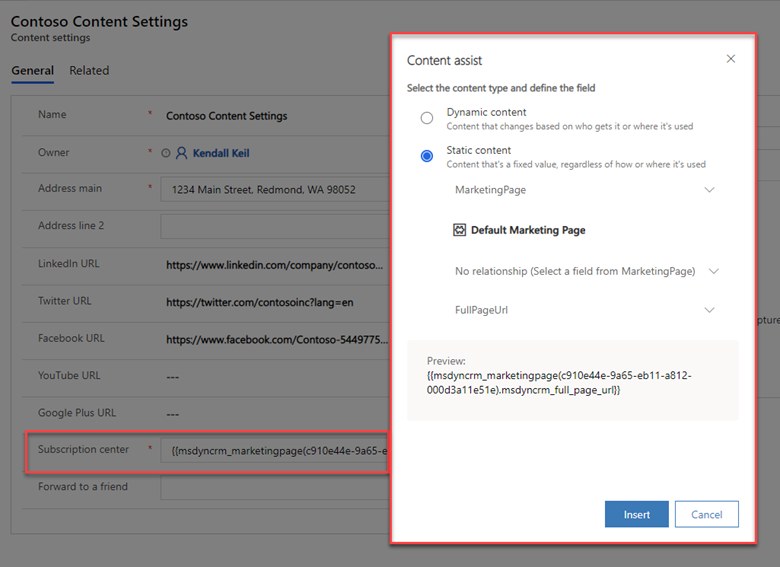

مركز الاشتراك هو صفحة تسويق يمكن لجهات الاتصال المعروفة استخدامها لإدارة تفضيلات الاتصال الخاصة بها وتفاصيل الاتصال بمؤسستك.

يجب أن تتضمن جميع رسائل البريد الإلكتروني التسويقي التجارية التي تم إنشاؤها باستخدام Dynamics 365 Marketing ارتباطًا إلى مركز اشتراك. وسوف تفشل رسائل البريد الإلكتروني في اجتياز عملية التحقق من الأخطاء إذا حاولت العرض المباشر لها دون وجود هذا الارتباط.‬ وفيما يلي سببان رئيسيان لاشتراط وجود ارتباط مركز الاشتراك في جميع الرسائل التجارية:

-   **المتطلبات القانونية** - يوجد لدى العديد من البلدان و/أو المناطق قوانين تقتضي أن تتضمن كافة رسائل البريد الإلكتروني التسويقي ارتباط إلغاء الاشتراك.

-   **إمكانية الوصول** - يُمكن لعوامل تصفية البريد العشوائي وخدمات مراقبة سمعة البريد الإلكتروني، التعرّف على رسائل البريد الإلكتروني التسويقي وقد تحذف تلك الرسائل التي لا تتضمن ارتباط إلغاء الاشتراك.

ثمة طريقة وحيدة يمكن لجهات الاتصال الوصول إلى مركز الاشتراك من خلالها هي تحديد الارتباط المُرسل إليها في البريد الإلكتروني. يتم دائمًا تخصيص ارتباطات البريد الإلكتروني للمستلم، مما يعني أن Dynamics 365 Marketing يعرف دائمًا جهة الاتصال التي طلبت مركز الاشتراك، وبالتالي يقوم بتعبئتها بالتفاصيل والاشتراكات الحالية لجهة الاتصال هذه. يمكنك أيضًا إضافة قوائم اشتراك إلى صفحات التسويق القياسية، مما يُتيح لجهات الاتصال الواردة (غير المعروفة من قبل) تسجيل الاشتراك في قائمة بريدية واحدة أو أكثر في نفس الوقت الذي تقوم فيه بالتسجيل.

تتضمن جميع مراكز الاشتراك خانة الاختيار **عدم إرسال بريد إلكتروني**. عندما تحدد جهة اتصال هذا الخيار، يتم تعيين علامة **عدم السماح برسائل بريد إلكتروني مجمع** في سجل جهة الاتصال لديها، ولن يرسل Dynamics 365 Marketing أي رسائل بريد إلكتروني تسويقي تجارية إلى جهة الاتصال هذه. وبشكل اختياري، يمكن لمركز الاشتراك لديك عرض العديد من خيارات الاشتراك الإضافية، مثل قائمة الرسائل الإخبارية المتاحة. وبفضل عرض عدة قوائم بريدية مختلفة في مركز الاشتراك، يمكنك معرفة المزيد عن الاهتمامات المُحددة لجهات اتصالك، مما يُتيح أيضًا تقديم المزيد من الخيارات لها بخلاف خيار **عدم السماح برسائل بريد إلكتروني مجمع** الملزم قانونًا.

يُعدّ مركز الاشتراك الجيد عاملاً مهمًا للغاية بالنسبة لأية مؤسسة تمارس التسويق عبر البريد الإلكتروني. كما ذكرنا سابقًا، فإن هذه الميزة ينصّ عليها القانون في العديد من دوائر الاختصاص القضائية، ولذا يجب عليك الارتباط بها من خلال كل بريد إلكتروني تسويقي ترسله. يمكنك تشغيل أي عدد تريده من مراكز الاشتراك، على سبيل المثال لدعم العديد من العلامات التجارية أو مجموعات المنتجات، ولكن يتعيّن أن يكون لديك دائمًا مركز اشتراك واحدًا على الأقل. ذلك، حيث بإمكان كل مركز اشتراك عرض العديد من قوائم الاشتراك المختلفة كما تريد، ولكنه يجب أن يُتيح لجهات الاتصال خيار إلغاء الاشتراك في جميع رسائل البريد الإلكتروني التسويقي.

لإعداد مركز اشتراك، يجب عليك ما يلي:

-   **إنشاء قوائم الاشتراك** (اختياري ولكن مستحسن) - في صفحة مركز الاشتراك، تعرض قوائم الاشتراك جهات الاتصال لديك مع الخيارات بالإضافة إلى خانة الاختيار **عدم إرسال بريد إلكتروني** المطلوبة. 
    في حالة عرض خيارات متعددة (مثل، رسائل إخبارية وأحداث وعروض ترويجية)، قد تودّ جهات الاتصال الاشتراك أو إلغاء الاشتراك في قوائم محددة بدلاً من إلغاء الاشتراك من كل شيء.
    قوائم الاشتراك هي قوائم ثابتة.

-   **إنشاء نموذج اشتراك** - يُسجّل نموذج الاشتراك تفاصيل حول جهات الاتصال مثل الاسم الأول واسم العائلة والبريد الإلكتروني وقوائم الاشتراك وخانة الاختيار **عدم إرسال بريد إلكتروني**.

-   **إنشاء صفحة اشتراك** - تستضيف صفحة الاشتراك نموذج جهات الاتصال لتحديث تفضيلات الاشتراك الخاصة بها وإدارتها.

-   **تحديد صفحة مركز الاشتراك في إعدادات المحتوى** - إعدادات المحتوى هي مجموعات من القيم القياسية المطلوبة المتاحة للاستخدام في رسائل البريد الإلكتروني التسويقي، بما في ذلك ارتباط مركز الاشتراك. إنك ستُحدد إعدادات المحتوى في رحلات العميل الفردية، مما يعني أن جميع رسائل البريد الإلكتروني التسويقية التي ترسلها تلك الرحلة ستستخدم مجموعة الإعدادات هذه (مثل، العنوان الفعلي ومركز الاشتراك وارتباطات مواقع التواصل الاجتماعي، وما إلى ذلك). بعد إنشاء صفحة مركز الاشتراك التي تتضمن نموذج مركز الاشتراك، يمكنك تحديث سجل إعدادات المحتوى الأساسي بصفحة مركز الاشتراك الملائمة.

-   **تضمين ارتباط مركز الاشتراك في بريد إلكتروني تسويقي** - يجب أن تتضمن جميع رسائل البريد الإلكتروني التجارية ارتباطًا إلى مركز الاشتراك لديك. وفي حالة إنشاء بريدك الإلكتروني باستخدام قالب جاهز، ستتم إضافة ارتباط مركز الاشتراك لك. أما إذا قمت بإنشاء البريد الإلكتروني من البداية، فسوف يجب عليك التأكد من إضافته.

-   **تعيين إعدادات المحتوى في رحلات العميل** - بعد إنشاء جميع المكونات، حدد إعدادات المحتوى لكل رحلة عميل. ونتيجةً لذلك، ستتلقى جميع رسائل البريد الإلكتروني في رحلة العميل هذه ارتباطًا إلى صفحة مركز الاشتراك المحددة في سجل إعدادات المحتوى الذي تم تعيينه لرحلة العميل.

> [!IMPORTANT] 
> ‏‫تتم إدارة قوائم الاشتراك على مستوى جهة الاتصال. إذا كانت هناك جهات اتصال متعددة تتشارك نفس عنوان البريد الإلكتروني، فإن جهة الاتصال المحددة التي ألغت الاشتراك هي فقط التي ستتوقف عن تلقي المراسلات. في حين أن جهات الاتصال الأخرى التي تستخدم نفس عنوان البريد الإلكتروني ستواصل تلقي المراسلات. إذا كنت تريد معالجة عمليات إلغاء الاشتراك على مستوى البريد الإلكتروني، فسوف ينبغي عليك إنشاء عمليات مخصصة.

لمزيد من المعلومات، راجع [إعداد قوائم ومراكز الاشتراك](/dynamics365/marketing/set-up-subscription-center/?azure-portal=true).

## مركز الاشتراك الافتراضي

يتوفر مركز اشتراك افتراضي مع كل مثيل من مثيلات Dynamics 365 Marketing. تعمل هذه الصفحة الافتراضية في الأصل على Service Fabric للمثيل لديك ولا تتطلّب مدخل Dynamics 365 أو موقع ويب خارجي. تهدف هذه الميزة إلى التأكد من أن جميع المؤسسات التي تستخدم Dynamics 365 Marketing يمكنها توفير هذه الميزة الأساسية، حتى إذا لم يكن لديها مدخل Dynamics 365 أو موقع ويب خارجي.

يمكنك تخصيص صفحة مركز الاشتراك الافتراضي و/أو إنشاء صفحات جديدة لتلبية احتياجات عملك.

> [!IMPORTANT] 
> لا تحذف صفحة مركز الاشتراك الافتراضي مطلقًا. فهي الصفحة الوحيدة التي تُنشر على Service Fabric وليس على مدخل أو موقع خارجي. لا توجد طريقة لإنشاء صفحة جديدة تُنشر على هذا النحو؛ لذلك، إذا قمت بحذف مركز الاشتراك الافتراضي، فسوف يجب عليك إنشاء آخر بديل على المدخل أو الموقع الخارجي لديك.

لمزيد من المعلومات، راجع [مركز الاشتراك الافتراضي](/dynamics365/marketing/set-up-subscription-center?azure-portal=true#the-default-subscription-center).

## إنشاء قائمة اشتراك

لعرض قائمة اشتراك أو تحريرها أو حذفها، انتقل إلى **التسويق > العميل > قوائم الاشتراك**.

1.  لإنشاء صفحة تسويق جديدة، حدد **+ قائمة اشتراك جديدة** في شريط الأوامر.

2.  يتم إنشاء قائمة جديدة مُكوّنة مسبقًا للعمل كقائمة اشتراك. وهذه القائمة الجديدة ستكون قائمة ثابتة. أدخل **اسمًا** للقائمة واملأ المعلومات الأخرى حسبما يلزم.

3.  حدد **حفظ** لإنشاء قائمة الاشتراك. بعد حفظ القائمة، يمكنك استخدام علامة التبويب **أعضاء** لعرض الأعضاء في القائمة أو تحريرهم أو إزالتهم منها. ومع ذلك، يجب عليك عادةً السماح لجهات الاتصال بإدارة اشتراكاتهم الخاصة باستخدام مركز الاشتراك لديك.

لمزيد من المعلومات، راجع [إنشاء قائمة اشتراك](/dynamics365/marketing/set-up-subscription-center?azure-portal=true#create-a-subscription-list) و[شرائح التسويق مقابل قوائم التسويق‬](/dynamics365/marketing/segments-vs-lists/?azure-portal=true).

## إنشاء نموذج مركز الاشتراك 

لإنشاء نموذج تسويق لمركز الاشتراك، انتقل إلى **التسويق** >
**التسويق عبر الإنترنت** > **نماذج التسويق** وأنشئ نموذج مركز اشتراك باستخدام نفس الإجراء الأساسي الذي استخدمته لإنشاء نموذج تسويق، ولكن تأكد أيضًا من إكمال المهام التالية:

-   تأكد من أن **نوع النموذج** هو **مركز اشتراك**، أو حدد قالب نموذج تسويق حيث يكون **النوع** هو 
    **مركز اشتراك**.

-   في علامة التبويب **المصمم**، تأكد من تضمين المعلومات التالية:

    -   معلومات جهة الاتصال الأساسية، مثل الاسم الأول واسم العائلة والبريد الإلكتروني وأي سمات أخرى قد ترغب جهة الاتصال في تحديثها

    -   خانة الاختيار **عدم إرسال بريد إلكتروني** (مطلوب لجميع نماذج الاشتراك)

    -   الزر **إرسال** (مطلوب لجميع النماذج)

-   إذا كنت تريد إضافة قوائم الاشتراك إلى النموذج، في علامة تبويب **مربع الأدوات**، قم بالتمرير لأسفل حتى تعثر على العنوان **قوائم الاشتراك**. سترى ضمن هذا العنوان أي قوائم اشتراك متوفرة حاليًا في النظام. لإضافة قائمة اشتراك إلى النموذج، اسحبها من علامة تبويب **مربع الأدوات** إلى منطقة اللوحة.

-   عند إضافة جميع العناصر الأساسية إلى نموذجك، يمكنك تحديد **‏‫التحقق من الأخطاء‬** وحل أي مشكلات تم الإبلاغ عنها، ثم حدد **عرض مباشر**.

لمزيد من المعلومات، راجع [‏‫إضافة قائمة اشتراك إلى نموذج اشتراك‬](/dynamics365/marketing/set-up-subscription-center?azure-portal=true#add-a-subscription-list-to-a-subscription-form).

## إنشاء صفحة تسويق لمركز اشتراك

بعد إنشاء نموذج مركز الاشتراك ونشره، سيلزمك إنشاء صفحة تسويق لمركز الاشتراك لوضع النموذج بها. فهذه الصفحة ستستخدمها جهات الاتصال لتحديث تفضيلات جهات الاتصال والاشتراكات الخاصة بها.

لإنشاء صفحة تسويق لمركز الاشتراك، انتقل إلى **التسويق > التسويق عبر الإنترنت > صفحات التسويق** وأنشئ صفحة مركز اشتراك باستخدام نفس الإجراء الأساسي الذي استخدمته لإنشاء صفحة تسويق، ولكن تأكد من إكمال المهام التالية:

-   تأكد من أن صفحة **النوع** هو  **مركز اشتراك**، أو حدد قالب صفحة تسويق حيث يكون  **النوع** هو **مركز اشتراك**.

-   تضمين عنصر **النموذج** الذي يشير إلى نموذج الاشتراك الملائم. تكوين  **أسلوب إرسال** النموذج من خلال استخدام الخيارات **تأكيد** و **رسائل الخطأ** و **‏‫عنوان URL لإعادة التوجيه** الملائمة.

-   إدخال قيم لجميع الحقول الأخرى المطلوبة (**الاسم** و **‏‫عنوان URL جزئي‬**).

-   عند إضافة جميع العناصر الأساسية إلى صفحتك، يمكنك تحديد **‏‫التحقق من الأخطاء‬** وحل أي مشكلات تم الإبلاغ عنها، ثم حدد **عرض مباشر**.

> [!NOTE] 
> تعمل مراكز الاشتراك فقط عندما "تعرف" هذه المراكز من تتحدث معه. ويُتيح ذلك لمركز الاشتراك إمكانية عرض معلومات جهة الاتصال الموجودة في الحقول القابلة للتحرير (مثل الاسم والبريد الإلكتروني) والإشارة إلى قوائم الاشتراك المتاحة التي ينتمي إليها العارض مسبقًا. ثمة طريقة وحيدة يمكن لمعظم الأشخاص فتح مركز الاشتراك من خلالها تتمثّل في تحديد ارتباط يتم إرساله إليهم في بريد إلكتروني تسويقي من رحلة العميل. تتضمن هذه الارتباطات معرفًا يُتيح لمركز الاشتراك معرفة جهة الاتصال التي طلبت الصفحة. 

في حالة فتح مركز اشتراك عن طريق فتح عنوان URL الخاص به مباشرةً، ستظهر رسالة خطأ تشير إلى أنه يتعذّر على النظام التحقق من صحة معلومات جهة الاتصال لديك. حدد **عرض النموذج على أي حال** لعرض صفحة الاشتراك. راجع موضوع **اختبار مركز الاشتراك** الوارد لاحقًا في هذه الوحدة لمعرفة مزيد من المعلومات حول كيفية اختبار مركز الاشتراك.

لمزيد من المعلومات، راجع [إنشاء صفحة تسويق لمركز الاشتراك](/dynamics365/marketing/set-up-subscription-center?azure-portal=true#create-a-subscription-center-marketing-page) و[‏‫إنشاء صفحة منتقل إليها بها نموذج‬](/dynamics365/marketing/create-landing-page/?azure-portal=true).

## تحديد مركز اشتراك في إعدادات المحتوى

تحتوي إعدادات المحتوى على قيم مشتركة يمكنك وضعها في رسالة بريد إلكتروني كنص ديناميكي باستخدام الزر مساعدة التحرير (أو عن طريق إدخال الرمز الصحيح). يجب عليك تعيين سجل إعدادات محتوى واحد لكل رحلة عميل. ونظرًا لهذه البنية، يمكنك استخدام نفس رسالة البريد الإلكتروني في عدة رحلات عميل، ولكن قد يختلف ارتباط مركز الاشتراك (وإعدادات المحتوى الأخرى) المُضمّن في الرسالة لكل رحلة.

لاستخدام سجلات إعدادات المحتوى، انتقل إلى **التسويق  > القوالب > إعدادات المحتوى**. سوف ينقلك هذا المسار إلى قائمة إعدادات المحتوى الحالية.

يمكنك تحرير أي سجل مُدرج أو تحديد **+ جديد** في شريط الأوامر لإنشاء سجل جديد. إذا كنت تريد تحرير سجل إعدادات المحتوى المباشر، فحدد **تحرير** في شريط الأدوات بعد فتح السجل.

لتحديد مركز اشتراك في سجل إعدادات المحتوى:

1.  في حقل **مركز الاشتراك**، حدد الزر مساعدة التحرير **</>**.

2.  حدد **ثابت**.

3.  في الحقل **‏‫تحديد كيان**، حدد **MarketingPage**.

4.  حدد صفحة مركز الاشتراك المناسبة.

5.  في الحقل **تحديد علاقة**، حدد **بلا علاقة**.

6.  في حقل الإدخال **‏‫تحديد حقل‬**، حدد **Full_Page_Url**.

7.  حدد **إدراج**.

بعد الانتهاء من إجراء التغييرات، حدد **حفظ**. في حالة تحرير سجل إعدادات محتوى كان موجودًا في العرض المباشر بالفعل، فإنه سيتم نشر تغييراتك تلقائياً بعد تحديد **حفظ**. إذا كنت تقوم بتحرير سجل إعدادات محتوى جديد، فإنه سيلزم **التحقق من الأخطاء** ثم **العرض المباشر**.

لمزيد من المعلومات، راجع [‏‫تحديد مركز اشتراك في إعدادات المحتوى‬](/dynamics365/marketing/set-up-subscription-center?azure-portal=true#identify-a-subscription-center-in-content-settings) و[استخدم إعدادات المحتوى لإعداد مستودعات القيم القياسية والمطلوبة لرسائل البريد الإلكتروني](/dynamics365/marketing/dynamic-email-content?azure-portal=true#use-content-settings-to-set-up-repositories-of-standard-and-required-values-for-email-messages).

## تضمين ارتباط مركز اشتراك في بريد إلكتروني تسويقي 

يجب أن يتضمّن نص جميع رسائل البريد الإلكتروني كلاً من ارتباط مركز الاشتراك والعنوان الفعلي لمؤسستك. هذه العناصر مطلوبة بموجب القانون في العديد دوائر الاختصاص القضائية، ولن يسمح لك Dynamics 365 Marketing بنشر أي بريد إلكتروني تسويقي لا يحتوي عليها. تتوفر هذه القيم من خلال كيان إعدادات المحتوى، ما يُتيح لك تخزين القيم مركزيًا وتغييرها لكل رحلة عميل حسب الحاجة. لذلك، ستضع هذه القيم كقيم ديناميكية سياقية. 

لإضافة ارتباط مركز اشتراك إلى بريد إلكتروني:

1.  حدد موقعًا ملائمًا لارتباط مركز الاشتراك في بريدك الإلكتروني.

2.  أدخل جزءًا من نص الارتساء هناك (مثل "إدارة التفضيلات").

3.  ‏‫حدد نص الارتساء، ثم حدد الزر **ارتباط**.

4.  حدد أيقونة **مساعدة التحرير** (**</>**).

5.  حدد **محتوى ديناميكي**.

6.  في الحقل **تحديد كيان**، حدد **ContentSettings**.

7.  في الحقل **تحديد علاقة**، حدد **بلا علاقة**.

8.  في حقل الإدخال **تحديد حقل**، حدد **SubscriptionCenter**.

9.  حدد **إدراج**.

10. انقر فوق **موافق**.

لمزيد من المعلومات، راجع [تضمين ارتباط مركز اشتراك في بريد إلكتروني تسويقي](/dynamics365/marketing/set-up-subscription-center?azure-portal=true#include-a-subscription-center-link-in-a-marketing-email).

## تعيين إعدادات المحتوى في رحلات العميل

يتم تحديد إعدادات المحتوى في كل رحلة عميل وتطبيقها على جميع رسائل البريد الإلكتروني التي ترسلها تلك الرحلة.

‏‫لعرض إعدادات المحتوى المطبقة على الرحلة وتحريرها، انتقل إلى **التسويق > تنفيذ التسويق > رحلات العميل** وحدد سجل الرحلة الملائم أو حدد **+ جديد** في شريط الأوامر لإنشاء سجل جديد. عند إعداد رحلتك، انتقل إلى علامة التبويب **عام** في سجل رحلة العميل. في حقل **إعدادات المحتوى**، حدد سجل إعدادات محتوى يتضمن مركز اشتراك مناسب سيطبّق على جميع رسائل البريد الإلكتروني في تلك الرحلة.

> [!div class="mx-imgBorder"]
> 

لمزيد من المعلومات، راجع [تحديد إعدادات المحتوى لاستخدامها في رحلة العميل](/dynamics365/marketing/set-up-subscription-center?azure-portal=true#identify-the-content-settings-to-use-in-a-customer-journey).

## اختبار مركز الاشتراك 

تعمل مراكز الاشتراك فقط عندما "تعرف" هذه المراكز من تتحدث معه. ويُتيح ذلك لمركز الاشتراك إمكانية عرض معلومات جهة الاتصال الموجودة في الحقول القابلة للتحرير (مثل الاسم والبريد الإلكتروني) والإشارة إلى قوائم الاشتراك المتاحة التي ينتمي إليها العارض مسبقًا. ثمة طريقة وحيدة يمكن لمعظم الأشخاص فتح مركز الاشتراك من خلالها تتمثّل في تحديد ارتباط يتم إرساله إليهم في بريد إلكتروني تسويقي من رحلة العميل. تتضمن هذه الارتباطات معرفًا يُتيح لمركز الاشتراك معرفة جهة الاتصال التي طلبت الصفحة. 

في حالة فتح مركز اشتراك عن طريق فتح عنوان URL الخاص به مباشرةً (باستخدام ارتباط تم إرساله في رسالة اختبار)، ستظهر رسالة خطأ تشير إلى أنه يتعذّر على النظام التحقق من صحة معلومات جهة الاتصال لديك. إذا حددت الخيار **عرض النموذج على أي حال**، فسوف يمكنك عرض صفحة الاشتراك ونموذجه، ولكن أي معلومات تُرسلها لن تسجّل في Dynamics Marketing لأن النظام لا يعرف سجل جهة الاتصال الذي يجب تطبيق التغييرات عليه. 

> [!div class="mx-imgBorder"]
> 

لاختبار مركز الاشتراك لديك بشكل كامل، يمكنك إعداد رحلة عميل بسيطة تستهدف سجل جهة اتصال واحدة بعنوان بريدك الإلكتروني وتُرسل بريدًا إلكترونيًا تسويقيًا بسيطًا يحتوي على ارتباط إلى مركز الاشتراك الخاص بك. عندما تتلقى الرسالة، انقر فوق ارتباط مركز الاشتراك من البريد الإلكتروني واختبر ميزات صفحة الاشتراك (على سبيل المثال، الاشتراك في القوائم وإلغاء الاشتراك فيها، وكذلك إلغاء الاشتراك بشكل عام.)

## تضمين مركز اشتراك كنموذج مستضاف

يمكنك تضمين نموذج مركز الاشتراك في موقع خارجي. اتبع الخطوات المتعلقة بكيفية إنشاء نموذج مضمّن ولكن عيّن **نوع النموذج** إلى **مركز اشتراك**. تتطلّب مراكز الاشتراك التعبئة المسبقة، لذلك يجب عليك مصادقة مجالك الخارجي وإعداد النموذج وتضمين رمز النموذج الذي تم إنشاؤه في صفحتك. لمزيد من المعلومات، راجع [تمكين التعبئة المسبقة في النماذج المضمنة](/dynamics365/marketing/embed-forms?azure-portal=true#enable-prefilling-on-embedded-forms).
