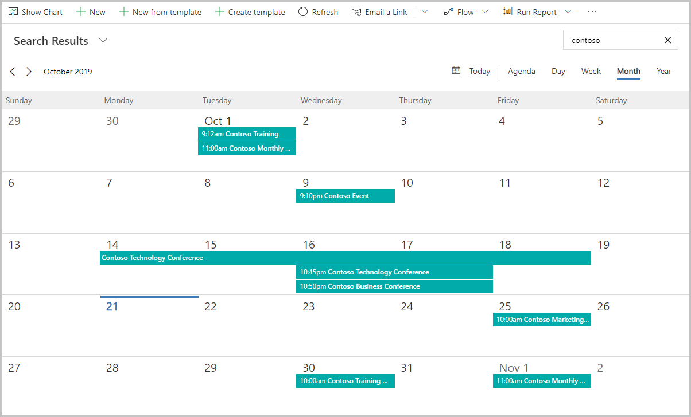

يأتي Dynamics 365 Marketing مزودًا بتقويم تسويق سهل وسريع الاستجابة. وباستخدام هذا التقويم، يستطيع المستخدمون تصور الأنشطة التسويقية في تقويم واحد في عرض يوم أو أسبوع أو شهر أو عام. 

يُتيح التحكم في تقويم التسويق لموظفي التسويق تصور مجموعة متنوعة من الأنشطة التسويقية. وجميع الأنشطة لها تاريخ بدء وتاريخ انتهاء. باستخدام عنصر تحكم سريع الاستجابة متوافق مع الأجهزة المحمولة، يستطيع المستخدمون عرض عناصر التقويم وإنشاؤها في بعض الحالات دون مغادرة الصفحة. يشبه التقويم برنامج Microsoft Outlook في مظهره واستخدامه.

يتم توفير التقويم على أنه عنصر تحكم. باستخدام التقويم، يستطيع المسؤولون والمخصصون الإضافة إلى أي نموذج أو كيان في النظام وتحسينه.

هناك نوعان أساسيان للتقويمات التسويقية: **تقويم على مستوى الكيان الوحدة وتقويم على مستوى النموذج**. ويتميز النوعان بتصميم ابتكاري. تتضمن التقويمات على مستوى الكيان الأحداث ورحلات العميل والمنشورات الاجتماعية. التقويمات على مستوى النموذج مثل جلسات الأحداث وحجوزات غرف الأحداث ومشاركات المتحدثين. 