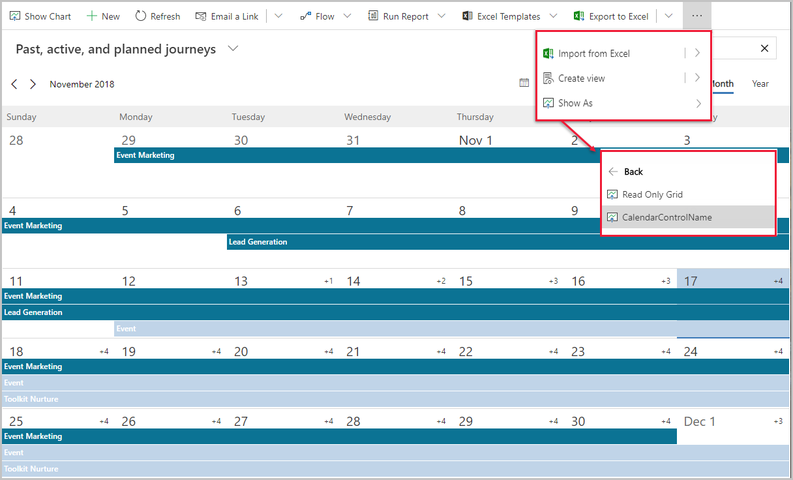

عندما يكون لديك كيان بتاريخ بدء وانتهاء محددين، يُمكنك عرض الكيان والسجلات المرتبطة به في طريقة عرض تقويم. وتوفر طريقة العرض أيضًا محدد عرض نظام. وباستخدامه، يُمكنك تصفية السجلات المعروضة. يُمكن عرض سجلات الكيان في يوم أو أسبوع أو شهر معين.

عندما تنتقل إلى كيان، فسيتم تعيينه افتراضيًا إلى طريقة عرض القائمة. تُظهر طريقة عرض القائمة جميع السجلات لهذا الكيان (مثال، جميع الأحداث ورحلات العميل النشطة). 

لعرض تقويم التسويق، انتقل إلى كيان، وحدد علامة تبويب **إظهار باسم** من شريط الأوامر ثم حدد **CalendarControlName**. إذا لم تشاهد علامة تبويب **إظهار باسم**، فقد تحتاج إلى النقر فوق علامات الحذف (...)، وتحديد **إظهار باسم**، ثم **CalendarControlName**.

سترى السجلات ذات الصلة ممثلة بطريقة رسومية في التقويم وفقًا لتواريخها المجدولة، ويمكنك فتح أي سجل مدرج من هنا. 

لمزيد من المعلومات، راجع [أنواع وأماكن تقويمات التسويق](/dynamics365/marketing/customize-marketing-calendars?azure-portal=true#types-and-locations-of-marketing-calendars) و [استخدام التقويم](/dynamics365/marketing/marketing-calendar?azure-portal=true#use-the-calendar).