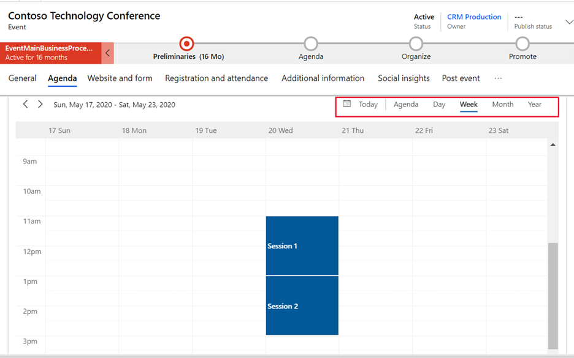

عند عرض سجل معين في Dynamics 365 Marketing، يستطيع المستخدمون عرض تقويم على مستوى النموذج. قد يظهر التقويم في علامة التبويب الخاصة به أو على أنه قسم في علامة تبويب معينة. سيرى المستخدمون النموذج معروضًا في طريقة عرض التقويم، لكنهم يظلون أيضًا يرون السجل في عرض القائمة. فيما يخص التقويمات على مستوى النموذج، سيتم عرض وإنشاء سجل للكيان المحدد فقط. يمكنك إضافة تقويم تسويق إلى أي نموذج حيث تعتقد أنه قد يكون مفيدًا.

يُمكنك فتح حدث معين أو سجل متحدث لعرض تقويم تسويق على مستوى النموذج. ثم انتقل إلى سجل على مستوى النموذج حيث تتمكن من رؤية النموذج في طريقة عرض التقويم إضافة إلى عرض القائمة. سترى السجلات ذات الصلة ممثلة بطريقة رسومية في التقويم وفقًا لتواريخها المجدولة، ويمكنك فتح أي سجل مدرج من هنا. 

يوضح هذا المثال جلسات التقويم على مستوى النموذج في سجل حدث.

> [!div class="mx-imgBorder"]
> 

لمزيد من المعلومات، راجع [أنواع وأماكن تقويمات التسويق](/dynamics365/marketing/customize-marketing-calendars?azure-portal=true#types-and-locations-of-marketing-calendars) و [استخدام التقويم](/dynamics365/marketing/marketing-calendar?azure-portal=true#use-the-calendar).