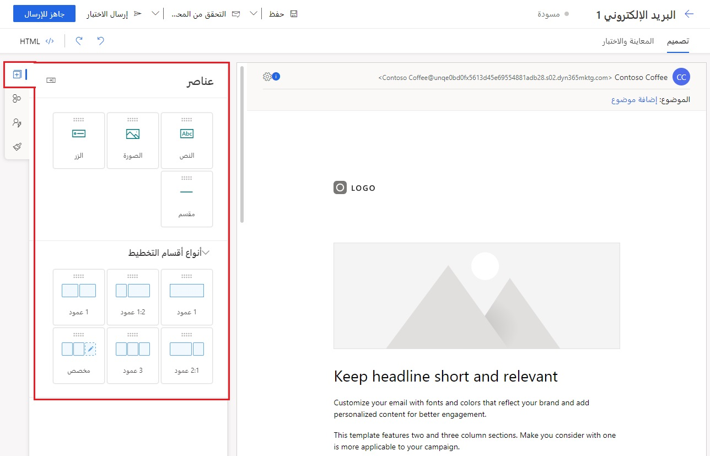
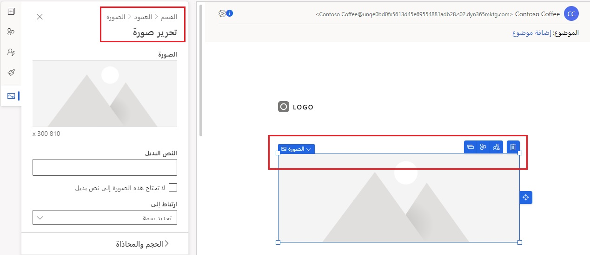
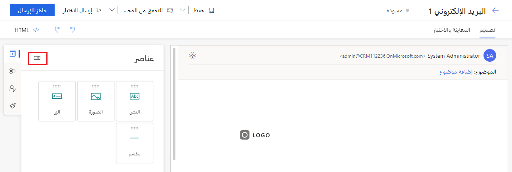
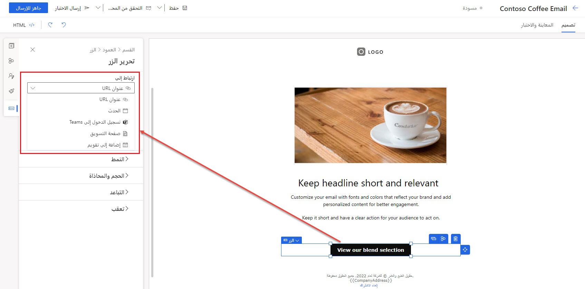
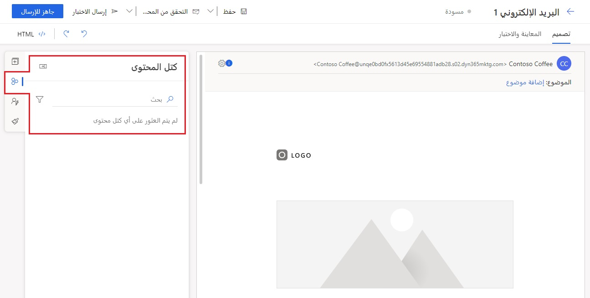
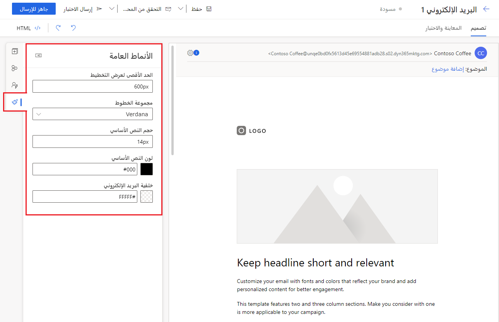

يتيح لك محرر البريد الإلكتروني التسويقي في الوقت الحقيقي إنشاء رسائل إلكترونية بشكل أسرع من خلال السحب والإفلات الدقيقين، والقائمة المضمنة في السياق، والتفاعلات سهلة التحديد. يمكنك إنشاء محتوى رسالة إلكترونية بسهولة وكفاءة باستخدام أفكار المحتوى المستندة إلى الذكاء الاصطناعي. باستخدام التوصيات المستندة إلى الذكاء الاصطناعي، يمكنك تحديد أفضل الصور لرسائلك الإلكترونية وتسليمها. يمكنك تسريع وقت إنشاء رسائلك الإلكترونية باستخدام كتل المحتوى المحسّنة القابلة لإعادة الاستخدام لدينا.

## إنشاء رسالة إلكترونية جديدة

لعرض بريد إلكتروني تسويقي جديد أو تحريره أو حذفه أو إنشائه، انتقل إلى 
**التسويق في الوقت الحقيقي > القنوات > الرسائل الإلكترونية**.

عند إنشاء رسالة إلكترونية جديدة، يمكنك اختيار قالب أو البدء من الصفر. إذا حددت البدء من قالب، فسينشئ هذا تخطيط الرسالة الإلكترونية ونموذج المحتوى لك.

عندما تُنشئ رسالة جديدة من قالب، يتم نسخ محتوى القالب إلى رسالتك الجديدة. الرسالة والقالب غير مرتبطين، لذا عندما تقوم بتحرير الرسالة، لن يتغير القالب. وبالمثل، فإن أي تغييرات مستقبلية تجريها على قالب لن تؤثر على أي رسائل موجودة تم إنشاؤها باستخدام هذا القالب. لمزيد من المعلومات، راجع [العمل مع الرسالة الإلكترونية، والصفحة، وقوالب النماذج](/dynamics365/marketing/email-templates/?azure-portal=true).

### إدخال اسم

يجب أن يكون لكل رسالة إلكترونية اسم يحدد الرسالة، عندما تبحث في طريقة عرض القائمة أو عند تحديد الرسائل المُراد تضمينها في رحلة العميل. لإدخال اسم، حدد حقل **اسم الرسالة الإلكترونية** على الجانب الأيسر من العنوان، وأدخل اسماً لرسالتك الجديدة.

### إدخال موضوع

أدخل موضوعاً لرسالتك عن طريق تحديد **إضافة موضوع** في قسم عنوان الرسالة الإلكترونية أعلى الصفحة وملء حقل **الموضوع** داخل جزء **عنوان الرسالة الإلكترونية.**  يُعد هذا إعداداً مهماً لأن هذا هو أحد الأشياء الأولى، التي سيراها المستلمون عندما يتلقون الرسالة الإلكترونية، وربما يستخدمون هذا الإعداد لتحديد ما إذا كانوا سيقرؤون الرسالة أو لا.

يمكنك أيضاً إضافة **نص الإصدار الأولي**، الذي يظهر بجوار أو أسفل سطر الموضوع في علبة الوارد الخاصة بالمستلم. يُتيح لك نص الإصدار الأولي إمكانية إضافة نص مخصص يتم عرضه في علبة الوارد الخاصة بالمستلم قبل فتح الرسالة الإلكترونية. يمنحك هذا فرصة لإنشاء سطر يجذب انتباه المستلم بمجرد أن يرى رسالتك.

### مراجعة الإعدادات المهمة الأخرى وتحديثها

تتضمن الإعدادات المهمة الأخرى الموفرة في جزء **عنوان الرسالة الإلكترونية** ما يلي:

#### إعدادات الإرسال

- **من البريد الإلكتروني‬** - عنوان البريد الإلكتروني الموضح للمستلمين على أنه عنوان الشخص الذي أرسل الرسالة الإلكترونية. سيكون هذا الحقل فارغاً ما لم يتم تعيين حقل افتراضي ضمن إعدادات التسويق الافتراضية. يمكنك إدخال عنوان بريد إلكتروني ثابت أو تحديد الرمز **تخصيص** لتحديد قيمة ديناميكية بديلة.

- **اسم المرسل** - الاسم الموضح للمستلمين على أنه الشخص الذي أرسل الرسالة الإلكترونية. سيكون هذا الحقل فارغاً ما لم يتم تعيين حقل افتراضي ضمن إعدادات التسويق الافتراضية تقوم أنت بإدخال اسم ثابت أو تحديد الرمز 
**تخصيص** لتحديد قيمة ديناميكية بديلة.

- **الرد على الرسالة الإلكترونية** - عنوان البريد الإلكتروني الذي ترسل إليه رسائل الرد عندما تريد نقل الرسائل إلى عنوان بريد إلكتروني مختلف عن عنوان المرسل.

#### إعدادات البريد الإلكتروني

- **قالب الرسالة الإلكترونية** - يعرض هذا اسم القالب الذي حددته عند إنشاء الرسالة الإلكترونية. يمكنك تغيير القالب من خلال تحديد اسم القالب. في حالة تغيير القالب، لن يتم الاحتفاظ بمحتوى بريدك الإلكتروني الحالي (بغض النظر عن عنوان الرسالة الإلكترونية).

- **تعيين الرسالة** - يؤثر هذا الحقل على المتطلبات المتعلقة بما يجب أن (ويجب ألا) تحتوي عليه الرسالة. تشمل الخيارات في هذا الحقل إما "تجارية" أو "حركات".

- **التوافق** - يتيح لك هذا الحقل تحديد مركز الاشتراك المُراد استخدامه لهذه الرسالة الإلكترونية.

- **نوع محتوى الرسالة الإلكترونية** - الخيار الوحيد حالياً هو الخيار الافتراضي.

- **لغة محتوى الرسالة الإلكترونية** - لغة رسالتك الإلكترونية.

- **إنشاء نص عادي تلقائياً** - يتم تعيين هذا الخيار إلى **نعم** بشكل افتراضي. ومع ذلك، يمكنك تعيينه إلى **لا** وتوفير إصدار نص عادي خاص بك للرسالة الإلكترونية.

- **الإصدار الأولي للنص العادي** - يعرض هذا الحقل الإصدار الأولي لإصدار النص العادي لرسالتك الإلكترونية.

لمزيد من المعلومات، راجع [إجراء الإعدادات الأساسية والمطلوبة](/dynamics365/marketing/email-design?azure-portal=true#make-basic-and-required-settings).

## إضافة عناصر

أثناء وجودك في علامة التبويب  **تصميم**، حدد الرمز **عناصر** في أقصى اليمين. ابدأ بسحب عنصر تصميم إلى اللوحة.

> [!div class="mx-imgBorder"]
> 

أثناء تحديد عنصر، يمكنك تكوينه وتنميطه باستخدام **الخصائص** على الجانب الأيمن. ستختلف الخصائص بناءً على نوع العنصر الذي تحدده (نص أو صورة أو زر أو مقسم أو عمود أو قسم). يعرض لك **التنقل التفصيلي** مكان وجودك، ويسمح لك بالانتقال إلى العناصر الأصلية بسرعة.

في **المصمم**، سترى أيضاً عناصر تحكم متنوعة تتيح لك نقل العنصر المحدد أو استنساخه أو حذفه. يمكنك استخدام سهم القائمة المنسدلة للتبديل بسرعة إلى العنصر الأصلي للعنصر المحدد. توجد أدوات أخرى تتيح لك إنشاء كتلة محتوى من تحديد العنصر أو تمكين المحتوى الشرطي للعنصر.

> [!div class="mx-imgBorder"]
> 

استخدم رمز **طي جزء التحرير‬** لتصغير نافذة جزء التحرير وتوسيع المصمم.

> [!div class="mx-imgBorder"]
> 

عندما تضيف **الصور** إلى بريدك الإلكتروني التسويقي، يحلل المحرر في الوقت الحقيقي محتوى نص رسالتك الإلكترونية، وباستخدام الذكاء الاصطناعي، يقترح الصور الأكثر صلةً من مكتبة الأصول الجديدة.

> [!div class="mx-imgBorder"]
> 

لمزيد من المعلومات، راجع [اقتراحات الصور المستندة إلى الذكاء الاصطناعي](/dynamics365/marketing/real-time-marketing-email?azure-portal=true#ai-driven-image-suggestions).

باستخدام **الصور** أو **الأزرار** في محرر البريد الإلكتروني التسويقي في الوقت الحقيقي، يمكنك الارتباط بالاستطلاعات أو الأحداث أو صفحات التسويق. يمكنك توفير ارتباطات للمستلمين لإضافة عنصر تقويم جديد أو الانضمام إلى حدث Microsoft Teams. يمكنك أيضاً إضافة ارتباطات مباشرة إلى المستندات المخزنة في مكتبة الأصول باستخدام خيار تنزيل الملفات.

> [!div class="mx-imgBorder"]
> 

لمزيد من المعلومات، راجع [ارتباط إلى المستندات ومقاطع الفيديو المخزنة في مكتبة الأصول](/dynamics365/marketing/real-time-marketing-email?azure-portal=true#link-to-documents-and-videos-stored-in-the-asset-library) و[ارتباط إلى الاستطلاعات أو الأحداث أو صفحات التسويق أو أحداث Microsoft Teams أو عناصر التقويم](/dynamics365/marketing/real-time-marketing-email?azure-portal=true#link-to-surveys-events-marketing-pages-microsoft-teams-events-or-calendar-items).

> [!IMPORTANT]
> عند تصميم محتوى الرسالة الإلكترونية، يجب أن تحرص دائماً على تقليل حجم رسائلك قدر الإمكان. عندما يتعلق الأمر بمحتوى النصوص والتعليمات البرمجية (لا يشمل محتوى الصور المشار إليه)، نوصيك بأن يكون حجم ملفاتك أقل من 100 كيلوبايت دائماً للأسباب التالية:
>
> - يتم غالباً تصنيف رسائل الرسالة الإلكترونية التي يزيد حجمها عن 100 كيلوبايت كبريد عشوائي من خلال عوامل تصفية البريد العشوائي
>
> - يقتطع Gmail الرسائل بعد أول 102 كيلوبايت من النص المصدر والترميز.
>
> - يتعذّر تسليم الرسائل الإلكترونية التي يزيد حجمها على 128 كيلوبايت من خلال رحلة العميل (سوف تفشل الرحلة [في التحقق من الأخطاء](/dynamics365/marketing/email-check-golive/?azure-portal=true) إذا كانت تتضمن رسائل حجمها أكبر من هذا)
>
> - يستغرق تحميل رسائل الرسالة الإلكترونية الكبيرة وقتاً أطول، مما قد يُزعج المستلمين.
>
> لمزيد من المعلومات، راجع [تصميم محتواك](/dynamics365/marketing/email-design?azure-portal=true#design-your-content) و[إنشاء رسائل البريد الإلكتروني التسويقي في الوقت الحقيقي](/dynamics365/marketing/real-time-marketing-email/?azure-portal=true).

## إضافة كتل المحتوى

كتل المحتوى عبارة عن أجزاء معدة مسبقاً من المحتوى ويمكنك إدراجها في الرسائل الإلكترونية. يمكن أن تحتوي على نصوص، وصور، وارتباطات، وأزرار، والمزيد - أي شيء يمكن استخدامه كمحتوى في رسالة إلكترونية. يمكن أن تتضمن التنسيق والتخطيط أيضاً. وعند إدراجها، يصبح كل المحتوى (بما في ذلك التخطيط، إن وُجد) المضمن في كتلة المحتوى جزءاً من الرسالة الإلكترونية.

يجب تمكين كتل المحتوى من قِبل المسؤول قبل أن تتمكن من البدء في استخدامها. لمزيد من المعلومات، راجع [كيفية تمكين الإصدار الأولي لكتل المحتوى](/dynamics365/marketing/content-blocks?azure-portal=true#how-to-enable-the-content-blocks-preview).

لإضافة كتلة محتوى، حدد علامة التبويب **كتلة المحتوى** في شريط أدوات اللوحة لمشاهدة قائمة كتل المحتوى المتاحة. يمكنك البحث في كتل المحتوى بالاسم أو بالعلامات. في القائمة، يُظهر لك رمز القفل كتل المحتوى المحمية من التحرير. يمكنك البحث بكلٍّ من الاسم والعلامات لتحديد موقع كتلة محتوى معينة.

> [!div class="mx-imgBorder"]
> 

يوجد نوعان من كتل المحتوى:

- **كتل محتوى العناصر**: تتضمن كتل المحتوى هذه عنصراً واحداً أو أكثر (نص، صورة، زر، ارتباط، إلخ.) فقط، ولكن دون تخطيط. نظراً لأن هذا النوع من كتل المحتوى يحتوي على عنصر (عناصر) فقط، فإنه لا يحتوي على تخطيط خاص به، وسيأخذ شكل القسم أو العمود الذي يتم وضعه فيه.

- **كتل محتوى القسم**: تتضمن كتل المحتوى هذه قسماً واحداً أو أكثر، وبالتالي تحتفظ بتخطيطها. يمكن أن تتضمن الأقسام أي مجموعة من العناصر، مثل النص، والصورة، والزر، والارتباط، وما إلى ذلك. وسيحتفظ هذا القسم بتخطيطه عند إدراجه في رسالة إلكترونية.

لمزيد من المعلومات، راجع [الإصدار الأولي: إنشاء كتل المحتوى التي يُمكنك إعادة استخدامها في تصميمات متعددة](/dynamics365/marketing/content-blocks/?azure-portal=true).

## إضافة محتوى شرطي

> [!IMPORTANT]
> ميزة الإصدار الأولي هي ميزة غير مكتملة، ولكن يتم توفيرها قبل طرحها رسمياً في إصدار حتى يتمكن العملاء من الوصول المبكر وتقديم التعليقات. ميزات الإصدار الأولي ليست مخصصة للاستخدام الإنتاجي وقد تتضمن وظائف محدودة أو مقيدة.

لا تقدم Microsoft دعماً لميزات الإصدار الأولي. لن يتمكن الدعم الفني لـ Microsoft Dynamics 365 من مساعدتك في حل المشكلات أو الإجابة عن الأسئلة. ميزات الإصدار الأولي ليست مخصصة للاستخدام الإنتاجي، لاسيما لمعالجة البيانات الشخصية أو البيانات الأخرى التي تخضع لمتطلبات الامتثال القانونية أو التنظيمية.

يُعد المحتوى الشرطي طريقة سهلة لتقديم محتوى مخصص فعال وجذاب. من الأمثلة البسيطة على المحتوى الشرطي تضمين صور مختلفة استناداً إلى مهنة المستلم أو فئته العمرية أو عنوانه أو اهتماماته أو عوامل أخرى من هذا القبيل. يُعد إنشاء هذا النوع من المحتوى المخصص في Dynamics 365 Marketing أمراً سهلاً، ولا يتطلب أي ترميز أو برمجة نصية. [حدد هنا لمشاهدة مقطع فيديو قصير](/dynamics365/marketing/conditional-content?azure-portal=true#what-is-conditional-content) يعرض محتوى شرطياً أثناء العمل.

يتكون المحتوى الشرطي، كما يوحي الاسم، من جزأين: الشرط والمحتوى. يُسمى الجمع بين هذين الجزأين "التباين". يمكنك إنشاء العديد من التباينات حسب الحاجة. في الوقت الذي يتم فيه إرسال رسالة إلكترونية، يتم تقييم الشروط بالترتيب الذي تظهر به في الرسالة الإلكترونية. عند الوفاء بشرط ما، يتم تضمين المحتوى المقابل ويتوقف التقييم الشرطي. إذا لم يتم الوفاء بأي شرط من الشروط، فإنه يتم استخدام المحتوى الافتراضي. إذا لم يوجد أي محتوى افتراضي، فإنه لا يتم تضمين أي محتوى.

يمكن أن يكون المحتوى الشرطي قسماً أو صورة:

- يمكن أن يتضمن القسم الشرطي نصاً أو صوراً أو أزراراً أو ارتباطات أو أي عنصر آخر يدعمه محرر البريد الإلكتروني.

- تتضمن الصورة الشرطية الصور فقط.

- لا يمكن أن يتضمن القسم الشرطي صورة شرطية.

يُعد المحتوى الشرطي طريقة رائعة لتخصيص محتوى الرسالة الإلكترونية. فيما يلي بعض الطرق التي يمكنك بها استخدام المحتوى الشرطي:

- تضمين صور مختلفة تطابق اهتمامات المستلم (على سبيل المثال، الألعاب الرياضية أو الهوايات).

- تقديم محتوى مختلف بناءً على المعلومات السكانية للمستلم (على سبيل المثال، المدينة أو دولة الإقامة أو الجنس أو العمر).

- استخدام محتوى بلغة مختلفة باستخدام المنطقة/البلد أو اللغة المفضلة للمستلم.

- تغيير بعض المحتوى داخل التذييل (على سبيل المثال، الارتباطات الاجتماعية أو النص القانوني) استناداً إلى معلومات المستلم.

> [!NOTE]
> يجب أن تحتوي الصورة الشرطية على محتوى افتراضي بينما يكون المحتوى الافتراضي اختيارياً للقسم الشرطي. يمنع هذا تسليم الرسائل الإلكترونية بتخطيطات بلا محاذاة.

لمعرفة كيفية الإنشاء والحذف والمعاينة، راجع [العمل مع المحتوى الشرطي](/dynamics365/marketing/conditional-content?azure-portal=true#working-with-conditional-content).

## كيفية تمكين الإصدار الأولي للمحتوى الشرطي

هذه ميزة قيد المعاينة حالياً وربما لا يتم تمكينها في بيئتك. إذا كنت لا ترى هذه الميزة في تطبيقك، فاتصل بالمسؤول الذي يمكنه تنشيطها بالانتقال إلى **الإعدادات** > **الإعدادات الأخرى** > 
**تبديلات الميزات** > **محرر البريد الإلكتروني** وتمكين تبديل ميزة 
**المحتوى الشرطي في محرر البريد الإلكتروني** .

> [!div class="mx-imgBorder"]
> 

لمزيد من المعلومات، راجع [الإصدار الأولي: كيفية استخدام المحتوى الشرطي](/dynamics365/marketing/conditional-content/?azure-portal=true).

## إضافة أفكار المحتوى (إصدار أولي)

> [!IMPORTANT]
> ميزة الإصدار الأولي هي ميزة غير مكتملة، ولكن يتم توفيرها قبل طرحها رسمياً في إصدار حتى يتمكن العملاء من الوصول المبكر وتقديم التعليقات. ميزات الإصدار الأولي ليست مخصصة للاستخدام الإنتاجي وقد تتضمن وظائف محدودة أو مقيدة.
>
> لا تقدم Microsoft دعماً لميزة الإصدار الأولي هذه. لن يتمكن الدعم الفني لـ Microsoft Dynamics ‏365 من مساعدتك في حل المشكلات أو الإجابة عن الأسئلة. ميزات الإصدار الأولي ليست مخصصة للاستخدام الإنتاجي، لاسيما لمعالجة البيانات الشخصية أو البيانات الأخرى التي تخضع لمتطلبات الامتثال القانونية أو التنظيمية.

> [!NOTE]
> يتوفر الإصدار الأولي لأفكار المحتوى حالياً فقط في البيئات الإنجليزية (الولايات المتحدة).

### كيفية تمكين الإصدار الأولي لأفكار المحتوى

> [!NOTE]
> يظهر زر أفكار المحتوى في محرر البريد الإلكتروني (في البيئات الإنجليزية فقط) حتى إذا لم يتم تمكينه من قِبل أحد المسؤولين.

1. انتقل إلى  **الإعدادات** > **الإعدادات الأخرى** > **تبديلات الميزات** > **محرر البريد الإلكتروني**.

1. قم بتمكين مفتاح تبديل ميزة **أفكار المحتوى** .

1. وافق على تحليل الرسائل الإلكترونية الأخيرة الجاهزة للإرسال الخاصة بمؤسستك عن طريق تحديد الزر **أوافق.** 

المرجع: [تمكين أفكار المحتوى](/dynamics365/marketing/content-ideas?azure-portal=true#enable-content-ideas).

### ما أفكار المحتوى؟

تشبه ميزة أفكار المحتوى شريك العصف الذهني، الذي يمكن أن يساعد في إلهامك أثناء قيامك بكتابة رسالة إلكترونية. أنت تقدم بضع جمل قصيرة وأفكار محتوى تنشئ مجموعة من أجزاء لتعليمة برمجية متكررة وتوصيات يمكنك البناء عليها. يمكنك إضافة هذه الاقتراحات إلى مسودتك، واستخدامها كمصدر إلهام لكتابة مسودة جديدة، أو الانتقال إلى اتجاه مختلف

أثناء وجودك في علامة التبويب  **تصميم**، حدد الرمز **أفكار المحتوى** في أقصى اليمين.

1. حدد الزر **لنبدأ** في جزء أفكار المحتوى (الإصدار الأولي).

1. أضف ما يصل إلى خمس جمل تصف محتواك وما تريد أن يأخذه القارئ من الرسالة.

1. حدد **الحصول على الأفكار**.

1. تعمل ميزة أفكار المحتوى على إنشاء مجموعة من الاقتراحات النصية. قد يستغرق إنشاء المحتوى وقتاً قصيراً (يصل إلى 15 ثانية، حسب الاستخدام).

1. استعرض الأفكار التي تم إنشاؤها باستخدام السهمين الأيمن والأيسر أعلى جزء أفكار المحتوى.

1. إذا كنت تحب فكرة محتوى، فحدد **إضافة إلى مسودتي** لنسخ المحتوى إلى رسالتك الإلكترونية. يمكنك أيضاً سحب فكرة تم إنشاؤها وإفلاتها مباشرةً في لوحة الرسالة الإلكترونية.

1. بمجرد إضافة فكرة المحتوى إلى مسودتك، تأكد من مراجعتها وتعديلها وفقاً لاحتياجاتك قبل إرسال الرسالة.

> [!div class="mx-imgBorder"]
> 

> [!NOTE]
> أفكار المحتوى هي مجرد اقتراحات. تقع على عاتقك مسؤولية تحرير الاقتراحات التي تم إنشاؤها حتى تكون نسختك النهائية دقيقة ومناسبة.

لمزيد من المعلومات، راجع [الإصدار الأولي: استخدام الذكاء الاصطناعي للبدء سريعاً في إنشاء الرسائل الإلكترونية باستخدام أفكار المحتوى](/dynamics365/marketing/content-ideas/?azure-portal=true).

## إضافة المحتوى الشرطي (إصدار أولي)

> [!IMPORTANT]
> ميزة الإصدار الأولي هي ميزة غير مكتملة، ولكن يتم توفيرها قبل طرحها رسمياً في إصدار حتى يتمكن العملاء من الوصول المبكر وتقديم التعليقات. ميزات الإصدار الأولي ليست مخصصة للاستخدام الإنتاجي وقد تتضمن وظائف محدودة أو مقيدة.
>
> لا تقدم Microsoft دعماً لميزة الإصدار الأولي هذه. لن يتمكن الدعم الفني لـ Microsoft Dynamics ‏365 من مساعدتك في حل المشكلات أو الإجابة عن الأسئلة. ميزات الإصدار الأولي ليست مخصصة للاستخدام الإنتاجي، لاسيما لمعالجة البيانات الشخصية أو البيانات الأخرى التي تخضع لمتطلبات الامتثال القانونية أو التنظيمية.

### كيفية تمكين الإصدار الأولي لميزة المحتوى الشرطي

1. انتقل إلى  **الإعدادات** > **الإعدادات الأخرى** > **تبديلات الميزات** > **محرر البريد الإلكتروني**.

1. قم بتمكين مفتاح تبديل ميزة **المحتوى الشرطي في محرر البريد الإلكتروني.** 

المرجع: [كيفية تمكين الإصدار الأولي للمحتوى الشرطي](/dynamics365/marketing/conditional-content?azure-portal=true#how-to-enable-the-conditional-content-preview).

## إضافة تخصيص

يحتوي محرر البريد الإلكتروني التسويقي في الوقت الحقيقي على عنصر تحكم جديد في مساعدة التحرير لربط البيانات المخصصة. استخدم البيانات المخصصة من أجل التعبئة الديناميكية للمعلومات الفريدة لكل مستلم رسالة إلكترونية.

### أضف التخصيص باستخدام الرموز المميزة المحددة مسبقاً

1. أضف عنصراً نصياً أو حدده، ثم حدد الزر **تخصيص** في شريط أدوات النص.

1. أثناء قيام المسؤول والمستخدمين الآخرين بإنشاء نص ديناميكي محدد مسبقاً ومشاركته، ستتم إضافة الأجزاء إلى القائمة. يتم فرز أفضل 10 عناصر في القائمة حسب الاستخدام على مستوى المؤسسة. إذا كان هناك أكثر من 10 عناصر في القائمة، فسترى العناصر المتبقية مرتبة حسب الترتيب الأبجدي بعد العناصر العشرة الأولى. يمكنك التمرير فوق النص الديناميكي في القائمة المحددة مسبقاً للاطلاع على تفاصيله. بدلاً من ذلك، يمكنك تحديد علامات الحذف العمودية بجوار اسم النص الديناميكي، ثم تحديد "مزيد من المعلومات".

1. حدد من القائمة.

1. في النافذة المشروطة **اختيار الجمهور الهدف**، حدد الجمهور (على سبيل المثال، جهة اتصال أو عميل متوقع).

   > [!NOTE]
   > سترى هذه النافذة المشروطة فقط في المرة الأولى التي تضيف فيها محتوى ديناميكياً داخل الرسالة الإلكترونية. سيتم تعيين عناصر المحتوى الديناميكي المتبقية تلقائياً إلى الجمهور المحدد في البداية.

1. حدد الجمهور، ثم حدد **اختيار**.

لمزيد من المعلومات، راجع [تخصيص محتوى باستخدام نص ديناميكي محدد مسبقاً](/dynamics365/marketing/real-time-marketing-predefined-dynamic-text/?azure-portal=true).

### إضافة تخصيص جديد

1. أضف عنصراً نصياً أو حدده، ثم حدد الزر **تخصيص** في شريط أدوات النص.

1. حدد **النص الديناميكي الجديد**.

1. حدد **اختيار سمة** لاختيار سمة ومصدر بيانات. 
   يمكن أن يعتمد مصدر البيانات الخاص بك على **جمهور**، أو **مشغل**، أو 
   **توافق**.

1. بعد اختيار مصدر البيانات، يمكنك البحث عن السمة المحددة أو المشغل الذي تبحث عنه.

1. أضف **اسم عرض** لتحديد نصك الديناميكي في محتوى الرسالة.

1. أضف **قيمة افتراضية** ليتم عرضها في حالة عدم توفر أي بيانات. يضمن ذلك احتواء رسالتك دائماً على محتوى مناسب، حتى إذا كانت البيانات مفقودة أو فارغة.

1. يتم تمييز النص الديناميكي المخصص في مصمم المحتوى.

1. يمكنك رؤية كل نصك الديناميكي وتحريره في علامة التبويب **تخصيص** في **مربع الأدوات**.

لمزيد من المعلومات، راجع [إضافة البيانات المخصصة إلى البريد الإلكتروني التسويقي في الوقت الحقيقي](/dynamics365/marketing/real-time-marketing-email?azure-portal=true#add-personalized-data-to-a-real-time-marketing-email).

### إضافة تخصيص متقدم

أثناء وجودك في علامة التبويب  **تصميم**، حدد الرمز **تخصيص** في أقصى اليمين.

تعرض العبارات **الشرطية** ‏(if-then-else) المحتوى استناداً إلى ما إذا كان تعبير شرطي واحد أو أكثر له القيمة true أو false. يمكنك إضافة الرمز المطلوب لإنشاء هذه العبارات في المصمم أو في طريقة عرض HTML. يمكنك بعد ذلك استخدام مربع حوار العنصر النائب لتحديد الشرط المُراد تقييمه.

لمزيد من المعلومات، راجع [المحتوى الشرطي](/dynamics365/marketing/real-time-marketing-personalization#conditional-content/?azure-portal=true).

تسمح لك عبارات **القوائم** (كل منها) بتنسيق المحتوى المكرر وعرضه لجدول محدد. يمكنك إضافة الرمز المطلوب لإنشاء هذه العبارات في المصمم أو في طريقة عرض HTML. يمكنك بعد ذلك استخدام مربع حوار العنصر النائب لتحديد القائمة المُراد تقييمها، بما في ذلك عدد الصفوف المُراد عرضها وترتيب عرضها.

لمزيد من المعلومات، راجع [قوائم المحتوى](/dynamics365/marketing/real-time-marketing-personalization?azure-portal=true#lists-of-content).

يمكنك استخدام أداة **منشئ الرموز** لإنشاء رمز لشرطك وسرد العناصر النائبة المُراد نسخها.

لمزيد من المعلومات، راجع [منشئ الرموز](/dynamics365/marketing/real-time-marketing-personalization?azure-portal=true#code-generator).

## تحديث الأنماط العامة

لتحديد نمط الرسالة بشكل عام، حدد رمز **الأنماط العامة** على الجانب الأيمن. من هنا، يمكنك تعديل مكونات الرسالة الإجمالية، بما في ذلك الخط، وحجم النص، ولون النص، وخلفية الرسالة الإلكترونية.

> [!div class="mx-imgBorder"]
> 

## إرسال رسالة اختبار

حدد الزر **إرسال رسالة اختبار** أعلى تصميم الرسالة الإلكترونية لإرسال التصميم الحالي لديك إلى عنوان بريد إلكتروني واحد أو أكثر. يبدأ هذا الأمر في التحقق من الخطأ، وبعد ذلك، إذا اجتازت رسالتك التحقق من الخطأ، فإنه تُفتح نافذة مشروطة تطلب منك تحديد المعلومات التالية:

- **إرسال رسالة إلكترونية للاختبار إلى** - أدخل عنوان البريد الإلكتروني الهدف.

- **عنوان الشركة** - إذا لم يكن هناك نص افتراضي متاح وتم ترك الحقل فارغاً هنا، فسيظهر هذا الجزء من الرسالة فارغاً.

- **مركز التفضيلات** - إذا لم يكن هناك نص افتراضي متاح وتم ترك الحقل فارغاً هنا، فسيظهر هذا الجزء من الرسالة فارغاً.

حدد الزر **إرسال رسالة اختبار** أسفل النافذة المشروطة لإرسال الرسالة إلى عنوان بريدك الإلكتروني المحدد.

يمكنك اختبار إرسال كلٍّ من رسائل الرسالة الإلكترونية المباشرة والمسودة، حتى لا تضطر إلى الانتقال إلى العرض المباشر لإرسال رسالة اختبار.

لمزيد من المعلومات، راجع [‏‫إرسال رسالة اختبار‬](/dynamics365/marketing/email-preview?azure-portal=true#send-a-test-message).

## تحرير رسالة إلكترونية مباشرة

أثناء وجود الرسالة الإلكترونية في حالة **جاهزة للإرسال،** فإنها تكون للعرض فقط. لتحرير الرسالة الإلكترونية في حالة جاهزة للإرسال:

1. افتح الرسالة الإلكترونية.

1. حدد الزر **تحرير** من شريط الأوامر.

1. في حالة استخدام الرسالة الإلكترونية في رحلة عميل مباشرة، فستُعلمك نافذة مشروطة بأن هذا التغيير سينعكس في جميع الرحلات التي تستخدم الرسالة.

   - إذا أردت تطبيق التغييرات على الرحلات المدرجة، فحدد **متابعة**. سترغب في ملاحظة أن التحليلات ستعكس مزيجاً من المحتوى القديم والجديد، وقد تمنع تغييرات الارتباط المستلمين من المرور عبر مسارات النجاح في فروع الرحلة.

   - إذا كنت لا تريد تطبيق التغييرات على الرحلات المدرجة، فيمكنك بدلاً من ذلك **إنشاء نسخة** أو **إلغاء**.

1. يمكنك إجراء التغييرات اللازمة على الرسالة.

1. حدد **إنهاء التحرير** في شريط الأوامر.

1. سيتحقق النظام تلقائياً من الصحة وينتقل مباشرة إلى الرسالة.

> [!NOTE]
> لن تتمكن من تغيير التخصيص أو الاستطلاعات لرسالة مستخدمة في رحلة مباشرة.

## الموافقة

تعتمد موافقة التسويق في الوقت الحقيقي على نقطة الاتصال. يتم تخزين موافقة العميل لكل عنوان بريد إلكتروني أو رقم هاتف، بدلاً من تخزينها لكل سجل جهة اتصال. لا تتأثر عمليات الموافقة على التسويق الصادر التي حددتها بالفعل بإعدادات التسويق في الوقت الحقيقي.

> [!IMPORTANT]
> إذا كنت ترغب في تشغيل رحلة عميل في الوقت الحقيقي لـ **جهات الاتصال** التي جمعت بالفعل بيانات الموافقة الخاصة بها في التسويق الصادر، فإنك لا تحتاج إلى اتخاذ أي إجراءات في مركز الموافقة (لست مطالباً بتحديد الزر **تحميل الموافقة** أو إنشاء سجلات موافقة جديدة) 
**بموجب شرط واحد**. يجب تخزين الموافقة على إرسال الرسائل الإلكترونية التجارية في حقل **السماح بالبريد الإلكتروني المجمع** لسجل جهة الاتصال. حتى مع فراغ مركز الموافقة، سيتحقق التطبيق من حقل **السماح بالبريد الإلكتروني المجمع** لكل سجل جهة اتصال، ويرسل رسالة إلكترونية تجارية استناداً إلى هذه البيانات. يعتمد فحص الموافقة قبل إرسال الرسائل الإلكترونية والرسائل النصية على نموذج الموافقة الذي تحدده في صفحة **التوافق.**  
لمزيد من المعلومات، راجع [تعرف على المزيد حول إعدادات التوافق](/dynamics365/marketing/real-time-marketing-compliance-settings/?azure-portal=true).

عند إنشاء رسالة إلكترونية جديدة، تكون إحدى المعلمات التي تحتاج إلى تعيينها هي **تعيين الرسالة**.

لعرض/تعديل تعيين الرسالة، حدد **إضافة موضوع** في عنوان الرسالة الإلكترونية لعرض جزء **عنوان الرسالة الإلكترونية.**  انتقل إلى قسم 
**إعدادات البريد الإلكتروني** . تعيين الرسالة هو حقل قائمة منسدلة يمكنك فيه اختيار **تجارية** أو **حركات**. بشكل افتراضي، يتم تصنيف الرسائل الإلكترونية الجديدة على أنها رسائل تجارية.

كما هو مطلوب للرسالة الإلكترونية التجارية، تتم إضافة عنصر نائب **عنوان الشركة** وارتباط **إلغاء الاشتراك** إلى تذييل الرسالة الإلكترونية تلقائياً. يعكس عنوان الشركة القيمة المعيَّنة في صفحة **التوافق** ويمكن تحريرها مباشرةً من محرر البريد الإلكتروني، إذا لزم الأمر. يؤدي ارتباط إلغاء الاشتراك إلى صفحة التفضيلات، حيث يمكن للعملاء مراجعة تفضيلات الاتصال وتغييرها.

يتم التحقق من وجود عنوان الشركة وارتباط إلغاء الاشتراك عندما تحدد **جاهزة للإرسال**. سيُعلمك التطبيق بما إذا كانت إحدى هذه المعلمات مفقودة.

> [!NOTE]
> سيعرض التطبيق تحذيرات، إذا قمت مثلاً بحذف إما عنوان الشركة الافتراضي أو الارتباط بصفحة التفضيلات الافتراضية. ومع ذلك، لن يمنعك هذا من إرسال مثل هذه الرسالة الإلكترونية. وبالتالي، يمكنك استبدال حقل **عنوان الشركة** المحدد بآخر حسب اختيارك، أو إضافة ارتباط إلى صفحة **التفضيلات** المخصصة، إذا أردت.

إذا كنت ترغب في إرسال رسالة إلكترونية تجارية، فسيتحقق التطبيق مما إذا كانت عناوين البريد الإلكتروني للجمهور الهدف قد منحت الموافقة عند بدء رحلة عميل. في النموذج المقيد، لن يتم إرسال الرسائل إلا إلى العملاء الذين تم الاشتراك بعناوين بريدهم الإلكترونية.

لمزيد من المعلومات، راجع [كيفية احترام الموافقة على الرسائل الإلكترونية](/dynamics365/marketing/real-time-marketing-email-text-consent?azure-portal=true#how-consent-is-respected-for-emails).
