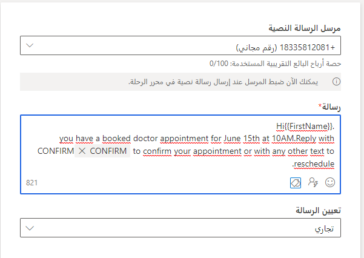

تسمح لك الرسائل النصية (SMS) بالوصول إلى العملاء مباشرة على أجهزتهم المحمولة. يمكنك إرسال رسائل نصية من التسويق في الوقت الفعلي عن طريق إنشاء رقم هاتف من خلال خدمات اتصالات Azure (تقتصر على 1100 رسالة شهرياً ومتاحة فقط في الولايات المتحدة) أو يمكنك شراء أو إعادة استخدام Twilio أو حساب TeleSign SMS حالي.

يجب تكوين مرسل رسالتك النصية من قبل المسؤول قبل أن تتمكن من البدء في إنشاء الرسائل النصية. لمزيد من المعلومات، راجع [إضافة رقم مرسل باستخدام الإصدار الأولي من خدمات اتصالات Azure (الولايات المتحدة فقط)](/dynamics365/marketing/real-time-marketing-outbound-text-messaging?azure-portal=true#add-a-sender-number-using-the-azure-communication-services-preview-us-only) و[إضافة رقم مرسل من حساب Twilio أو TeleSign (عالمي)](/dynamics365/marketing/real-time-marketing-outbound-text-messaging?azure-portal=true#add-a-sender-number-from-a-twilio-or-telesign-account-worldwide).

من المهم ملاحظة أن التسويق في الوقت الحقيقي يرسل رسائل نصية صادرة، مما يعني أن تطبيق Dynamics 365 Marketing لا يتعقب الاستجابات باستثناء الكلمات الأساسية المتعلقة بالتوافق، مثل إيقاف "STOP".

## تصميم رسالة نصية

لعرض رسالة نصية جديدة أو تحريرها أو حذفها أو إنشائها، انتقل إلى 
**التسويق في الوقت الحقيقي > القنوات > الرسائل النصية**.

1. لإنشاء رسالة نصية جديدة، حدد **جديد**.

1. ستفتح لوحة التصميم مع الحقول من أجل الرسالة. أدخل **الاسم** للرسالة النصية أعلى يسار اللوحة. تُستخدم هذه المعلومات لأغراض داخلية ولن تكون مرئية للمستلمين.

1. حدد **مرسل رسالة نصية**. تتيح لك هذه القائمة المنسدلة الاختيار من بين أرقام هواتف المرسلين (الإصدار الأولي من خدمات اتصالات Azure أو Twilio أو TeleSign) التي تم تكوينها في بيئتك.

1. أدخل محتوى **رسالتك**. يمكن أن يشمل ذلك الرموز التعبيرية والتخصيص وارتباطاً إلى استطلاع Customer Voice وكلمات SMS الأساسية.

1. اختر ما إذا كان **تعيين رسالتك** تجارياً أو حركات. الرسالة التجارية هي الرسالة التي يتم إرسالها إلى المستلمين الذين اختاروا استلام الرسائل. مثال على ذلك هو قسيمة مرسلة إلى مجموعة من العملاء الذين اختاروا تلقي العروض الترويجية من شركتك. رسالة الحركة هي الرسالة التي يتم إرسالها استجابة لحركة بدأها المستلم معك مسبقاً. مثال على ذلك هو الرد على استفسار عبر البريد الإلكتروني.

1. احفظ تغييراتك.

1. حدد **التحقق من المحتوى** لتشغيل مُدقق الأخطاء على رسالتك.‬ قم بتصحيح الأخطاء، إذا لزم الأمر.

1. حدد **إرسال الاختبار** لمراجعة الرسالة. إذا كنت تستخدم رقم المرسل المجاني للإصدار الأولي من خدمات اتصالات Azure، يمكنك اختبار إرسال الرسالة إلى أي رقم هاتف محمول بالولايات المتحدة. إذا كنت تستخدم رقم مرسل Twilio أو TeleSign، فيمكنك إرسال الرسالة إلى جهاز محمول في أي بلد مدعوم.

1. عند الانتهاء، حدد **جاهزة للإرسال** للرسالة لتصبح متاحاً للتحديد في الرحلات.

لمزيد من المعلومات، راجع [إنشاء رسائل نصية](/dynamics365/marketing/real-time-marketing-outbound-text-messaging?azure-portal=true#create-text-messages).

## إضافة تخصيص على الرسالة

ضمن الرسائل النصية، يُمكنك إدراج بيانات ديناميكية فريدة لكل مستلم. قد ترغب في ملء اسم أو وقت موعد أو موقع أو أي بيانات فريدة أخرى ديناميكياً.

لتخصيص رسالة نصية، أكمل الخطوات التالية:

1. حدد الزر **تخصيص** في حقل **الرسالة** .

1. اختر من قائمة الرموز المحددة مسبقاً أو قم بتحديد **نص ديناميكي جديد** لإنشاء رمز جديد.

1. في حالة إنشاء سمة ديناميكية جديدة:

   1. حدد **اختيار سمة** وحدد مصدر البيانات (الجمهور أو مشغل الحدث أو التوافق).

   1. بعد اختيار مصدر البيانات، ابحث عن السمة المحددة التي تريد إضافتها وحددها.

   1. سيتم ملء **اسم** **العرض** تلقائياً. هذا وصف سهل بالنسبة لك حيث يمكنك الرجوع إليه وسيُملأ وفقاً للسمة التي حددتها عند إرسال الرسالة النصية من رحلة. يمكنك التحديث إذا لزم الأمر.

   1. أضف **قيمة افتراضية**، إذا كنت تريد ذلك. تسمح لك القيمة الافتراضية بإضافة محتوى للحالات التي تكون فيها هذه البيانات فارغة في نظامك. 
   على سبيل المثال، عند تضمين الاسم الأول على أنه محتوى ديناميكي في الرسالة، فقد ترغب في إضافة *عميل مهم* في حقل **القيمة الافتراضية** في حالة ما إذا كان حقل **الاسم الأول** فارغاً لأي من عملائك. 
   إذا كانت البيانات فارغة ولم يتم عرض أي قيمة افتراضية، فسيظهر هذا الجزء من الرسالة فارغاً.

   1. حدد **حفظ**.

لمزيد من المعلومات، راجع [تخصيص رسالة نصية](/dynamics365/marketing/real-time-marketing-outbound-text-messaging?azure-portal=true#personalize-text-messages).

## إضافة كلمات أساسية إلى رسالتك

يمكنك التفاعل مع عملائك من خلال إنشاء رحلات بناءً على ردودهم على رسائل SMS الخاصة بك. يمكنك إضافة كلمة أساسية واحدة أو أكثر إلى رسالة SMS الخاصة بك من خلال الرمز ذي الصلة. اختر واحدة موجودة بالفعل وتم استخدامها مسبقاً في رحلة عميل أو أنشئ واحدة جديدة.

> [!div class="mx-imgBorder"]
> 

تتم أيضاً إضافة جميع الكلمات الأساسية التي تم إنشاؤها من خلال محرر الرسائل القصيرة (SMS) إلى صفحة **كلمات SMS الأساسية**. يمكن العثور على هذا في **الإعدادات** > **مشاركة العملاء** > **كلمات SMS الأساسية**. من هذه الصفحة، يمكنك:

- حذف الكلمات الأساسية القديمة.

- تحديث الكلمات الأساسية التي حددتها على أنها غامضة إلى شيء أكثر وضوحاً من شأنه تحسين معدل استجابتك.

- أضف كلمات أساسية جديدة ستظهر في محرر الرسائل القصيرة (SMS) ورحلات عملائك.

لمزيد من المعلومات، راجع [استمر في المحادثة مع عملائك من خلال اتخاذ إجراء بشأن ردود الرسائل القصيرة (SMS) الخاصة بهم](/dynamics365-release-plan/2022wave1/marketing/dynamics365-marketing/continue-conversation-customers-taking-action-their-sms-replies/?azure-portal=true).

## تحرير رسالة نصية مباشرة

أثناء وجود الرسالة النصية في حالة **جاهزة للإرسال،** فإنها تكون للعرض فقط. لتحرير رسالة نصية في حالة جاهزة للإرسال:

1. افتح الرسالة النصية.

1. حدد الزر **تحرير** من شريط الأوامر.

1. في حالة استخدام الرسالة النصية في رحلة عميل مباشرة، فستُعلمك نافذة مشروطة بأن هذا التغيير سينعكس في جميع الرحلات التي تستخدم الرسالة.

   - إذا أردت تطبيق التغييرات على الرحلات المدرجة، فحدد **متابعة**. سترغب في ملاحظة أن التحليلات ستعكس مزيجاً من المحتوى القديم والجديد، وقد تمنع تغييرات الارتباط المستلمين من المرور عبر مسارات النجاح في فروع الرحلة.

   - إذا كنت لا تريد تطبيق التغييرات على الرحلات المدرجة، فيمكنك بدلاً من ذلك **إنشاء نسخة** أو **إلغاء**.

1. يمكنك إجراء التغييرات اللازمة على الرسالة.

1. حدد **إنهاء التحرير** في شريط الأوامر.

1. سيتحقق النظام تلقائياً من الصحة وينتقل مباشرة إلى الرسالة.

> [!NOTE]
> لن تتمكن من تغيير التخصيص أو الاستطلاعات لرسالة مستخدمة في رحلة مباشرة.

## الموافقة

في التسويق في الوقت الحقيقي، تكون القواعد عند إرسال رسائل نصية هي نفسها قواعد إرسال الرسائل الإلكترونية. عندما ترسل رسائل نصية للحركات، لا يلزم الحصول على الموافقة. يتطلب إرسال الرسائل النصية التجارية أن يكون رقم الهاتف المحمول مشتركاً قبل أن يتمكن من تلقي رسالة.

بالنسبة للرسائل التجارية، إذا كنت تستخدم خدمات اتصالات Azure، فعندما يرد العميل بكلمة STOP، سيتم إلغاء اشتراكه في اتصالات الرسائل النصية. للتأكد من أن موفري خدمة رسائل SMS التابعين لجهات خارجية (Twilio أو Telesign) يتعاملون مع أوامر الإيقاف (STOP) بشكل صحيح، يجب عليك تكوين إعدادات الموافقة الخاصة بك مع الموفر مباشرةً.

لمزيد من المعلومات، راجع [كيفية احترام الموافقة على الرسائل النصية](/dynamics365/marketing/real-time-marketing-email-text-consent#how-consent-is-respected-for-text-messages/?azure-portal=true).
